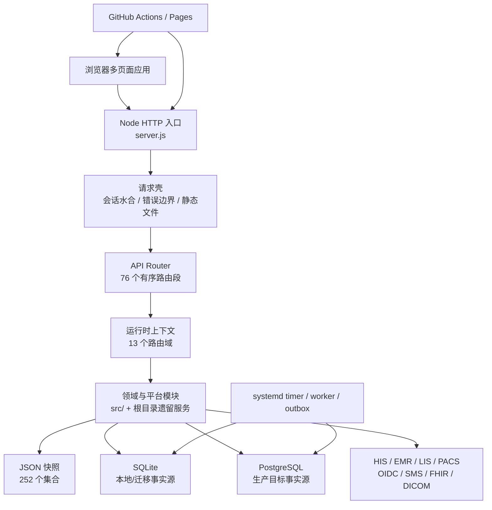

# CURRENT ARCHITECTURE — 主线现状地图

> 实施分支 AS-IS 快照：历史采样基于 `main@a15d10dc67a7fd89540d3073ece34b5d8c7b942e`；
> 当前对账基线为 `main@21d8f3c8f659c70e3d4980c3a67c39ca72d1712a`
> 采集日期：2026-08-20
> 性质：AS-IS，只描述已存在实现，不表达目标状态或实施授权。#131 的 P0/P1 增量仍是
> 待重新验证的 PR 候选；ARC-002 已通过 PR #132 合入当前主线。

## 1. 系统轮廓

平台是一个模块化单体，但迁移并不完整：HTTP 路由已经模块化，SQLite migration 注册表已从组合根分离，种子数据、存储装配和大量领域函数仍集中在 `server.js`；浏览器应用仍以多个大体量全局脚本为主。

## 2. 仓库结构

本实施分支预计跟踪 1,388 个文件，其中 JavaScript 947、Markdown 233、JSON 94、HTML 44。主要目录：

| 路径 | 作用 | 当前边界 |
|---|---|---|
| `/` | 服务入口、浏览器页面、遗留领域服务 | 仍然平铺，存在同名模块和超大文件 |
| `src/http/` | API router、路由段、运行时上下文、静态资产发布策略 | T00 管组合、顺序和显式静态发布边界；T01–T09 管领域路由 |
| `src/platform/` | 数据、事件、区域、部署、治理与切换控制 | 模块化程度较高，仍依赖组合根注入 |
| `src/identity-security/` | 会话、认证、授权、静态页面守卫、安全审计 | 页面授权与资产发布策略分层执行，均默认拒绝 |
| `src/*领域*/` | 新领域服务、仓储、传输和 worker | 与根目录遗留服务并存 |
| `config/` | 进程、数据所有权、区域、迁移和发布策略 | 多数为机器可读治理事实 |
| `data/` | 被跟踪的 `db.json` 开发/迁移输入 | 浏览器只读取运行时或构建时生成的 `public-demo.json`；生成物不入库 |
| `deploy/` | SQL、systemd、Compose、环境模板和现场验证 | 生产证据默认 NO-GO |
| `scripts/` | 测试、readiness、报告、部署和后台 worker | 169 个根级文件，职责和产物较分散 |
| `test/` | Node test 与 Playwright | 405 个 test/spec 文件（400 Node、5 E2E） |
| `regions/` | 多地区部署配置 | 由区域清单和发布注册表控制 |
| `digital-hospital-standard-platform/` | 内嵌数智医院展示前端 | 独立页面但仍共享主仓发布生命周期 |
| `resident-mini-program-platform/` | 居民小程序适配前端 | 独立页面但仍共享主仓发布生命周期 |
| `output/` | 已跟踪的 PDF 制品 | 属生成物，不应作为源码直接编辑 |

`national-access-showcase/`、应急发布 worktree 和视频项目不在此主线跟踪树内；它们不能被描述为主线源码模块，也不能与主应用依赖或数据混用。

## 3. 主应用与入口

| 应用/入口 | 技术 | 责任 |
|---|---|---|
| Node API 服务 | `server.js` | 启动、依赖装配、会话、allowlist 静态读取、合成演示快照、API 调度、SQLite/JSON 兼容；SQLite DDL 委托独立注册表 |
| 平台管理端 | `index.html`、`app.js` | 监管、资源、统计、公共卫生与治理入口 |
| 居民端 | `citizen.html`、`citizen.js` | 居民档案、授权、慢病和服务旅程 |
| 机构/医生/医保/县域端 | 对应 HTML/JS | 各角色工作台 |
| 专项应用 | 公卫、急救、血液、影像、体检、护理、陪诊等页面 | 专项领域体验与演示 |
| 数智医院子站 | `digital-hospital-standard-platform/` | 标准能力展示；单个 `app.js` 约 10.5k 行 |
| 居民小程序适配 | `resident-mini-program-platform/` | 居民端交付适配 |
| API 路由入口 | `src/http/api-router.js`、`src/http/routes/index.js` | 76 个路由段的固定顺序与短路 |
| 后台入口 | `scripts/*worker.js`、systemd timer | outbox 投递、同步、核对和控制任务 |

## 4. 运行时边界

- `main` 是唯一集成和发布分支。
- `config/process-workstreams.json` 定义 T00–T09 所有权；跨域协议、路由顺序、CI、组合根和部署属于 T00。
- `config/domain-data-ownership.json` 登记 83 个生产候选集合；`shared` 和 `state-data` 明确为非所有者域。
- 开发环境允许 JSON 或 SQLite；生产策略声明 PostgreSQL 为事实源且禁止 fallback write。
- 生产 Go/No-Go 默认 `NO-GO`，真实环境、联调、审批和站点证据不能由仓库生成。

## 5. 已确认的边界偏差

1. 静态服务器与 Pages 现按 `config/static-publication.json` 的 44 个入口递归收集显式浏览器资源；未知路径统一 404。
2. 浏览器和 Service Worker 已迁移到合成的 `data/public-demo.json`；`data/db.json` 不进入静态制品。
3. `server.js` 仍约 28.2k 行；SQLite migration 已抽离约 550 行，但路由拆分没有同步拆完组合根和领域实现。
4. ARC-002 已删除 `pilot-cutover-alert-runtime` 对 `server.js` 的反向
   `require`：运行时只消费显式 `controlProvider`，worker CLI 在组合边界懒注入现有
   `pilotCutoverControlPlaneReadiness`。provider 缺失、返回值无效或抛错均投影为受限
   `controlErrorCode` 和 `NO-GO`，不泄露错误正文；当前静态图不再形成该环。PR #132、
   required checks、合并后 main CI 与 Pages 均已通过，主线 ARC-002 已关闭。
5. SQLite v1–v14 已冻结内容指纹，v15 追加 append-only 连续审计 source；`STORAGE_SCHEMA_VERSION`、部署检查和测试统一从注册表 head v15 派生。历史 ledger 的 v1–v14 checksum 保持兼容，v15 起写入内容 SHA-256。
6. TEST-001 候选已建立统一的 `build`、`lint`、`typecheck`、`test:unit`、`test:integration`、`test:smoke` 入口；build 复用静态发布 allowlist 并默认输出到仓库外，unit/integration 完整分区根测试，smoke 独立启动临时 JSON 运行时。lint 仍有 3 个文件的精确遗留规则例外，typecheck 当前只覆盖 6 个治理/安全边界文件。
7. 审计验证已收敛到 `src/identity-security/audit-chain.js` 的 v2 严格端口；内容、链接、结构和重复 ID 任一异常均失败，验证 API/合规报告不再读取时重封。全量状态写入中的审计数组由服务端管理。
8. 机器 API 授权矩阵扫描全部模块化路由源码的 588 条 `requireApiRole`/显式公共声明，并对九条高风险接口锁定 owner、角色、范围和用途；`production-api-catalog-v1` 再与 372 个字面条件路由取并集，形成 594 个唯一接口条目（587 个字面路由、7 个运行时策略），补充自定义鉴权缺口、幂等观察和生产状态。CI 对源集合、目录唯一性、必要字段和高风险唯一性 fail closed；全部目录条目保持 `NO-GO`，静态标记不替代运行时/现场证据。
9. P1 生产适配器增量保持现有 owner：T01 的 `production-adapters.js` 承担 JWKS/JWT 与 SMS 协议；OTP、发送/登录限流和失败锁定由共享 `auth-security-state-store` 承载，单主机 SQLite 复用 `state_collections`、生产多实例使用组合根长期 PostgreSQL pool；T00 的 PostgreSQL 组合保持 shadow/rehearsal 且 `productionPrimary=false`，受控迁移评估继续失败关闭。连续审计已使用 v15 同事务 append-only source、最小投影和 checkpoint v3，worker/preflight/systemd 已进入部署制品；未签名 receipt、外部单调 anchor、真实 WORM/KMS 与现场证据使 `productionReady=false` 继续失败关闭。
   浏览器服务端登录不再把 token/bearer 写入 `localStorage`；Cookie 上下文在服务端和浏览器
   水合链路均优先，旧脚本可读 token 会在上下文请求前清除。生产 bearer/hybrid 只有显式
   `AUTH_BEARER_COMPATIBILITY=enabled` 才能启用，启用后仍固定形成 `NO-GO` blocker。
10. T04 的慢病随访事件保留 `citizen-chronic.followup-updated.v1` 和既有 API，新增
    `src/citizen-chronic/followup-event-publisher.js` 作为签名 HTTPS publisher 端口。默认本地
    回执只在非生产且未配置远端时可用；生产必须注入独立 activation verifier，环境字符串不
    能证明启用证据。端口拒绝非 HTTPS/443、回环、私网、链路本地目标和重定向，以稳定的
    event/payload 幂等键发送，验签后仅向 service 交付私有 capability。机构 dispatch 在读取后、
    外发前按居民和机构范围过滤，并要求授权/尝试审计先成功持久化，再记录成功/失败结果审计；
    持久状态只保留可重验摘要及
    accepted/delivered 状态。当前仍由受权 HTTP dispatch 同步触发，没有 worker、租约、死信
    或多实例持久投递仓储，因此 `productionReady` 继续为 `false`。
11. T00 共享对象存储端口新增 `object-storage-gateway-trust-v1`。生产配置缺少合同版本、独立响应
    验签密钥或上传/下载 exact-Origin 白名单时，在发起网络请求前失败关闭；响应先按原始 body 验证
    HMAC、时间窗和 request ID，再绑定 operation、bucket、attachment、object/version。上传/下载
    URL 受 Origin 与 TTL 约束，完成和生命周期必须返回显式扫描/执行回执。非生产未声明版本时暂保留
    legacy 迁移路径，所有生产就绪投影仍为 `false`。当前没有修改 T08 公开路由、数据库或 Schema；
    元数据兼容上限仍为 500 条，但创建第 501 条时会在网关调用前以稳定错误失败关闭，既有
    immutable/legal-hold 元数据不再被静默淘汰；无损分页仓储、外部调用与本地写入双写以及
    供应商能力证明仍是后续债务。
12. SEC-004 第一切片把 `server.js` 的浏览器响应头抽到
    `src/http/browser-security-policy.js`，动态 HTML、静态资源、API、下载与错误响应继续复用同一端口。
    现有兼容 CSP 仍强制同源 base/frame、禁止 object 与脚本事件属性，但为保持 44 个页面兼容继续
    允许 inline 脚本/样式；不含 `unsafe-inline`/`unsafe-eval` 的目标策略仅以 Report-Only 下发。
    显式发布图的机器基线当前登记 37 个 P0 inline script 与 21 个 P1 inline style/style attribute，
    CI 和静态构建按资产/类型/片段指纹拒绝新增高风险。静态制品携带同一策略合同，但真实托管响应头、
    严格 CSP、独立扫描和现场验收均未证明，`productionReady` 保持 `false`。

## 6. T06 五子域治理切片

本分支新增 `config/clinical-subdomains.json`，把临床专科正式定义为急救、血液、影像、体检、质量安全五个治理子域。运行时、公开 API、数据库和部署拓扑均未改变，仍由同一个 Node 模块化单体承载。`GET /api/operations/dashboard` 与其余 32 个 operations 命令/治理字面路径均已由 T00 原子移交至 T02 `platform-governance/operations-*`；每个 route segment 保持原 method/path、角色、响应、写入/审计副作用和全局路由插槽。T06 已不再拥有 operations 子上下文，operations 不能被描述成第六个临床子域。

急救第二切片将 `GET /api/emergency/dashboard` 的查询组合移入 `src/clinical-specialties/emergency/dashboard-query.js`。HTTP 路由、鉴权、数据库读取、响应脱敏和全局运行时上下文保持原位；这是一个用例端口迁移，不代表急救子域已完成源码隔离。

血液第三切片将 `GET /api/blood-system` 的组合和机构范围投影移入 `src/clinical-specialties/blood/dashboard-query.js`。旧 HTTP 路由仍负责鉴权、读取和响应；既有交易数组内存规范化仍在查询执行前发生，但没有新增 `writeDatabase`、schema、审计或部署变化。

影像第四切片将 `GET /api/imaging-cloud` 的构建、脱敏和公开响应投影移入 `src/clinical-specialties/imaging/`。旧 HTTP 路由继续负责角色、居民范围和数据访问审计；带 `residentId` 的 GET 仍按遗留行为持久化审计。通用影像响应净化不再由血液混合路由实现，但旧导出保持兼容。

体检第五切片将 `GET /api/physical-exams` 的 Overview 构建、生产 readiness 组合和角色投影移入 `src/clinical-specialties/physical-examination/dashboard-query.js`。混合 HTTP 路由仍负责鉴权、居民范围、安全事件、访问审计持久化和最终脱敏，调用顺序保持不变；体检写命令仍留在 `blood-innovation`。

## 7. REG-01A 区域共享调阅现状

`POST /api/regional-data-sharing/access-reviews` 的 method/path、commission/institution 角色声明和 `shared-05` 全局插槽保持不变；T00 integration 切片把写决策接到 `src/platform/governance/regional-sharing-access-command.js` 的目标 T02 命令端口，并通过同目录 anti-corruption adapter 只读消费 T04 授权事实。institution 按精确 `orgCode` 调阅来源或目标共享包；commission 在非生产兼容模式保留历史全域范围并显式标记 blocker。GET 的 `accessReviews` 与 POST 响应均使用专用最小投影。

`personalRecords[category=authorizations]` 是当前唯一居民许可事实，撤销状态在每次执行及 inbox replay 前重新读取。客户端 `decision`、`consentStatus` 和备注不参与结论。共享包只允许明确 `ready + passed`，请求与存量边界都拒绝超长或畸形证据。兼容 HTTP 层以模块级 package queue 串行化当前单进程全状态写入；这不等于跨进程事务，因此 production 还要求已授权的 PostgreSQL atomic repository，当前门禁固定 NO-GO。区域现场 evidence lifecycle 仍只证明部署/验收状态，不提供居民数据访问许可。

T00 同时在 T02 `state-data` 兼容边界关闭通用写旁路：四个已登记的区域 owner 集合在 `PUT /api/state` 中只能省略或与当前服务端值深相等，集合级 legacy writer 一律拒绝。命令回执不能由 commission 删除、改写、重排或伪造追加，共享包版本和 `lastAccessReviewId` 也不能绕过命令改写。

演示数据重置仍保留旧 path/角色以支持非生产验收，但 production 请求在读取 seed 或写库前返回 `DEMO_RESET_DISABLED_IN_PRODUCTION`；因此 reset 不是生产回执删除入口。
## 8. T05 转诊单一命令轨道

本实施分支保留 `/api/referrals/:id/actions`、`/api/workflow-actions` 和 `/api/tasks/:id/actions` 三条公开路径及原成功响应形状，但 `collection=referrals` 的写入统一委托 `src/care-coordination/referral-command-service.js`。权限先于 inbox 重放和 CAS；机构按 from/to/org、区县主体按 region、居民按本人或家庭授权校验。聚合、command inbox 和 outbox 继续由既有 UoW 原子提交，未新增 schema、部署进程或转诊核心概念。

## 9. 健康驾驶舱指标治理首切片

`src/platform/governance/health-dashboard-indicator-contract.js` 已建立
`health-dashboard-indicator-contract.v1`，首个定义为月度门急诊人次
`population-service-visits.v1`。合同冻结 T02 聚合 owner、T03 来源 owner、公式、类型、
单位、自然月周期和 `Asia/Shanghai` 时区；测量附带服务端范围、水位、来源版本、质量状态、
阻断项和稳定摘要。现有两个 API、commission 鉴权和旧字段不变，新元数据通过指标条目和
summary 加法暴露。当前样例日报缺受认可的签名/版本且运行时未注入区域范围，因此测量保持
`blocked`，不能作为生产证据。三个历史 `industry-*` ID 由按 canonical ID 键控的显式弃用
alias 兼容，不再按数组位置改名。
