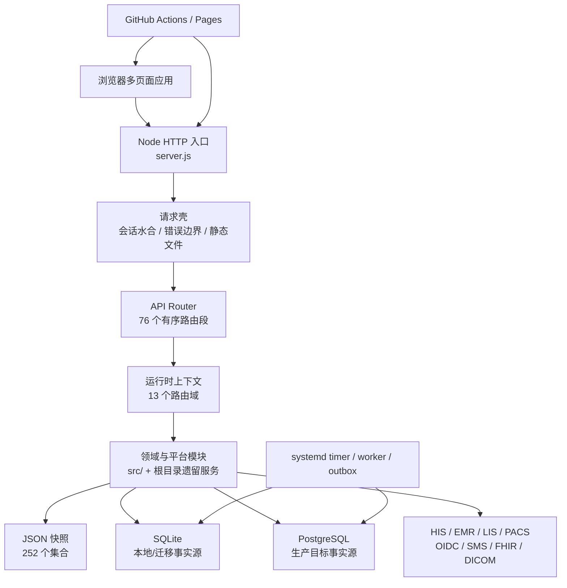

# CURRENT ARCHITECTURE — 主线现状地图

> 实施分支 AS-IS 快照：历史采样基于 `main@a15d10dc67a7fd89540d3073ece34b5d8c7b942e`；
> 当前对账基线为 `main@21d8f3c8f659c70e3d4980c3a67c39ca72d1712a`
> 采集日期：2026-08-20
> 性质：AS-IS，只描述已存在实现，不表达目标状态或实施授权。#131 的 P0/P1 增量仍是
> 待重新验证的 PR 候选；ARC-002 已通过 PR #132 合入当前主线。

## 1. 系统轮廓

平台是一个模块化单体，但迁移并不完整：HTTP 路由已经模块化，SQLite migration 注册表已从组合根分离，种子数据、存储装配和大量领域函数仍集中在 `server.js`；浏览器应用仍以多个大体量全局脚本为主。

## 2. 仓库结构

本治理切片闭集盘点 1,532 个受跟踪文件，其中 JavaScript 1,034、Markdown 264、JSON 106、HTML 44。主要目录：

| 路径 | 作用 | 当前边界 |
|---|---|---|
| `/` | 服务入口、浏览器页面、遗留领域服务 | 仍然平铺，存在同名模块和超大文件 |
| `src/http/` | API router、路由段、运行时上下文、静态资产发布策略 | T00 管组合、顺序和显式静态发布边界；T01–T09 管领域路由 |
| `src/platform/` | 数据、事件、区域、部署、治理与切换控制 | 模块化程度较高，仍依赖组合根注入 |
| `src/identity-security/` | 会话、认证、授权、静态页面守卫、安全审计 | 页面授权与资产发布策略分层执行，均默认拒绝 |
| `src/*领域*/` | 新领域服务、仓储、传输和 worker | 与根目录遗留服务并存 |
| `config/` | 进程、数据所有权、区域、迁移和发布策略 | 多数为机器可读治理事实 |
| `data/` | 被跟踪的 `db.json` 开发/迁移输入 | 浏览器只读取运行时或构建时生成的 `public-demo.json`；生成物不入库 |
| `deploy/` | SQL、systemd、Compose、环境模板和现场验证 | 生产证据默认 NO-GO |
| `scripts/` | 测试、readiness、报告、部署和后台 worker | 187 个根级文件，职责和产物较分散 |
| `test/` | Node test 与 Playwright | 461 个 test/spec 文件（447 Node、14 E2E spec 文件） |
| `regions/` | 多地区部署配置 | 由区域清单和发布注册表控制 |
| `digital-hospital-standard-platform/` | 内嵌数智医院展示前端 | 独立页面但仍共享主仓发布生命周期 |
| `resident-mini-program-platform/` | 居民小程序适配前端 | 独立页面但仍共享主仓发布生命周期 |
| `output/` | 已跟踪的 PDF 制品 | 属生成物，不应作为源码直接编辑 |

`national-access-showcase/`、应急发布 worktree 和视频项目不在此主线跟踪树内；它们不能被描述为主线源码模块，也不能与主应用依赖或数据混用。

## 3. 主应用与入口

| 应用/入口 | 技术 | 责任 |
|---|---|---|
| Node API 服务 | `server.js` | 启动、依赖装配、会话、allowlist 静态读取、合成演示快照、API 调度、SQLite/JSON 兼容；SQLite DDL 委托独立注册表 |
| 平台管理端 | `index.html`、`app.js` | 监管、资源、统计、公共卫生与治理入口 |
| 居民端 | `citizen.html`、`citizen.js` | 居民档案、授权、慢病和服务旅程 |
| 机构/医生/医保/县域端 | 对应 HTML/JS | 各角色工作台 |
| 专项应用 | 公卫、急救、血液、影像、体检、护理、陪诊等页面 | 专项领域体验与演示 |
| 数智医院子站 | `digital-hospital-standard-platform/` | 标准能力展示；单个 `app.js` 约 10.5k 行 |
| 居民小程序适配 | `resident-mini-program-platform/` | 居民端交付适配 |
| API 路由入口 | `src/http/api-router.js`、`src/http/routes/index.js` | 76 个路由段的固定顺序与短路 |
| 后台入口 | `scripts/*worker.js`、systemd timer | outbox 投递、同步、核对和控制任务 |

## 4. 运行时边界

- `main` 是唯一集成和发布分支。
- `config/process-workstreams.json` 定义 T00–T09 所有权；跨域协议、路由顺序、CI、组合根和部署属于 T00。
- `config/domain-data-ownership.json` 登记 83 个生产候选集合；`shared` 和 `state-data` 明确为非所有者域。
- 开发环境允许 JSON 或 SQLite；生产策略声明 PostgreSQL 为事实源且禁止 fallback write。
- 生产 Go/No-Go 默认 `NO-GO`，真实环境、联调、审批和站点证据不能由仓库生成。

## 5. 已确认的边界偏差

1. 静态服务器与 Pages 现按 `config/static-publication.json` 的 44 个入口递归收集显式浏览器资源；未知路径统一 404。
2. 浏览器和 Service Worker 已迁移到合成的 `data/public-demo.json`；`data/db.json` 不进入静态制品。
3. `server.js` 仍约 28.2k 行；SQLite migration 已抽离约 550 行，但路由拆分没有同步拆完组合根和领域实现。
4. ARC-002 已删除 `pilot-cutover-alert-runtime` 对 `server.js` 的反向
   `require`：运行时只消费显式 `controlProvider`，worker CLI 在组合边界懒注入现有
   `pilotCutoverControlPlaneReadiness`。provider 缺失、返回值无效或抛错均投影为受限
   `controlErrorCode` 和 `NO-GO`，不泄露错误正文；当前静态图不再形成该环。PR #132、
   required checks、合并后 main CI 与 Pages 均已通过，主线 ARC-002 已关闭。
5. SQLite v1–v14 已冻结内容指纹，v15 追加 append-only 连续审计 source，v16 追加慢病随访 durable outbox；`STORAGE_SCHEMA_VERSION`、部署检查和测试统一从注册表 head v16 派生。历史 ledger 的 v1–v14 checksum 保持兼容，v15 起写入内容 SHA-256。
6. TEST-001 已建立统一的 `build`、`lint`、`typecheck`、`test:unit`、`test:integration`、`test:smoke` 入口；build 复用静态发布 allowlist 并默认输出到仓库外，unit/integration 完整分区根测试，smoke 独立启动临时 JSON 运行时。治理 CI 执行 `data:collection-governance:verify`，以源码、owner 和隔离清单漂移失败关闭；原 `server.js` c8 门禁保持 85/85/55，内部边界现以 10 个职责独立组锁定真实覆盖基线和直接负向矩阵：原 identity、audit、object storage、API governance 四组，加上 worker observability、区域共享命令、转诊 owner command、科研合规导出、浏览器响应头策略和 Safe URL 端口六组。所有报告只存在临时目录。TEST-006 已恢复全文件 `no-unreachable`；`internet-nursing.js` 与 `quality-safety.js` 的 16 个重复翻译键已按显式 shadow map 去重，保留原首次插入顺序和最终生效值，lint 不再有文件级规则例外。typecheck 去重后由 9 个唯一文件扩大到 13 个治理/安全边界文件。集成套件成员、顺序、断言和超时不变，但本机三次采样约 294–371 秒的 API 热点现在独立进程执行，并向 CI 日志输出无阈值的批次/套件耗时。
   TEST-006 care revalidation 已把这 3 段显式 skip 全部恢复为可执行断言，并新增陪诊 owner route、护理闭环、护士生命周期 3 个可独立运行的真实 HTTP 特征测试。测试只使用临时 JSON 副本和进程内 owner 证据签发能力；陪诊 handoff 现统一解释 `reject/return`，引用挂号单在补字段前先校验存在性与当前用户 scope。护理通知继续以 planned message + pending outbox 表达，仓库测试不伪造外部送达或现场证据。API 巨型测试的第一个可逆夹具切片已将临时 JSON seed、环境变量和同一 server 生命周期移入 `test/helpers/api-regression-runtime.js`；第二、第三个切片分别只将单个 HIS hospital adapter mock 与单个 SIEM alert delivery mock 的创建、动态回环监听、测试环境和关闭移入各自测试 helper。43 个有序子测试、请求/响应与签名断言、告警成功/503/恢复重试顺序、超时、单进程执行和 integration 成员均保持不变，并由顺序摘要门禁锁定；synthetic HIS/SIEM 响应均不是外部回执或上线证据。
   TEST-005 将浏览器 E2E 精确分为根 33 项与居民 13 项：两套配置统一使用 Playwright Chromium、
   `serviceWorkers=block` 和动态回环端口；居民套件复用独占 runner、独立临时数据目录并在结束后释放服务。
   在线 46 项并集/唯一性、浏览器策略和 runner 生命周期由专项测试锁定。PWA 专项另以 3 项独占套件允许
   Service Worker，验证居民登录后的 v61 安装、v60 清理、同源成功响应缓存边界、离线导航回退及最终
   unregister/Cache Storage 清理。SEC-004 另增加急救生命链、医生工作台、血液上线看板、陪诊工作台、产品运行驾驶舱及产品区域运行驾驶舱各 1 项恶意 API 载荷回归，
   当前根 33 + 居民 13 + PWA 3 = 49 项；标准在线 context 仍保持阻止 Service Worker。
7. 审计验证已收敛到 `src/identity-security/audit-chain.js` 的 v2 严格端口；内容、链接、结构和重复 ID 任一异常均失败，验证 API/合规报告不再读取时重封。全量状态写入中的审计数组由服务端管理。
8. 机器 API 授权矩阵现从路由扫描和小型认证证据合同派生 601 条声明；`production-api-catalog-v3` 与 371 个字面条件路由取并集，形成 593 个唯一接口条目（586 个字面路由、7 个运行时策略）。认证证据共 13 项：复用 SMS callback 既有合同，并对原 13 个未分类 key 中 12 个真实入口完成 required/optional/none、credential source、replay/CSRF 和 scope 分类；T10 真实入口以 401/403 直接拒绝测试闭合，公卫相邻 GET/POST 误配 key 已从解析器中消除，当前无未分类认证。幂等证据注册表现有 9 份直接行为合同：7 个完整 endpoint 与 2 个转诊 action-slice。T01 `POST /api/security/controls/:id/actions` 复用既有 session-security-audit repository，以 commission/step-up 先行、精确 control ID、命令回放/冲突、单进程串行、SQLite collection-version CAS 和单次 control+receipt+audit 状态写入闭合仓库行为；PG adapter 未接线，不创建 outbox，也不宣称跨实例 exactly-once。333 个写接口中 7 个 endpoint 为 `behavior-verified`，326 个仍为 `behavior-proof-required`；退款 endpoint 的 runtime-role variant 与两个通用 action endpoint 仍使当前 328 项需复核，593 项全部 `NO-GO`。T07 `reviewedProofRequired` 现保留 financial dispatch 与 formal grouping job 两项。
9. P1 生产适配器增量保持现有 owner：T01 的 `production-adapters.js` 承担 JWKS/JWT 与 SMS 协议；OTP、发送/登录限流和失败锁定由共享 `auth-security-state-store` 承载，单主机 SQLite 复用 `state_collections`、生产多实例使用组合根长期 PostgreSQL pool；T00 的 PostgreSQL 组合保持 shadow/rehearsal 且 `productionPrimary=false`，受控迁移评估继续失败关闭。连续审计已使用 v15 同事务 append-only source、最小投影和 checkpoint v3，worker/preflight/systemd 已进入部署制品；未签名 receipt、外部单调 anchor、真实 WORM/KMS 与现场证据使 `productionReady=false` 继续失败关闭。
   浏览器服务端登录不再把 token/bearer 写入 `localStorage`；Cookie 上下文在服务端和浏览器
   水合链路均优先，旧脚本可读 token 会在上下文请求前清除。生产 bearer/hybrid 只有显式
   `AUTH_BEARER_COMPATIBILITY=enabled` 才能启用，启用后仍固定形成 `NO-GO` blocker。
10. T04 的慢病随访事件保留 `citizen-chronic.followup-updated.v1` 和既有 API，T00 在同一 SQLite
    事务中写入 v16 专用 outbox。HTTP dispatch 只在真实 durable queue 可用且健康时确认排队，请求路径
    不再调用外部系统。独立 worker 使用 lease owner/token hash/version/expiry fencing、有界退避、死信和
    digest-only replay；completion/failure 被 stale fence 拒绝时记录摘要化 outcome 并继续批次。可部署的
    file-backed provider 验证外部 Ed25519 签名 activation decision，但真实 decision、endpoint、凭据、可信回执和
    现场验收仍外置，因此当前 `productionReady=false`；有效外部 trust verifier 可通过当前
    release/artifact 绑定的正式证据驱动中央 preflight，无需再改代码。
11. T00 共享对象存储端口新增 `object-storage-gateway-trust-v1`。生产配置缺少合同版本、独立响应
    验签密钥或上传/下载 exact-Origin 白名单时，在发起网络请求前失败关闭；响应先按原始 body 验证
    HMAC、时间窗和 request ID，再绑定 operation、bucket、attachment、object/version。上传/下载
    URL 受 Origin 与 TTL 约束，完成和生命周期必须返回显式扫描/执行回执。非生产未声明版本时暂保留
    legacy 迁移路径，所有生产就绪投影仍为 `false`。当前没有修改 T08 公开路由、数据库或 Schema；
    元数据兼容上限仍为 500 条，但创建第 501 条时会在网关调用前以稳定错误失败关闭，既有
    immutable/legal-hold 元数据不再被静默淘汰；无损分页仓储、外部调用与本地写入双写以及
    供应商能力证明仍是后续债务。
12. SEC-004 第一切片把 `server.js` 的浏览器响应头抽到
    `src/http/browser-security-policy.js`，动态 HTML、静态资源、API、下载与错误响应继续复用同一端口。
    第二切片把 37 个可执行内联脚本统一迁至外部脚本，把 8 个内联样式块和 13 个样式属性迁至外部
    CSS/class；页面角色与账户守卫由 `page-auth-bootstrap.js` 复用同一标准接口。显式发布图的 P0/P1
    静态风险基线现为 0，CI 和静态构建拒绝新增高风险。兼容 CSP 暂时仍含 `unsafe-inline`，严格目标
    仅以 Report-Only 下发，因为动态 CSSOM/全角色运行时回归、真实托管响应头、独立扫描和现场验收
    均未证明，`productionReady` 保持 `false`。
13. DATA-003 首个仓库内治理切片复用现有 `collection-governance`，不新建第二份 owner 清单。
    当前快照 252 个集合已全部获得机器状态：60 个命中 87 个数据 owner 合同，3 个为既有系统
    集合，188 个源码精确引用但 owner 未明确的集合标为 `review-required`，1 个仅存在种子的集合
    标为 `legacy-quarantined`。静态扫描覆盖 599 个受跟踪 JS/HTML 运行时源；process owner 只作为
    review 证据且固定禁止推断数据 owner。新增/删除、重复状态、引用漂移、非 owner 域和生产晋升
    都在 CI 失败关闭；本切片没有修改 JSON/SQLite、schema、API 或运行时，仍为 `NO-GO`。
14. SEC-004 治理清单已升级为 `browser-security-risk-inventory.v2`，当前扫描 145 个显式发布资产。
    `browser-safe-url-policy.v1` 复用居民短时凭据/对象存储的 HTTPS、无凭据和 exact-Origin 语义，
    为 internal navigation、official source、object storage、`tel` 与 blob download 建立唯一公共端口。
    血液主工作台、急救生命链、医生工作台、血液上线看板、陪诊工作台、产品运行驾驶舱及产品区域运行驾驶舱 controller 的可信 DOM/text 切片与 Safe URL 内部闭环后，机器基线锁定
    841 个 DOM HTML sink（37 个资产）、6 个动态 URL sink（2 个资产）和 45 个动态样式/CSSOM/runtime style element
    （14 个资产）；29 个原模板 occurrence 中 28 个真实 URL 已改为无 URL 模板加 DOM 绑定，另 1 个
    `item.action` 普通赋值已从扫描误报中排除。当前 4 项是公共端口内受控 mutation/navigation，只有
    2 个缺真实 OHIF exact-Origin allowlist 的导航继续 `review-required`。每个资产/类型同时绑定
    occurrence 数量和规范化源行聚合 SHA-256。相同数量的片段替换、数量增加和新类型/资产都会失败关闭；
    该清单和 Safe URL 端口不是可信 HTML 渲染、严格 CSP、外部 Origin 或生产安全证明；兼容
    `unsafe-inline`、严格 Report-Only 与 `productionReady=false` 均未改变。
15. TEST-007 已在既有 `operations-command-handoff` harness 上建立 32/32 路径的闭集行为矩阵。
    19 条读取和 13 条写入逐路径锁定角色、拒绝先于读取、payload/错误、响应与实际副作用；三条集成入口
    另覆盖签名和机构范围，全部写入口覆盖审计/写入顺序及审计或写入失败不返回成功。专项门禁进入
    governance-api；本切片没有修改 699 行 handler、HTTP、数据、Schema 或生产状态，ARC-008 仍未关闭。

## 6. T06 五子域治理切片

本分支新增 `config/clinical-subdomains.json`，把临床专科正式定义为急救、血液、影像、体检、质量安全五个治理子域。运行时、公开 API、数据库和部署拓扑均未改变，仍由同一个 Node 模块化单体承载。`GET /api/operations/dashboard` 与其余 32 个 operations 命令/治理字面路径均已由 T00 原子移交至 T02 `platform-governance/operations-*`；每个 route segment 保持原 method/path、角色、响应、写入/审计副作用和全局路由插槽。T06 已不再拥有 operations 子上下文，operations 不能被描述成第六个临床子域。

急救第二切片将 `GET /api/emergency/dashboard` 的查询组合移入 `src/clinical-specialties/emergency/dashboard-query.js`。HTTP 路由、鉴权、数据库读取、响应脱敏和全局运行时上下文保持原位；这是一个用例端口迁移，不代表急救子域已完成源码隔离。

血液第三切片将 `GET /api/blood-system` 的组合和机构范围投影移入 `src/clinical-specialties/blood/dashboard-query.js`。旧 HTTP 路由仍负责鉴权、读取和响应；既有交易数组内存规范化仍在查询执行前发生，但没有新增 `writeDatabase`、schema、审计或部署变化。

影像第四切片将 `GET /api/imaging-cloud` 的构建、脱敏和公开响应投影移入 `src/clinical-specialties/imaging/`。旧 HTTP 路由继续负责角色、居民范围和数据访问审计；带 `residentId` 的 GET 仍按遗留行为持久化审计。通用影像响应净化不再由血液混合路由实现，但旧导出保持兼容。

体检第五切片将 `GET /api/physical-exams` 的 Overview 构建、生产 readiness 组合和角色投影移入 `src/clinical-specialties/physical-examination/dashboard-query.js`。混合 HTTP 路由仍负责鉴权、居民范围、安全事件、访问审计持久化和最终脱敏，调用顺序保持不变；体检写命令仍留在 `blood-innovation`。

## 7. REG-01A 区域共享调阅现状

`POST /api/regional-data-sharing/access-reviews` 的 method/path、commission/institution 角色声明和 `shared-05` 全局插槽保持不变；T00 integration 切片把写决策接到 `src/platform/governance/regional-sharing-access-command.js` 的目标 T02 命令端口，并通过同目录 anti-corruption adapter 只读消费 T04 授权事实。institution 按精确 `orgCode` 调阅来源或目标共享包；commission 在非生产兼容模式保留历史全域范围并显式标记 blocker。GET 的 `accessReviews` 与 POST 响应均使用专用最小投影。

`personalRecords[category=authorizations]` 是当前唯一居民许可事实，撤销状态在每次执行及 inbox replay 前重新读取。客户端 `decision`、`consentStatus` 和备注不参与结论。共享包只允许明确 `ready + passed`，请求与存量边界都拒绝超长或畸形证据。兼容 HTTP 层以模块级 package queue 串行化当前单进程全状态写入；这不等于跨进程事务，因此 production 还要求已授权的 PostgreSQL atomic repository，当前门禁固定 NO-GO。区域现场 evidence lifecycle 仍只证明部署/验收状态，不提供居民数据访问许可。

T00 同时在 T02 `state-data` 兼容边界关闭通用写旁路：四个已登记的区域 owner 集合在 `PUT /api/state` 中只能省略或与当前服务端值深相等，集合级 legacy writer 一律拒绝。命令回执不能由 commission 删除、改写、重排或伪造追加，共享包版本和 `lastAccessReviewId` 也不能绕过命令改写。

演示数据重置仍保留旧 path/角色以支持非生产验收，但 production 请求在读取 seed 或写库前返回 `DEMO_RESET_DISABLED_IN_PRODUCTION`；因此 reset 不是生产回执删除入口。
## 8. T05 转诊单一命令轨道

本实施分支保留 `/api/referrals/:id/actions`、`/api/workflow-actions` 和 `/api/tasks/:id/actions` 三条公开路径及原成功响应形状，但 `collection=referrals` 的写入统一委托 `src/care-coordination/referral-command-service.js`。权限先于 inbox 重放和 CAS；机构按 from/to/org、区县主体按 region、居民按本人或家庭授权校验。聚合、command inbox 和 outbox 继续由既有 UoW 原子提交，未新增 schema、部署进程或转诊核心概念。

## 9. 健康驾驶舱指标治理首切片

`src/platform/governance/health-dashboard-indicator-contract.js` 已建立
`health-dashboard-indicator-contract.v1`，首个定义为月度门急诊人次
`population-service-visits.v1`。合同冻结 T02 聚合 owner、T03 来源 owner、公式、类型、
单位、自然月周期和 `Asia/Shanghai` 时区；测量附带服务端范围、水位、来源版本、质量状态、
阻断项和稳定摘要。现有两个 API、commission 鉴权和旧字段不变，新元数据通过指标条目和
summary 加法暴露。当前样例日报缺受认可的签名/版本且运行时未注入区域范围，因此测量保持
`blocked`，不能作为生产证据。三个历史 `industry-*` ID 由按 canonical ID 键控的显式弃用
alias 兼容，不再按数组位置改名。

## 2026-08-22 慢病随访耐久外部投递增量

T04 的随访 PATCH 仍在聚合内生成 `citizen-chronic.followup-updated.v1`；T00 在同一 SQLite 写事务中
把事件插入/核对 v16 专用 outbox。HTTP dispatch 已变为本地排队确认，不再同步访问外部。独立 worker
完成 lease、外发、回执摘要、退避、死信与 replay；生产 endpoint/凭据/activation/可信回执/现场验收
未由仓库提供，当前 `productionReady=false`；中央 preflight 已可消费外部验证且绑定当前发布的
正式证据解除该门禁。PostgreSQL 主切换不在本切片。

## 2026-08-23 对象存储 ADR 前置治理（AS-IS）

基于 `origin/main@0796886`，对象存储运行时仍是既有 T00 `secure-object-storage.js` 共享信任端口与
T08 `integration` 同步 HTTP caller；`secureAttachments` 仍是 500 条失败关闭的遗留 collection，SQLite
schema head 仍为 v16。当前没有 v17 表、异步 API、事务命令、worker、无损分页或持久对账实现。

新增 Proposed ADR 与机器 `object-storage-architecture-decision-v1` 台账只描述建议方向：T08 data owner、
T00 technical storage/worker owner、版本化异步 API v2、v17 结构化表、回填/冻结、keyset 分页、worker、
reconcile 和 evidence-driven readiness。data owner 与 v1/v2 兼容策略仍待人类确认；机器门禁要求所有
implementation/promotion 标志为 false、行动保持 blocked，并在治理 CI 失败关闭。该治理切片不改变
`domain-data-ownership`、migration、runtime、API、数据或生产 `NO-GO`。

## 2026-08-23 严格生产预检证据信任装配

`production-preflight` 的既有 `externalTrustVerifier` 注入点已有可部署 T00 文件型 provider：从仓库外
受控绝对路径读取不超过 1 MiB 的普通非 symlink trust-anchor bundle 与 signed envelope，以独立配置的
bundle SHA-256 固定 Ed25519 公钥集合，并验证 active/revoked/retired 生命周期、双角色独立 signer、
24 小时时窗以及 release/source/artifact/evidence/registry 精确绑定。CLI 缺少或无法验证任一材料时只返回
稳定脱敏原因并保持 NO-GO；结构正确的 synthetic evidence 不能替代外部签名。本切片不改变 Runtime
Go/No-Go、公开 API、数据库或最终生产授权。

## 2026-08-23 生产切换行动证据 v2

`config/production-cutover-actions.json` 只保留 14 项行动定义，已删除可手工宣称完成的 `status`。
`production-cutover-action-evaluation-v2` 只从外部可信 provider 返回的当前 release/artifact 绑定决定派生
effective status；缺记录、provider、有效期、转换历史、命令回执摘要或独立 signer 时均保持 `NO-GO`。
仓库不保存原始现场证据、签名或命令输出。strict preflight 已把 14/14 验证作为额外必要条件；
`production-promotion.yml` 仅允许 main 上手工触发、production environment 与专用 self-hosted label，
通过后只生成不可覆盖的 digest-only eligibility receipt，不宣称部署已执行。

## 2026-08-23 生产 Go/No-Go 受信 receipt 边界（AS-IS）

`buildRuntimeProductionGoNoGoCenter()` 现先从五类本地事实计算当前 `evidenceFingerprint`，再通过显式
`preflightDecisionReceipt + preflightDecisionVerifier` 端口验证第六项 prerequisite。receipt 必须精确绑定
当前 `releaseId`、`sha256:` 制品摘要和证据指纹，并在有效期内由 verifier 确认 single-use 且未重放。
默认 server 未配置 verifier，因此本地 launch/cutover JSON、DR 布尔、普通 evidenceRef、四方签字和
历史 GO 都不能单独形成 `productionGoRecorded=true`。唯一外部生产授权权威仍待 Proposed ADR 人工接受，
真实签发、信任根、耐久防重放和现场验收未完成，平台保持 `NO-GO`。

## 2026-08-23 Worker 兼容观测层

AS-IS 仍是多套独立 worker 状态机：12 个 profile 分别保留自己的 retry、lease、checkpoint、receipt 和终态，
没有引入单一队列或共同任务状态。T00 新增 `platform-worker-observability.v1`，在现有报告上附加闭集、
metadata-only 投影；worker/run 只输出 SHA-256 摘要，错误只输出稳定 code，完整业务报告不进入投影摘要。
部署模板发现的 9 个 server-side 入口均由机器清单登记和 CI 校验。该层固定生产非授权；浏览器 Service
Worker、外部数字医院注册及仍为 Proposed 的对象存储 v2 worker 不在运行合同内。

## 2026-08-23 仓库文档与跟踪 PDF 治理

日常开发和本地 ownership 校验默认使用最新 fetched `origin/main`；固定
`baseline/governance-20260817-enhancement-v1` 仅保留为可复现证据 tag。历史日期化路由/治理文档不再被
`AGENTS.md` 作为当前工作流入口引用，原文和摘要保持不变。

`repository-governance-v1` 从 Git 路径派生 264 份 Markdown 的闭集清单：195 份 `current`、68 份
`snapshot`、1 份 `superseded`，每个路径必须唯一命中规则；snapshot 内容聚合摘要失败关闭。
`output/pdf` 的 3 个 PDF 未修改，分别绑定 SHA-256、大小、页数、引入提交、来源与保留理由。现有仓库
没有任何一个 PDF 的可复现生成器；医院运行脚本只是 verifier，不能被描述为 generator。机器门禁只读，
不生成报告、PDF 或归档产物。
