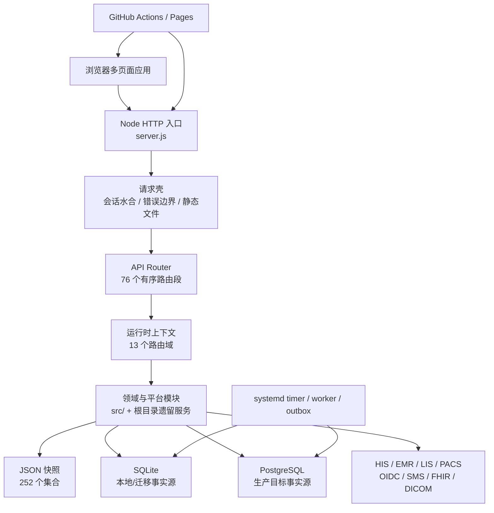

# CURRENT ARCHITECTURE — 主线现状地图

> 实施分支 AS-IS 快照：基于 `main@a15d10dc67a7fd89540d3073ece34b5d8c7b942e`
> 采集日期：2026-08-20
> 性质：AS-IS，只描述已存在实现，不表达目标状态或实施授权。

## 1. 系统轮廓

平台是一个模块化单体，但迁移并不完整：HTTP 路由已经模块化，SQLite migration 注册表已从组合根分离，种子数据、存储装配和大量领域函数仍集中在 `server.js`；浏览器应用仍以多个大体量全局脚本为主。

## 2. 仓库结构

本实施分支预计跟踪 1,388 个文件，其中 JavaScript 947、Markdown 233、JSON 94、HTML 44。主要目录：

| 路径 | 作用 | 当前边界 |
|---|---|---|
| `/` | 服务入口、浏览器页面、遗留领域服务 | 仍然平铺，存在同名模块和超大文件 |
| `src/http/` | API router、路由段、运行时上下文、静态资产发布策略 | T00 管组合、顺序和显式静态发布边界；T01–T09 管领域路由 |
| `src/platform/` | 数据、事件、区域、部署、治理与切换控制 | 模块化程度较高，仍依赖组合根注入 |
| `src/identity-security/` | 会话、认证、授权、静态页面守卫、安全审计 | 页面授权与资产发布策略分层执行，均默认拒绝 |
| `src/*领域*/` | 新领域服务、仓储、传输和 worker | 与根目录遗留服务并存 |
| `config/` | 进程、数据所有权、区域、迁移和发布策略 | 多数为机器可读治理事实 |
| `data/` | 被跟踪的 `db.json` 开发/迁移输入 | 浏览器只读取运行时或构建时生成的 `public-demo.json`；生成物不入库 |
| `deploy/` | SQL、systemd、Compose、环境模板和现场验证 | 生产证据默认 NO-GO |
| `scripts/` | 测试、readiness、报告、部署和后台 worker | 169 个根级文件，职责和产物较分散 |
| `test/` | Node test 与 Playwright | 405 个 test/spec 文件（400 Node、5 E2E） |
| `regions/` | 多地区部署配置 | 由区域清单和发布注册表控制 |
| `digital-hospital-standard-platform/` | 内嵌数智医院展示前端 | 独立页面但仍共享主仓发布生命周期 |
| `resident-mini-program-platform/` | 居民小程序适配前端 | 独立页面但仍共享主仓发布生命周期 |
| `output/` | 已跟踪的 PDF 制品 | 属生成物，不应作为源码直接编辑 |

`national-access-showcase/`、应急发布 worktree 和视频项目不在此主线跟踪树内；它们不能被描述为主线源码模块，也不能与主应用依赖或数据混用。

## 3. 主应用与入口

| 应用/入口 | 技术 | 责任 |
|---|---|---|
| Node API 服务 | `server.js` | 启动、依赖装配、会话、allowlist 静态读取、合成演示快照、API 调度、SQLite/JSON 兼容；SQLite DDL 委托独立注册表 |
| 平台管理端 | `index.html`、`app.js` | 监管、资源、统计、公共卫生与治理入口 |
| 居民端 | `citizen.html`、`citizen.js` | 居民档案、授权、慢病和服务旅程 |
| 机构/医生/医保/县域端 | 对应 HTML/JS | 各角色工作台 |
| 专项应用 | 公卫、急救、血液、影像、体检、护理、陪诊等页面 | 专项领域体验与演示 |
| 数智医院子站 | `digital-hospital-standard-platform/` | 标准能力展示；单个 `app.js` 约 10.5k 行 |
| 居民小程序适配 | `resident-mini-program-platform/` | 居民端交付适配 |
| API 路由入口 | `src/http/api-router.js`、`src/http/routes/index.js` | 76 个路由段的固定顺序与短路 |
| 后台入口 | `scripts/*worker.js`、systemd timer | outbox 投递、同步、核对和控制任务 |

## 4. 运行时边界

- `main` 是唯一集成和发布分支。
- `config/process-workstreams.json` 定义 T00–T09 所有权；跨域协议、路由顺序、CI、组合根和部署属于 T00。
- `config/domain-data-ownership.json` 登记 83 个生产候选集合；`shared` 和 `state-data` 明确为非所有者域。
- 开发环境允许 JSON 或 SQLite；生产策略声明 PostgreSQL 为事实源且禁止 fallback write。
- 生产 Go/No-Go 默认 `NO-GO`，真实环境、联调、审批和站点证据不能由仓库生成。

## 5. 已确认的边界偏差

1. 静态服务器与 Pages 现按 `config/static-publication.json` 的 44 个入口递归收集显式浏览器资源；未知路径统一 404。
2. 浏览器和 Service Worker 已迁移到合成的 `data/public-demo.json`；`data/db.json` 不进入静态制品。
3. `server.js` 仍约 28.2k 行；SQLite migration 已抽离约 550 行，但路由拆分没有同步拆完组合根和领域实现。
4. `server.js` 与 `src/platform/cutover/pilot-cutover-alert-runtime.js` 存在运行时 `require` 环。
5. SQLite v1–v14 已迁入 `src/platform/storage/sqlite-migrations.js` 并冻结内容指纹；`STORAGE_SCHEMA_VERSION`、部署检查和测试统一从注册表 head v14 派生。历史 ledger 的 v1–v14 checksum 保持兼容，v15 起写入内容 SHA-256。
6. TEST-001 候选已建立统一的 `build`、`lint`、`typecheck`、`test:unit`、`test:integration`、`test:smoke` 入口；build 复用静态发布 allowlist 并默认输出到仓库外，unit/integration 完整分区根测试，smoke 独立启动临时 JSON 运行时。lint 仍有 3 个文件的精确遗留规则例外，typecheck 当前只覆盖 6 个治理/安全边界文件。
7. 审计验证已收敛到 `src/identity-security/audit-chain.js` 的 v2 严格端口；内容、链接、结构和重复 ID 任一异常均失败，验证 API/合规报告不再读取时重封。全量状态写入中的审计数组由服务端管理。
8. 机器 API 授权矩阵扫描全部模块化路由源码的 `requireApiRole` 声明，并对九条高风险接口锁定 owner、角色、范围和用途；CI 对声明数量和高风险唯一性 fail closed。

## 6. T06 五子域治理切片

本分支新增 `config/clinical-subdomains.json`，把临床专科正式定义为急救、血液、影像、体检、质量安全五个治理子域。运行时、公开 API、数据库和部署拓扑均未改变，仍由同一个 Node 模块化单体承载。现有 `/api/operations` 路由被登记为历史错位并等待 T00/T02 handoff，不能被描述成第六个临床子域。

急救第二切片将 `GET /api/emergency/dashboard` 的查询组合移入 `src/clinical-specialties/emergency/dashboard-query.js`。HTTP 路由、鉴权、数据库读取、响应脱敏和全局运行时上下文保持原位；这是一个用例端口迁移，不代表急救子域已完成源码隔离。

血液第三切片将 `GET /api/blood-system` 的组合和机构范围投影移入 `src/clinical-specialties/blood/dashboard-query.js`。旧 HTTP 路由仍负责鉴权、读取和响应；既有交易数组内存规范化仍在查询执行前发生，但没有新增 `writeDatabase`、schema、审计或部署变化。

影像第四切片将 `GET /api/imaging-cloud` 的构建、脱敏和公开响应投影移入 `src/clinical-specialties/imaging/`。旧 HTTP 路由继续负责角色、居民范围和数据访问审计；带 `residentId` 的 GET 仍按遗留行为持久化审计。通用影像响应净化不再由血液混合路由实现，但旧导出保持兼容。

体检第五切片将 `GET /api/physical-exams` 的 Overview 构建、生产 readiness 组合和角色投影移入 `src/clinical-specialties/physical-examination/dashboard-query.js`。混合 HTTP 路由仍负责鉴权、居民范围、安全事件、访问审计持久化和最终脱敏，调用顺序保持不变；体检写命令仍留在 `blood-innovation`。
