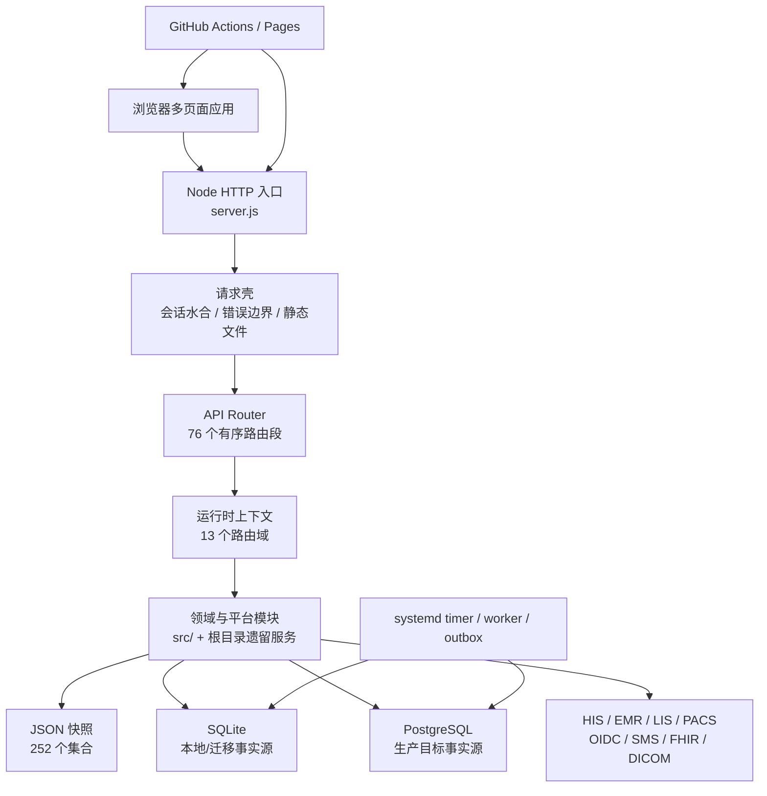

# CURRENT ARCHITECTURE — 主线现状地图

> 快照：`main@b1e489852e85db982fca9239da694e2a641f5945`
> 采集日期：2026-08-18
> 性质：AS-IS，只描述已存在实现，不表达目标状态或实施授权。

## 1. 系统轮廓

平台是一个模块化单体，但迁移并不完整：HTTP 路由已经模块化，组合根、种子数据、存储装配和大量领域函数仍集中在 `server.js`；浏览器应用仍以多个大体量全局脚本为主。

## 2. 仓库结构

主线跟踪 1,335 个文件，其中 JavaScript 924、Markdown 205、JSON 92、HTML 44。主要目录：

| 路径 | 作用 | 当前边界 |
|---|---|---|
| `/` | 服务入口、浏览器页面、遗留领域服务 | 仍然平铺，存在同名模块和超大文件 |
| `src/http/` | API router、路由段、运行时上下文 | T00 管组合与顺序；T01–T09 管领域路由 |
| `src/platform/` | 数据、事件、区域、部署、治理与切换控制 | 模块化程度较高，仍依赖组合根注入 |
| `src/identity-security/` | 会话、认证、授权、静态页面守卫、安全审计 | 已有 fail-closed 能力；静态资产发布根仍不安全 |
| `src/*领域*/` | 新领域服务、仓储、传输和 worker | 与根目录遗留服务并存 |
| `config/` | 进程、数据所有权、区域、迁移和发布策略 | 多数为机器可读治理事实 |
| `data/` | 被跟踪的 `db.json` 静态/开发快照 | 同时被浏览器、脚本和 SQLite 初始化使用 |
| `deploy/` | SQL、systemd、Compose、环境模板和现场验证 | 生产证据默认 NO-GO |
| `scripts/` | 测试、readiness、报告、部署和后台 worker | 168 个文件，职责和产物较分散 |
| `test/` | Node test 与 Playwright | 393 个 test/spec 文件 |
| `regions/` | 多地区部署配置 | 由区域清单和发布注册表控制 |
| `digital-hospital-standard-platform/` | 内嵌数智医院展示前端 | 独立页面但仍共享主仓发布生命周期 |
| `resident-mini-program-platform/` | 居民小程序适配前端 | 独立页面但仍共享主仓发布生命周期 |
| `output/` | 已跟踪的 PDF 制品 | 属生成物，不应作为源码直接编辑 |

`national-access-showcase/`、应急发布 worktree 和视频项目不在此主线跟踪树内；它们不能被描述为主线源码模块，也不能与主应用依赖或数据混用。

## 3. 主应用与入口

| 应用/入口 | 技术 | 责任 |
|---|---|---|
| Node API 服务 | `server.js` | 启动、依赖装配、会话、静态读取、API 调度、SQLite/JSON 兼容 |
| 平台管理端 | `index.html`、`app.js` | 监管、资源、统计、公共卫生与治理入口 |
| 居民端 | `citizen.html`、`citizen.js` | 居民档案、授权、慢病和服务旅程 |
| 机构/医生/医保/县域端 | 对应 HTML/JS | 各角色工作台 |
| 专项应用 | 公卫、急救、血液、影像、体检、护理、陪诊等页面 | 专项领域体验与演示 |
| 数智医院子站 | `digital-hospital-standard-platform/` | 标准能力展示；单个 `app.js` 约 10.5k 行 |
| 居民小程序适配 | `resident-mini-program-platform/` | 居民端交付适配 |
| API 路由入口 | `src/http/api-router.js`、`src/http/routes/index.js` | 76 个路由段的固定顺序与短路 |
| 后台入口 | `scripts/*worker.js`、systemd timer | outbox 投递、同步、核对和控制任务 |

## 4. 运行时边界

- `main` 是唯一集成和发布分支。
- `config/process-workstreams.json` 定义 T00–T09 所有权；跨域协议、路由顺序、CI、组合根和部署属于 T00。
- `config/domain-data-ownership.json` 登记 83 个生产候选集合；`shared` 和 `state-data` 明确为非所有者域。
- 开发环境允许 JSON 或 SQLite；生产策略声明 PostgreSQL 为事实源且禁止 fallback write。
- 生产 Go/No-Go 默认 `NO-GO`，真实环境、联调、审批和站点证据不能由仓库生成。

## 5. 已确认的边界偏差

1. 静态服务器在页面授权后仍从仓库根目录读取任意非越界路径，非 HTML 资产默认 `ASSET` 放行。
2. `data/db.json` 是被跟踪、被前端读取并被 Service Worker 缓存的快照。
3. `server.js` 仍约 28,746 行；路由拆分没有同步拆完组合根和领域实现。
4. `server.js` 与 `src/platform/cutover/pilot-cutover-alert-runtime.js` 存在运行时 `require` 环。
5. SQLite migration 数组已到 v14，但 `STORAGE_SCHEMA_VERSION`、部署检查和测试仍声明 v11。
6. 主线没有统一的 `build`、`lint`、`typecheck`、`test:unit`、`test:integration`、`test:smoke` 脚本入口。
