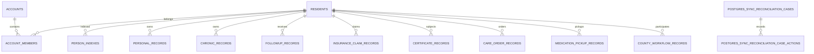

# DATA MODEL — 主线数据地图

> 快照：`main@b1e4898`。禁止据此直接编辑数据库或 `data/db.json`；schema 事实必须由运行时与 migration 再验证。

## 1. 存储拓扑

| 环境/用途 | 存储 | 权威性 |
|---|---|---|
| 静态演示 | `data/db.json` | 只读演示快照，不应成为生产事实源 |
| 本地开发 | JSON 或 Node `node:sqlite` | `config/domain-data-ownership.json` 声明 local-demo-only |
| 自动化测试 | 隔离测试适配器/临时文件 | 仅用于确定性验证 |
| 迁移期 | SQLite + transactional outbox + PostgreSQL shadow | 本地提交后异步复制，禁止请求路径双写 |
| 生产目标 | PostgreSQL | 声明为 system-of-record，fallback write=false |
| 专项状态 | 会话、数智医院执行、shadow checkpoint/receipt | 可使用独立 SQLite/PostgreSQL 表，生命周期独立 |

## 2. SQLite Schema

主存储 migration 位于 `server.js` 的 `SQLITE_MIGRATIONS` 数组，当前实际 migration head 为 v14。包括 `schema_migrations` 在内，主 SQLite 逻辑上创建 30 张表：

| 组 | 表 |
|---|---|
| 集合与审计 | `state_collections`、`storage_events`、`schema_migrations` |
| 身份主索引镜像 | `residents`、`accounts`、`account_members`、`person_indexes` |
| 个人记录镜像 | `personal_records` |
| 慢病与服务镜像 | `chronic_records`、`followup_records`、`insurance_claim_records`、`certificate_records`、`care_order_records`、`medication_pickup_records`、`county_workflow_records` |
| 治理与科研镜像 | `institution_credit_evaluation_records`、`research_dataset_records`、`disease_registry_model_records`、`accessibility_checklist_records` |
| PostgreSQL 迁移 | `postgres_sync_outbox`、`postgres_sync_reconciliations`、`postgres_sync_reconciliation_cases`、`postgres_sync_reconciliation_case_actions` |
| 会话 | `auth_sessions` |
| 公卫幂等键 | `public_health_modernization_signal_keys`、3 张 respiratory lifecycle key 表、2 张 official exchange key 表 |

另外存在独立 SQLite 表：`digital_hospital_execution_state`、`shadow_relay_checkpoints`、`shadow_relay_operation_receipts`。它们不应与主业务 schema 版本混算。

### 关系主链

外键主要约束居民镜像和账号成员；大量领域数据仍封装在 `payload TEXT` 或 `state_collections.payload` JSON 中，因此物理 FK 不能覆盖全部逻辑关系。

## 3. Migration 现状

- v1–v14 顺序执行，每次在事务中 apply，成功后写 `schema_migrations(version,name,checksum,applied_at)`。
- checksum 只基于 `version:name`，不包含 SQL/函数实现；已应用 migration 被修改时无法发现内容漂移。
- migration 定义和大型运行时位于同一个 `server.js`，所有权为 T00，模块边界不清。
- `STORAGE_SCHEMA_VERSION` 仍为 11；`storageMeta`、部署脚本和静态测试仍以 v11 为门禁，但 migration 已到 v14。
- 当前没有独立的 schema 快照、完整指纹或“已应用 migration 不可变”机器门禁。

因此“v14 已存在”不等于 migration 体系已经治理完成。

## 4. JSON 集合与实际使用

`data/db.json` 当前有 252 个顶层集合。主要用途：

- 静态页面和离线演示直接 fetch；
- SQLite 首次初始化种子；
- readiness、报告和部署检查输入；
- 本地兼容快照与回退读取。

`config/domain-data-ownership.json` 只登记 83 个集合：platform-governance 32、care 11、public-health 10、clinical 9、integration 7、citizen 6、identity 5、insurance 2、research 1。其余集合按策略为 `legacy-non-authoritative`，禁止直接晋升为生产写模型。

## 5. PostgreSQL 结构

已跟踪 SQL 至少定义 13 张生产候选表：

- 主存储：`primary_storage_batches`、`primary_collection_state`；
- 身份安全审计：4 张 stream/control/command/event 表；
- 医保支付：aggregate、command、outbox；
- 转诊投递：outbox、replay；
- 急救信号投递：outbox、replay。

此外脚本生成 MPI、collection migration 和 runtime sync SQL。生产是否真实建立这些表取决于外部环境证据，仓库不得宣称已切换。

## 6. 核心数据不可变边界

核心概念定义见 `CORE_DATA_DEFINITIONS.md`。主线现有机器事实优先级为：

1. `config/domain-data-ownership.json` 的 owner、reader、写契约和生产存储策略；
2. `config/cross-domain-contracts.json` 的跨域契约；
3. SQLite/PostgreSQL migration 与表约束；
4. `data/db.json` 仅作为演示/迁移输入，不定义生产语义。

## 7. 主要风险

- `DATA-001`：migration head v14 与公开 schema version v11 不一致。
- `DATA-002`：migration checksum 不覆盖 SQL 内容，历史漂移不可检测。
- `DATA-003`：252 个 JSON 集合仅 83 个有生产所有权，遗留数据边界巨大。
- `DATA-004`：JSON 快照同时承担页面数据、种子和报告输入，多角色耦合。
- `DATA-005`：大量 `payload` JSON 关系没有数据库约束，只能靠应用验证。
- `DATA-006`：静态发布 `data/db.json` 与 Service Worker 缓存扩大数据泄露面。
- `DATA-007`：PostgreSQL 目标模型、SQLite 镜像和专项数据库存在版本/核对复杂度。

## 8. 临床子域数据盘点

`config/clinical-subdomains.json` 将中央已登记的 9 个 `clinical-specialties` 集合映射到急救、影像和质量安全子域，并登记 66 个遗留候选集合。候选集合仍受 `legacy-non-authoritative` 策略约束，不因子域盘点获得生产写入资格。血液和体检尚无中央登记的生产候选集合；后续必须通过独立 T00 数据任务晋升。质量安全只能写质量自有集合，通过版本化查询或事件读模型消费其他子域数据。

急救 dashboard 查询端口只消费既有 `readDatabase` 快照和血液协调只读投影，不创建集合、不写数据、不改变事务或事实源。数据所有权、schema、migration 和 PostgreSQL/SQLite 拓扑均未变化。

血液现有 22 个候选集合；dashboard 查询端口只读取其中既有的 test report、release review、shipment、safety incident、compatibility test 和 transfusion episode 投影。它保留 `normalizeTransactionState` 对缺失数组的内存补齐，但路由不调用 `writeDatabase`；这些候选集合仍是 `legacy-non-authoritative`，本切片没有晋升 Owner、创建 schema 或新增 migration。

影像 dashboard 查询读取既有 studies、shares、互认和报告投影，并继续使用居民/个人记录等外部只读数据形成授权范围。带 `residentId` 的请求仍由 HTTP 适配器追加现有数据访问日志并调用原持久化边界；查询端口本身不写业务集合。本切片没有新增集合、改变 Owner、schema、migration 或事实源。

体检 dashboard 查询读取 `personalRecords[category=physical-exam]`、异常案例、联调、专项分流、附件、网关事件和慢病任务等既有投影。7 个体检候选集合仍为 `legacy-non-authoritative`，没有被本切片晋升为生产 Owner；显式居民查询继续由 HTTP 适配器持久化原有访问审计，查询端口不写业务集合，也不改变 schema、migration 或事实源。
