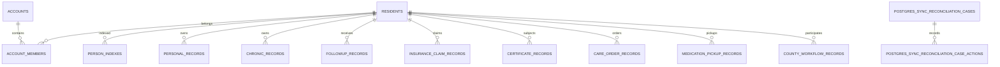

# DATA MODEL — 主线数据地图

> 实施分支 AS-IS 快照：基于 `main@a15d10d`。禁止据此直接编辑数据库或 `data/db.json`；schema 事实必须由运行时与 migration 再验证。

## 1. 存储拓扑

| 环境/用途 | 存储 | 权威性 |
|---|---|---|
| 静态演示 | 生成的 `data/public-demo.json` | 从运行时/构建时 JSON 输入合成，删除凭据并掩码身份联系字段；不入库、不成为生产事实源 |
| 本地开发 | JSON 或 Node `node:sqlite` | `config/domain-data-ownership.json` 声明 local-demo-only |
| 自动化测试 | 隔离测试适配器/临时文件 | 仅用于确定性验证 |
| 迁移期 | SQLite + transactional outbox + PostgreSQL shadow | 本地提交后异步复制，禁止请求路径双写 |
| 生产目标 | PostgreSQL | 声明为 system-of-record，fallback write=false |
| 专项状态 | 会话、数智医院执行、shadow checkpoint/receipt | 可使用独立 SQLite/PostgreSQL 表，生命周期独立 |

认证安全状态在单主机 SQLite 中复用 `state_collections[auth-security-state-v1]`，该内部键从业务快照、集合版本和 PostgreSQL shadow outbox 中排除；生产多实例使用 `${POSTGRES_SCHEMA}.auth_security_state`。两种实现只持久化主体 HMAC 摘要、验证码摘要、TTL、计数与锁定元数据，不保存明文手机号或验证码。

## 2. SQLite Schema

主存储 migration 位于 `src/platform/storage/sqlite-migrations.js` 的版本化注册表，当前实际与公开 head 均为 v14。包括 `schema_migrations` 在内，主 SQLite 逻辑上创建 30 张表：

| 组 | 表 |
|---|---|
| 集合与审计 | `state_collections`、`storage_events`、`schema_migrations` |
| 身份主索引镜像 | `residents`、`accounts`、`account_members`、`person_indexes` |
| 个人记录镜像 | `personal_records` |
| 慢病与服务镜像 | `chronic_records`、`followup_records`、`insurance_claim_records`、`certificate_records`、`care_order_records`、`medication_pickup_records`、`county_workflow_records` |
| 治理与科研镜像 | `institution_credit_evaluation_records`、`research_dataset_records`、`disease_registry_model_records`、`accessibility_checklist_records` |
| PostgreSQL 迁移 | `postgres_sync_outbox`、`postgres_sync_reconciliations`、`postgres_sync_reconciliation_cases`、`postgres_sync_reconciliation_case_actions` |
| 会话 | `auth_sessions` |
| 公卫幂等键 | `public_health_modernization_signal_keys`、3 张 respiratory lifecycle key 表、2 张 official exchange key 表 |

另外存在独立 SQLite 表：`digital_hospital_execution_state`、`shadow_relay_checkpoints`、`shadow_relay_operation_receipts`。它们不应与主业务 schema 版本混算。

### 关系主链

外键主要约束居民镜像和账号成员；大量领域数据仍封装在 `payload TEXT` 或 `state_collections.payload` JSON 中，因此物理 FK 不能覆盖全部逻辑关系。

## 3. Migration 现状

- v1–v14 在独立注册表中连续执行，每个版本在事务中 apply，成功后写 `schema_migrations(version,name,checksum,applied_at)`。
- 为兼容既有数据库，v1–v14 ledger checksum 继续使用历史 `version:name` 摘要；对应源码内容另由 14 个冻结 SHA-256 和注册表校验保护，禁止改写。
- v15 及以后 ledger checksum 使用包含 version、name、owner、apply 实现和显式依赖的内容 SHA-256；新版本必须连续追加。
- runner 在执行新迁移前校验已应用 ledger 是注册表的连续前缀，name/checksum 漂移会 fail-closed；单个迁移失败时 DDL 与 ledger 行一并回滚。
- `STORAGE_SCHEMA_VERSION`、`storageMeta`、部署检查、生产 readiness 和发布报告统一从 `SQLITE_SCHEMA_HEAD` 派生，当前为 14。
- 自动化测试覆盖空库 0→14、v11→14、重复执行、冻结指纹、ledger 漂移、未来 v15 内容 checksum 和失败回滚；schema fingerprint 用于比较升级结果与空库结果。

专项 SQLite 表仍有独立生命周期和台账，不得误计入主 schema head；生产 PostgreSQL 是否已迁移仍必须由现场证据证明。

## 4. JSON 集合与实际使用

`data/db.json` 当前有 252 个顶层集合。主要用途：

- SQLite 首次初始化种子；
- readiness、报告和部署检查输入；
- 本地兼容快照与回退读取。

静态页面不再直接读取该文件。Node 静态服务按源文件 mtime/size 合成 `data/public-demo.json`；Pages 在仓库外临时目录生成同名制品，Service Worker 只缓存该脱敏结果。

`config/domain-data-ownership.json` 只登记 83 个集合：platform-governance 32、care 11、public-health 10、clinical 9、integration 7、citizen 6、identity 5、insurance 2、research 1。其余集合按策略为 `legacy-non-authoritative`，禁止直接晋升为生产写模型。

`followups` 继续由 citizen-chronic/T04 拥有；随访事件 outbox、inbox、projection 和 receipt
仍嵌在该聚合的 `domainRuntime` 中。本切片只增加安全 publisher 端口，没有新集合、DDL、
migration 或事实源变化。receipt 不保存供应方原始回执 ID、签名或正文，只保存事件关联、
payload/request/receipt/provider/signature/activation 摘要、occurredAt 和 `accepted|delivered`
状态；outbox 同步保存外部状态。HTTP dispatch 成功后仍通过既有整体状态写回持久化；批次
外发或最终整体写回失败时输入快照保持 pending，后续以稳定幂等键重试。缺少独立持久 lease、
attempt/backoff 和 dead-letter，因此不能把当前结构描述为多实例生产投递仓储。

## 5. PostgreSQL 结构

已跟踪 SQL 至少定义 13 张生产候选表：

- 主存储：`primary_storage_batches`、`primary_collection_state`；
- 身份安全审计：4 张 stream/control/command/event 表；
- 医保支付：aggregate、command、outbox；
- 转诊投递：outbox、replay；
- 急救信号投递：outbox、replay。

此外脚本生成 MPI、collection migration 和 runtime sync SQL；PostgreSQL migration package 同时创建 runtime sync、中央会话与 `auth_security_state` 表。生产是否真实建立这些表取决于外部环境证据，仓库不得宣称已切换。

### 转诊命令持久化

三条转诊 HTTP 写入口共用既有 `referralSystem.referrals`、`referralCommandInbox` 与 `referralOutbox`。一次非重放命令在同一 UoW 中写入聚合新版本、幂等收件箱回执和 `care-coordination.referral-updated.v1` 发件箱事件；旧记录缺少 `version` 时按既有兼容规则解释为 1。REF-01a 不新增表、集合或 migration。

## 6. 核心数据不可变边界

核心概念定义见 `CORE_DATA_DEFINITIONS.md`。主线现有机器事实优先级为：

1. `config/domain-data-ownership.json` 的 owner、reader、写契约和生产存储策略；
2. `config/cross-domain-contracts.json` 的跨域契约；
3. SQLite/PostgreSQL migration 与表约束；
4. `data/db.json` 仅作为演示/迁移输入，不定义生产语义。

## 7. 主要风险

- `DATA-001`、`DATA-002` 已在本切片关闭：公开 head 已统一为 v14，历史源码由冻结内容指纹保护，v15+ ledger 使用内容 checksum。
- `DATA-003`：252 个 JSON 集合仅 83 个有生产所有权，遗留数据边界巨大。
- `DATA-004`：JSON 快照同时承担页面数据、种子和报告输入，多角色耦合。
- `DATA-005`：大量 `payload` JSON 关系没有数据库约束，只能靠应用验证。
- `DATA-006`：已由显式发布清单、合成脱敏快照、旧缓存版本撤销和敏感路径负向测试缓解；仓库历史与源快照的数据分类仍需单独治理。
- `DATA-007`：PostgreSQL 目标模型、SQLite 镜像和专项数据库存在版本/核对复杂度。

## 8. 临床子域数据盘点

`config/clinical-subdomains.json` 将中央已登记的 9 个 `clinical-specialties` 集合映射到急救、影像和质量安全子域，并登记 66 个遗留候选集合。候选集合仍受 `legacy-non-authoritative` 策略约束，不因子域盘点获得生产写入资格。血液和体检尚无中央登记的生产候选集合；后续必须通过独立 T00 数据任务晋升。质量安全只能写质量自有集合，通过版本化查询或事件读模型消费其他子域数据。

急救 dashboard 查询端口只消费既有 `readDatabase` 快照和血液协调只读投影，不创建集合、不写数据、不改变事务或事实源。数据所有权、schema、migration 和 PostgreSQL/SQLite 拓扑均未变化。

血液现有 22 个候选集合；dashboard 查询端口只读取其中既有的 test report、release review、shipment、safety incident、compatibility test 和 transfusion episode 投影。它保留 `normalizeTransactionState` 对缺失数组的内存补齐，但路由不调用 `writeDatabase`；这些候选集合仍是 `legacy-non-authoritative`，本切片没有晋升 Owner、创建 schema 或新增 migration。

影像 dashboard 查询读取既有 studies、shares、互认和报告投影，并继续使用居民/个人记录等外部只读数据形成授权范围。带 `residentId` 的请求仍由 HTTP 适配器追加现有数据访问日志并调用原持久化边界；查询端口本身不写业务集合。本切片没有新增集合、改变 Owner、schema、migration 或事实源。

体检 dashboard 查询读取 `personalRecords[category=physical-exam]`、异常案例、联调、专项分流、附件、网关事件和慢病任务等既有投影。7 个体检候选集合仍为 `legacy-non-authoritative`，没有被本切片晋升为生产 Owner；显式居民查询继续由 HTTP 适配器持久化原有访问审计，查询端口不写业务集合，也不改变 schema、migration 或事实源。

## 9. 健康驾驶舱指标测量

`population-service-visits.v1` 是代码内版本化逻辑合同，不新增集合、表、DDL 或 migration。
测量只读取既有 `healthStatistics.dailyServiceReports` 与 `healthStatistics.serviceReports` 聚合，
不持久化为权威事实。日报必须具备受认可的签名摘要或获批来源版本才可能达到 `ready`；月报
比例折算明确标记为 estimated/blocked。缺少服务端区域范围、来源水位或完整证据同样失败关闭。
如后续把测量快照晋升为生产事实，必须先登记数据 owner、分类、reader、write contract，并由
T00 建立 migration 和回滚证据。
