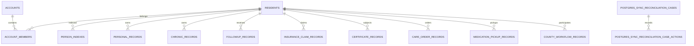

# DATA MODEL — 主线数据地图

## 2026-08-29 路由实现源登记不是业务数据

`routeImplementationSources` 是源码治理元数据，只保存子域 ID、仓库相对 JavaScript 路径与静态挂载它的 route facade 路径清单。它不新增或修改业务集合、SQLite/PostgreSQL 表、字段、DDL、migration、审计事实或生产证据；domain、process owner、目标源码根与允许的 API 前缀继续来自既有临床注册表。当前数组为空，数据库及 252 个集合状态完全不变。

## 2026-08-27 生产 Go/No-Go 页面数据边界

本切片只改变浏览器对既有 `/api/production-go-no-go/center` 响应的 DOM 投影，不新增或修改集合、SQLite/PostgreSQL 表、migration、审计记录或生产证据。恶意载荷 E2E 使用临时测试响应，不构成业务事实、审批或现场证据。

## 2026-08-26 T09 兼容聚合元数据

本切片没有新增表、SQLite DDL 或 migration，也未直接编辑数据快照。现有 `researchDatasets[]` 与
`drugConsumableSupervisions[]` 仅在被命令触及时追加内部兼容元数据：

| 字段 | 语义 | 约束 |
|---|---|---|
| `domainVersion` | 聚合乐观版本 | 遗留缺失值解释为 0；成功命令加 1；显式 `expectedVersion` 不匹配返回 409 |
| `commandReceipts[]` | actor-scoped 命令回执 | 最多 100 条；保存 key hash、request digest、动作、结果版本/ID、首次公共响应快照和时间，不保存原始 key；公共投影删除 |

科研合规导出申请继续写入既有 `compliantDataExports[]`；数据集、导出申请、`usageAudit` 与
`dataAccessLogs` 在一次状态持久化中提交。药械记录、记录内 `auditTrail` 与 `securityEvents` 同样一次提交。
这些 JSON/SQLite 兼容元数据不是生产 PostgreSQL schema 冻结或跨实例事务证明；正式迁移仍须由 T00
依据核心数据定义和 migration 规则另行登记。

> 实施分支 AS-IS 快照：基于 `main@a15d10d`。禁止据此直接编辑数据库或 `data/db.json`；schema 事实必须由运行时与 migration 再验证。

## 1. 存储拓扑

| 环境/用途 | 存储 | 权威性 |
|---|---|---|
| 静态演示 | 生成的 `data/public-demo.json` | 从运行时/构建时 JSON 输入合成，删除凭据并掩码身份联系字段；不入库、不成为生产事实源 |
| 本地开发 | JSON 或 Node `node:sqlite` | `config/domain-data-ownership.json` 声明 local-demo-only |
| 自动化测试 | 隔离测试适配器/临时文件 | 仅用于确定性验证 |
| 迁移期 | SQLite + transactional outbox + PostgreSQL shadow | 本地提交后异步复制，禁止请求路径双写 |
| 生产目标 | PostgreSQL | 声明为 system-of-record，fallback write=false |
| 专项状态 | 会话、数智医院执行、shadow checkpoint/receipt | 可使用独立 SQLite/PostgreSQL 表，生命周期独立 |

认证安全状态在单主机 SQLite 中复用 `state_collections[auth-security-state-v1]`，该内部键从业务快照、集合版本和 PostgreSQL shadow outbox 中排除；生产多实例使用 `${POSTGRES_SCHEMA}.auth_security_state`。两种实现只持久化主体 HMAC 摘要、验证码摘要、TTL、计数与锁定元数据，不保存明文手机号或验证码。

浏览器 `localStorage[health-city-auth-session]` 只保留非凭据身份/授权投影或静态演示状态，
不再保存服务端 `token`、access/refresh/id token、bearer 或 Authorization 值。HttpOnly Cookie
是动态浏览器会话凭据；显式 bearer-only 兼容只在当前页面内存中短暂持有 token，页面重载不恢复，
且生产始终保持 NO-GO。本切片不新增表、集合、字段或 migration。

Playwright E2E 只在操作系统临时目录复制开发种子，根 40 项和居民 13 项由不同服务进程与不同
`DATA_DIR` 消费；每次标准运行还分配独立回环端口，不能连接其他 worktree 的测试服务。测试结束删除
临时目录，既不写回 `data/db.json`，也不形成业务事实、迁移证据或生产验收证据。

PWA 专项 3 项复用相同的仓库外临时数据和动态回环端口，只在独立浏览器 context 创建 v61 Cache Storage
与 Service Worker registration；每项结束注销 registration 并删除所有测试 origin cache。缓存只接受同源
成功响应，`/api/*` 与被拒绝的 `/data/db.json` 不进入缓存。Cache Storage 不是业务事实源或迁移证据。

## 2. SQLite Schema

主存储 migration 位于 `src/platform/storage/sqlite-migrations.js` 的版本化注册表，当前实际与公开 head 均为 v15。包括 `schema_migrations` 在内，主 SQLite 逻辑上创建 31 张表：

| 组 | 表 |
|---|---|
| 集合与审计 | `state_collections`、`storage_events`、`schema_migrations` |
| 连续审计来源 | `audit_delivery_source_events` |
| 身份主索引镜像 | `residents`、`accounts`、`account_members`、`person_indexes` |
| 个人记录镜像 | `personal_records` |
| 慢病与服务镜像 | `chronic_records`、`followup_records`、`insurance_claim_records`、`certificate_records`、`care_order_records`、`medication_pickup_records`、`county_workflow_records` |
| 治理与科研镜像 | `institution_credit_evaluation_records`、`research_dataset_records`、`disease_registry_model_records`、`accessibility_checklist_records` |
| PostgreSQL 迁移 | `postgres_sync_outbox`、`postgres_sync_reconciliations`、`postgres_sync_reconciliation_cases`、`postgres_sync_reconciliation_case_actions` |
| 会话 | `auth_sessions` |
| 公卫幂等键 | `public_health_modernization_signal_keys`、3 张 respiratory lifecycle key 表、2 张 official exchange key 表 |

另外存在独立 SQLite 表：`digital_hospital_execution_state`、`shadow_relay_checkpoints`、`shadow_relay_operation_receipts`。它们不应与主业务 schema 版本混算。

### 关系主链

外键主要约束居民镜像和账号成员；大量领域数据仍封装在 `payload TEXT` 或 `state_collections.payload` JSON 中，因此物理 FK 不能覆盖全部逻辑关系。

## 3. Migration 现状

- v1–v14 在独立注册表中连续执行，每个版本在事务中 apply，成功后写 `schema_migrations(version,name,checksum,applied_at)`。
- 为兼容既有数据库，v1–v14 ledger checksum 继续使用历史 `version:name` 摘要；对应源码内容另由 14 个冻结 SHA-256 和注册表校验保护，禁止改写。
- v15 及以后 ledger checksum 使用包含 version、name、owner、apply 实现和显式依赖的内容 SHA-256；新版本必须连续追加。
- runner 在执行新迁移前校验已应用 ledger 是注册表的连续前缀，name/checksum 漂移会 fail-closed；单个迁移失败时 DDL 与 ledger 行一并回滚。
- `STORAGE_SCHEMA_VERSION`、`storageMeta`、部署检查、生产 readiness 和发布报告统一从 `SQLITE_SCHEMA_HEAD` 派生，当前为 16。
- 自动化测试覆盖空库 0→16、v11→16、v15→16 回填、重复执行、冻结指纹、ledger 漂移、未来 v17 内容 checksum 和失败回滚；schema fingerprint 用于比较升级结果与空库结果。

专项 SQLite 表仍有独立生命周期和台账，不得误计入主 schema head；生产 PostgreSQL 是否已迁移仍必须由现场证据证明。

## 4. JSON 集合与实际使用

`data/db.json` 当前有 252 个顶层集合。主要用途：

- SQLite 首次初始化种子；
- readiness、报告和部署检查输入；
- 本地兼容快照与回退读取。

静态页面不再直接读取该文件。Node 静态服务按源文件 mtime/size 合成 `data/public-demo.json`；Pages 在仓库外临时目录生成同名制品，Service Worker v61 只缓存同源成功响应中的该脱敏结果，不缓存源快照的 404 拒绝响应。

`config/domain-data-ownership.json` 当前登记 106 个 owner 合同，其中 60 个集合沿用既有版本化写
合同，19 个首发 legacy 集合仅完成唯一业务 owner、reader、classification 与实际源码证据审查，
27 个合同集合当前不在快照。另有 `dataAccessLogs`、`platformProcessAudit`、`securityEvents` 3 个
既有系统集合。剩余 170 个无 owner 集合全部进入显式治理状态：169 个在 599 个受跟踪 JS/HTML
运行时源中观察到精确标识符引用，标为 `review-required`；
`dalianHealthStatistics2025` 未观察到运行时源码引用，标为 `legacy-quarantined`。静态引用不能证明
生产实际读写，process owner 也不能推断数据 owner。19 个 owner-reviewed legacy 通过显式
`legacy-owner-review-write-policy.v1` 固定 `productionWriteAllowed=false`、`migrationRequired=true`；
它们与其余 170 个 legacy 集合共 189 个均禁止生产写入和晋升。

根目录 `browser-security-policy.json` 是公开的静态发布/响应头治理合同，不是业务集合、数据库
Schema、生产事实或安全评估证据。Inventory v2 风险基线只保存公开资产路径、风险类型、优先级、
精确 occurrence 数量和规范化源行聚合 SHA-256，不保存页面正文、用户数据、CSP 上报、Cookie 或
凭据。新增、替换或数量漂移会使构建失败；风险减少需在评审后更新合同，但不产生 migration 或
数据 Owner 变化。

T06 血液主工作台可信渲染只改变浏览器节点构造：接口响应字段仍按既有 API 投影读取，但一律进入
文本节点或受控 `dataset`，不创建新的业务集合、缓存、Schema、migration 或审计事实。相应风险基线
由 1013 个 occurrence 净减至 985 个；该基线变化是代码安全治理元数据，不是生产数据迁移证据。

`browser-safe-url-policy.v1` 只处理浏览器 URL 能力决定，不创建集合、字段、表、DDL、migration 或
事实源。exact-Origin allowlist 由调用方的既有受控配置提供，不保存签名 URL、对象 key、居民标识、
电话事件或外部 provider 回执；29 个原模板 occurrence 已由 28 个真实迁移和 1 个词法误报校正闭合，
当前 Inventory 中 2 个 OHIF `review-required` occurrence 也只是源码治理
状态，不能写回业务数据或作为生产放行证据。

`followups` 继续由 citizen-chronic/T04 拥有；随访事件 outbox、inbox、projection 和 receipt
仍嵌在该聚合的 `domainRuntime` 中。本切片只增加安全 publisher 端口，没有新集合、DDL、
migration 或事实源变化。receipt 不保存供应方原始回执 ID、签名或正文，只保存事件关联、
payload/request/receipt/provider/signature/activation 摘要、occurredAt 和 `accepted|delivered`
状态；outbox 同步保存外部状态。HTTP dispatch 成功后仍通过既有整体状态写回持久化；批次
外发或最终整体写回失败时输入快照保持 pending，后续以稳定幂等键重试。缺少独立持久 lease、
attempt/backoff 和 dead-letter，因此不能把当前结构描述为多实例生产投递仓储。

`secureAttachments` 仍是遗留 JSON 元数据集合，尚未晋升为结构化生产写模型。兼容入口最多
允许保存 500 条；达到或超过上限时，新的上传授权请求会在对象存储网关调用和本地写入之前以
`SECURE_ATTACHMENT_METADATA_CAPACITY_EXCEEDED` 失败关闭。既有记录（包括 immutable 与
legal-hold）不会再为新记录让位；这只关闭静默数据丢失，不替代无损分页仓储、migration、
并发 CAS、outbox 或外部对象对账。

## 5. PostgreSQL 结构

已跟踪 SQL 至少定义 13 张生产候选表：

- 主存储：`primary_storage_batches`、`primary_collection_state`；
- 身份安全审计：4 张 stream/control/command/event 表；
- 医保支付：aggregate、command、outbox；
- 转诊投递：outbox、replay；
- 急救信号投递：outbox、replay。

此外脚本生成 MPI、collection migration 和 runtime sync SQL；PostgreSQL migration package 同时创建 runtime sync、中央会话与 `auth_security_state` 表。生产是否真实建立这些表取决于外部环境证据，仓库不得宣称已切换。

主存储受控迁移评估现在要求迁移/核对/outbox/备份恢复之外，还必须提供容量 profile 与结果引用、达到目标的数据量/并发/吞吐、受限 P95/P99、验证通过的故障切换、无数据丢失和零未关闭严重问题。它只消费元数据，不保存测试载荷或凭据；即使全部通过也固定保持 `productionPrimary=false` 和 `runtimeCutoverEnabled=false`。

### 转诊命令持久化

三条转诊 HTTP 写入口共用既有 `referralSystem.referrals`、`referralCommandInbox` 与 `referralOutbox`。一次非重放命令在同一 UoW 中写入聚合新版本、幂等收件箱回执和 `care-coordination.referral-updated.v1` 发件箱事件；旧记录缺少 `version` 时按既有兼容规则解释为 1。REF-01a 不新增表、集合或 migration。

## 6. 核心数据不可变边界

核心概念定义见 `CORE_DATA_DEFINITIONS.md`。主线现有机器事实优先级为：

1. `config/domain-data-ownership.json` 的 owner、reader、写契约和生产存储策略；
2. `config/cross-domain-contracts.json` 的跨域契约；
3. SQLite/PostgreSQL migration 与表约束；
4. `data/db.json` 仅作为演示/迁移输入，不定义生产语义。

## 7. 主要风险

- `DATA-001`、`DATA-002` 已关闭：公开 head 已统一为 v15，历史 v1–v14 源码由冻结内容指纹保护，v15+ ledger 使用内容 checksum。
- `DATA-003` 已关闭“未分类”缺口：252/252 集合具有唯一机器状态，未知 owner 不被伪造，新增/删除、
  重复登记、源码使用漂移和生产晋升由 CI 失败关闭。
- `DATA-008`：首发范围 19 个集合已根据实际读写调用点关闭 owner review；169 个 `review-required`
  和 1 个 `legacy-quarantined` 集合仍没有可证明的数据 owner。owner 审查不等于可写晋升：19 个
  owner-reviewed legacy 仍须独立版本化写合同、migration、回滚与现场证据才能改变生产状态。
- `DATA-004`：JSON 快照同时承担页面数据、种子和报告输入，多角色耦合。
- `DATA-005`：大量 `payload` JSON 关系没有数据库约束，只能靠应用验证。
- `DATA-006`：已由显式发布清单、合成脱敏快照、旧缓存版本撤销和敏感路径负向测试缓解；仓库历史与源快照的数据分类仍需单独治理。
- `DATA-007`：PostgreSQL 目标模型、SQLite 镜像和专项数据库存在版本/核对复杂度。

## 8. 临床子域数据盘点

`config/clinical-subdomains.json` 将中央已登记的 9 个 `clinical-specialties` 集合映射到急救、影像和质量安全子域，并登记 66 个遗留候选集合。候选集合仍受 `legacy-non-authoritative` 策略约束，不因子域盘点获得生产写入资格。血液和体检尚无中央登记的生产候选集合；后续必须通过独立 T00 数据任务晋升。质量安全只能写质量自有集合，通过版本化查询或事件读模型消费其他子域数据。

急救 dashboard 查询端口只消费既有 `readDatabase` 快照和血液协调只读投影，不创建集合、不写数据、不改变事务或事实源。数据所有权、schema、migration 和 PostgreSQL/SQLite 拓扑均未变化。

血液现有 22 个候选集合；dashboard 查询端口只读取其中既有的 test report、release review、shipment、safety incident、compatibility test 和 transfusion episode 投影。它保留 `normalizeTransactionState` 对缺失数组的内存补齐，但路由不调用 `writeDatabase`；这些候选集合仍是 `legacy-non-authoritative`，本切片没有晋升 Owner、创建 schema 或新增 migration。

影像 dashboard 查询读取既有 studies、shares、互认和报告投影，并继续使用居民/个人记录等外部只读数据形成授权范围。带 `residentId` 的请求仍由 HTTP 适配器追加现有数据访问日志并调用原持久化边界；查询端口本身不写业务集合。本切片没有新增集合、改变 Owner、schema、migration 或事实源。

影像 share 写用例继续只向既有候选集合 `imageCloudShares` 头插记录并保留 300 条上限，同时复用原数据访问审计并由 HTTP 适配器执行原单次 `writeDatabase`。该候选集合仍为 `legacy-non-authoritative`；迁移只改变源码 owner 边界，不新增字段、集合、schema、migration、双写或生产事实源资格。

影像 QC 写用例继续更新既有候选集合 `imageCloudStudies`，并向既有 `imageCloudQualityReviews` 头插记录、
保留 300 条兼容上限；FHIR DiagnosticReport 发布成功后由 HTTP 适配器执行原单次 `writeDatabase`，失败时
不写本地业务状态。两个集合继续是 `legacy-non-authoritative`，本切片只迁移源码 owner，不新增字段、集合、
表、schema、migration、outbox 或生产事实源资格。外部 FHIR 成功而本地写失败仍可能不一致，继续作为
`NO-GO` 风险保留。

体检 dashboard 查询读取 `personalRecords[category=physical-exam]`、异常案例、联调、专项分流、附件、网关事件和慢病任务等既有投影。专项分流命令继续调用既有服务修改 `physicalExamSpecializedIntakes` 中的目标记录，并按原顺序追加居民访问审计、安全事件后规范化写回；未引入新集合、字段、索引、事务或迁移。7 个体检候选集合仍为 `legacy-non-authoritative`，没有被本切片晋升为生产 Owner；查询与命令端口都不改变 schema、migration 或事实源。

## 9. REG-01A 区域共享数据合同

| 集合/事实 | Owner | 分类 | 本切片语义 |
|---|---|---|---|
| `personalRecords` 授权记录 | citizen-chronic | restricted | T02 通过 `resident-authorization-decision.v1` 只读消费；撤销即时生效 |
| `regionalDataSharingScope` | platform-governance | internal | 区域共享说明与范围投影 |
| `regionalSharingPackages` | platform-governance | restricted | `version` 是 access command 的应用层 CAS；生产还要求 `regionCode`、`requiredAuthorizationScopes` |
| `regionalSharingSnapshots` | platform-governance | internal | 共享目录快照，不是授权事实 |
| `regionalSharingAccessReviews` | platform-governance | restricted | `regional-sharing-access-receipt.v1` 只追加历史；禁止截断、删除或原地改写旧回执 |

区域共享回执保存授权引用/版本、结构化用途、范围、共享包版本和稳定摘要；不保存原始幂等键或自由文本用途。展示集合 `dataAccessLogs/securityEvents` 仍受 120 条上限约束，v15 source 只保留它们今后的最小投影；区域共享的权威业务回执仍是未截断的 `regionalSharingAccessReviews`。区域切片本身未增 DDL；当前主 schema 因连续审计来源已进至 v15，其生产切换授权仍为 false。

四个区域 owner 集合均为 legacy state writer 的 server-managed 字段：全量提交时只能省略或深相等，省略从现有状态恢复；集合级写入被拒绝。该规则同时保护 receipt 顺序/原值以及 package `version`、`lastAccessReviewId`，避免客户端绕过命令 CAS。演示 reset 仅允许非生产，生产固定失败关闭。

`regional-sharing-read-model.v1` 只读取上述四个区域集合及既有 residents、诊断报告、个人记录、互认记录和
接口契约投影；它不创建集合、表、字段、DDL、migration、审计事实或缓存。交接清单的 report ID 和生成时间
只存在响应及既有安全审计投影中，不成为新的事实源；本次 builder 归位不改变 SQLite v16 head、JSON/SQLite/
PostgreSQL 拓扑或任何 data owner。
## 10. 健康驾驶舱指标测量

`population-service-visits.v1` 是代码内版本化逻辑合同，不新增集合、表、DDL 或 migration。
测量只读取既有 `healthStatistics.dailyServiceReports` 与 `healthStatistics.serviceReports` 聚合，
不持久化为权威事实。日报必须具备受认可的签名摘要或获批来源版本才可能达到 `ready`；月报
比例折算明确标记为 estimated/blocked。缺少服务端区域范围、来源水位或完整证据同样失败关闭。
如后续把测量快照晋升为生产事实，必须先登记数据 owner、分类、reader、write contract，并由
T00 建立 migration 和回滚证据。

## 11. OPS-02 医院运行命令移交的数据不变量

`operations-command` 从 T06 路由目录迁至 T02 platform-governance 只改变源码和运行时上下文
Owner。原 handler 的 `readDatabase`、`writeDatabase`、集合名称、120/80 条兼容窗口、
区域共享切片的安全审计与过程审计顺序保持兼容；后续连续审计切片只新增 v15 source 表和同事务 hook，不改变 JSON/SQLite/PostgreSQL 主从拓扑，也不授权 PostgreSQL 主切换。
其中对 `resourceDispatchRequests`、`taskMessages` 的直写是从 T06 原样迁移的既有跨域债务，
两者机器 Owner 仍为 T05 care-coordination；本切片不把运行时路由 Owner 迁移误写为数据 Owner
迁移，后续必须通过独立 ADR 和 T05 owner port/版本化事件治理。

TEST-007 现在对 13 条 operations 写路径逐条验证实际集合变化、安全审计和持久化调用顺序；其中
7 条治理动作另验证 `platformProcessAudit`，并锁定审计失败不调用 `writeDatabase`、写入失败不发送
成功响应。该测试使用内存 fixture，不新增
集合、表、DDL、migration 或事务保证；`resourceDispatchRequests`、`taskMessages` 的 T05 Owner 与
ARC-008 状态不变。

## 12. 连续审计来源的 AS-IS 边界

`audit_delivery_source_events` 是 SQLite v15 新增的 append-only 来源。`server.js` 在既有平台状态
`BEGIN/COMMIT` 内严格验证新旧 `securityEvents/dataAccessLogs`，以稳定 event ID 和去除链字段后的
source digest 核对现存行，同 ID 异内容失败关闭，新事件按时间顺序追加；UPDATE/DELETE 触发器拒绝常规改写。

worker 的 `append-only-audit-source-v2` 通过单调 `sequence` cursor 读取
`audit-delivery-minimal-projection-v1`，批次绑定 start/end cursor 与 source head。checkpoint v3 同时绑定
source/sink contract、目标摘要、cursor/source hash 与 receipt 摘要；checkpoint v2 snapshot 不静默提升。
已淘汰历史不可恢复，未签名 receipt、外部单调 anchor、真实 WORM/KMS/保留和现场验收仍是 NO-GO；
`productionReady` 固定为 `false`，本切片不切换 PostgreSQL 主库。

## 13. 生产 API 目录数据边界

`production-api-catalog-v3` 是从路由源码、授权矩阵与两个小型证据注册表即时派生的治理元数据，不新增 JSON 集合、SQLite/PostgreSQL 表、字段、DDL、migration、outbox 或生产事实源。`config/api-authentication-evidence.json` 只登记可由控制流和负向测试证明的 custom auth 入口；SMS 认证继续从既有 `config/api-idempotency-evidence.json` 派生，避免第二份手工真相。两者均只保存源码/测试引用和分类字符串，不复制 598 项路由清单，也不保存真实 credential、provider payload 或外部回执。

目录中的源码 marker 既不是认证证明，也不是幂等执行证据；只有 owner、控制流锚点和可执行负向测试一致时才产生认证 evidence contract。认证分类只描述 AS-IS 的 required/optional/none、凭据来源、replay/CSRF 和 scope，不代表目标政策充分或生产安全。幂等 `behavior-verified` 仍只证明当前仓库行为，不证明跨实例 exactly-once 或生产耐久性；所有生产状态继续 `NO-GO`。

API-002 的 existing-proof 扩展现使注册表达到 30 份合同，其中 28 个为完整 endpoint、2 个为 action-slice。T09 使用既有 `researchDatasets`、`compliantDataExports`、`drugConsumableSupervisions` 与审计集合；T04/T05 复用慢病计划、反馈和会诊聚合；T02/T06 复用 operations 与 quality-safety 记录及既有审计投影。有界 receipt 保存散列命令身份和首次公共响应或精确结果快照，使聚合后续变化后仍可零写返回原响应。T07 标准药械状态机和 T03 highlight signal 合同保持既有边界。没有为这些证据新增集合、表、DDL、migration、outbox 或事实源，也不宣称跨实例 exactly-once；生产 PostgreSQL 状态未改变。

T07 第二批审计的 3 条 `reviewedProofRequired` 已全部由直接 endpoint 行为合同替换；formal grouping create 最后关闭资源范围、并发/CAS、稳定错误和原子审计证据缺口。机器验证仍禁止拒绝记录和正式合同同 key 并存，当前 `reviewedProofRequired` 为 0。

## 14. 内部边界覆盖率数据边界

`internal-boundary-coverage-v1` 只登记测试文件、源码范围和当前覆盖率阈值，不新增集合、表、字段、DDL、migration、outbox 或生产事实源。c8 原始数据和报告只进入操作系统临时目录并在命令结束时删除，不得提交或归档为平台数据。

当前 10 个组的新增范围只覆盖既有 Worker 脱敏投影、区域共享/转诊/科研命令逻辑和两个浏览器安全策略端口；它们不创建或修改任何业务数据。Safe URL 的 Node 直接测试可可信执行同一 UMD/CommonJS 端口，但其覆盖率不代表 44 个浏览器页面、793 个 HTML sink、42 个动态样式 sink 或真实 OHIF Origin 已被覆盖。急救生命链、医生工作台、血液上线看板、陪诊工作台、产品运行驾驶舱、产品区域运行驾驶舱、质量安全工作台、区域切换工作台、血液召回面板、血液创新指挥中心、体检工作台与生产 Go/No-Go 页面恶意响应 E2E 只验证临时测试数据的 DOM 表达，不创建业务事实或生产证据；血液接口/设备、要求、演练、迁移、审批、回滚、召回、创新、事件枢纽与数字孪生数据以及体检报告、居民解释、质检结论及其他领域元数据仍使用原 API/集合事实源，本切片没有修改 schema、migration 或持久状态。

覆盖百分比不是业务事实、发布凭证或现场验收证据；它不能晋升 API、身份、审计或对象存储的生产状态，所有相关生产边界继续 `NO-GO`。

## 15. 慢病随访外部投递权威状态（SQLite v16）

`followups[*].domainRuntime.outbox` 继续承载 T04 领域事件兼容快照；`chronic_followup_dispatch_outbox` 是
外部投递状态机的权威本地来源。`server.js` 在同一 SQLite 事务中由前者提取并插入/核对后者，不允许请求
路径调用外部 publisher。关系为一个 followup 聚合对应多个唯一 event；一个 event 最多一个 mutable delivery
row，并可对应多个 append-only replay 记录。

投递 row 的 source 列永久冻结；worker 只更新状态、尝试、下一次时间、租约 fencing、最小回执/错误摘要。
token、原始错误、原始 provider receipt、凭据和人工审批正文不入库。外部供应方幂等、可信签名回执和
PostgreSQL 多节点主存储尚未建立，`productionReady=false`。

## 16. 对象存储 v17 耐久模型（Accepted，仓库内已实施）

T08 integration 已确认为 data owner，T00 为 technical owner；SQLite head 为 v17。结构化权威模型包括
`secure_attachment_records`、`object_storage_commands`、`object_storage_command_receipts`、
`object_storage_reconciliation_cases`、`object_storage_reconciliation_actions` 五组关系。

一条附件元数据对应多个稳定命令；一条命令最多一个当前投递状态并可绑定不可变最小回执；
附件/命令可关联多个对账 case/action。回填覆盖全部遗留行并以 count/digest/orphan 失败关闭，通过后冻结
遗留写入；v2 请求路径只在本地事务创建附件/命令，不调用 provider。列表使用绑定 scope、版本和固定
high-water mark 的 HMAC keyset cursor。外部状态/abort capability、KMS/WORM/扫描和现场证据未完成，
`productionWriteAllowed=false`。

## 17. 生产证据信任材料的数据边界

`platform-governance.evidence-trust-anchors.v1` 与 signed envelope 均是仓库外、metadata-only 的部署输入，
不是业务集合、数据库事实、migration 或生产证据正文。anchor bundle 只含公钥、摘要、角色、状态和有效期；
envelope 只含受控引用、SHA-256、release/artifact/evidence/registry 绑定与签名。preflight 只输出 decision ID、
envelope digest、角色和 signer 数量，不持久化文件、绝对路径、公钥正文或原始错误。本切片不改变 SQLite
head v17、PostgreSQL 结构、`data/db.json` 或任何其他 data owner。

## 18. 生产切换行动证据数据边界

仓库内 JSON 是 `production-cutover-action-definitions-v2` 定义，不是状态事实。权威 effective status 来自
仓库外每行动一个 `<action-id>.json` 签名 envelope，经共享 Ed25519 trust provider 验证后的摘要化决定，
绑定 action、release、artifact、前态转换、
证据/指纹/命令回执 digest、有效期和独立 signer。评估报告不含 envelope、现场正文、凭据或患者数据，
也不新增集合、表、DDL 或 migration。promotion receipt 只保存 preflight、production envelope、14 项行动
报告和 artifact 的摘要，且明确 `deploymentExecuted=false`。

## 19. 生产 preflight decision receipt 不可变绑定（运行时投影）

本切片没有新增数据库表、collection 或 migration。受信 receipt 是外部权威候选产生的短时输入，当前只在
进程内验证，不写入 `data/db.json` 或 SQLite。不可变合同为
`contract + receiptId + decision=GO + releaseId + sha256 artifactDigest + evidenceFingerprint + issuedAt + expiresAt`；
verifier verdict 还必须精确回显前三项绑定和 receiptId，并提供 `verifiedAt`、`verifierId`、
`singleUseEnforced=true`、`replayDetected=false`。验证后的对象由进程内 trust marker 标记，序列化、重建或
伪造的普通对象不再可信。未来若引入耐久 nonce/replay ledger，必须另立 Accepted ADR、migration 和恢复测试。

## 20. TEST-006 测试耗时观测数据边界

标准测试 runner 只把批次和套件的 `durationMs` 输出到进程/CI 日志，不写 `data/db.json`、SQLite、
PostgreSQL、release、报告或归档产物。API 热点隔离配置只登记受跟踪测试文件路径，不包含业务数据、
患者信息、凭据或生产证据，也不改变任何 schema、migration、集合 owner 或事实源。
首个 API 夹具切片把原测试正文已有的 seed 变换原样封装到 `test/helpers/api-regression-runtime.js`：仍从受跟踪
`data/db.json` 只读复制到系统临时目录，只向副本加入相同测试账号、机构和 SMS accepted fixture，服务停止后删除；
它不写回源文件，不创建 migration，也不把 accepted fixture 解释为 provider receipt 或上线证据。
第二个夹具切片只移动单个 HIS mock 的进程内请求数组、临时环境变量和 HTTP 生命周期；`receiptId` 仍是
原 API 回归的 synthetic 响应，既不持久化到新的事实源，也不代表真实 HIS 回执、现场联调或生产证据。
第三个夹具切片同样只移动单个 SIEM alert mock 的进程内请求数组、成功/503 失败开关、临时环境变量和
HTTP 生命周期；`siem-event-*` 仍是 synthetic 响应，失败与恢复顺序继续由原子测试正文控制。它不新增表、
集合、schema、migration 或耐久事实源，也不代表真实 SIEM 回执、告警送达或现场联调证据。
第四个夹具切片只移动单个 financial gateway mock 的进程内请求数组、三类 synthetic receipt 映射、临时环境
变量和 HTTP 生命周期；`payment-provider-*`、`insurance-provider-*`、`certificate-provider-*` 不持久化为
新事实源，也不代表真实支付、医保或证照供应方回执、联调或生产证据。本切片不新增集合、schema 或 migration。
第五个夹具切片只移动单个 object-storage gateway mock 的进程内请求数组、四类签名 synthetic 响应、动态
回环 URL、临时环境变量和 HTTP 生命周期；`setScanStatus` 只控制测试内存状态，仍由原测试正文按原顺序切换。
synthetic upload/scan/download/lifecycle 回执、URL 和恶意 provider 文本不持久化为新事实源，也不代表真实
对象存储、扫描、WORM、KMS、联调或现场证据；本切片不新增集合、表、schema 或 migration。
两个前端文件去重的 16 项仅是静态中文翻译键；shadow map 只存在测试代码，既不成为新的业务字典，
也不写入运行时状态。两项历史覆盖值继续采用原 JavaScript 最终生效值，不改变数据模型或展示输入。

care skip revalidation 同样没有新增表、集合、DDL 或 migration。3 个独立特征测试逐次复制受跟踪
`data/db.json` 到系统临时目录，服务停止后删除副本；派单 capability 仅在测试进程内签发并由同进程
owner adapter 校验，不写回源快照。陪诊引用 `registrationOrders` 仍是只读关联，创建前新增的存在性与
scope 校验不改变该集合 owner；护理 notification plan/outbox 继续是意图与待投递事实，不等同外部回执。

## 21. Worker 观测投影不是数据模型

`platform-worker-observability.v1` 是进程内返回值，不新增集合、SQLite/PostgreSQL 表、DDL、migration、
data owner 或权威事实。`sourceReportDigest` 只对已脱敏的 profile/outcome/time/identity digest/count/error code
输入计算，不对业务报告正文、患者数据、凭据或 lease token 计算可关联摘要。当前 schema head v17
和所有核心表冻结；后续若要持久化指标或日志，必须由独立 owner/留存/访问控制决策处理。

## 22. 仓库清单与 PDF 摘要不是业务数据

`repository-governance-v1` 只保存路径分类、计数/聚合摘要以及三个跟踪 PDF 的 SHA-256、大小、页数、
引入提交和来源引用。它不读取或写入 `data/db.json`、SQLite、PostgreSQL，不新增 collection、表、字段、
DDL、migration、业务事实或生产证据。PDF digest 只证明受跟踪字节未漂移，不能证明内容正确、来源系统
已上线或现场已经验收。

## 23. 金融回调证明不是持久化数据

callback 写意图中的验签证明绑定目标 gateway event，callback event/nonce 在全金融账本唯一；证明只存在于单次写调用，不属于数据库 schema、JSON collection 或公共投影。成功 finalize 的 provider receipt 必须绑定 gateway type、operation、status 与 dispatchedAt；失败 finalize 固定失败码、失败时间、死信原因和死信标记。

## 24. PostgreSQL 切换评估输入不是业务事实源

`postgres-primary-transition-metadata-v1` 只允许模式、状态、计数、摘要、性能数值、数据丢失布尔值和受控
证据引用；不允许附加字段、业务 payload、连接串、凭据或原始日志。凭据属于合同禁止项，CLI 只额外拒绝
常见凭据模式，不能替代 secret scanning 或 DLP。CLI 只读该仓库外文件，以调用方必填 SHA-256 固定
打开 descriptor 的内容，并返回七门布尔
投影，不写 `data/db.json`、SQLite 或 PostgreSQL，不新增集合、表、字段、DDL 或 migration。评估通过不是
生产数据迁移事实，也不改变 PostgreSQL/SQLite 权威关系。

## 25. 预生产现场控制输入不是业务事实源

environment、joint-test、monitoring、rehearsal 与 candidate 文件均为仓库外 metadata-only 输入或派生报告，
不写 `data/db.json`、SQLite/PostgreSQL，不新增 collection、表、字段、DDL、migration、outbox 或事实 Owner。
通用读取边界只限制绝对路径、symlink、普通文件、大小和换 inode 路径替换，不为每份文件新增可信摘要；
联调双签、既有 evidence fingerprint、服务账号权限和现场复核继续承担真实性证明。候选聚合不持久化，
调用方必须显式提供发布号与包指纹，candidate 用部署环境 anchor 摘要发现文件漂移，但不把同进程环境值
当作信任授权，普通 CLI 固定 NO-GO/退出 2；它只接收五个不同
账号、key ID、公钥材料提交且签发年龄/生命周期不超过 48 小时的 Ed25519 签名报告信封，并校验报告摘要、
上游 schema、完整检查项和授权账本，不接受自报 ready 的 JSON。
`cutoverExecutionAuthorized=false`、`executionAuthorized=false`、
`runtimeCutoverEnabled=false`、`productionPrimary=false`、`productionReady=false` 固定不变。

## 26. 9+5 开发组织不是数据模型

开发组织合同只保存进程 ID、父子关系和开发政策，不新增 collection、表、字段、DDL、migration、数据分类或事实源。process Owner、临床子域 Owner 和数据 Owner 继续分别由现有权威清单管理；T01–T09 或 T06 子域身份不能自动推断生产数据 Owner。

## 27. 首批生产范围不是业务数据模型

`production-release-scope.v1` 只保存权威对象 ID、显式来源绑定、数量和 SHA-256 摘要。它不新增 JSON 集合、SQLite/PostgreSQL 表、字段、DDL、migration、outbox 或状态事实；14 个切换项仍是 definitions-only，外部证据不得回写为仓库内完成状态。范围合同固定 `externalEvidenceRequired=true`、`productionReady=false`。

首发范围的 19 个 legacy 引用已通过 `first-release-legacy-owner-review.v1` 冻结 owner/readers/
classification、显式 fail-closed write policy 和实际源码证据。它们关闭的是 owner 决策缺口，不是生产
写入或 schema 缺口；`referrals` 与 `operationsReadiness` 另以显式来源绑定治理，因此范围报告为
`collectionReviewRequired=0`，但 21 个引用仍无生产写资格，所有 38 个引用均禁止生产晋级。
