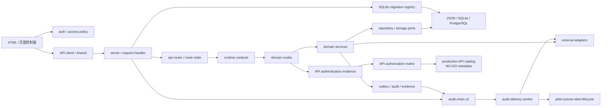

# DEPENDENCY MAP — 主线依赖地图

> 实施分支 AS-IS 快照：基于 `main@a15d10d`。依赖包括代码、数据、外部系统、后台任务、构建和部署关系。

## 1. 代码依赖方向



期望方向大体存在，但组合根仍把大量底层函数直接注入路由上下文；新模块不得回读组合根。
ARC-002 已把已确认的 alert runtime 反向依赖移到 worker 组合边界，并通过 PR #132 合入主线。

## 2. 静态依赖指标

- 非测试 CommonJS 文件：527。
- 本地 `require` 边：862。
- 显式循环：当前主线为 0 条（ARC-002 实施前基线为 1 条）。
- 最高入度模块：`runtime-source` 62、`technical-evidence` 22、`region-manifest` 18。
- 最宽上下文：public-health 160 个依赖、care 102、clinical 76。

### 已移除循环（主线）

```text
旧：server.js → pilot-cutover-alert-runtime.js → server.js

现：platform-cutover-alert-worker.js
      ├─→ pilot-cutover-alert-runtime.js
      └─→ server.js → pilot-cutover-alert-runtime.js
```

`pilot-cutover-alert-runtime.js` 只接受显式 `controlProvider`，不再静态或动态导入
`server.js`。worker 默认 provider 在真正执行 `run-once` 时才读取组合根，`status` 与组合
对象创建均不加载 server。由此形成单向 DAG；缺失、无效和异常 provider 都保持脱敏
`NO-GO`。该实现已通过 PR #132、required checks、合并后 main CI 与 Pages，ARC-002 已从
P1 台账关闭。

## 3. Node 与第三方包

| 类别 | 依赖 | 现状 |
|---|---|---|
| Runtime | Node `>=22.5` | CI 使用 Node 24；依赖 `node:sqlite` |
| 生产 npm | `pg ^8.22.0` | PostgreSQL 适配器；官方 npm audit 为 0 |
| 测试 | `@playwright/test ^1.61.0` | 浏览器 E2E |
| 覆盖率 | `c8 ^11.0.0` | 原 `server.js` 门禁保持 85/85/55；另以 10 个独立组锁定 identity、audit、object storage、API governance、worker、三个高风险命令边界及两个浏览器安全端口的真实基线 |
| 静态质量（开发） | `eslint 9.39.5`、`typescript 7.0.2`、`@types/node 22.20.1` | 精确版本；Node `>=22.5` 兼容；不进入生产依赖 |
| 平台内置 | http/fs/path/crypto/https | 无 Web 框架，路由和静态服务自行实现 |

标准 build 继续使用 Node 内置模块和既有静态发布代码，没有引入 bundler。ESLint、
TypeScript 与 Node 类型仅用于开发门禁；lockfile audit 已修复 c8 传递链中的
`brace-expansion` 漏洞，当前完整依赖树与生产依赖树均为 0 vulnerabilities。

## 4. 浏览器依赖

- 44 个 HTML 页面和根目录脚本通过全局加载顺序共享状态。
- `auth.js`、`shared.js`、`platform-api-client.js`、`platform-shell.js` 是主要共享边界。
- 动态浏览器凭据方向为 `HttpOnly Cookie → /api/auth/context → 脱敏身份投影`；`auth.js` 在
  任何普通 API 调用前清除旧 localStorage token，Cookie 与 Authorization 并存时服务端也选择
  Cookie。bearer-only 兼容 token 仅存在页面内存，不跨重载恢复。
- Inventory v2 在显式发布图精确锁定 820 处 `innerHTML=` 与 4 处 `insertAdjacentHTML`（合计 824，
  覆盖 33 个资产）；血液主工作台 25 处、急救生命链和医生工作台 controller 各 6 处、血液上线看板 8 处、陪诊工作台 7 处 `innerHTML` 加 1 处 `insertAdjacentHTML`、产品运行驾驶舱、产品区域运行驾驶舱与质量安全工作台各 1 处、区域切换工作台及血液召回面板各 2 处、血液创新指挥中心 10 处以及体检风险卡 2 处 `innerHTML` 已迁到 DOM/text 节点；体检页面仍保留 25 处失败关闭，最高仍为 citizen 94、
  app 90、public-health 78、platform 72。
- 同一清单现锁定 6 个动态 URL sink（公共 Safe URL port 内 2 个 DOM URL attribute 和 2 个导航调用、
  2 个 OHIF 导航）以及 45 个动态样式 sink（30 个模板 style 属性、
  12 个 CSSOM 属性、2 个 `setProperty`、1 个 runtime style element）。浏览器 URL 依赖方向为
  `页面 action → 无 URL 模板/固定 DOM anchor → browser-safe-url-policy.v1 → capability/protocol/userinfo/exact-Origin decision → DOM/navigation`；
  28 个真实模板 URL 已迁移，1 个普通属性赋值误报已校正；
  居民短时凭据复用同一端口，服务端对象存储信任合同保持不变。仅 2 个 OHIF 导航仍因真实 exact-Origin 未证明而需复核，
  这些词法事实和端口测试都不是 taint 分析、外部 Origin 或生产放行证据。
- 37 个页面内联守卫/脚本已汇入 `page-auth-bootstrap.js`、`mobile-preview.js` 等外部依赖；8 个样式块和
  13 个静态样式属性已汇入外部 CSS/class，显式发布图的 inline/eval 风险现为 0；CI/构建同时对
  Inventory v2 的资产/类型 occurrence 与聚合指纹失败关闭。
- 集中响应头端口暂保留兼容 CSP 的 `script/style 'unsafe-inline'`，并下发不含 `unsafe-inline`/`unsafe-eval`
  的严格 Report-Only 目标；动态 CSSOM、全角色浏览器回归和真实托管验证完成前不得描述为 CSP 已关闭。
- Service Worker v61 缓存应用壳以及生成的 `data/public-demo.json`；激活时删除 v60 及其他旧缓存，只缓存同源成功响应，API、跨 Origin 与 404 拒绝响应不进入 Cache Storage。
- E2E 依赖方向为 `npm test:e2e → root runner(39) / resident owned runner(13) / PWA runner(3) → 动态回环端口 + 独立临时
  DATA_DIR → Playwright Chromium`。两套配置共用 `playwright-browser-policy.v1` 并设置
  `serviceWorkers=block`；系统 Chrome、固定 5210 端口和跨套件服务复用不再是标准测试依赖。

## 5. 数据依赖

```text
data/db.json
  ├─ SQLite 首次种子
  ├─ readiness/report 脚本
  └─ public-demo-snapshot 纯函数
       ├─ Node /data/public-demo.json
       ├─ Pages 临时构建制品
       └─ Service Worker v61 同源成功响应缓存

SQLite commit
  → transactional outbox
  → PostgreSQL shadow relay
  → reconciliation/checkpoint
  → 证据门禁
  →（仅获批后）primary read/write
```

SQLite schema 依赖现为 `server.js → sqlite-migrations → node:sqlite/session schema helper`。部署检查、生产数据库 readiness 和发布报告也只读消费注册表 head/校验器，不再各自硬编码 v11。注册表不得反向依赖组合根或领域路由，因此本切片没有新增循环依赖。

JSON 源快照仍是高扇出依赖，但浏览器和 Pages 只依赖经统一纯函数转换后的公开演示契约；任何结构变化仍需验证脱敏、页面兼容、报告和初始化路径。

集合治理依赖方向为 `data/db.json 顶层名称 + Git 跟踪运行时源码 + process ownership +
CORE_DATA_DEFINITIONS → collection-governance → CI/release 治理投影`。数据 owner 只从
`domain-data-ownership` 和既有系统合同读取；源码引用的 T00–T09 process owner 只作为 review
证据，固定 `ownerInferenceAllowed=false`。治理模块不反向依赖 `server.js`，只把它作为被扫描文本，
也不写 JSON/SQLite/PostgreSQL。

身份安全状态依赖方向为 `identity route → auth-security-state-store → SQLite state_collections / PostgreSQL auth_security_state`。组合根为会话与认证状态注入同一长期 PostgreSQL pool，仓储只借用连接且不关闭调用方拥有的 pool；发送验证码固定为限流、原子签发、供应商发送，失败时只撤销本次 OTP。

生产会话 transport 的依赖方向为 `环境配置 → runtime-identity-policy → Cookie/Bearer 解析`。
`AUTH_SESSION_TRANSPORT=bearer|hybrid` 不能单独启用生产 Bearer，必须同时显式设置
`AUTH_BEARER_COMPATIBILITY=enabled`；即使显式启用，readiness 仍返回 NO-GO blocker。

## 6. 外部系统

| 外部依赖 | 主要模块 | 失败边界 |
|---|---|---|
| PostgreSQL | platform storage、session、领域 repository | TLS、schema、CAS、outbox、核对、容量与故障切换元数据门禁 |
| HIS/EMR/LIS/PACS | T08、care、clinical | 现场地址、凭据、证书、字段与回执 |
| OIDC/SMS | T01 identity-security | provider 可用性、绑定、重放、回调验签及共享 OTP/限流/锁定状态 |
| HAPI FHIR/Orthanc/OHIF | Solution A、clinical | 容器版本、认证、DICOM/FHIR 兼容 |
| 对象存储 | `secure-object-storage.js`（T00 共享端口）→ T08 现有附件 caller → 厂商中立网关 | 生产缺 v1 合同、独立响应密钥、精确上传/下载 Origin、响应签名/时间窗/请求对象绑定或显式扫描/生命周期回执即失败关闭；附件元数据达到 500 条时也在网关调用前失败关闭并保留全部既有行；真实桶/KMS/WORM/扫描/备份/容量、无损分页和外部调用—本地写入对账仍阻断上线 |
| 连续审计 | `server.js` SQLite 事务 → `audit_delivery_source_events` → source repository/cursor → `audit-delivery-worker` → SIEM 或 filesystem rehearsal WORM | v15 append-only source、最小投影、批次 source binding 和 checkpoint v3 已显式；可信 SIEM receipt、外部单调锚与真实 WORM/KMS capability 仍阻断生产 |
| GitHub Actions/Pages | CI 与静态站 | 分支保护、制品、外部 5xx |

## 7. 后台任务

- 应用内：session cleanup `setInterval`。
- systemd：PostgreSQL sync/reconcile、platform shadow relay/reconcile、care outbox worker。
- 领域 worker：referral delivery、emergency signal、insurance payment、public health 等。
- 平台事件：通用 pending outbox publish runtime。
- 连续审计：独立 oneshot + timer 已进入部署合同；`append-only-audit-source-v2` 的仓库内 continuity 已实现，生产仍因可信 receipt、外部 anchor、真实 WORM 与现场证据拒绝解锁。
- 慢病随访：T04 当前仅有受权 HTTP dispatch；生产依赖 T04 自有签名 HTTPS publisher 和独立
  activation verifier，未在 T00 组合根注入 verifier 时默认失败关闭。机构范围 allowlist、
  前置授权审计门禁、publisher 私有 receipt capability 和结果审计均位于该调用链；非生产可用
  本地模拟。尚未建立
  worker、持久 lease/checkpoint、退避和死信，不得计作已上线的后台任务。
- 切换告警 worker：CLI 组合层懒注入中央控制面，库级告警运行时不反向依赖组合根。

没有单一队列产品；不同 worker 各自实现 lease、checkpoint、retry 或 receipt。优点是依赖少，风险是重试语义、观测和运维接口不一致。

## 8. CI 与部署依赖

- CI 分为区域矩阵、complete-unit-test、`governance-api`、`browser-e2e`、
  `release-readiness` 和聚合 `test`。
- `process/**` PR 的所有权门禁以 GitHub 提供的目标分支为比较基线；固定 `baselineTag` 只用于可复现工作树和发布证据。
- 区域矩阵保持 5 分钟、complete-unit-test 与 governance-api 为 10 分钟；
  browser-e2e 和 release-readiness 各为 15 分钟，聚合 test 为 5 分钟。
- Chromium 安装和 Playwright E2E 独占 browser-e2e runner；发布、数据库、安全、报告和
  部署证据在 release-readiness 并行执行，不再共享浏览器外部依赖的时间预算。
- browser-e2e 本地与 CI 均由标准 `test:e2e` 顺序执行在线根 39、居民 13、PWA 3 项；三阶段各自分配
  动态端口和临时数据。在线 context 阻止 Service Worker，PWA context 独立允许并逐项清理 registration/cache；
  Playwright 列表门禁拒绝遗漏、重复归属或浏览器/Service Worker 策略漂移。
- complete-unit-test 依次运行标准 unit/integration，governance-api 运行 lint/typecheck/smoke，
  release-readiness 和 Pages 运行标准 build；required check 名称和 fail-closed 聚合保持不变。
- TEST-006 保持上述 CI job 拓扑、预算和 required check 不变；标准 integration runner 依据同一
  suite 配置把 `test/api.test.js` 作为单文件热点批次，其余文件仍按既有 40 文件上限顺序分批。
  每个批次和整套测试向日志输出 `durationMs`，不设性能放行阈值，也不写仓库报告。
- 首个夹具切片的测试依赖方向为 `test/api.test.js -> test/helpers/api-regression-runtime.js -> server.js + 临时 JSON 副本`。
  helper 不被运行时代码或其他领域模块反向引用；server 仍只启动一次，43 个子测试仍在同一进程按原顺序共享状态，
  因此没有新增运行时依赖、静态环、并行写入或 CI 拓扑变化。
- 第二个夹具切片新增且仅新增测试依赖
  `test/api.test.js -> test/helpers/hospital-adapter-mock-runtime.js -> node:http`；helper 只管理一个子测试已有的
  HIS mock 生命周期，不依赖运行时代码、financial/alert/storage mock 或其他测试阶段，也不改变 server 共享状态、
  integration 成员、43 项顺序、CI 拓扑和预算。
- 第三个夹具切片新增且仅新增测试依赖
  `test/api.test.js -> test/helpers/alert-delivery-mock-runtime.js -> node:http`；helper 只管理一个子测试已有的
  SIEM mock 生命周期，不依赖运行时代码、financial/storage mock 或其他测试阶段。失败/恢复仍由所属子测试
  显式驱动，因此没有新增反向依赖、静态环、并行共享状态、integration 成员、CI 拓扑或预算变化。
- 第四个夹具切片新增且仅新增测试依赖
  `test/api.test.js -> test/helpers/financial-gateway-mock-runtime.js -> node:http`；helper 只管理一个子测试已有的
  financial mock 生命周期，不依赖运行时代码、storage mock 或其他测试阶段。签名/callback/reconciliation/retry
  仍由所属子测试执行，因此没有新增反向依赖、静态环、并行共享状态、integration 成员、CI 拓扑或预算变化。
- 第五个夹具切片新增且仅新增测试依赖
  `test/api.test.js -> test/helpers/object-storage-gateway-mock-runtime.js -> secure-object-storage sign port + node:http`；
  helper 只管理一个子测试已有的 storage mock 生命周期，复用原测试已调用的响应签名端口。四类响应、动态 URL
  和 `scanStatus` 仍封闭在该 helper，测试正文只通过最小 setter 保持原切换顺序，因此没有新增运行时依赖、
  反向环、并行共享状态、integration 成员、CI 拓扑或预算变化。
- 两个前端翻译 map 继续由原 `displayText` / `zh` / `zhText` / `statusLabel` 调用链消费；去重不引入
  共享运行时模块或新依赖。专项 Node 测试读取并隔离执行这些纯翻译边界，标准 unit 自动发现负责漂移门禁。
- care revalidation 的依赖方向为
  `HTTP route -> careServiceCreatePayload/careServiceTransitionInput -> careServicePlatformAdapter -> T05 owner service/domain -> repository + outbox`。
  挂号关联只通过组合根现有 `canAccessRegistrationOrder` 读取校验，不让 T05 写入 T07 挂号事实；独立测试
  通过同进程服务复用领域一次性派单证据 registry，避免跨进程伪造 capability，且没有新增反向依赖或静态环。
- 主分支必需检查名称仍为 `complete-unit-test` 与 `test`。聚合 test 使用 `always()`
  并要求三个风险域结果全部为 success，失败、取消和跳过均 fail-closed。
- governance-api 先校验 custom auth 控制流/负向测试证据，再校验声明级授权矩阵、显式幂等行为证据合同和派生生产 API 目录；依赖方向为 `routeSourceFiles + authentication/idempotency 小型 evidence registry → authorization matrix v3 → production catalog v3`。只有显式标记的 SMS 外部 principal 从幂等合同派生 custom auth，平台 session/RBAC 合同继续复用授权矩阵。T07 financial dispatch/formal grouping 依赖保持不变。T03 highlight signal 写入方向为 `session/RBAC → orgType/sourceOrgCode scope → strict body normalization → header/body/id/canonical key selection → actor organization namespace hash → per-key process tail → fresh snapshot → bounded publicHealthSignals + chained securityEvents → one state write/SQLite collection-version CAS`；读取方向为 `session/RBAC → orgType/orgCode fail-closed → readDatabase → build highlights → public signal projection → district organization/allowlist projection → projected-count audit → response`。POST、独立 GET 与 system 内嵌 highlights 复用同一纯投影；system 与 highlights 各自在读取前拒绝不支持的组织范围，system 的其余字段仍由原 builder 保持兼容。scope denial 单独走既有安全审计端口，精确重放锁内直接返回。没有增加集合、DDL、outbox、worker、PG adapter、跨域端口或外部依赖；200 条 ledger、单进程命令尾和 SQLite CAS 不等于分布式 exactly-once。`reviewedProofRequired` 为零，证据门禁仍不写数据库、报告或发布制品。
- governance-api 同时执行 `data:collection-governance:verify`；新集合、陈旧/重复状态、owner/reader
  边界、源码使用状态漂移或任何生产晋升标志都会失败，命令默认只输出摘要且不写 release。
- governance-api 随后运行 10 组内部边界覆盖门禁；脚本仅依赖现有 c8、既有直接行为测试和显式配置，报告写入临时目录并在结束时删除。源码文件不得跨组重复，负向证据测试必须实际由所属组执行。该门禁与原 `server.js` 85/85/55 覆盖门禁独立，不能相互替代。
- GitHub Actions 的 checkout、Node、Pages 和 artifact 引用均固定到经官方仓库
  `refs/tags/vN` 核验的完整 commit SHA，并保留 `# vN` 注释供升级评审；契约测试禁止
  `actions/*@vN` 标签引用回流。
- systemd 模板包含多项 Linux hardening。
- Solution A 的 HAPI FHIR、PostgreSQL、Orthanc、OHIF 默认镜像已固定为审核过的精确版本与 registry digest；Orthanc 认证默认启用，Web 与 DICOM 默认绑定回环。非回环 DICOM 仅接受显式私网接口配置，真实拉取/漏洞扫描、TLS、防火墙白名单、设备连通和现场网络验收仍是生产阻断项。
- Pages 先在 runner 临时目录构建显式资源集再上传；服务端和 Pages 共用同一发布清单。
- 静态制品同时携带 `browser-security-policy.json` 和构建 manifest 的 NO-GO 投影；它要求托管/CDN
  应用等价响应头，但仓库当前没有真实静态托管响应头抓取证据，不能由制品内容推定已生效。

## 9. 依赖治理结论

- ARC-002 已移除唯一已确认的静态环并通过 PR/main CI 与 Pages；架构回归继续禁止
  `pilot-cutover-alert-runtime` 重新导入组合根。
- `runtime-source`、`technical-evidence`、`data/db.json` 和宽运行时上下文仍是高耦合枢纽；静态消费者已从源快照扇出中隔离。
- 新模块必须依赖稳定端口，不得新增对 `server.js`、根目录全局状态或未注册 JSON 集合的反向依赖。
- SQLite DDL 必须追加到 T00 注册表；运行时、测试和发布门禁只能消费其公开 head/校验接口，禁止复制版本常量或迁移定义。

## 10. 临床子域依赖约束

五子域注册表禁止目标源码目录直接导入其他子域内部实现，也禁止 `src/clinical-specialties` 新增对 `server.js` 的反向依赖。现有 blood → emergency、blood → quality-safety 由 `BloodEventHub.dashboard` 兼容，已登记为待迁移的版本化查询契约；质量安全的目标是事件读模型，不允许跨子域写入。身份、MPI、机构目录、审计、集成网关、对象存储、outbox、区域上下文和观测继续由平台共享端口提供。

急救 dashboard 当前依赖方向为 `HTTP route → emergency-dashboard-query.v1 → 注入的急救查询端口 / blood-emergency-coordination.v1 兼容端口`。新用例不导入血液实现、不读取 `server.js`，但兼容端口仍由组合根中的 `BloodEventHub.dashboard` 提供，因此跨域契约状态仍为 partial。

血液 dashboard 当前依赖方向为 `HTTP route → blood-dashboard-query.v1 → 注入的 BloodService / BloodTransactionService 兼容端口`。目标模块不导入根目录服务或 `server.js`，但端口实现仍由统一组合根提供，且查询仍接收宽 JSON 快照，因此只完成用例边界，尚未完成仓储或运行时上下文隔离。

影像 dashboard 当前依赖方向为 `HTTP route → imaging-dashboard-query.v1 → 注入的 dashboard builder / 脱敏端口 → imaging/public-response`。share 写边界为 `imaging-cloud route → imaging-study-share-command.v1 → appendDataAccessLog / randomUUID ports`；QC 写边界为 `imaging-cloud route → imaging-study-quality-control-command.v1 → publishDiagnosticReportToFhir / randomUUID ports`。HTTP 层继续拥有鉴权、查找/404、body、FHIR 错误审计、单次持久化和响应投影。`publishDiagnosticReportToFhir` 从 `clinical-blood` 子上下文转移到 `imaging-cloud`，两者依赖数分别变为 30 和 12，全域 76 项依赖集合不变；`clinical-blood` 因其余遗留影像用例仍需其他端口而暂不能完成收窄。QC 仍是请求路径外调后本地写入，未增加 outbox 或反向依赖。

体检 dashboard 当前依赖方向为 `HTTP route → physical-examination-dashboard-query.v1 → 注入的 Overview / readiness 端口`。专项分流写边界为 `blood-innovation HTTP adapter → physical-examination-specialized-intake-action-command.v1 → 注入的既有业务动作 / 审计 / 时钟 / 规范化 / 持久化端口`；适配器继续拥有鉴权、body、读取/定位、居民范围、错误映射与响应。两个体检端口均不导入根目录体检服务或 `server.js`，但仍接收宽 JSON 快照；混合路由和共享存储耦合尚未消除。

医院运行依赖方向现为 `platform-governance/operations-dashboard|operations-command HTTP route → 注入的既有 operations builders / 数据与审计端口`。dashboard 保留 8 项只读依赖，command 的 20 项依赖完整迁入 T02 runtime context；T06 已删除两个 operations 子上下文及其独占依赖。builder、组合根、数据、响应和写入顺序均未移动，原两个全局路由插槽保持不变；本切片只关闭错误领域归属，不把宽 handler 误述为已完成用例拆分。

TEST-007 的验证依赖方向为 `32 路径闭集 → 既有 operations-command createRuntime harness → 真实
route segment`。它用注入 spy 验证授权、读取、构建、审计、持久化和响应的顺序，不引入运行时依赖或
平行 router；`operations-command:behavior-test` 由 governance-api 和标准 unit 补集执行。

## 11. 区域共享调阅依赖方向

当前方向为 `shared-05 兼容 HTTP 适配器 → regional-sharing-access-command.v1（目标 T02） → resident-authorization-decision.v1 anti-corruption adapter → T04 授权状态/lifecycle`，居民范围、审计和持久化继续作为注入端口。T00 integration 拥有本次跨 owner 接线；命令不直接读取 `personalRecords.meta`、不导入 `server.js`，旧 `createRegionalSharingAccessReview` 已从组合根和 shared runtime context 删除。

只读方向现为 `shared-05 → shared runtime regionalSharingReadModel capability → regional-sharing-read-model.v1
→ 注入的 legacy normalize/seed/scope/handoff evidence/UUID/clock ports`。read model 不导入组合根、HTTP route、
存储实现或写命令；shared context 的两个散 builder 依赖已收敛为一个冻结 capability。`readDatabase`、
review allowlist、角色脱敏和 handoff 安全审计仍位于兼容 HTTP 边界，避免读模型取得身份或持久化职责。

数据依赖为 `T02 regionalSharingPackages/accessReviews → resident-authorization-decision.v1 → T04 personalRecords`。反向只允许 T04/identity-security 消费 `regional-sharing-access-receipt.v1`，不得由 T02 写授权事实。单进程 package queue 只保护当前兼容适配器，生产仍因 `productionCutoverAuthorized=false`、非 PostgreSQL 或 atomic repository 缺失而失败关闭；regional site evidence lifecycle 不进入授权决策。

遗留状态写方向被限制为 `commission PUT /api/state → state-data guard → 非区域集合`：四个区域 owner 集合只能省略或深相等，不能流入 `normalizeState/writeDatabase`；`/api/state-collections/:collection` 同样拒绝它们。`POST /api/reset` 只在非生产到达 seed/write，production 在边界失败关闭。
## 12. T05 转诊命令依赖约束

转诊写依赖方向为 `shared.js / citizen.js → 三条兼容 HTTP 路径 → referral-command-service → DomainRepository → referrals + command inbox + outbox`。领域服务只依赖平台 contract、repository 和 event runtime，不导入 `server.js` 或其他子域内部；HTTP 层注入居民授权和 JSON 存储端口。兼容路由不得绕过 owner command，居民任务消息和安全审计在命令成功后由 HTTP 层保留。

## 13. 健康驾驶舱指标合同依赖

依赖方向为 `health-dashboard-summary → health-dashboard-indicator-contract.v1 →
technical-evidence.sha256`。合同模块不依赖 `server.js`、HTTP 路由、JSON 文件或数据库实现；
调用方显式传入人口服务聚合、来源元数据、服务端 scope 与计算时间。T03 继续拥有日报/月报来源，
T02 只拥有聚合合同和测量投影。当前 runtime 路由仍归 T01，本切片没有移动路由或改变组合顺序。

## 慢病随访投递依赖方向

`T04 followup PATCH → T00 SQLite state transaction → v16 followup dispatch outbox → 独立 worker →
T04 signed publisher → 外部系统`。反向写回请求路由已移除；worker 网络调用不持有 SQLite 事务。
worker 依赖 repository 端口和 publisher 端口，repository 不依赖 HTTP。部署/preflight 只读取合同与配置状态，
不能生成 activation 或可信回执。worker 复用 canonical `DATA_DIR/health-city.sqlite`，显式路径漂移启动失败；
activation provider 只验证仓库外 registry 的逐事件 Ed25519 签名决定，不持有审批私钥。跨 T04/T00 的改动由
T00 集成分支承载。

## 对象存储 ADR 前置治理依赖方向

当前运行依赖保持 `T08 integration HTTP caller → T00 secure-object-storage v1 gateway port → 外部网关`，
本切片没有增加数据库或 worker 边。新增治理依赖是
`Proposed ADR + machine decision/action register + domain owner manifest(read-only) + SQLite schema head(read-only)
→ object-storage architecture verifier → architecture:test/governance-api`；验证器不依赖 `server.js`、不写
数据库、不生成报告。

若决策 Accepted，建议目标依赖为 `T08 data-owner command/API → T00 v17 repository + transactional command
enqueue → T00 fenced worker → gateway`，另由 lossless keyset scan 驱动 reconcile/readiness。该目标不是
AS-IS。T08 route owner 不能反向推断 data owner，T00 技术端口不能取得业务事实所有权；在 owner 与兼容
策略批准前，所有 v17/runtime/API/promotion 依赖均保持 blocked。

## Production evidence trust 依赖方向

依赖方向为 `production-preflight CLI → production-evidence-trust-provider → technical-evidence + node:crypto/fs`。
部署方只注入外部 anchor/envelope 绝对路径和 anchor bundle digest；provider 不依赖 `server.js`、HTTP、
数据库或外部网络。production 专用适配复用通用 `verifySignedEnvelope`，把 manifest、registry 与 evidence
records 转为稳定摘要绑定，再投影到既有 externalTrustVerifier 两个布尔输出。缺 provider 或任一验证失败
不回退到结构 evidence validator。deployment package 与 release-readiness CI 显式包含并测试该闭包，
`productionReady=false` 继续由完整 preflight 决定。

## 生产切换行动证据依赖方向

依赖方向为 `committed definitions → external signed envelope → production-evidence-trust-provider 通用端口 →
v2 evaluator → strict preflight → protected manual workflow → digest-only receipt`。definitions 与 evaluator
不依赖组合根或业务存储；provider 私钥、真实信任锚和现场证据始终在仓库外。评估失败只输出稳定 code
与摘要，不反向写回定义文件；workflow 不反向取得现场审批或部署权威。

## 生产 Go/No-Go 受信 receipt 依赖方向

当前依赖固定为 `server composition → production-go-no-go domain → production-preflight-decision-receipt trust port
→ explicitly injected external verifier`。domain 只接受由 trust port 在当前进程创建的验证投影；trust port
不依赖 `server.js`、数据库、release 文件或环境布尔，避免本地事实反向成为授权权威。默认组合没有
external verifier，所以依赖缺失时稳定失败关闭。未来外部 CAB/provider、信任根和耐久 anti-replay store
只能从 composition 边界注入，不得让领域模型依赖具体供应方 SDK；该依赖仍待 Accepted ADR。

## Worker 共同观测依赖方向

依赖方向为 `既有 worker/CLI → worker-observability-contract → versioned inventory → node:crypto`。
共同层不依赖 `server.js`、HTTP、数据库、provider 或领域实现，也不被 repository 反向调用。12 个 profile
保持不同 state/retry/lease/checkpoint/receipt 语义，只投影为共同 outcome/count/error-code/digest；因此
不存在新的跨域写边或第二套任务协议。部署包显式携带模块和清单，CI 从 systemd `ExecStart` 发现 9 个
入口并拒绝未登记或未接入适配器的 worker。对象存储 v2 的 Proposed worker 继续 blocked。

## 仓库文档与 PDF 治理依赖方向

依赖方向为 `git ls-files + config/repository-governance.json + ADR status + process manifests + tracked PDF
bytes/source paths → scripts/repository-governance.js → governance-api + architecture:test`。验证器只读文件和 Git
索引，不依赖 `server.js`、HTTP、数据库、外部服务或 PDF 工具链，也不生成制品。当前流程依赖
`origin/main`，固定 baseline tag 只被证据链消费；日期化 snapshot 和 superseded ADR 不得成为开发基线。

## 金融回调证据依赖方向

依赖方向为 `provider HMAC payload → verifyFinancialCallback → process-local target-event attestation → callback route write intent → server append-only/global uniqueness guard → integrationGatewayEvents`。attestation 不进入反向读取、数据库或 API。finalize 另经过 `provider receipt/failure evidence shape → server transition guard`，防止业务路由自报无证据终态。

## PostgreSQL 受控切换评估依赖方向

依赖方向为 `仓库外 metadata-only JSON + 调用方 SHA-256 + 环境变量布尔/引用 → postgres-primary-transition-readiness →
buildPostgresPrimaryStorageConfig + buildTransitionAssessment → 脱敏七门投影`。部署依赖方向为
`migration/read/adapter/storage-admin + sync/reconcile templates → production-deployment-package → verifier/deploy-check`。
CLI 不依赖 `server.js`、HTTP、数据库 client、strict preflight、对象存储或连续审计；`DATABASE_URL` 仅从
secret provider 注入实际命令，不进入 process contract 或评估输出。

## 预生产现场控制依赖方向

依赖方向为 `受控绝对路径 → descriptor 有界读取 → 既有 environment/joint-test/monitoring/rehearsal
evaluators → 部署 anchor 漂移校验 → Ed25519 报告信封验证 → 受信宿主绑定门禁 → candidate review → 脱敏只读结果`。joint-test 的 campaign、trust registry、evidence 三个输入先
经过同一 JSON 读取边界，再由既有 Ed25519/96 场景合同验证；alert journal 单独按 JSONL 链合同验证。
CLI 不依赖 `server.js`、HTTP、数据库 client、worker runtime、rollback executor 或外部网络。deployment package
只登记源码闭包、既有生产 trust-anchor 变量名称，不携带文件值、凭据或现场证据。

## 9+5 开发组织依赖方向

治理依赖固定为 `process-workstreams + clinical-subdomains + service-extraction-scorecard → development-organization-governance → architecture/governance CI`。组合合同不被运行时、路由或 repository 反向依赖，不读取业务数据库，也不改变 T01–T09 或 T06 子域的实现依赖。开发协作方向为 `领域工作树 → main/T00 集成 → 共享门禁 → 模块化单体部署`。
