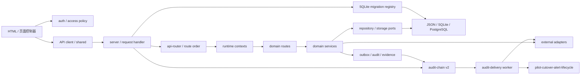

# DEPENDENCY MAP — 主线依赖地图

> 实施分支 AS-IS 快照：基于 `main@a15d10d`。依赖包括代码、数据、外部系统、后台任务、构建和部署关系。

## 1. 代码依赖方向



期望方向大体存在，但组合根仍把大量底层函数直接注入路由上下文；新模块不得回读组合根。
ARC-002 已把已确认的 alert runtime 反向依赖移到 worker 组合边界，并通过 PR #132 合入主线。

## 2. 静态依赖指标

- 非测试 CommonJS 文件：526。
- 本地 `require` 边：861。
- 显式循环：当前主线为 0 条（ARC-002 实施前基线为 1 条）。
- 最高入度模块：`runtime-source` 62、`technical-evidence` 22、`region-manifest` 18。
- 最宽上下文：public-health 160 个依赖、care 102、clinical 76。

### 已移除循环（主线）

```text
旧：server.js → pilot-cutover-alert-runtime.js → server.js

现：platform-cutover-alert-worker.js
      ├─→ pilot-cutover-alert-runtime.js
      └─→ server.js → pilot-cutover-alert-runtime.js
```

`pilot-cutover-alert-runtime.js` 只接受显式 `controlProvider`，不再静态或动态导入
`server.js`。worker 默认 provider 在真正执行 `run-once` 时才读取组合根，`status` 与组合
对象创建均不加载 server。由此形成单向 DAG；缺失、无效和异常 provider 都保持脱敏
`NO-GO`。该实现已通过 PR #132、required checks、合并后 main CI 与 Pages，ARC-002 已从
P1 台账关闭。

## 3. Node 与第三方包

| 类别 | 依赖 | 现状 |
|---|---|---|
| Runtime | Node `>=22.5` | CI 使用 Node 24；依赖 `node:sqlite` |
| 生产 npm | `pg ^8.22.0` | PostgreSQL 适配器；官方 npm audit 为 0 |
| 测试 | `@playwright/test ^1.61.0` | 浏览器 E2E |
| 覆盖率 | `c8 ^11.0.0` | 只 include `server.js` |
| 静态质量（开发） | `eslint 9.39.5`、`typescript 7.0.2`、`@types/node 22.20.1` | 精确版本；Node `>=22.5` 兼容；不进入生产依赖 |
| 平台内置 | http/fs/path/crypto/https | 无 Web 框架，路由和静态服务自行实现 |

标准 build 继续使用 Node 内置模块和既有静态发布代码，没有引入 bundler。ESLint、
TypeScript 与 Node 类型仅用于开发门禁；lockfile audit 已修复 c8 传递链中的
`brace-expansion` 漏洞，当前完整依赖树与生产依赖树均为 0 vulnerabilities。

## 4. 浏览器依赖

- 44 个 HTML 页面和根目录脚本通过全局加载顺序共享状态。
- `auth.js`、`shared.js`、`platform-api-client.js`、`platform-shell.js` 是主要共享边界。
- 发现 871 处 `innerHTML=` / `insertAdjacentHTML` 类写入；最高为 citizen 94、app 90、public-health 78、platform 72。
- CSP 允许 `script-src 'unsafe-inline'` 和 `style-src 'unsafe-inline'`。
- Service Worker 缓存应用壳以及生成的 `data/public-demo.json`，缓存版本已从 v59 提升到 v60 以撤销旧快照缓存。

## 5. 数据依赖

```text
data/db.json
  ├─ SQLite 首次种子
  ├─ readiness/report 脚本
  └─ public-demo-snapshot 纯函数
       ├─ Node /data/public-demo.json
       ├─ Pages 临时构建制品
       └─ Service Worker v60 缓存

SQLite commit
  → transactional outbox
  → PostgreSQL shadow relay
  → reconciliation/checkpoint
  → 证据门禁
  →（仅获批后）primary read/write
```

SQLite schema 依赖现为 `server.js → sqlite-migrations → node:sqlite/session schema helper`。部署检查、生产数据库 readiness 和发布报告也只读消费注册表 head/校验器，不再各自硬编码 v11。注册表不得反向依赖组合根或领域路由，因此本切片没有新增循环依赖。

JSON 源快照仍是高扇出依赖，但浏览器和 Pages 只依赖经统一纯函数转换后的公开演示契约；任何结构变化仍需验证脱敏、页面兼容、报告和初始化路径。

身份安全状态依赖方向为 `identity route → auth-security-state-store → SQLite state_collections / PostgreSQL auth_security_state`。组合根为会话与认证状态注入同一长期 PostgreSQL pool，仓储只借用连接且不关闭调用方拥有的 pool；发送验证码固定为限流、原子签发、供应商发送，失败时只撤销本次 OTP。

## 6. 外部系统

| 外部依赖 | 主要模块 | 失败边界 |
|---|---|---|
| PostgreSQL | platform storage、session、领域 repository | TLS、schema、CAS、outbox、核对 |
| HIS/EMR/LIS/PACS | T08、care、clinical | 现场地址、凭据、证书、字段与回执 |
| OIDC/SMS | T01 identity-security | provider 可用性、绑定、重放、回调验签及共享 OTP/限流/锁定状态 |
| HAPI FHIR/Orthanc/OHIF | Solution A、clinical | 容器版本、认证、DICOM/FHIR 兼容 |
| 对象存储 | secure object storage | 引用、摘要、签名 URL、保留期 |
| GitHub Actions/Pages | CI 与静态站 | 分支保护、制品、外部 5xx |

## 7. 后台任务

- 应用内：session cleanup `setInterval`。
- systemd：PostgreSQL sync/reconcile、platform shadow relay/reconcile、care outbox worker。
- 领域 worker：referral delivery、emergency signal、insurance payment、public health 等。
- 平台事件：通用 pending outbox publish runtime。
- 切换告警 worker：CLI 组合层懒注入中央控制面，库级告警运行时不反向依赖组合根。

没有单一队列产品；不同 worker 各自实现 lease、checkpoint、retry 或 receipt。优点是依赖少，风险是重试语义、观测和运维接口不一致。

## 8. CI 与部署依赖

- CI 分为区域矩阵、complete-unit-test、`governance-api`、`browser-e2e`、
  `release-readiness` 和聚合 `test`。
- `process/**` PR 的所有权门禁以 GitHub 提供的目标分支为比较基线；固定 `baselineTag` 只用于可复现工作树和发布证据。
- 区域矩阵保持 5 分钟、complete-unit-test 与 governance-api 为 10 分钟；
  browser-e2e 和 release-readiness 各为 15 分钟，聚合 test 为 5 分钟。
- Chromium 安装和 Playwright E2E 独占 browser-e2e runner；发布、数据库、安全、报告和
  部署证据在 release-readiness 并行执行，不再共享浏览器外部依赖的时间预算。
- complete-unit-test 依次运行标准 unit/integration，governance-api 运行 lint/typecheck/smoke，
  release-readiness 和 Pages 运行标准 build；required check 名称和 fail-closed 聚合保持不变。
- 主分支必需检查名称仍为 `complete-unit-test` 与 `test`。聚合 test 使用 `always()`
  并要求三个风险域结果全部为 success，失败、取消和跳过均 fail-closed。
- GitHub Actions 使用 `@vN` 标签而非 commit SHA。
- systemd 模板包含多项 Linux hardening。
- Solution A 默认 HAPI 镜像为 `latest`；Orthanc DICOM 端口对宿主开放，必须在生产前加固。
- Pages 先在 runner 临时目录构建显式资源集再上传；服务端和 Pages 共用同一发布清单。

## 9. 依赖治理结论

- ARC-002 已移除唯一已确认的静态环并通过 PR/main CI 与 Pages；架构回归继续禁止
  `pilot-cutover-alert-runtime` 重新导入组合根。
- `runtime-source`、`technical-evidence`、`data/db.json` 和宽运行时上下文仍是高耦合枢纽；静态消费者已从源快照扇出中隔离。
- 新模块必须依赖稳定端口，不得新增对 `server.js`、根目录全局状态或未注册 JSON 集合的反向依赖。
- SQLite DDL 必须追加到 T00 注册表；运行时、测试和发布门禁只能消费其公开 head/校验接口，禁止复制版本常量或迁移定义。

## 10. 临床子域依赖约束

五子域注册表禁止目标源码目录直接导入其他子域内部实现，也禁止 `src/clinical-specialties` 新增对 `server.js` 的反向依赖。现有 blood → emergency、blood → quality-safety 由 `BloodEventHub.dashboard` 兼容，已登记为待迁移的版本化查询契约；质量安全的目标是事件读模型，不允许跨子域写入。身份、MPI、机构目录、审计、集成网关、对象存储、outbox、区域上下文和观测继续由平台共享端口提供。

急救 dashboard 当前依赖方向为 `HTTP route → emergency-dashboard-query.v1 → 注入的急救查询端口 / blood-emergency-coordination.v1 兼容端口`。新用例不导入血液实现、不读取 `server.js`，但兼容端口仍由组合根中的 `BloodEventHub.dashboard` 提供，因此跨域契约状态仍为 partial。

血液 dashboard 当前依赖方向为 `HTTP route → blood-dashboard-query.v1 → 注入的 BloodService / BloodTransactionService 兼容端口`。目标模块不导入根目录服务或 `server.js`，但端口实现仍由统一组合根提供，且查询仍接收宽 JSON 快照，因此只完成用例边界，尚未完成仓储或运行时上下文隔离。

影像 dashboard 当前依赖方向为 `HTTP route → imaging-dashboard-query.v1 → 注入的 dashboard builder / 脱敏端口 → imaging/public-response`。生产控制路由也直接复用影像公开投影，不再通过 `clinical-blood` 路由模块获取实现；为兼容现有导入，混合路由仍转导出这些函数。查询依然接收宽 JSON 快照，审计端口仍留在 HTTP 层。

体检 dashboard 当前依赖方向为 `HTTP route → physical-examination-dashboard-query.v1 → 注入的 Overview / readiness 端口`。查询端口不导入根目录体检服务或 `server.js`；实现仍由组合根注入，且继续接收宽 JSON 快照。居民授权集合、生产运行标志、审计持久化和脱敏仍是 HTTP/平台端口，避免领域查询拥有身份或存储实现。

医院运行 dashboard 的依赖方向现为 `platform-governance/operations-dashboard HTTP route → 注入的既有 operations builders / BloodEventHub 只读投影`。T06 已删除该子上下文以及仅由它使用的 observability、production operations 和 runtime metrics 依赖；builder、组合根、数据和响应未移动。`operations-command` 及其写依赖继续留在 T06 兼容边界，后续必须单独移交。

## 11. T05 转诊命令依赖约束

转诊写依赖方向为 `shared.js / citizen.js → 三条兼容 HTTP 路径 → referral-command-service → DomainRepository → referrals + command inbox + outbox`。领域服务只依赖平台 contract、repository 和 event runtime，不导入 `server.js` 或其他子域内部；HTTP 层注入居民授权和 JSON 存储端口。兼容路由不得绕过 owner command，居民任务消息和安全审计在命令成功后由 HTTP 层保留。

## 12. 健康驾驶舱指标合同依赖

依赖方向为 `health-dashboard-summary → health-dashboard-indicator-contract.v1 →
technical-evidence.sha256`。合同模块不依赖 `server.js`、HTTP 路由、JSON 文件或数据库实现；
调用方显式传入人口服务聚合、来源元数据、服务端 scope 与计算时间。T03 继续拥有日报/月报来源，
T02 只拥有聚合合同和测量投影。当前 runtime 路由仍归 T01，本切片没有移动路由或改变组合顺序。
