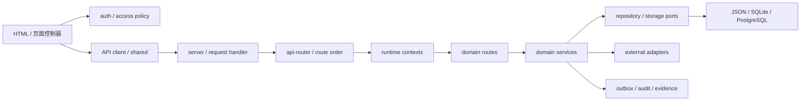

# DEPENDENCY MAP — 主线依赖地图

> 快照：`main@b1e4898`。依赖包括代码、数据、外部系统、后台任务、构建和部署关系。

## 1. 代码依赖方向



期望方向大体存在，但组合根仍把大量底层函数直接注入路由上下文，领域模块也可能回读根模块。

## 2. 静态依赖指标

- 非测试 CommonJS 文件：526。
- 本地 `require` 边：861。
- 显式循环：1 条。
- 最高入度模块：`runtime-source` 62、`technical-evidence` 22、`region-manifest` 18。
- 最宽上下文：public-health 160 个依赖、care 102、clinical 76。

### 已确认循环

```text
server.js
  → pilot-cutover-alert-runtime.js
  → server.js.pilotCutoverControlPlaneReadiness
```

这是组合根被领域/平台模块反向依赖的实例，导致初始化顺序和测试替身更脆弱。

## 3. Node 与第三方包

| 类别 | 依赖 | 现状 |
|---|---|---|
| Runtime | Node `>=22.5` | CI 使用 Node 24；依赖 `node:sqlite` |
| 生产 npm | `pg ^8.22.0` | PostgreSQL 适配器；官方 npm audit 为 0 |
| 测试 | `@playwright/test ^1.61.0` | 浏览器 E2E |
| 覆盖率 | `c8 ^11.0.0` | 只 include `server.js` |
| 平台内置 | http/fs/path/crypto/https | 无 Web 框架，路由和静态服务自行实现 |

主线没有 ESLint、TypeScript 或独立 build 工具依赖，也没有相应标准脚本。增加依赖前必须先证明现有能力不足。

## 4. 浏览器依赖

- 44 个 HTML 页面和根目录脚本通过全局加载顺序共享状态。
- `auth.js`、`shared.js`、`platform-api-client.js`、`platform-shell.js` 是主要共享边界。
- 发现 871 处 `innerHTML=` / `insertAdjacentHTML` 类写入；最高为 citizen 94、app 90、public-health 78、platform 72。
- CSP 允许 `script-src 'unsafe-inline'` 和 `style-src 'unsafe-inline'`。
- Service Worker 缓存应用壳以及 `data/db.json`。

## 5. 数据依赖

```text
data/db.json
  ├─ 静态页面 fetch
  ├─ SQLite 首次种子
  ├─ readiness/report 脚本
  ├─ Pages 静态发布
  └─ Service Worker 缓存

SQLite commit
  → transactional outbox
  → PostgreSQL shadow relay
  → reconciliation/checkpoint
  → 证据门禁
  →（仅获批后）primary read/write
```

JSON 快照是高扇出依赖；任何结构变化会同时影响浏览器、服务、测试、报告和部署。

## 6. 外部系统

| 外部依赖 | 主要模块 | 失败边界 |
|---|---|---|
| PostgreSQL | platform storage、session、领域 repository | TLS、schema、CAS、outbox、核对 |
| HIS/EMR/LIS/PACS | T08、care、clinical | 现场地址、凭据、证书、字段与回执 |
| OIDC/SMS | T01 identity-security | provider 可用性、绑定、重放、回调验签 |
| HAPI FHIR/Orthanc/OHIF | Solution A、clinical | 容器版本、认证、DICOM/FHIR 兼容 |
| 对象存储 | secure object storage | 引用、摘要、签名 URL、保留期 |
| GitHub Actions/Pages | CI 与静态站 | 分支保护、制品、外部 5xx |

## 7. 后台任务

- 应用内：session cleanup `setInterval`。
- systemd：PostgreSQL sync/reconcile、platform shadow relay/reconcile、care outbox worker。
- 领域 worker：referral delivery、emergency signal、insurance payment、public health 等。
- 平台事件：通用 pending outbox publish runtime。

没有单一队列产品；不同 worker 各自实现 lease、checkpoint、retry 或 receipt。优点是依赖少，风险是重试语义、观测和运维接口不一致。

## 8. CI 与部署依赖

- CI 三类 job：区域矩阵、complete-unit-test、综合 `test`。
- 综合 job 串接大量 readiness/report/deployment 命令，定位和执行时间风险较高。
- GitHub Actions 使用 `@vN` 标签而非 commit SHA。
- systemd 模板包含多项 Linux hardening。
- Solution A 默认 HAPI 镜像为 `latest`；Orthanc DICOM 端口对宿主开放，必须在生产前加固。
- Pages 直接发布根目录静态内容，与静态发布 allowlist 风险相连。

## 9. 依赖治理结论

- 不存在广泛静态环，但唯一已确认环位于关键组合根，应列 P1。
- `runtime-source`、`technical-evidence`、`data/db.json` 和宽运行时上下文是高耦合枢纽。
- 新模块必须依赖稳定端口，不得新增对 `server.js`、根目录全局状态或未注册 JSON 集合的反向依赖。

## 10. 临床子域依赖约束

五子域注册表禁止目标源码目录直接导入其他子域内部实现，也禁止 `src/clinical-specialties` 新增对 `server.js` 的反向依赖。现有 blood → emergency、blood → quality-safety 由 `BloodEventHub.dashboard` 兼容，已登记为待迁移的版本化查询契约；质量安全的目标是事件读模型，不允许跨子域写入。身份、MPI、机构目录、审计、集成网关、对象存储、outbox、区域上下文和观测继续由平台共享端口提供。

急救 dashboard 当前依赖方向为 `HTTP route → emergency-dashboard-query.v1 → 注入的急救查询端口 / blood-emergency-coordination.v1 兼容端口`。新用例不导入血液实现、不读取 `server.js`，但兼容端口仍由组合根中的 `BloodEventHub.dashboard` 提供，因此跨域契约状态仍为 partial。
