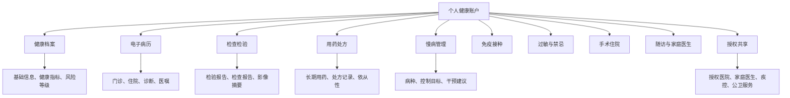

# C端全流程审计与优化清单

生成日期：2026-06-15

## 一、已审计流程

| 流程 | 当前状态 | 审计结论 |
|---|---|---|
| 管理端居民档案录入 | 已实现 | 可新增、编辑、查询、查看详情 |
| 管理端慢病登记 | 已实现 | 可记录病种、来源机构、管理状态 |
| 管理端随访管理 | 已实现 | 可新增、记录、一键完成、逾期识别 |
| 本地数据保存 | 已实现 | 服务模式保存至 `data/db.json`，静态模式保存至浏览器本地 |
| 居民端读取档案 | 已实现 | 可读取管理端居民、慢病、随访数据 |
| 居民端电子病历 | 首版实现 | 当前为模拟病历时间线，后续接区域 EMR |
| 手机端预览 | 已实现 | `mobile-preview.html` 可模拟手机视口 |
| 真机访问 | 支持 | 需电脑与手机在同一 Wi-Fi，并启动本地服务 |

## 二、主要问题

1. C 端仍偏“慢病个人页”，还没有形成完整的个人健康信息库。
2. 电子病历之外，检查检验、用药、过敏史、免疫接种、手术住院等信息未集中展示。
3. 居民缺少对“哪些健康信息已归集、哪些还缺失”的直观感知。
4. 未来接入真实数据时，需要预留授权共享、来源机构、数据更新时间等字段。

## 三、本轮优化方向

本轮将 C 端从“健康档案与电子病历页面”升级为“个人健康信息库”。

新增能力：

- 档案完整度。
- 个人健康信息库分类视图。
- 检查检验。
- 用药处方。
- 过敏史。
- 免疫接种。
- 手术住院。
- 授权共享。
- 数据来源与更新状态。

## 四、理想状态

个人客户端的理想状态是居民本人拥有一个长期、连续、可授权、可追溯的健康信息账户。

## 五、后续建议

1. 将电子病历、检查检验、处方等模拟数据抽成独立接口。
2. 增加居民授权管理：本人授权、家庭成员授权、医生查看授权。
3. 增加数据来源标签：医院、基层、公卫、医保、个人上传。
4. 增加健康档案完整度评分与缺失项提醒。
5. 增加个人上传能力：体检报告、外院病历、居家监测数据。
