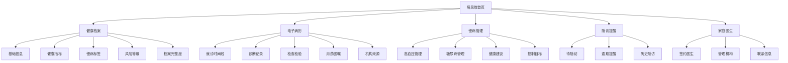
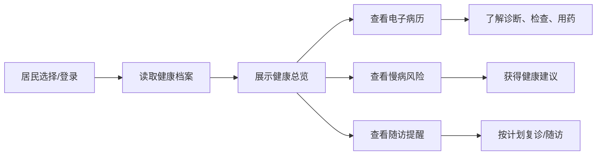

# 慢病平台 C 端居民端设计方案

生成日期：2026-06-15

## 一、设计定位

C 端面向居民本人和家庭成员，第一阶段不做复杂互联网医院能力，优先围绕“看得懂自己的健康档案”和“能追踪自己的诊疗记录”展开。

首期核心入口：

1. 电子病历：按时间线整合门诊、住院、检查检验、诊断、医嘱和用药。
2. 健康档案：整合基础信息、慢病登记、健康指标、风险评估、家庭医生和随访计划。

## 二、C 端信息架构

## 三、居民端主流程

## 四、首期页面设计

| 页面区域 | 设计内容 |
|---|---|
| 顶部身份栏 | 居民姓名、年龄、管理机构、家庭医生、风险等级 |
| 健康档案总览 | 血压、血糖、BMI、慢病标签、随访状态 |
| 电子病历时间线 | 按日期展示就诊机构、科室、诊断、检查、用药 |
| 慢病管理卡 | 展示病种、管理状态、控制目标和建议 |
| 随访提醒 | 展示待随访、逾期随访、责任医生和建议 |

## 五、数据来源设计

第一阶段使用本地数据：

- 居民基础档案：来自管理端居民档案。
- 慢病登记：来自管理端慢病登记。
- 随访计划：来自管理端随访管理。
- 电子病历：先使用本地模拟数据，后续可接医院 HIS/EMR。
- 健康指标：来自居民档案中的血压、血糖、BMI。

后续接口方向：

- 区域全民健康信息平台。
- 医院电子病历系统。
- 基层健康档案系统。
- 检查检验系统。
- 家庭医生签约服务系统。

## 六、首期实现边界

已纳入：

1. 居民选择。
2. 健康档案总览。
3. 电子病历时间线。
4. 慢病登记与风险等级。
5. 随访提醒。
6. 家庭医生信息。

暂不纳入：

1. 实名认证。
2. 在线问诊。
3. 支付。
4. 处方流转。
5. 真实医疗数据对接。
6. 家属授权管理。
