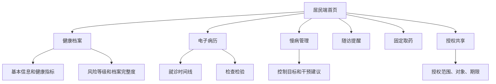

# C 端居民端设计方案

更新日期：2026-06-18

居民端当前定位为“个人健康信息库 + 慢病服务入口”。它不是互联网医院，也不承担线上诊疗，而是让居民能看懂自己的健康档案、诊疗记录、慢病管理状态和授权共享情况。

## 1. 已实现页面

- `citizen.html`：居民端主页面。
- `mobile-preview.html`：手机外框预览，用于检查移动端视觉效果。
- `login.html`：居民账号入口，演示账号为 `citizen / 123456`。

## 2. 已实现功能

| 功能 | 当前实现 |
|---|---|
| 居民身份 | 支持演示居民和家庭成员视角 |
| 健康档案 | 展示基本信息、健康指标、慢病标签、风险等级 |
| 电子病历 | 展示门诊、住院、诊断、医嘱和来源机构 |
| 检查检验 | 展示检查检验项目、结果、时间和来源 |
| 用药处方 | 展示长期用药、处方和固定取药信息 |
| 慢病管理 | 展示高血压、糖尿病等慢病管理状态和建议 |
| 随访提醒 | 展示待随访、逾期随访、责任医生和建议 |
| 过敏与禁忌 | 展示过敏史和风险提示 |
| 免疫接种 | 展示接种记录 |
| 手术住院 | 展示住院和手术摘要 |
| 授权共享 | 记录授权对象、范围、有效期和状态 |

## 3. 居民端信息架构

## 4. 数据来源

当前居民端读取本地演示数据：

- 居民基础档案：`residents`
- 慢病登记：`chronicDiseases`
- 随访计划：`followups`
- 个人健康信息库：`personalRecords`
- 固定取药和协同事项：`medicationPickups`、`careOrders`

正式接入时建议对接区域全民健康信息平台、基层公卫系统、医院 HIS/EMR、LIS/PACS、医保结算和家庭医生签约系统。

## 5. 当前边界

- 账号为演示账号，未接真实实名身份。
- 授权共享目前是业务记录，还没有成为后端强制权限控制。
- 病历、检查、用药等为演示数据结构，尚未接入真实院内接口。
- 居民上传材料可以作为流程演示，尚未实现影像/附件的长期对象存储。
