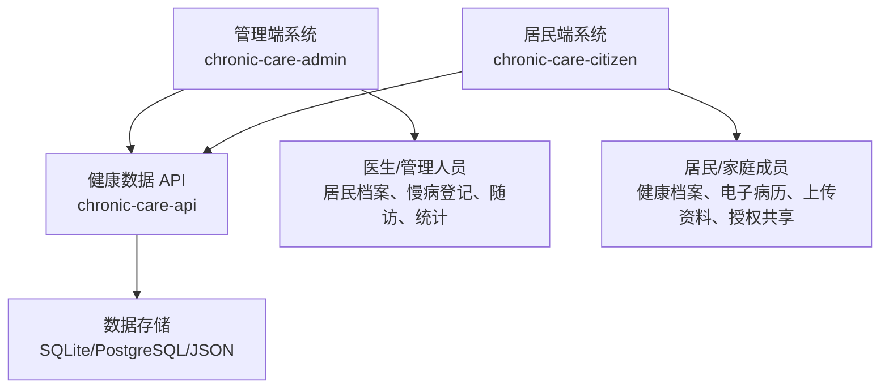

# 慢病平台 GitHub 拆分部署方案

生成日期：2026-06-15

## 一、是否可以拆成两个系统

可以。建议拆成两个前端系统、一个共享后端服务。



## 二、推荐仓库结构

### 方案 A：一个 GitHub 仓库，分目录部署

适合当前阶段，管理最简单。

```text
chronic-care-platform/
  admin/
    index.html
    app.js
    styles.css
  citizen/
    citizen.html
    citizen.js
    citizen.css
    mobile-preview.html
  api/
    server.js
    data/
  docs/
```

优点：

- 方便统一维护。
- 前后端代码都在一个仓库。
- 适合 MVP 和演示阶段。

缺点：

- 后续团队协作、独立发布时边界不够清晰。

### 方案 B：两个 GitHub 仓库 + 一个 API 仓库

适合后续正式开发。

```text
chronic-care-admin
chronic-care-citizen
chronic-care-api
```

优点：

- 管理端和居民端可以独立迭代、独立发布。
- API 可以单独部署、扩展和加权限。

缺点：

- 初期维护成本略高。

## 三、GitHub Pages 能部署什么

GitHub Pages 适合部署静态前端：

- 管理端页面。
- 居民端页面。
- 手机预览页面。
- 设计文档和架构图。

GitHub Pages 不适合直接运行：

- Node.js 后端 `server.js`。
- `/api/state`。
- `/api/personal-records`。
- 需要写入 `data/db.json` 的服务端逻辑。

因此，如果只用 GitHub Pages，可以运行“静态演示模式”；如果要保留数据写入和 API，需要把后端部署到支持 Node.js 的平台。

## 四、部署路径建议

### 第一阶段：GitHub Pages 静态演示

部署内容：

- 管理端静态页面。
- 居民端静态页面。
- 手机预览页面。

能力：

- 页面可访问。
- 居民端可用浏览器 localStorage 保存上传资料。
- 不支持多人共享数据。
- 不支持真正后端 API。

### 第二阶段：前端 GitHub Pages + 后端 Node 服务

部署内容：

- 管理端：GitHub Pages。
- 居民端：GitHub Pages。
- API：Node.js 服务，后续可部署到云服务器、Render、Railway、Fly.io、Vercel Serverless 或自有服务器。
- 数据库：从 JSON 升级到 SQLite 或 PostgreSQL。

能力：

- 管理端和居民端共享同一套数据。
- 个人健康信息库统一保存。
- 授权共享、上传资料、随访管理都可持久化。

## 五、当前项目拆分建议

当前目录可以先这样重组：

```text
chronic-care-platform/
  admin/
    index.html
    app.js
    styles.css
  citizen/
    citizen.html
    citizen.js
    citizen.css
    mobile-preview.html
    mobile-preview.css
  api/
    server.js
    package.json
    data/db.json
  docs/
    C端居民端设计方案.md
    C端全流程审计与优化清单.md
    慢病平台系统结构图与优化建议.md
```

为了避免一次性移动文件导致路径混乱，建议下一步先做“逻辑拆分”：

1. 在文档和 README 中明确三个模块。
2. 保持当前目录可运行。
3. 后续确认部署方式后，再进行目录重构。

## 六、下一步最优操作

建议下一步做：

1. 增加 `docs/` 目录，集中放架构与设计文档。
2. 增加部署说明 `DEPLOYMENT.md`。
3. 增加 `.gitignore`，避免日志和本地临时文件入库。
4. 再决定是否把当前项目拆成 `admin/ citizen/ api/`。

如果要正式发布到 GitHub，建议先保留一个仓库，采用 monorepo。等功能稳定后，再拆成两个或三个仓库。
