# 全平台功能图

> 更新：2026-08-31。该图是当前功能与治理关系总览，不替代六张 AS-IS 架构地图、Owner 注册表、API 目录、数据模型或发布门禁。

```mermaid
flowchart TB
    subgraph USERS["访问主体与应用入口"]
        CITIZEN["居民 / 家庭成员<br/>居民端、健康档案、服务办理"]
        MEDICAL["医生 / 护士 / 药师<br/>专业工作台"]
        INSTITUTION["医疗机构 / 体检机构 / 血站<br/>机构运营与业务协同"]
        COMMISSION["卫健委 / 医保 / 监管人员<br/>监管驾驶舱、治理中心"]
        ACCESS["Web / PWA / API<br/>统一登录与授权上下文"]
    end

    CITIZEN --> ACCESS
    MEDICAL --> ACCESS
    INSTITUTION --> ACCESS
    COMMISSION --> ACCESS

    subgraph DOMAINS["九个一级开发域"]
        T01["T01 运行与身份安全<br/>登录、会话、角色、权限、CSRF<br/>健康检查、指标、安全响应头"]
        T02["T02 平台与状态治理<br/>平台治理、审计验证、发布状态<br/>医院运行、区域共享、工作项中心"]
        T03["T03 公共卫生<br/>疾病监测、预警、直报<br/>医防协同、呼吸道病原、应急报送"]
        T04["T04 居民与慢病<br/>居民主索引、健康档案、家庭授权<br/>慢病管理、随访、主动健康"]
        T05["T05 服务协同<br/>预约挂号、转诊、护理、陪诊<br/>服务工单、会诊和闭环协同"]

        subgraph T06["T06 临床专科"]
            T06G["父级治理与兼容接线"]
            EMERGENCY["急救<br/>120受理、急救事件、生命链<br/>院前院内交接"]
            BLOOD["血液<br/>采供血、库存、临床用血<br/>输血安全、追溯与召回"]
            IMAGING["影像<br/>影像云、检查互认、分享<br/>阅片与影像质控"]
            EXAM["体检<br/>体检接入、报告归档<br/>异常处置、复查和健康解释"]
            QUALITY["质量安全<br/>质量检查、问题派发<br/>整改反馈、复核与观察模型"]

            T06G --> EMERGENCY
            T06G --> BLOOD
            T06G --> IMAGING
            T06G --> EXAM
            T06G --> QUALITY
        end

        T07["T07 医保支付产品线<br/>按病种付费、结算清单、支付<br/>退款、凭证、对账与异常处理"]
        T08["T08 外部集成<br/>HIS / EMR / LIS / PACS<br/>短信、支付、对象存储、SIEM/WORM"]
        T09["T09 科研与共享<br/>科研数据集、伦理审批<br/>脱敏、沙箱、合规导出、共享查询"]
    end

    ACCESS --> T01
    T01 --> T02
    T01 --> T03
    T01 --> T04
    T01 --> T05
    T01 --> T06G
    T01 --> T07
    T01 --> T08
    T01 --> T09

    subgraph PLATFORM["共享平台能力"]
        ROUTER["模块化 HTTP 路由<br/>API目录、认证分类、授权矩阵"]
        POLICY["统一安全策略<br/>角色 + 账号类型 + 机构 + 区域 + 居民范围"]
        COMMAND["Owner 命令端口<br/>幂等回放、版本CAS、职责分离"]
        AUDIT["审计与证据链<br/>业务审计、安全审计、Hash验证"]
        ASYNC["异步执行控制<br/>Outbox、Worker、Lease、重试、死信"]
        STORAGEPORT["对象存储安全端口<br/>结构化元数据、扫描、留存、对账"]
        RELEASE["生产治理<br/>Readiness、Go/No-Go、切换与回滚"]
    end

    T02 --> ROUTER
    T03 --> COMMAND
    T04 --> COMMAND
    T05 --> COMMAND
    EMERGENCY --> COMMAND
    BLOOD --> COMMAND
    IMAGING --> COMMAND
    EXAM --> COMMAND
    QUALITY --> COMMAND
    T07 --> COMMAND
    T09 --> COMMAND

    ROUTER --> POLICY
    COMMAND --> AUDIT
    COMMAND --> ASYNC
    T08 --> STORAGEPORT
    T02 --> RELEASE

    subgraph DATA["数据与存储"]
        JSON["JSON兼容状态<br/>演示种子与遗留集合<br/>不得直接编辑"]
        SQLITE["SQLite v17<br/>38张主Schema表<br/>当前事务与兼容存储"]
        PG["PostgreSQL目标架构<br/>受控迁移、演练、核对与回滚<br/>尚未成为生产Primary"]
        OBJECTMETA["对象存储元数据<br/>命令、回执、对账和生命周期"]
        EVIDENCE["外部证据索引<br/>仅保存摘要、引用和签名绑定"]
    end

    COMMAND --> SQLITE
    SQLITE -.兼容投影.-> JSON
    SQLITE -.受控迁移.-> PG
    STORAGEPORT --> OBJECTMETA
    AUDIT --> EVIDENCE
    ASYNC --> SQLITE
    RELEASE --> EVIDENCE

    subgraph EXTERNAL["外部系统与现场能力"]
        HIS["HIS / EMR"]
        LISPACS["LIS / PACS / 影像云"]
        PH["疾控、区域平台、国家直报"]
        FINANCE["医保、支付、银行和结算系统"]
        SMS["短信、OIDC、身份目录"]
        OBJPROVIDER["对象存储、KMS、WORM、恶意文件扫描"]
        OBSERVE["SIEM、监控、告警、备份"]
        SITE["现场网络、TLS、终端、容量<br/>演练、审批和验收"]
    end

    T08 --> HIS
    T08 --> LISPACS
    T08 --> PH
    T08 --> FINANCE
    T08 --> SMS
    STORAGEPORT --> OBJPROVIDER
    AUDIT --> OBSERVE
    RELEASE --> SITE

    subgraph GOVERNANCE["T00 集成治理——不计入九个一级开发域"]
        OWNER["Owner与边界注册表<br/>9个一级域 + 5个临床子域"]
        ARCH["六张架构地图、ADR<br/>核心数据不可变定义"]
        CI["Build / Lint / Typecheck<br/>Unit / Integration / Smoke / E2E"]
        INTEGRATION["组合根、路由顺序、跨域协议<br/>main集成、部署包和发布门禁"]
    end

    OWNER -.约束.-> DOMAINS
    ARCH -.约束.-> PLATFORM
    CI -.验证.-> DOMAINS
    CI -.验证.-> PLATFORM
    INTEGRATION -.统一集成.-> ROUTER
    INTEGRATION -.统一发布.-> RELEASE

    BOUNDARY["统一仓库 · 模块化单体 · 共享Node.js运行时 · 统一部署<br/>各域可以独立计划、开发和测试，但不等于独立部署<br/>当前生产状态：FROZEN-NO-GO"]

    GOVERNANCE --> BOUNDARY
    RELEASE --> BOUNDARY
```

## 使用边界

- 九个一级开发域是 T01–T09；T00 只负责集成治理。
- 急救、血液、影像、体检和质量安全是 T06 下的五个可治理临床子域。
- T07 医保支付是独立开发产品线，但仍通过 T00、main 和共享运行时发布。
- 可独立计划、开发和测试不表示可独立部署；服务提取、数据库切换和生产发布仍需单独 ADR、迁移、证据及审批。
- 外部系统、真实 PostgreSQL、多实例、KMS/WORM、监控、容灾和现场验收尚未闭合，生产状态保持 FROZEN-NO-GO。
