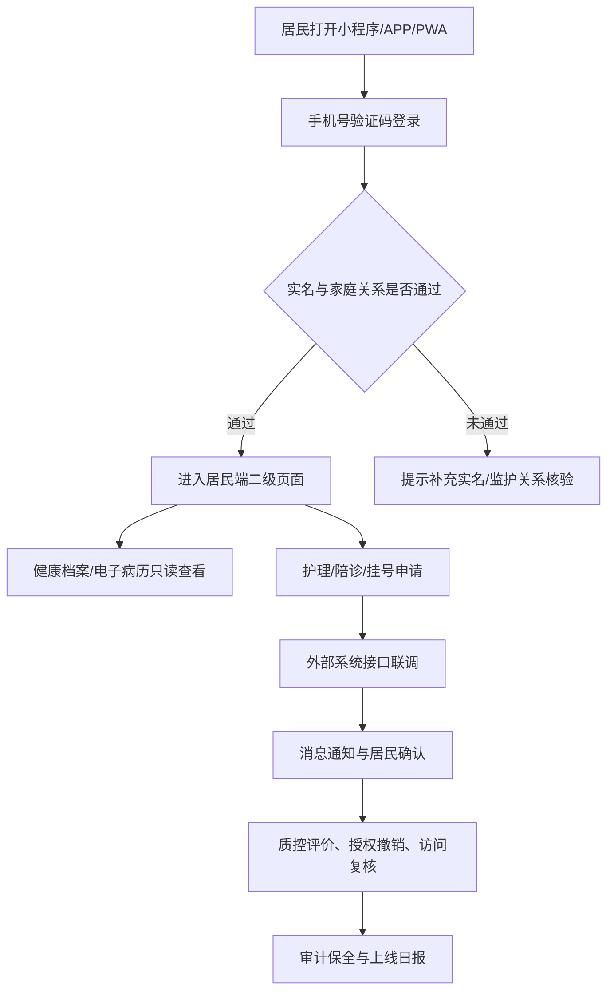

# 居民端真实上线需求文档

## 1. 上线目标

居民端真实上线目标是把当前可演示、可试点的 `citizen.html` 能力升级为小程序、APP 和 PWA 均可运行的居民健康服务入口。上线版本面向受控试点居民开放，支持手机号验证码登录、家庭成员授权访问、健康档案和电子病历只读查看、护理申请、陪诊预约、挂号预约、消息待办、授权撤销和访问复核。

真实上线不以“全部外部系统一次性接通”为前提，但所有未接通的外部依赖必须在页面、接口、运维和发布材料中明确标注为上线阻断项或受控试点限制项。

## 2. 上线范围

| 模块 | 上线能力 | 必接接口 | 上线口径 |
| --- | --- | --- | --- |
| 登录与身份 | 手机号验证码登录、失败锁定、会话签发、居民身份绑定 | 短信网关、政务实名核验、家庭关系核验 | 生产必接 |
| 健康档案 | 居民基本信息、慢病、随访、指标趋势、授权状态 | 主索引、公卫/基层慢病系统 | 试点只读上线 |
| 出生人口健康管理 | 出生医学证明归集、入册接续、新生儿访视和低体重专案提醒 | 出生医学证明、妇幼健康、公安共享回执 | 试点上线 |
| 电子病历 | 门诊记录、检查检验、用药处方、影像索引、附件资料 | HIS、EMR、LIS、PACS、文档存储 | 试点只读上线 |
| 护理服务 | 居民提交护理申请、查看评估、派单、护士接单和质控回访 | 互联网护理管理、电子签名、定位/轨迹、医保/支付 | 试点上线 |
| 陪诊服务 | 居民预约陪诊、服务商目录校验、医院回执、合同保险和评价 | 服务商监管目录、医院接诊回执、消息网关 | 试点上线 |
| 挂号服务 | 号源查询、预约、取消、支付/医保状态和短信通知 | HIS/互联网医院号源、支付、医保电子凭证 | 试点上线 |
| 消息待办 | 预约变化、护士接单、陪诊匹配、授权到期和居民确认 | 短信、订阅消息、APP 推送、站内信回执 | 生产必接 |

## 3. 角色与权限

| 角色 | 权限边界 | 上线要求 |
| --- | --- | --- |
| 居民本人 | 查看本人健康数据，发起护理、陪诊、挂号，新增/撤销授权 | 必须通过实名手机号或政务身份绑定 |
| 家庭成员/监护人 | 在授权范围内查看家庭成员数据和代办服务 | 必须完成家庭关系或监护关系核验 |
| 医疗机构 | 处理居民授权范围内的病历、护理、挂号、陪诊回执 | 不得越权读取居民未授权数据 |
| 平台运维 | 监控、审计、应急下线、发布回滚 | 不得直接查看明文敏感健康数据 |
| 卫健监管 | 查看汇总运行指标、投诉质控、服务目录和审计证据 | 只看监管所需最小数据集 |

## 4. 业务流程

## 5. 功能需求

### 5.1 登录与身份

- 支持手机号验证码发送、冷却、有效期、失败次数锁定、登录审计和会话过期。
- 生产验证码必须接入 `SMS_GATEWAY_URL`，不得使用演示固定验证码。
- 登录成功后必须绑定 `accountId`、`residentId`、`personIndex` 和家庭成员授权范围。
- 连续错误验证码达到阈值后必须短时锁定，并返回重试时间。

### 5.2 二级页面导航

- 居民端必须保留 `page=health-record|emr|nursing|escort|registration` 二级页面路由。
- 手机端底部导航必须满足 44px 以上触控高度，当前页面要有明确状态。
- APP/小程序预览中底部导航按五个独立功能页切换，不得触发锚点式上下滚动。
- 已实现功能和待生产化边界必须区分；居民可见页面不得出现内部管理集合和未上线承诺。

### 5.3 健康档案与电子病历

- 居民可查看本人及授权家庭成员的健康档案、电子病历、检查检验、用药处方、影像索引和附件资料。
- EMR/LIS/PACS 原文调阅必须受授权和审计约束。
- 撤销授权后，远程会诊、机构端查看和居民端复核必须同步更新。
- 出生人口健康管理必须展示出生证归集、待接续、低体重专案和下一服务提醒。

### 5.4 护理、陪诊和挂号

- 护理服务必须覆盖申请、评估、知情同意、派单、护士接单、服务记录、质控评价和投诉处理。
- 陪诊预约必须校验已发布服务商，禁止不存在或未发布服务主体接单。
- 挂号预约必须锁定真实号源，生成就诊号、支付状态、医保预核验状态和取消规则。

### 5.5 消息与待办

- 所有预约、取消、派单、评价和授权变更必须生成站内消息。
- 生产上线必须接入短信、订阅消息或 APP 推送回执。
- 已确认、已取消、已评价的待办不得重复展示可操作按钮。

## 6. 接口需求

| 接口 | 用途 | 上线要求 |
| --- | --- | --- |
| `POST /api/auth/phone-code` | 发送验证码 | 生产短信网关、冷却、审计 |
| `POST /api/auth/phone-login` | 验证码登录 | 失败锁定、会话签发、实名绑定 |
| `GET /api/state` | 居民端聚合状态 | 按居民和家庭授权裁剪 |
| `GET/POST /api/personal-records` | 档案和授权 | 撤销后强制拦截 |
| `GET /api/internet-nursing/dashboard` | 护理服务 | 机构、护士、质控证据完整 |
| `POST /api/internet-nursing/orders` | 护理预约 | 风险评估和电子签名待办 |
| `GET /api/escort-services/dashboard` | 陪诊服务 | 只展示已发布服务商 |
| `POST /api/escort-services/orders` | 陪诊预约 | 服务商、医院、日期、重复预约校验 |
| `GET /api/registrations/dashboard` | 号源和订单 | HIS/互联网医院号源 |
| `POST /api/registrations/orders` | 预约挂号 | 支付、医保、短信通知 |
| `POST /api/registrations/orders/:id/cancel` | 取消预约 | 释放号源、退费/通知 |
| `GET /api/messages` | 居民消息 | 多渠道送达回执 |
| `POST /api/tasks/:id/actions` | 待办动作 | 幂等、审计、重复按钮隐藏 |

## 7. 非功能需求

| 类别 | 要求 |
| --- | --- |
| 可用性 | 试点期服务可用性不低于 99.5%，关键登录和预约链路需有降级提示 |
| 性能 | 手机端首屏主要内容 3 秒内可用；接口 P95 不超过 800ms |
| 兼容性 | 支持主流微信/支付宝小程序容器、Android/iOS WebView、现代移动浏览器 |
| 可访问性 | 支持大字模式、触控区不低于 44px、关键按钮有可读标签 |
| 安全 | HTTPS、会话签名、验证码锁定、最小权限、敏感数据脱敏、审计哈希链 |
| 隐私 | 隐私政策、授权告知、撤销授权、访问复核和数据最小化 |
| 运维 | 监控告警、日志保全、备份恢复、应急下线、灰度发布和回滚脚本 |

## 8. 生产上线前置条件

- 配置 `NODE_ENV=production`、正式 `SESSION_SECRETS`、`INTEGRATION_GATEWAY_SECRET`、`SMS_GATEWAY_URL`、`OIDC_*` 和审计保全目标。
- 完成政务实名、家庭关系、短信网关、HIS/EMR/LIS/PACS、护理、陪诊、医保和支付联调。
- 完成小程序备案、隐私协议、APP 签名、推送证书、崩溃监控和升级通道配置。
- 完成等保/密评材料、生产数据库备份恢复、监控值班和灾备演练。
- 完成试点医院、卫健监管、医保经办、平台运维和项目实施方签字。

## 9. 验收标准

| 验收项 | 通过标准 |
| --- | --- |
| 登录验收 | 验证码发送、冷却、有效期、失败锁定、实名绑定和审计均通过 |
| 导航验收 | 五个二级页面 URL 可直达，手机底部导航可操作，切换不产生上下滚动 |
| 数据验收 | 居民只能看到本人和授权家庭成员数据 |
| 服务验收 | 护理、陪诊、挂号均能创建、通知、取消或评价 |
| 安全验收 | 未授权访问、撤销授权、重复操作和无效服务商均被拦截 |
| 发布验收 | `npm.cmd run check`、`npm.cmd test`、`npm.cmd run deploy:check`、`npm.cmd run citizen:launch-foundation`、`npm.cmd run launch:smoke` 全部通过 |
| 现场验收 | 联调记录、压测报告、监控截图、灾备演练和上线签字归档 |

## 10. 发布与回滚

1. 先发布后端 API 和生产环境变量，验证 `/api/health`。
2. 再发布居民端静态资源、小程序包和 APP/PWA 壳。
3. 用 `launch:smoke -- --base-url=<生产地址>` 执行线上冒烟。
4. 灰度开放试点白名单，观察登录、预约、消息、审计和错误率。
5. 出现身份、支付、医保、病历越权或消息大面积失败时，立即切换到只读模式或下线对应服务入口。

## 11. 分阶段里程碑

| 阶段 | 目标 | 完成标志 |
| --- | --- | --- |
| T0 需求冻结 | 完成本文档、接口清单和上线边界确认 | 文档、测试和 release 门禁引用本文 |
| T1 生产联调 | 接入身份、短信、HIS/EMR/LIS/PACS、护理、陪诊、医保 | 联调记录和接口验收通过 |
| T2 受控试点 | 白名单居民真实使用健康档案、护理、陪诊和挂号 | 日报、问题闭环和用户反馈稳定 |
| T3 正式推广 | 扩大居民范围并纳入常态运营 | 监控、值班、审计和投诉质控闭环 |
