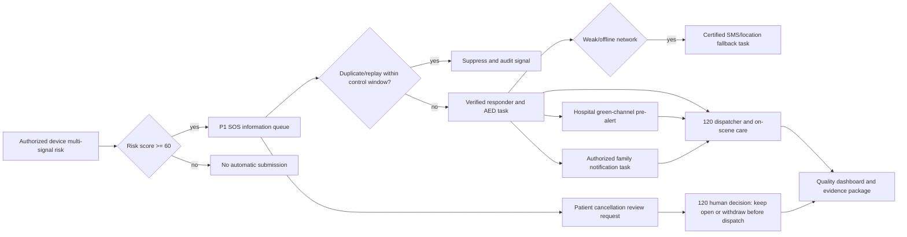

# Emergency golden four-minute life chain

## Seven delivered capabilities

1. **Golden four-minute coordination**: on SOS acceptance, creates nearby verified-responder tasks with AED/CPR guidance while preserving 120 dispatcher authority.
2. **Pre-authorized device risk alert**: a resident explicitly authorizes a device and permitted signals; only a risk score at or above 60 can create an automatic P1 information-queue SOS. Replayed source signals and same-device/same-signal reports within 120 seconds are recorded and suppressed rather than creating another event.
3. **Green-channel pre-alert**: chest-pain and stroke signals select an eligible hospital capability and create a pre-alert. Hospital acceptance remains a human confirmation.
4. **Family emergency collaboration**: only resident-authorized emergency contacts receive a notification task, with a masked contact reference in the operational view.
5. **Emergency command projection**: emergency center/hospital roles can view active events, vehicles, hospitals, AED reference sites, responder workload, and capacity-gap indicators.
6. **Weak-network life line**: weak/offline device reports create an auditable SMS/location fallback delivery task; a certified messaging gateway is still required before transmission.
7. **Quality and review dashboard**: summarizes automatic SOS, responder-task coverage, hospital pre-alert confirmation, weak-network fallback, duplicate suppression, cancellation-review workload, and closed-loop evidence status.

## API surface

- `POST /api/emergency/life-chain/authorizations`
- `POST /api/emergency/life-chain/authorizations/:id/revoke`
- `POST /api/emergency/life-chain/family-contacts`
- `POST /api/emergency/life-chain/device-sos`
- `GET /api/emergency/life-chain/overview`
- `GET /api/emergency/life-chain/command-center`
- `GET /api/emergency/life-chain/quality`
- `POST /api/emergency/events/:id/green-channel/confirm`
- `POST /api/emergency/events/:id/automatic-sos-cancellation-request`
- `POST /api/emergency/events/:id/automatic-sos-cancellation-resolve`

## Safety and production boundary

- The platform is supplementary to the official 120 path. Device SOS submits information to the 120 queue; a webpage cannot silently call 120 or bypass the mobile operating-system confirmation.
- Automatic SOS requires resident authorization, a configured device, an allow-listed signal, and a risk score threshold. The trusted-device gateway now verifies HMAC-SHA256 signatures through a runtime credential reference, a 120-second clock window, a monotonic device counter and idempotent source-signal identifiers; exact idempotent replays are re-authenticated before the prior result is returned. It never persists the raw device secret. A device becomes active only after externally signed attestation evidence is independently verified by a different commission operator. Suspended and retired devices cannot report; credential rotation clears the prior attestation and requires a new four-eyes proof. The life-chain domain consumes only signature-verified trusted gateway signals, rejects cross-resident use, and links each trusted signal to at most one automatic SOS event while preserving duplicate suppression.
- Real manufacturer certificates, vault credentials, vehicle terminals and monitoring devices remain a signed site-integration requirement. The software route contract is delivered in `emergency-device-gateway.js`; T00 must bind its six declared routes in the shared `server.js` before HTTP acceptance.
- A cancellation request does not cancel an ambulance. Before dispatch, only the 120 emergency-center role can keep the queue item open or withdraw it after a human review; a dispatched case cannot be withdrawn through this path.
- Consent withdrawal, duplicate/replay suppression, cancellation review and 120-only cancellation resolution remain mandatory safety controls around automatic SOS.
- Pending cancellation reviews are visible only in the 120 command workbench, where the reviewer records either `keep-open` or `withdraw-before-dispatch`; the quality view retains the aggregate workload without exposing the patient cancellation queue to other hospitals.
- Responder, AED, vehicle, hospital-capacity, SMS, wearable, and emergency-center feeds in this release are platform workflow/reference data. Real dispatch, message transmission, and clinical acceptance require signed interfaces, current authoritative registries, privacy/security assessment, joint testing, and site evidence.

## Verification

`npm run emergency:test` verifies authorization denial, signal threshold, automatic SOS, responder/AED coordination, family task, weak-network fallback, hospital confirmation, citizen scope, and quality projection. `npm run emergency:readiness`, `npm run deploy:check`, and `npm run release:report` retain the functional-versus-formal-go-live boundary.

The 2026-07-28 T10 plan review records all eight emergency code capability groups as implemented. Remaining work is deliberately external: live CTI/location/vehicle/hospital integration, T00 route and transaction binding, and site SLO/disaster-recovery acceptance. None of those actions can be closed by the static preview or seeded emergency data.
