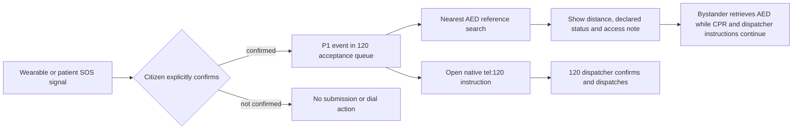

# Confirmed SOS and AED guidance

## Scope

`POST /api/emergency/sos` accepts a **confirmed** citizen SOS and creates a P1 event in the 120 acceptance queue. It records the detected signal, location, complaint, audit record, and the native-call instruction `tel:120`.

`GET /api/emergency/aed-map?latitude={latitude}&longitude={longitude}` returns the nearest AED reference sites, distance, declared availability, access note, and retrieval guidance for authorized citizen, emergency-center, and hospital users.

## Safety boundary

- This feature supplements, and does not replace, the public 120 emergency telephone service or the 120 dispatch decision.
- A citizen must explicitly confirm SOS submission. The web page cannot silently place a phone call or bypass the device operating-system confirmation screen; it only opens `tel:120` after the SOS record is accepted.
- AED retrieval must not delay CPR, dispatcher instructions, or scene-safety assessment. Device availability must be confirmed on site.

## Flow

## Production data boundary

The current AED entries are demonstration reference data. Before real deployment, replace them with a signed, current municipal AED registry or certified operator feed, define refresh/SLA and outage handling, and validate public access, maintenance status, geographic accuracy, and data ownership with the responsible organization.

## Verification

`npm run emergency:test` exercises rejected unconfirmed SOS, accepted confirmed SOS, citizen scope, AED distance ordering, and the existing dispatch-to-handover evidence flow. `npm run emergency:readiness` checks the UI, API, documentation, and release artifacts.
