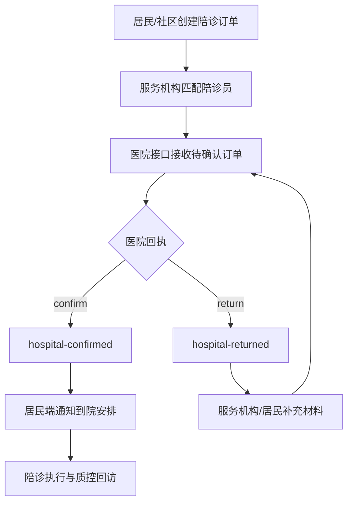

# 助医陪诊模块医院接口开发文档

## 1. 对接目标

本接口用于助医陪诊平台与医院 HIS/预约导诊/门诊服务台之间的轻量闭环。居民或服务机构创建陪诊订单后，医院侧回写接诊确认、就诊序号、科室联系人、到院提示或退回原因，平台据此通知居民端和陪诊服务机构，并形成审计记录。

## 2. 系统边界

- 平台侧系统：慢病医防融合管理平台助医陪诊模块。
- 医院侧系统：HIS、预约挂号、门诊导诊、院内消息网关。
- 本期范围：订单确认、到院提示、退回补充、审计留痕。
- 暂不包含：真实号源锁定、医保结算、院内支付、PACS/LIS 结果回传。

## 3. 身份与权限

- 调用方必须使用机构端或管理端账号登录，携带 `Authorization: Bearer <token>`。
- 医院账号按 `hospitalCode` 与登录用户 `orgCode` 匹配，例如 `MR1`。
- 卫健委/管理端账号可用于联调、验收和异常处置。
- 居民端无权调用医院回执接口，只能查看本人与家庭授权成员的订单结果。

## 4. 核心接口

### 4.1 医院接诊回执

`POST /api/escort-services/orders/:id/hospital-handoff`

请求体：

```json
{
  "decision": "confirm",
  "hospitalCode": "MR1",
  "hospitalCheckInStatus": "confirmed",
  "hospitalCheckInNo": "OP-MR1-20260627-008",
  "hisVisitId": "HIS-MR1-20260627-0008",
  "appointmentSource": "hospital-outpatient-guidance",
  "departmentCode": "CARD",
  "doctorCode": "DOC-CARD-01",
  "outpatientQueueNo": "C08",
  "hospitalDepartmentContact": "Cardiology outpatient guidance desk",
  "appointmentAt": "2026-06-27T09:30:00+08:00",
  "hospitalNotice": "Arrive 20 minutes early and bring ID card.",
  "note": "Hospital outpatient guidance desk confirmed the escort handoff."
}
```

返回体关键字段：

```json
{
  "id": "eso-r1-20260622",
  "residentId": "r1",
  "hospitalCode": "MR1",
  "status": "hospital-confirmed",
  "hospitalInterfaceStatus": "confirmed",
  "hospitalCheckInStatus": "confirmed",
  "hospitalCheckInNo": "OP-MR1-20260627-008",
  "hisVisitId": "HIS-MR1-20260627-0008",
  "appointmentSource": "hospital-outpatient-guidance",
  "departmentCode": "CARD",
  "doctorCode": "DOC-CARD-01",
  "outpatientQueueNo": "C08",
  "hospitalDepartmentContact": "Cardiology outpatient guidance desk",
  "hospitalConfirmedAt": "2026-06-29T10:00:00.000Z",
  "hospitalNotice": "Arrive 20 minutes early and bring ID card."
}
```

退回补充：

```json
{
  "decision": "return",
  "hospitalCode": "MR1",
  "hospitalCheckInStatus": "pending",
  "hospitalNotice": "Appointment number is missing; please supplement outpatient registration evidence.",
  "note": "Returned by hospital outpatient desk."
}
```

### 4.2 查询陪诊工作台

`GET /api/escort-services/dashboard`

医院端可查看本机构 `hospitalCode` 关联的订单。返回 `summary.hospitalConfirmed`、`summary.hospitalReturned`、订单内医院回执字段和审计轨迹。

### 4.3 居民端通知读取

`GET /api/messages`

医院回执成功后，平台生成 `collection=escortServiceOrders` 的站内消息，居民端展示接诊确认、到院提示或退回补充要求。

### 4.4 Resident task actions

`POST /api/tasks/escortServiceOrders:<id>/actions` accepts resident actions for the same order. `action=cancel-request` records `status=cancel-requested`, `cancellationReason`, `familyContactStatus=cancel-requested`, sends an institution-side task message, and removes the order from resident reminder cards while preserving it in the escort order history and audit trail.

## 5. 字段映射

| 平台字段 | 医院来源 | 说明 |
| --- | --- | --- |
| `hospitalCode` | 机构编码/统一医院编码 | 与登录账号 `orgCode` 对齐 |
| `hospitalInterfaceStatus` | 回执结果 | `pending`、`confirmed`、`returned` |
| `hospitalCheckInStatus` | 导诊/签到状态 | `pending`、`confirmed`、`completed` |
| `hospitalCheckInNo` | HIS/预约序号 | 门诊序号、导诊单号或挂号流水号 |
| `hospitalDepartmentContact` | 科室服务台 | 用于陪诊员到院联系 |
| `hospitalNotice` | 医院提示 | 身份证、空腹、提前到院、补充材料等 |
| `hospitalConfirmedAt` | 回执时间 | 平台接收或医院生成时间 |

## 6. 状态流转



## 7. 错误码

| HTTP | 场景 | 处理建议 |
| --- | --- | --- |
| 400 | 请求体字段不合法 | 检查 JSON、日期和状态值 |
| 400 | `providerId` 不在陪诊服务主体目录 | 先同步 `escortServiceProviders` 监管目录，再提交居民预约 |
| 401 | 未登录或 token 失效 | 重新登录机构端 |
| 403 | 居民端选择未发布服务主体 | 服务主体完成发布、保险和应急预案审核后再开放预约 |
| 403 | `hospitalCode` 与账号机构不匹配 | 核对医院编码和订单归属 |
| 404 | 订单不存在 | 核对订单 ID 和环境 |

## 8. 联调验收

- 使用医院账号 `hospital / 123456` 调用医院接诊回执接口。
- 确认订单状态进入 `hospital-confirmed` 或 `hospital-returned`。
- 确认 `auditTrail`、`dataAccessLogs`、`securityEvents` 均留痕。
- 确认居民端 `/api/messages` 能收到医院回执通知。
- 执行 `npm.cmd run escort:readiness` 和 `npm.cmd run deploy:check` 作为上线前验收。
## 9. HIS / appointment source fields

These fields are optional in early pilots but should be included by production hospital gateways:

| Field | Source system | Purpose |
| --- | --- | --- |
| `hisVisitId` | HIS/registration | Stable visit or registration primary key for reconciliation. |
| `appointmentSource` | HIS, outpatient guidance, resident mobile, escort console | Identifies where the appointment confirmation came from. |
| `departmentCode` | Hospital department dictionary | Maps the displayed department to a production dictionary code. |
| `doctorCode` | HIS clinic or doctor dictionary | Optional doctor or clinic code for appointment matching. |
| `outpatientQueueNo` | Outpatient calling/queue system | Queue number shown to the resident and escort worker. |

Joint testing must prove the resident card, escort console, task message, audit trail, and data access log all carry the same `hisVisitId` or the agreed site-specific equivalent.
