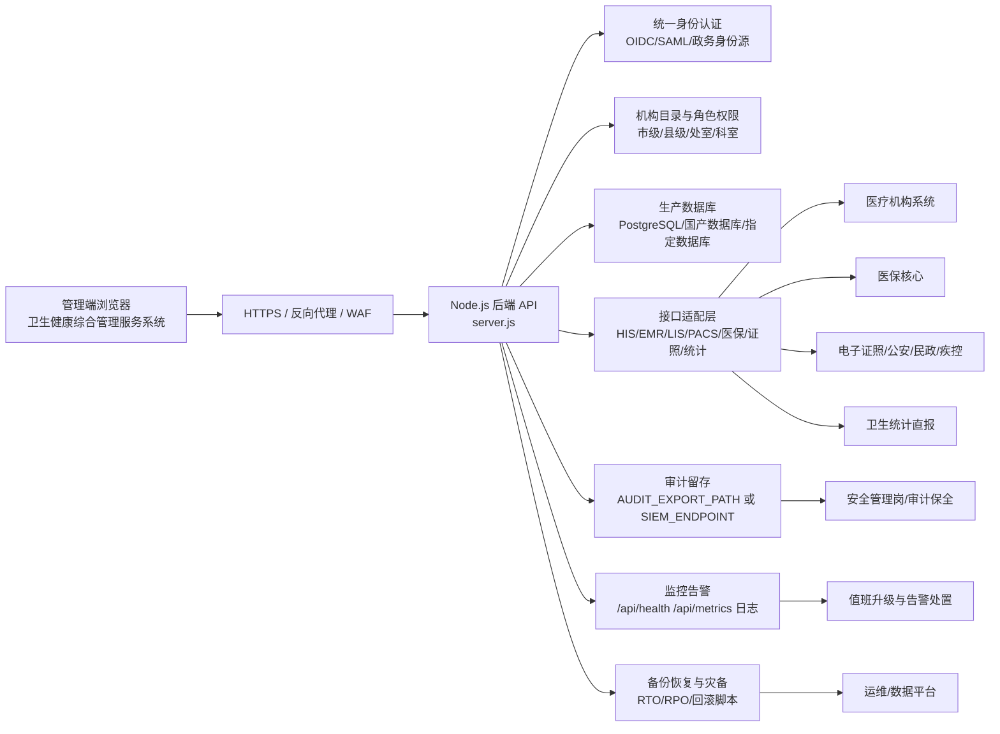

# 卫生健康综合管理服务系统生产后端上线准备清单

报告日期：2026-07-06

## 1. 结论

真实上线需要生产级后端。当前系统已经具备 Node.js API、登录权限、管理端摘要接口、生产门禁接口、发布报告、审计事件和自动化测试基础，但仍不能只按静态页面上线。

生产上线的正确路径不是重新建设一套后端，而是将现有 Node.js 后端生产化，并完成生产数据库、统一身份、外部接口、审计留存、监控告警、备份恢复和安全合规闭环。

## 2. 当前已有后端能力

| 能力 | 当前实现 | 上线口径 |
|---|---|---|
| Node.js API 服务 | `server.js` 提供 `/api/*` 路由 | 可作为生产后端基础，需要生产部署 |
| 管理端摘要 | `/api/health-dashboard/summary` | 已能汇总指标、风险、任务、接口、证据和功能报告 |
| 上线门禁 | `/api/health-dashboard/production-readiness` | 已返回门禁、阻塞项、现场问题、证据包和 P0 接收判定 |
| 页面审查入口 | `health-dashboard.html#production-readiness-board` | 已展示生产后端上线准备 8 项清单，并支持按阻塞、待办、关注状态筛选，便于管理端审查 |
| 健康检查 | `/api/health`、`/api/system/readiness` | 可用于监控探活和发布前检查 |
| 指标接口 | `/api/metrics` | 可接入监控平台，仍需生产指标和告警规则 |
| 登录与角色 | `commission` 等角色访问控制 | 生产需替换为统一身份和机构目录 |
| 审计事件 | 安全事件写入和读取 | 生产需接入审计留存目录或 SIEM |
| 发布证据 | `release:report`、`release:manifest`、`health-dashboard:summary` | 已可生成上线审查证据 |

## 3. 生产后端目标架构

## 4. 生产后端必须补齐的 P0 能力

| 编号 | 后端能力 | 必须完成内容 | 验收证据 | 当前状态 |
|---|---|---|---|---|
| B-P0-1 | 生产部署环境 | Node 运行时、进程守护、HTTPS、反向代理、环境变量、生产密钥、部署账号 | 环境部署单、`env:check:production`、域名证书、发布记录 | 待现场配置 |
| B-P0-2 | 生产数据库 | 正式数据库、连接池、迁移脚本、账号权限、索引约束、备份恢复、回滚窗口 | 数据库验收单、迁移日志、恢复演练报告、`production-db:readiness` | 阻塞 |
| B-P0-3 | 统一身份 | 政务统一认证或主管部门身份源、OIDC/SAML、claim 映射、机构目录、角色权限 | 身份联调记录、权限矩阵、拒绝访问审计、签字单 | 阻塞 |
| B-P0-4 | 外部接口适配 | HIS/EMR/LIS/PACS、医保、电子证照、统计直报等真实接口、签名、幂等、重试、死信 | 字段映射表、真实报文、联调截图、整改复测、联合签字 | 阻塞 |
| B-P0-5 | 审计留存 | 安全事件、访问日志、数据读取日志接入审计留存目录或 SIEM，支持哈希链验证 | `AUDIT_EXPORT_PATH` 或 `SIEM_ENDPOINT`、导出样例、留存策略 | 阻塞 |
| B-P0-6 | 监控告警 | 健康检查、指标采集、错误率、响应时间、任务积压、接口失败率、告警路由 | 监控截图、告警规则、值班表、演练记录 | 待演练 |
| B-P0-7 | 备份恢复与灾备 | 自动备份、恢复脚本、RTO/RPO、灾备切换、回滚方案 | 备份报告、恢复日志、灾备演练报告、签字单 | 待演练 |
| B-P0-8 | 安全合规 | 等保、密评、信创、国密、漏洞整改、最小权限、脱敏策略 | 测评报告、整改闭环、安全评审单 | 待现场材料 |

## 5. 建议后端部署形态

| 部署层 | 建议 |
|---|---|
| 运行方式 | 使用 Node.js LTS 或单位指定运行环境，采用进程守护和健康探活 |
| 反向代理 | 使用 Nginx、网关或政务云统一入口，强制 HTTPS |
| 配置管理 | 通过 `.env`、密钥管理系统或容器环境变量注入生产配置 |
| 数据库 | 优先接入单位统一数据库或指定国产数据库；演示 JSON/SQLite 不作为生产主库 |
| 日志 | 应用日志、安全事件、审计日志分离，统一接入日志平台 |
| 监控 | 采集 `/api/health`、`/api/metrics`、接口失败率、响应时间和任务积压 |
| 发布 | 先预生产联调，再生产灰度或窗口切换，保留回滚脚本和恢复点 |

## 6. 上线前后端验收顺序

1. 部署预生产 Node API 和反向代理。
2. 配置生产环境变量、密钥、域名、证书和网关访问策略。
3. 接入生产数据库并完成迁移、脱敏演练和恢复演练。
4. 接入统一身份和机构目录，完成角色权限、拒绝访问和审计测试。
5. 接入真实外部接口，完成字段映射、真实报文、幂等、重试、死信和对账验证。
6. 配置审计留存目标，导出并校验哈希链审计样例。
7. 接入监控告警和值班升级，完成故障演练。
8. 完成灾备和回滚演练，确认 RTO/RPO。
9. 运行 `npm.cmd run check`、`npm.cmd test`、`npm.cmd run test:e2e`、`npm.cmd run release:report`、`npm.cmd run deploy:check`。
10. 市、县两级卫生健康行政部门和实施/运维/安全责任方完成联合签字。

## 7. 与当前模块的关系

| 当前模块 | 后端上线关联 |
|---|---|
| 综合指标看板 | 需要真实统计日报、出生、死亡、就诊、入院接口替换演示快照 |
| 风险预警与任务闭环 | 需要源业务系统开放状态回写、超期规则和审计字段 |
| 接口联调与验收证据 | 需要真实报文、字段映射、联调截图和整改复测记录 |
| 上线运行门禁 | 需要读取真实生产环境、审计留存、数据库、监控、灾备和签字状态 |
| P0 接收判定 | 需要现场责任岗位完成接收、退回或签字闭环 |
| 发布报告 | 需要在生产环境重新生成报告并归档 |

## 8. 当前不能宣称生产 ready 的原因

当前发布报告仍保留生产切换警告：`audit:retentionTargetConfigured`，说明生产审计留存目标尚未配置。除此之外，统一身份、生产数据库、接口签字、监控灾备、安全合规仍需现场证据闭环。

因此，当前系统可用于演示、联调、培训、上线审查和现场验收准备；真实上线必须在生产后端底座全部通过后再确认。

## 9. 下一步开发建议

| 优先级 | 开发项 | 产出 |
|---|---|---|
| P0 | 生产环境配置模板 | `.env.production.example`、部署参数清单、环境检查说明 |
| P0 | 审计留存门禁强化 | 将 `AUDIT_EXPORT_PATH` 或 `SIEM_ENDPOINT` 检查结果更明确地展示到驾驶舱 |
| P0 | 生产数据库适配层 | 数据库连接配置、迁移演练、恢复演练和回滚验证 |
| P0 | 统一身份适配契约 | OIDC/SAML claim 映射、机构目录、角色权限样例 |
| P1 | 接口网关联调台账 | 外部接口真实报文、失败重试、死信和对账状态 |
| P1 | 运维监控面板 | 运行状态、接口失败率、响应时间、告警和值班状态 |

## 10. 结论

真实上线需要生产级后端。当前系统已有后端基础，应继续沿现有 Node API、发布报告、上线门禁和审计链路生产化，而不是另起一套纯静态系统。上线前必须完成生产数据库、统一身份、真实接口、审计留存、监控告警、备份恢复和安全合规闭环。
