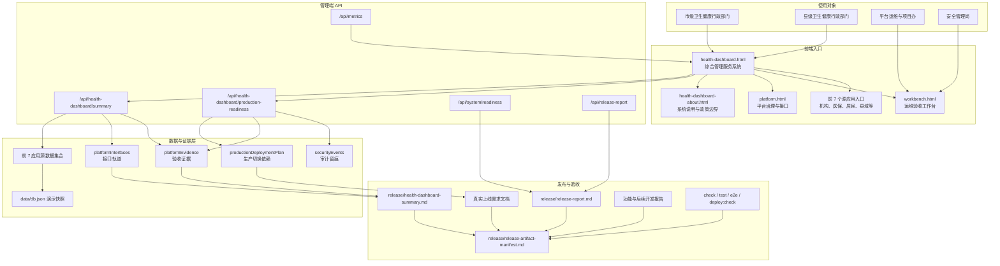

# 卫生健康综合管理服务系统功能与后续开发报告

报告日期：2026-07-06

## 1. 报告口径

本报告用于说明“卫生健康综合管理服务系统”当前已完成功能、系统架构、责任边界、上线差距和下一步开发计划。

系统面向各级卫生健康行政部门使用，定位为前 7 个应用的综合汇总、运行监测、风险预警、任务督办、接口联调、验收取证和上线门禁入口。具体业务办理、签收、处置、复核和状态回写仍回到源业务应用或外部系统完成。

当前发布口径：可用于演示发布、联调验收和上线审查；未完成生产环境、统一身份、审计留存、生产数据库、接口签字、监控告警和灾备演练前，不得标记为真实生产 ready。

## 2. 系统架构图

## 3. 已完成功能

| 类别 | 已完成功能 | 当前状态 | 证据与口径 |
|---|---|---|---|
| 综合入口 | 前 7 个应用汇总入口 | 已就绪 | 汇总 7 个源应用、212 条源记录，保留源应用办理边界 |
| 指标看板 | 出生、死亡、就诊、入院看板 | 已就绪 | 支持日、周、月、年 4 个周期，提供来源字段和趋势洞察 |
| 行政视角 | 市县两级行政工作台 | 已就绪 | 覆盖市级卫健委、业务处室、区县卫健局、区县业务科室 |
| 辖区监管 | 辖区机构监管钻取 | 已就绪 | 覆盖 6 个辖区、5 个机构、12 条待办 |
| 任务趋势 | 任务闭环率与超期率趋势 | 需关注 | 已有 4 个周期，当前闭环率 8%、超期率 49%，后续需接入实时回写 |
| 内设机构 | 委机关内设机构职能台账 | 已就绪 | 覆盖规划信息、医政、基层公卫、妇幼、疾控、监督、项目安全等 7 类职责 |
| 证照链路 | 证照交换链路 | 需关注 | 覆盖出生、死亡、电子证照、公安、民政、疾控和统计直报回执 |
| 风险任务 | 风险预警与任务闭环 | 需关注 | 展示 12 条预览待办、181 条源应用待办、5 条高风险 |
| 风险下钻 | 风险下钻与处置轨迹 | 已就绪 | 8 条下钻记录均含来源、责任人、时限、状态或阻塞原因 |
| 接口证据 | 接口联调与验收证据 | 已就绪 | 9 条接口轨道、10 条验收证据 |
| 政策说明 | 政策说明与关于页 | 已就绪 | 已说明政策依据、数据边界、现场切换条件和系统定位 |
| 发布审计 | 发布审计与验收报告 | 需关注 | 已生成驾驶舱摘要、发布聚合报告、部署门禁；生产切换仍需现场签字 |
| 上线门禁 | 上线运行门禁 | 受阻 | 5 项门禁中 1 项就绪、1 项关注、3 项阻塞 |
| 现场证据 | 现场验收证据包 | 已就绪 | 4 项材料、3 项已就绪，生产证据需用现场材料替换演示样例 |

## 4. 已完成技术能力

| 能力 | 已实现内容 |
|---|---|
| 摘要接口 | `/api/health-dashboard/summary` 聚合指标、风险、任务、接口、证据和功能报告 |
| 生产门禁接口 | `/api/health-dashboard/production-readiness` 返回门禁、阻塞项、切换清单、现场问题、证据包和 P0 接收判定 |
| 管理端权限 | 仅 `commission` 角色可访问管理端页面和驾驶舱 API |
| 审计留痕 | 读取生产门禁时写入安全事件，保留审计轨迹 |
| 发布报告 | `health-dashboard:summary`、`release:report`、`release:manifest` 生成发布证据 |
| 验收测试 | 已覆盖静态检查、API 契约、摘要生成、端到端角色旅程和部署门禁 |
| 空状态边界 | 当前可兼容前 7 个应用尚未完全生产接入时的空状态、演示快照和现场替换边界 |

## 5. 责任边界

### 5.1 卫生健康行政部门内设机构

| 责任机构 | 当前功能关联 | 下一步开发重点 |
|---|---|---|
| 规划信息处/信息中心 | 综合入口、统计日报、接口轨道、数据源说明 | 接入市级平台运行监控、真实卫生统计日报、机构目录和生产数据库适配 |
| 医政医管处 | 就诊、入院、机构服务、互认、远程会诊和风险督办 | 联调 HIS、EMR、LIS、PACS、床位、远程会诊和检查检验互认接口 |
| 基层卫生处/公共卫生处 | 基层源业务、任务闭环、辖区监管 | 接入基层源业务回写结果，形成闭环率和超期率看板 |
| 妇幼健康处 | 出生医学证明、电子证照、公安户籍回执 | 补齐撤销、补正和纸电一致性证据 |
| 疾控处/应急办 | 死亡、疾控死因监测、突发公共卫生事件 | 联调疾控死因监测、传染病报告和应急处置接口 |
| 综合监督处/政策法规处 | 政策说明、监管边界、合规审查 | 补齐行政监管事项清单、授权规则和个人信息保护影响评估 |
| 项目办/安全管理岗 | 发布审计、上线门禁、审计留存、安全验收 | 完成统一身份、审计留存、监控告警、备份恢复、等保密评和上线签字 |

### 5.2 市县两级机构

| 层级 | 使用机构 | 当前功能 | 下一步开发重点 |
|---|---|---|---|
| 市级 | 市卫生健康委 | 跨应用总览、运行监测、风险预警、任务督办、接口验收 | 建设市级行政监管专题视图和处室权限 |
| 市级 | 市级业务处室 | 按职责查看指标、风险、任务、证据和门禁 | 补齐处室职责清单、事项权限、督办规则和审计字段 |
| 县级 | 区县卫生健康局 | 辖区机构监管、任务闭环、现场问题台账 | 增加区县筛选、辖区机构监管看板、闭环率和超期率 |
| 县级 | 区县业务科室 | 查看属地任务、证据、风险和接口联调状态 | 建立区县业务科室与源模块权限映射 |

## 6. 下一步开发功能

### P0：真实上线硬门禁

| 优先级 | 功能 | 目标 | 验收条件 |
|---|---|---|---|
| P0-1 | 生产审计留存目标配置 | 配置 `AUDIT_EXPORT_PATH` 或 `SIEM_ENDPOINT` | `release:report` 不再出现 `audit:retentionTargetConfigured` 警告 |
| P0-2 | 统一身份与机构目录接入 | 接入政务统一认证、机构目录、角色权限和区县科室映射 | 真实账号完成登录、拒绝访问审计和角色权限矩阵签字 |
| P0-3 | 生产数据库与备份恢复 | 完成正式库适配、迁移、备份、恢复、脱敏和回滚演练 | 生产数据库 readiness、恢复演练报告和 RTO/RPO 验收通过 |
| P0-4 | 监控告警与灾备演练 | 接入 `/api/health`、`/api/metrics`、告警路由、值班升级和灾备脚本 | 告警演练、值班升级和灾备恢复演练可追溯 |
| P0-5 | 核心接口现场签字 | 归档 HIS/EMR/LIS/PACS、医保、电子证照、统计直报真实报文和签字单 | 真实报文、截图、问题清单、整改复测和联合签字单一致归档 |

### P1：行政监管业务增强

| 优先级 | 功能 | 开发内容 |
|---|---|---|
| P1-1 | 市县辖区钻取增强 | 按市级处室、区县卫健局、业务科室、辖区机构筛选指标、风险、任务和证据 |
| P1-2 | 小时级预警 | 在日周月年看板基础上接入小时级出生、死亡、就诊、入院异常波动 |
| P1-3 | 超期督办闭环 | 将任务超期、责任人、处置期限、复核状态和源应用链接形成督办台账 |
| P1-4 | 上线证据签字闭环 | 支持证据提交、退回补证、整改复测、签字归档和上线批次关联 |
| P1-5 | 科室权限视图 | 按委机关处室和区县业务科室展示可见模块、可见辖区和审计范围 |

### P2：长期运行优化

| 优先级 | 功能 | 开发内容 |
|---|---|---|
| P2-1 | 数据质量与来源血缘 | 展示核心指标来源系统、采集时间、质量规则、异常原因和责任归属 |
| P2-2 | 运行交接和值守台账 | 沉淀巡检、告警、问题分派、整改期限、复盘记录和交接签字 |
| P2-3 | 发布批次对比 | 对比不同发布批次的指标、风险、门禁、证据和接口状态变化 |
| P2-4 | 现场联调模板化 | 将身份、接口、监控、灾备、签字材料形成可下载模板和 API 校验 |
| P2-5 | 管理端可视化增强 | 增强趋势图、矩阵图、漏斗图、风险热力和证据状态图 |

## 7. 当前上线差距

| 门禁 | 当前状态 | 需要补齐 |
|---|---|---|
| 正式环境 | 部分就绪 | 生产域名、HTTPS、反向代理、生产密钥、环境变量、部署账号 |
| 统一身份 | 待接收 | 政务统一认证/OIDC/SAML、机构目录、角色权限和区县科室映射 |
| 审计留存 | 阻塞 | 配置 `AUDIT_EXPORT_PATH` 或 `SIEM_ENDPOINT`，完成哈希链导出和留存策略 |
| 生产数据库 | 阻塞 | 正式库适配、迁移日志、备份恢复、脱敏演练、回滚窗口 |
| 接口联调 | 待现场签字 | HIS/EMR/LIS/PACS、医保核心、电子证照、统计直报真实报文和联合签字 |
| 监控灾备 | 阻塞 | 监控告警、值班升级、灾备恢复脚本、RTO/RPO 演练报告 |
| 安全合规 | 待现场材料 | 等保、密评、信创、国密、漏洞整改和上线安全评审 |

## 8. 发布与验收证据

| 证据 | 用途 |
|---|---|
| `release/health-dashboard-summary.md` | 驾驶舱功能、指标、门禁、证据和责任边界摘要 |
| `release/release-report.md` | 全平台发布聚合报告 |
| `release/release-artifact-manifest.md` | 发布包清单 |
| `docs/health-dashboard-production-launch-requirements.md` | 真实上线需求文档 |
| `docs/health-dashboard-function-roadmap-report.md` | 本功能与后续开发报告 |
| `docs/health-dashboard-backend-go-live-checklist.md` | 生产后端上线准备清单 |
| `npm.cmd run check` | 语法和脚本静态检查 |
| `npm.cmd test` | API、摘要、发布、部署和安全测试 |
| `npm.cmd run test:e2e` | 管理端和角色旅程端到端测试 |
| `npm.cmd run deploy:check` | 部署前静态快照和发布门禁检查 |

## 9. 结论

卫生健康综合管理服务系统已具备综合汇总、行政监管、人口服务看板、风险下钻、任务闭环、接口证据、现场验收、上线门禁、关于页和发布报告能力。当前系统可以支撑演示发布、联调验收和上线审查。

真实生产上线仍受 P0 门禁约束，重点是审计留存、统一身份、生产数据库、核心接口签字、监控告警和灾备演练。后续开发应优先完成 P0 现场可验收项，再推进 P1 行政监管增强和 P2 长期运行优化。
