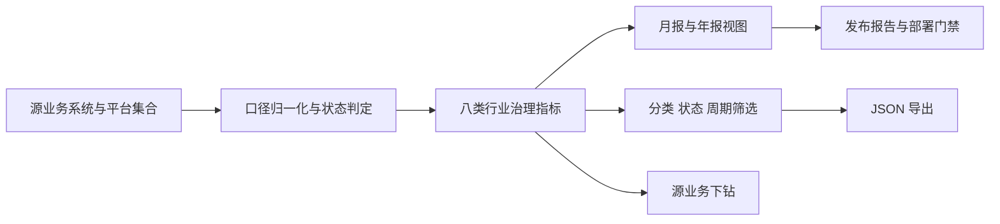

# 二期行业治理指标中心报告

生成日期：2026-07-10

## 一、建设目标

行业治理指标中心面向卫生健康行政部门，将健康体检、发热门诊、疾病报卡、临床辅助、健康档案调阅、预约服务、家庭医生和区域绩效八类监管主题固化为可查询、可筛选、可导出、可下钻的指标目录。

指标中心不替代体检、HIS、EMR、公共卫生、号源、支付、家庭医生或绩效考核源系统，也不替代法定直报。缺少真实数据源时必须显示 `blocked`，不得用演示计数形成正式月报或年报。

## 二、已实现能力

| 能力 | 运行入口 | 验收口径 |
|---|---|---|
| 指标目录 | `health-dashboard.html#industry-governance-indicator-center` | 固化 8 个二期行业治理监管主题 |
| 指标口径 | `indicatorCenter.indicators` | 每项包含定义、分子、分母、当前值、异常数和状态 |
| 数据来源 | `sourceCollections`、`sourceSystems` | 明确平台集合、外部源系统和责任部门 |
| 月报/年报 | `indicatorCenter.periodViews`、`indicator.reports` | 输出月报和年报视图，并标注当前规范化快照边界 |
| 筛选下钻 | 页面分类、状态、周期控件 | 可筛选并回到源业务页面处理异常 |
| 导出 | `导出指标 JSON` | 导出当前筛选结果、报告周期和边界说明 |
| 管理端 API | `GET /api/health-dashboard/industry-governance-indicators` | 仅 `commission` 角色可访问，读取动作进入审计链 |
| 聚合 API | `GET /api/health-dashboard/summary` | 在综合驾驶舱摘要中返回完整 `indicatorCenter` |

## 三、指标范围

| 监管主题 | 责任部门 | 主要来源 | 当前生产边界 |
|---|---|---|---|
| 健康体检覆盖 | 医政医管处、基层卫生处 | 体检系统、居民主索引 | 需接入正式体检记录 |
| 发热门诊报告闭环 | 医政医管处、疾控处 | 发热门诊系统、公共卫生平台 | 需完成事件处置回执 |
| 疾病报卡回执率 | 疾控处、区县信息中心 | HIS/EMR、区县直报平台 | 需接入正式诊断触发和回执 |
| 临床辅助消息回执率 | 医政医管处、质控中心 | 医生工作站、规则中心 | 需接入真实工作站插件回执 |
| 健康档案调阅合规率 | 规划信息处、数据安全岗 | 全民健康信息平台、统一授权 | 需核验统一身份和授权链 |
| 预约订单对账完成率 | 医政医管处、便民服务运营 | 医院号源、支付和医保回调 | 需接入 17 家医院真实号源 |
| 家庭医生履约覆盖率 | 基层卫生处、区县卫健局 | 家庭医生签约、基层公卫 | 需接入真实团队和服务包政策 |
| 区域绩效证据就绪率 | 规划信息处、医政医管处 | 综合监管、医共体绩效、信用评价 | 需确认正式指标版本和签字 |

## 四、数据流



## 五、上线边界

当前指标中心可以用于方案汇报、指标口径确认、联调审查和演示环境监管。正式月报、年报和区域绩效考核仍需补齐事件日期过滤、正式指标版本、源系统签名、机构范围、复核流程和现场签字。

## 六、验收命令

```powershell
npm.cmd run health-dashboard:summary
npm.cmd run release:report
npm.cmd run release:manifest
npm.cmd run deploy:check
npm.cmd test
```
