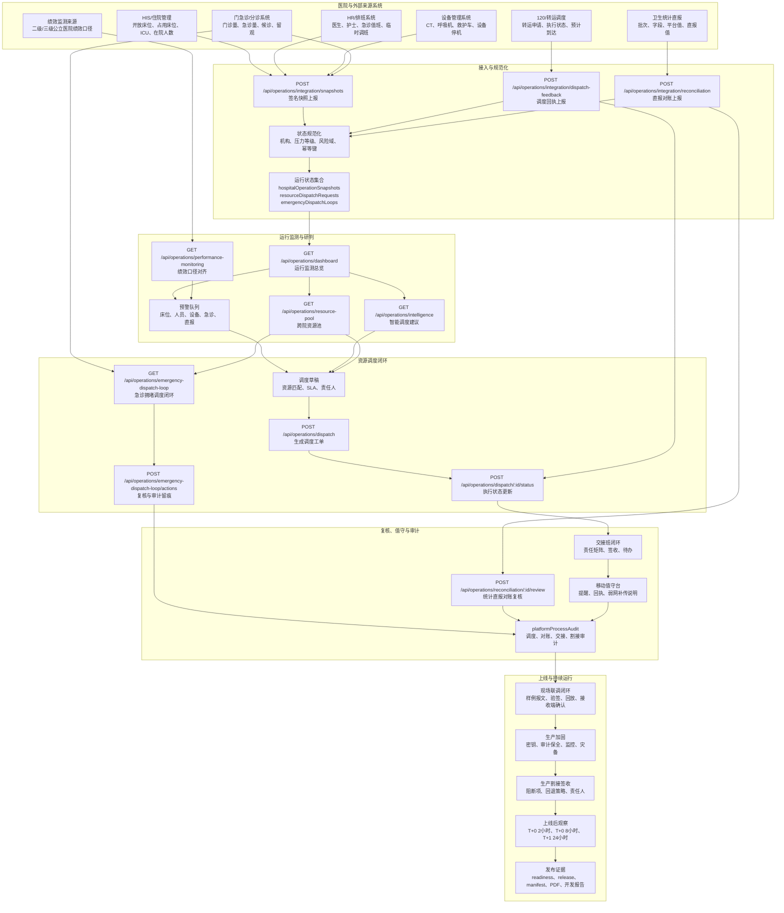
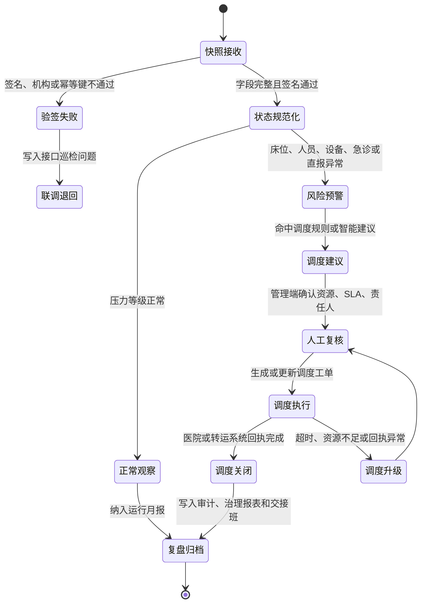
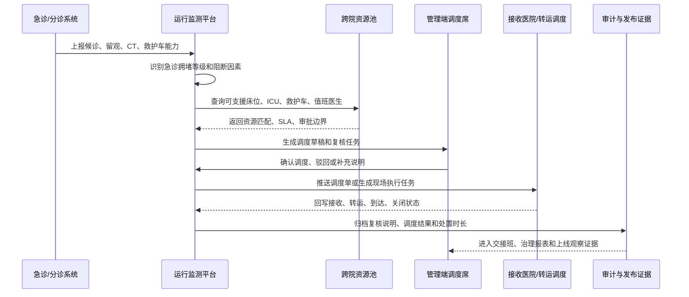
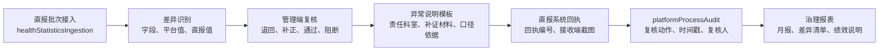
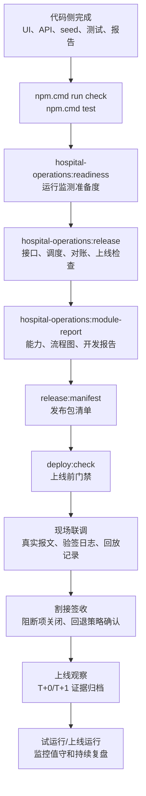

# 医院运行监测平台完整流程图

更新时间：2026-07-08

本文用于说明医院运行监测与资源调度平台从数据接入、运行监测、预警研判、资源调度、复核对账、审计归档到上线观察的完整业务流程。流程图中的接口和数据集合均已接入现有模块证据链，生产上线仍需现场真实系统完成报文、验签、回放、接收端确认和签收归档。

## 1. 端到端业务总流程

## 2. 运行监测状态流转

## 3. 急诊拥堵调度闭环

## 4. 统计直报对账复核流程

## 5. 上线验收与现场联调流程

## 6. 现场交付边界

| 边界 | 代码侧已完成 | 现场仍需完成 |
|---|---|---|
| 数据接入 | 签名接入 API、状态规范化、演示数据集合 | 真实 HIS/住院、HR、设备、急诊、统计直报报文 |
| 资源调度 | 调度工单、跨院资源池、急诊拥堵闭环 | 跨院协议、转运责任、接收医院签收、120 回执 |
| 对账复核 | 差异批次、复核动作、异常说明、审计留痕 | 直报系统回执、补正材料、统计办公室签收 |
| 上线运行 | 加固清单、割接签收、上线后观察、发布证据 | 正式密钥、统一身份、监控/SIEM、灾备演练、现场签字 |
