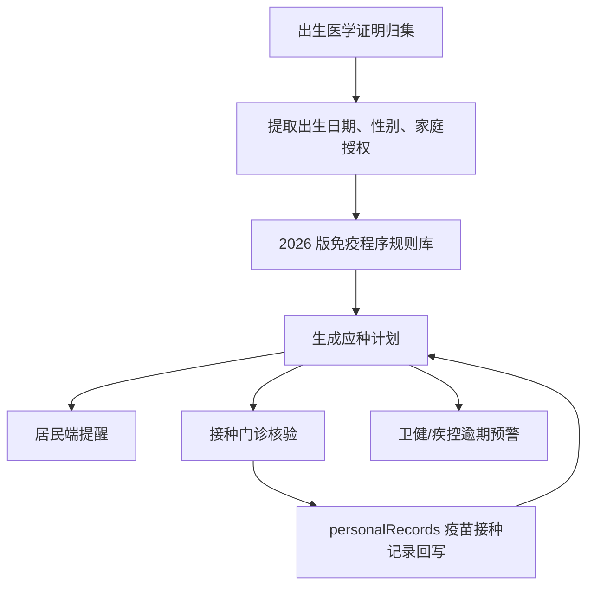

# 国家免疫规划疫苗儿童免疫程序系统说明

## 政策依据

- 《国家免疫规划疫苗儿童免疫程序及说明（2026年版）》，2026 年 6 月。

## 系统落点

- 规则库：`immunization-schedule.js` 固化 2026 版免疫程序、剂次、年龄、接种途径、剂量、补种和特殊健康状态提醒。
- 业务入口：`immunization.html` 可从出生医学证明生成儿童应种计划，支持卫健管理端、医疗机构端和居民端使用。
- 妇幼接续：出生医学证明归集后，居民端“出生人口健康管理”自动展示下一剂次、逾期未种和 30 天内到期提醒。
- 监管看板：卫健管理端“妇幼健康管理”统计接种计划覆盖、逾期未种和到期提醒，用于疾控与妇幼协同。
- 特殊健康状态：页面可切换早产/低体重、HBsAg 阳性或不详且体重小于 2000g、HIV 暴露/感染、免疫功能异常和血液制品使用等状态，生成禁种、暂缓、接种单位评估和特殊程序提醒。
- 发布证据：`scripts/immunization-readiness.js` 输出 `release/immunization-readiness-report.json` 和 `release/immunization-readiness-report.md`。

## 2026 版程序覆盖

| 疫苗 | 程序 | 系统口径 |
| --- | --- | --- |
| 乙肝疫苗 HepB | 出生、1 月龄、6 月龄 | 第 1 剂提示出生后 24 小时内完成；HBsAg 阳性或不详母亲所生新生儿纳入特殊提醒 |
| 卡介苗 BCG | 出生时 | 提示小于 3 月龄完成，HIV 暴露儿童需确认状态 |
| 脊灰疫苗 IPV/bOPV | 2、3、4 月龄和 4 周岁 | 默认先 IPV 后 bOPV，补种需保证 2 次含 II 型脊灰疫苗免疫史 |
| 百白破 DTaP | 2、4、6、18 月龄和 6 周岁 | 补种时前 3 剂间隔不小于 28 天，后续按最小间隔提醒 |
| 麻腮风 MMR | 8、18 月龄 | 作为注射类减毒活疫苗参与 28 天间隔提醒 |
| 乙脑 JE | 减毒 8 月龄、2 周岁；灭活 8 月龄两剂、2 周岁、6 周岁 | 系统默认减毒程序，并保留灭活替代规则 |
| 流脑 MPSV | A 群 6、9 月龄；A+C 群 3、6 周岁 | 系统提示 A 群与 A+C 群剂次间隔规则 |
| 甲肝 HepA | 减毒 18 月龄；灭活 18 月龄、2 周岁 | 系统默认减毒程序，并保留灭活替代规则 |
| 双价 HPV 2vHPV | 13 周岁女孩两剂 | 第 1 剂小于 14 周岁完成，第 2 剂 6 个月后、12 个月内完成 |

## 特殊健康状态规则

| 状态 | 系统提醒 |
| --- | --- |
| HBsAg 阳性或不详母亲所生且体重小于 2000g | 出生后尽早接种第 1 剂乙肝疫苗，满 1、2、7 月龄再完成 3 剂次；卡介苗需结合胎龄和医学稳定性评估。 |
| HIV 感染母亲所生且感染状况不详 | 卡介苗暂缓；脊灰减毒、乙脑减毒、甲肝减毒禁止；麻腮风需先确认是否严重免疫抑制。 |
| HIV 感染且有症状或严重免疫抑制 | 卡介苗、脊灰减毒、乙脑减毒、甲肝减毒和麻腮风禁止；非减毒活疫苗无特殊禁忌。 |
| 免疫功能异常 | 非减毒活疫苗原则可接种，减毒活疫苗需结合免疫功能和临床状态评估。 |
| 使用含免疫球蛋白血液制品 | 非减毒活疫苗、卡介苗和口服减毒活疫苗无间隔限制；除卡介苗外的注射类减毒活疫苗需间隔至少 3 个月。 |

## 数据与权限

- 数据来源：`birthCertificates` 提供儿童姓名、性别和出生日期；`personalRecords.category === "vaccines"` 提供既往接种记录。
- 权限边界：居民端仅按家庭成员授权查看接种计划；管理端只做统计、预警和协同；医疗机构端负责接种门诊或妇幼机构核验。
- 生产依赖：需对接疾控免疫规划信息系统、接种单位预约系统、疫苗库存和异常反应监测。

## 流程

