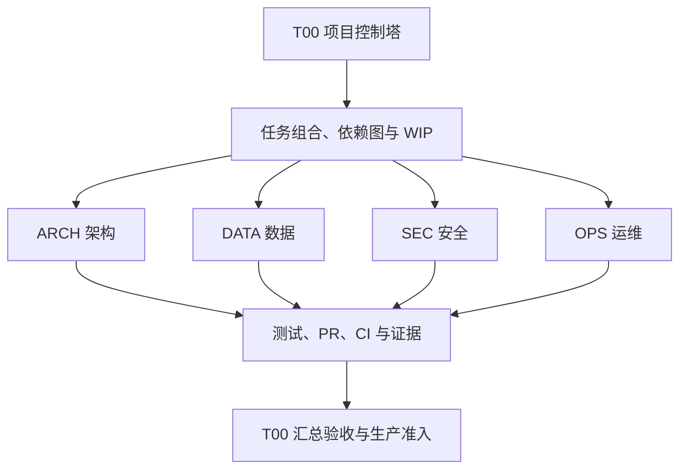

# 平台全生命周期治理工作流

## 1. 权威边界

### GOV-006 四路并行开发 WIP 与写范围登记 PLAN

- 来源：用户于 2026-09-09 要求继续四路同步开发；T00 已批准本轮中风险控制塔登记 PLAN。
- 目标：以一个中央治理任务关闭已验收的 GOV-005，同时正式登记影像、居民和体检三条互不重叠的实施线，使依赖、WIP、验收和生产边界可机器检查。
- 范围：仅修改生命周期总账、本规范和 `ROADMAP.md` 当前事实；不修改三条领域线业务文件，不代替各领域独立 worktree、测试、评审、PR 或 CI。
- 验收：GOV-005 绑定已合并 PR #277 与 CI run 34233229053 的非生产证据后关闭；OPS-020 至 OPS-024、TEST-010 与 TEST-011 均有唯一编号、owner、依赖、精确写范围、测试和回滚；OPS-023、OPS-024 与 TEST-011 获批后，GOV-006、OPS-022、OPS-023、OPS-024 与 TEST-011 使组合 WIP 达到 5/5，且没有范围冲突，释放前不得再登记新在制任务。
- 测试：生命周期定向测试、文档事实漂移、只读 handoff、T00 process verify 和本 Draft PR 的 required CI。
- 回滚：整体回退本登记补丁；不删除或回退领域分支代码、业务数据、历史 PR 或 CI 证据。
- 放行边界：GOV-006 当前位于 Draft PR #280，在合并和 required CI 归档前保持实施中；三条领域线仍需各自验收。任何仓库结果都不改变六域生产 `NO-GO`。

### TEST-010 区域运营 E2E 静态 fixture PLAN

- 来源与审批：主线定时 Lifecycle gates run 34271928551 的在线根 E2E 为 59/60，唯一失败位于 `test/e2e/product-regional-operations-trusted-rendering.spec.js`；T00 将其纳入已批准低风险任务包。
- 范围：仅修改该 Playwright spec，把偶发的 `route.fetch` 回源替换为完整脱敏静态 fixture 的 `route.fulfill`；不修改业务路由、timeout、retry、workflow、生产数据或运行时。
- 验收：目标场景 `repeat-each=20` 稳定通过；真实 productization route 单元测试继续验证服务端行为；在线根 Playwright 60 项全部通过且测试清单不漂移。
- 回滚：回退该测试文件单一提交，恢复原 fixture；不修改业务数据或生产证据。
- 集成结果：PR #282 已合并，required CI run 34310567775 九项通过并完成独立审查；TEST-010 已关闭并达到“已集成”。该测试证据不等于生产证据，六域继续 `NO-GO`。

### TEST-011 挂号跨端认证与导航就绪等待 PLAN

- 来源与审批：CI run 34311363398 在 `test/e2e/roles.spec.js` 报告 `authFetch` 未定义；URL 已匹配但 `auth.js` 尚未执行。T00 于 2026-09-09 将本修复纳入低风险批准任务包。
- 范围：仅修改 `test/e2e/roles.spec.js`，等待页面既有 `data-auth-resolved=allowed` 与 `data-navigation-shell=ready` 标记后再调用 `authFetch`；不修改生产代码、认证协议、timeout、retry 或 workflow。
- 验收：延迟 auth 脚本时仍等待真实认证和导航就绪；不使用固定 sleep 或放宽 timeout；挂号跨端定向场景及在线根 Playwright 60 项通过。
- 回滚：回退该测试文件单一提交，恢复原等待；不修改业务数据、认证状态或生产证据。
- 放行边界：任务当前为已批准/未建设，实施须使用登记 worktree 和 branch，完成后仍需独立评审、Draft PR 与 required CI；生产继续 `NO-GO`。

### OPS-020 影像质控恢复指引 PLAN

- 来源与审批：T06 基于已合并的影像质控对账计划提出最小兼容切片；T00 于 2026-09-09 以中风险 PLAN 批准，范围仅限 `imaging-cloud.js` 和 `test/imaging-dashboard-route-characterization.test.js`。
- 目标：unknown、本地提交失败、严格状态读取失败或当前视图未找到时，只提示刷新、核对和升级，不能暗示外部动作已经完成或资源不存在。
- 验收：保留 POST→GET、相同资源写锁和全部请求语义；失败路径不新增 POST、不使用演示回退、不泄露 provider 或内部错误；特征测试覆盖七类恢复场景。PR #278 已合并，required CI run 34308801123 九项通过，OPS-020 已关闭并达到“已集成”。
- 回滚：合并前关闭 #278；合并后回退该 PR 单一提交并重跑影像专项及 required CI。无 schema 或数据迁移。
- 非目标：不实施耐久 command/outbox、幂等/CAS、机构范围、migration、worker 或 FHIR 回读。`docs/adr/2026-09-07-imaging-quality-control-durable-reconciliation.md` 仍为 Proposed，生产继续 `NO-GO`。
- 证据边界：#278/CI 只证明本次恢复指引仓库集成；耐久、可观测性和现场缺口继续由 OPS-015、OPS-018 及 Proposed ADR 跟踪，不构成生产证据。

### OPS-021 居民评价弹窗会话隔离 PLAN

- 来源与审批：T04 复现居民评价 A 会话请求迟到后关闭、重置或污染 B 会话的问题；T00 于 2026-09-09 批准中风险前端兼容修复。
- 范围：仅 `citizen-service-feedback.js`、`test/citizen-service-feedback.test.js` 和 `test/e2e/citizen-service-feedback.spec.js`；不修改 API、schema、服务端授权、投诉 SLA 或服务端状态机。
- 验收：关闭 A 并打开 B 后，A 的迟到成功、失败或原生 close 事件不得影响 B；同会话提交中不得并行重复请求；失败保留当前草稿、使用固定脱敏提示并允许按既有命令语义重试。
- 测试与回滚：定向单元和居民 E2E 先复现失败，再验证会话隔离、重复提交、失败重试、file 模式和 XSS 边界；回退单一前端/测试提交，不删除评价、投诉、消息、回执或审计。
- 集成结果：PR #279 已合并，required CI run 34309613178 九项通过并完成独立审查；OPS-021 已关闭并达到“已集成”。该证据仅证明本次浏览器会话隔离，投诉独立工单、SLA、升级、结案、多实例 exactly-once 和现场验收继续由 OPS-017 跟踪，生产仍为 `NO-GO`。

### OPS-023 居民取消待确认展示纠正 PLAN

- 来源与审批：T04 发现居民端将 `cancel-requested` 或“取消待确认”误当成已取消，导致待处理事项从需关注计数中消失；T00 于 2026-09-09 将其纳入低风险批准任务包。
- 范围：仅 `citizen-service-feedback.js`、`test/citizen-service-feedback.test.js` 和 `test/e2e/citizen-service-feedback.spec.js`；只精确识别既有两种待确认状态，不修改 API、领域状态机、schema、取消命令或服务端事实。
- 验收：两种待确认来源均显示待处理 warn 并计入需关注；真正取消与完成终态保持现有显示和计数；先补两来源与终态对照 RED，再通过既有弹窗回归和真实页面 E2E。
- 回滚：回退三文件单一提交并重跑居民单元与 E2E；不修改或删除服务订单、取消请求、评价、投诉、消息或审计数据。
- 放行边界：任务当前为已批准/未建设，实施须使用登记 worktree 和 branch，完成后仍需独立评审、Draft PR 与 required CI；生产继续 `NO-GO`。

### OPS-022 体检异常操作陈旧卡片锁定 PLAN

- 来源与审批：T06 复现异常处置 POST 成功、随后 GET 刷新失败时旧快照动作仍可点击的问题；T00 于 2026-09-09 批准中风险前端兼容修复。
- 范围：仅 `physical-examination.js` 与 `test/e2e/physical-examination-trusted-rendering.spec.js`；不改变 API method/path、服务端状态机、幂等/CAS、schema、审计或中央治理文件。
- 验收：POST 成功而刷新失败时保留最后成功快照，将对应卡片标为陈旧并禁用全部动作；再次点击不产生第二次 POST；后续有效 GET 重新渲染最新快照并恢复允许操作；POST 本身失败保持既有重试语义。
- 测试与回滚：在现有单一体检 E2E 内覆盖 200→502、稳定脱敏提示、旧快照锁定、零重复 POST 与有效 GET 恢复；回退两文件单一提交，不回退或删除服务端体检事实。
- 放行边界：任务保持实施中；服务端多实例 exactly-once、完整可观测性和现场验收仍由既有高风险缺口跟踪，生产继续 `NO-GO`。

### OPS-024 影像质控响应完整性与关联校验 PLAN

- 来源与审批：真实 VM 复现坏 JSON 的 200 响应被连续两次显示成功并产生重复 POST；T00 于 2026-09-09 批准本中风险现有响应承诺校验 PLAN。
- 范围：仅 `imaging-cloud.js` 和 `test/imaging-dashboard-route-characterization.test.js`；不修改服务端 API、FHIR 协议字段、schema、migration、领域状态机或 worker。
- 验收：坏 JSON、null、数组、空对象、study/review 错关联及同步资源 ID 缺失、非法或不一致均不得进入成功；所有 202 保持 unknown 锁且不自动 GET 或重发；完整合法且关联一致的 200 保留原成功行为。
- 测试与回滚：先以真实脚本特征测试覆盖响应形状、关联、资源 ID、202 与合法 200 对照，再运行影像专项；回退两文件单一提交，无数据迁移或外部补偿。
- 放行边界：任务当前为已批准/未建设；只验证现有服务端承诺，不新增 FHIR 字段要求。耐久 command/outbox、provider 协议、worker 与现场证据继续由 OPS-015、OPS-018 和 Proposed ADR 跟踪，生产保持 `NO-GO`。

### GOV-005 生命周期地图反向覆盖与技术债编号治理 PLAN

- 来源：用户于 2026-09-08 批准中风险 T00 PLAN；T00 负责本轮治理修复。
- 目标：让六图差距映射由任务状态反向约束，并使技术债表编号唯一且不与生命周期任务编号同号异义。
- 范围：仅修改生命周期配置/脚本/测试、文档事实漂移脚本/测试、`TECH_DEBT.md`、`ROADMAP.md` 与本规范；不修改业务运行时、API、数据或部署。
- 规则：任一 `taskStatus != 已关闭`、能力低于“已集成”或 `unresolved` 非空的任务必须至少映射一张图；完全闭合任务不得保留陈旧映射。技术债表 ID 必须唯一，且不得与生命周期 task ID 或当前受管 Markdown 中的其他治理定义产生语义冲突；扫描仅识别表格首列、治理条目和标题位置，避免把普通业务示例当作治理编号。
- 验收：OPS-019 按已合并 PR #275 与 CI run 34228860692 闭合但只登记非生产证据；OPS-016 保留 #258/#263/#268 完整 PR/CI 链并删除已闭合的 GOV-003 缺口；正向治理检查及缺失、陈旧、重复映射和编号冲突负向测试均通过。
- 测试：生命周期与文档事实漂移定向测试、quick、architecture 和 process verify，并由本 Draft PR 的 required CI 继续验证。
- 回滚：整体回退本治理补丁，恢复旧任务总账与文档；不删除业务数据或历史证据，也不改变六域生产 `NO-GO`。
- 集成结果：PR #277 已合并至主线，required CI run 34233229053 九项通过；该证据仅证明仓库集成，GOV-005 已关闭但不构成生产证据。

### GOV-004 流程优化 PLAN

- 来源：用户于 2026-09-08 明确要求优化当前开发流程；T00 负责本次中风险治理修复。
- 目标：列出待核对的集成收尾、依赖交接和能力缺口；堵住目录/子文件双写及混合变更遗漏测试的漏洞。
- 范围：本规范、生命周期脚本及其测试、任务总账。复用当前状态和证据字段，不增加业务运行时、数据库或外部依赖。
- 验收：只读交接报告不修改状态、不推断 PR 已合并；前置依赖、审批、写范围和 WIP 均显示具体阻断；父子目录冲突失败关闭；任一未分类文件触发全量单元回退。
- 测试：生命周期负向与只读测试、quick 门禁、架构及仓库治理检查，并由 PR 的必需 CI 验证集成。
- 回滚：回退本次治理补丁；保留既有业务数据、任务证据和所有生产准入要求。

### OPS-019 PWA v63 缓存失效 PLAN

- 来源：OPS-017 居民评价投诉资产已由 PR #272 集成；已安装 PWA 必须以新缓存命名原子获取对应脚本。
- Owner：T04 负责居民端能力，T00 负责 Service Worker 受保护路径集成；本轮使用已批准低风险任务包。
- 范围：仅将居民应用壳缓存从 v62 升至 v63，更新 PWA 浏览器契约及六图中的当前缓存事实；不修改 API、评价投诉状态机、业务数据或历史 ADR。
- 验收：新 Worker 安装后缓存含 `citizen-service-feedback.js`；激活时删除 v62 和另一更早缓存并且只保留 v63；离线导航、API 不缓存、源快照 404 边界继续通过。
- 测试：`npm run test:e2e:pwa`、架构/事实漂移检查、quick 门禁、T00 ownership 校验和 required CI。
- 回滚：回退本任务合并提交及 v63 测试期望；不得删除业务数据。回滚会重新暴露新旧居民脚本混装风险，因此只能在停止静态发布并确认客户端版本策略后执行。
- 已知边界：仓库测试不等于真实 HTTPS、设备/浏览器策略或现场缓存升级验收；生产继续 NO-GO。

T00 是项目控制塔，只负责需求接入、任务组合、依赖排序、WIP、风险汇总、证据核对和放行结论。领域实现必须使用独立任务编号、process worktree、分支、PLAN、PR 和验收记录。T00 不以一个长期“大任务”承载领域代码。

机器事实源是 `config/lifecycle-governance.json`，可执行检查是 `npm run governance:lifecycle`。业务运行待办仍由既有平台待办中心管理，不与研发任务总账混用。



## 2. 十二步闭环

1. T00 接收需求、缺口或监管控制。
2. 记录业务价值、来源、风险等级和数据敏感等级。
3. 在六张地图状态层登记当前基线、目标状态、差距任务和验收证据。
4. 创建独立任务编号，声明 owner、前置依赖、受影响模块和写范围。
5. 编写 PLAN、验收标准、测试策略、可观测性交付和回滚方案。
6. 按风险审批：候选和待批准任务可先登记但不得实施；低风险进入批准任务包；中风险由 T00 审批 PLAN；高风险需要 Accepted ADR、人工评审和专项验证。任务进入“已批准”或后续在制状态时，审批模式必须与风险级别精确匹配。
7. 从最新 `origin/main` 创建独立 process worktree；不得在 T00 工作项中夹带其他领域代码。
8. 先补失败测试、契约或架构适应性规则。
9. 实施最小补丁；同一核心写范围同时只能有一个在制任务。
10. 依据变更影响运行 quick、PR、nightly 或 release 门禁。
11. 创建单主题 PR，完成 review、CI 和证据归档。
12. 合并后更新任务总账、六图状态、风险、ADR 和生产准入矩阵；仓库完成不能自动晋级生产。

任何门禁失败都退回最近的安全阶段。未关闭的高风险任务不得扩散到下游，组合 WIP 上限为 5，建议保持 3 至 5 项。

## 2A. 每轮交付与合并后的交接

每轮开始、PR 合并后及控制塔恢复运行时，执行：

```powershell
node scripts/lifecycle-governance.js handoff
```

命令先验证总账，再派生三份只读清单，不访问 GitHub、不改文件、不自动批准或关闭任务：

| 清单 | 责任人与下一步 |
|---|---|
| `integrationReview` | 集成责任人核对 PR 是否实际合并、合并提交是否在主线、对应提交的必需 CI 是否全部成功；报告中的 PR/CI 引用仅为核对入口 |
| `dependencyReview` | Owner 核对未关闭依赖、风险审批、其他在制任务的重叠写范围、WIP 余量和未解决事项；无已知阻断也只是交接候选 |
| `capabilityFollowups` | Owner 为已关闭任务剩余的能力和可观测性缺口登记后续任务、责任人、验收标准；能力状态继续按真实证据保留 |

集成责任人应在合并后的同一轮交付中完成一次总账收尾 PR：更新 PR/CI 证据，关闭已验收的代码切片，核对后续依赖并释放写范围。网络失败或中断时保留待核对状态；恢复后先重查远端事实，再继续收尾。不得仅凭 PR 链接、分支名、旧提交的绿灯或聊天结论关闭任务。

任务关闭表示本次批准范围已经交付，不自动提高 `capabilityStatus`。缺少完整可观测性、系统场景或现场证据的能力继续保留原状态；后续任务应在 `unresolved` 中引用，避免缺口在任务关闭时消失。只有能力验收证据完整后才能晋升为“已验证”，生产准入仍单独执行。

低风险批准包内的后续工作，在依赖和写范围经 T00 核对释放后继续执行，不重复请求同一范围的方向批准。高风险审批、尚未满足的外部条件或实质范围变化继续按原规则处理。

写范围按仓库相对路径匹配，目录包含其子文件；统一识别斜杠、末尾目录标记和大小写别名。同一任务可声明相交范围，不同在制任务的范围不得重叠。相邻但不同的目录不视为冲突。

## 3. 任务与追踪链

任务编号只使用 `ARCH`、`DATA`、`SEC`、`OPS`、`TEST`、`REL` 或 `GOV` 前缀。每项任务必须形成：

```text
需求 → 监管控制 → 风险 → ADR → 任务 → 测试 → 证据
```

必填内容包括来源需求、影响模块、数据敏感等级、风险、验收标准、测试、回滚、未解决事项、前置依赖、写范围、worktree 和分支。高风险任务缺少批准、Accepted ADR、测试或证据时，控制塔检查失败。

能力状态只允许：

```text
未建设 → 已实现 → 已验证 → 已集成 → 准生产 → 已投产
```

“已实现”只说明实现存在；“已验证”需要测试证据；“已集成”还需要 PR 和 CI 证据；“准生产”要求生产准入矩阵全部满足。任何仓库证据都不能替代真实生产证据。

## 4. 六张地图状态层

六张 AS-IS 地图的正文继续陈述事实，状态层统一存放在机器事实源的 `maps` 中，避免在六份长文档中复制并腐化状态。每条地图状态都必须有：当前基线、目标状态、差距任务、验收证据。地图正文和状态层由架构及文档漂移门禁共同约束。

## 5. 四级门禁

| 层级 | 时机 | 标准入口 | 目的 |
|---|---|---|---|
| quick | 每次提交 | `npm run gate:quick` | 影响分析、治理合同、lint、类型和单元测试 |
| PR | 提交 PR | `npm run gate:pr` | build、架构、受影响集成、smoke 和浏览器安全 |
| nightly | 每日 | `npm run gate:nightly` | 全量发现、跨模块回归、E2E 和内部边界覆盖趋势 |
| release | 发布候选 | `npm run gate:release` | 冻结生产范围并执行严格、真实证据驱动的 preflight |

`node scripts/lifecycle-governance.js impact --base=<ref>` 输出受影响模块和所需门禁。未匹配的新路径至少进入 quick 和 PR，不得静默跳过。夜间与手动门禁由 `lifecycle-gates.yml` 执行；release 缺现场信任材料时必须失败并保持 `NO-GO`。

影响分析逐文件列出 `unclassifiedFiles`。同一批既有已分类文件又有未分类文件时，仍执行全量单元回退；同时修改文档不能掩盖未分类代码。已分类改动复用现有影响规则选择测试。测试证据注明提交、命令和结果；同一提交已有成功证据时不重复无关全量测试，出现新改动、冲突、失败或未覆盖风险时补跑对应验证，必需 CI 保持完整。

影响规则中的完整文件名精确匹配，末尾 `/` 表示目录，`.md` 这类扩展名表示后缀，既有 `auth` 规则保留文件名前缀含义。全量单元回退后，仍补跑已选中但不属于 unit 分区的测试；已在 unit 中执行的用例不重复运行。

失败日志只需保留摘要、稳定错误和证据位置，不得把居民数据、凭据、供应商原始载荷或生产秘密写入报告。flaky 测试必须另立稳定任务、owner 和退出日期，不能通过重试把失败改写为通过。

## 6. 系统级黄金场景

控制塔登记 10 条永久系统场景。每条同时覆盖正常、失败、越权和恢复路径，并由涉及领域共同维护。场景登记不等于已经测试；初始状态为“未建设”，只有形成测试与证据后才能逐级晋升。

## 7. 可观测性完成定义

新增生产运行能力的任务必须同时交付结构化日志、指标与告警、分布式追踪、健康检查、SLO/错误预算、故障手册、降级策略和数据补偿方案。纯仓库治理任务可声明不适用及理由；运行时任务不得以“不适用”规避完成定义。

## 8. 生产准入

功能完整性、数据迁移、安全合规、性能容量、灾备恢复和供应商联调六域默认均为 `NO-GO`。每域必须记录当前仓库状态、解除条件、所需外部证据和责任方。只有六域都具备外部生产证据后，任务才可进入“准生产”；最终生产执行仍由现有受保护 promotion、环境审批和现场授权控制。

仓库交付的标准表述是：“仓库交付达到相应状态，生产仍为 NO-GO”。不得使用“全部完成”概括尚需现场执行的迁移、联调、测评、容量或灾备事项。
