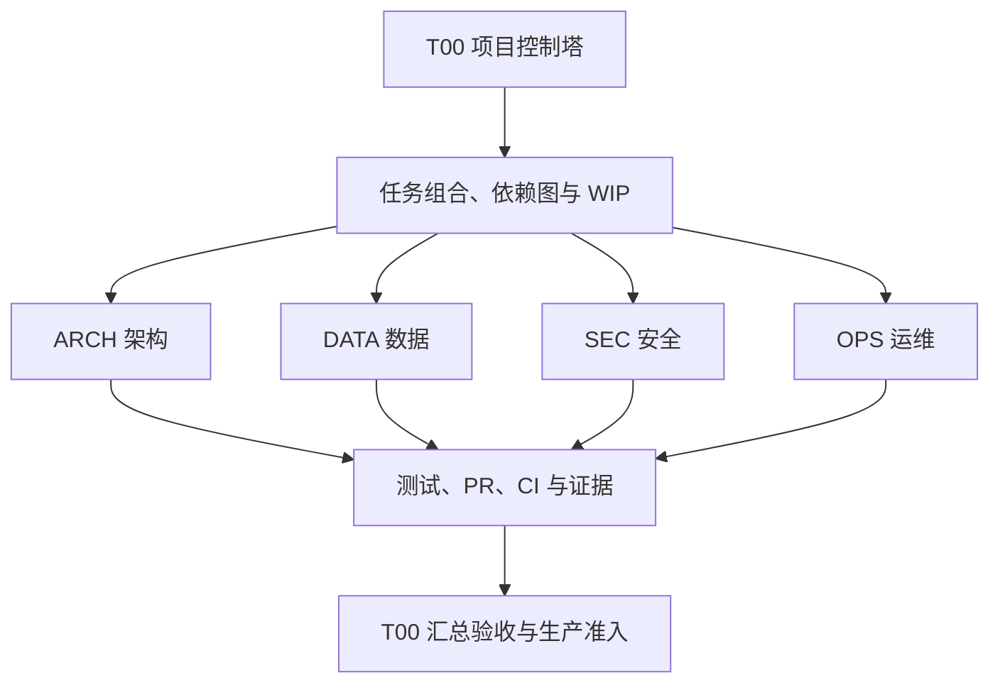

# 平台全生命周期治理工作流

## 1. 权威边界

T00 是项目控制塔，只负责需求接入、任务组合、依赖排序、WIP、风险汇总、证据核对和放行结论。领域实现必须使用独立任务编号、process worktree、分支、PLAN、PR 和验收记录。T00 不以一个长期“大任务”承载领域代码。

机器事实源是 `config/lifecycle-governance.json`，可执行检查是 `npm run governance:lifecycle`。业务运行待办仍由既有平台待办中心管理，不与研发任务总账混用。



## 2. 十二步闭环

1. T00 接收需求、缺口或监管控制。
2. 记录业务价值、来源、风险等级和数据敏感等级。
3. 在六张地图状态层登记当前基线、目标状态、差距任务和验收证据。
4. 创建独立任务编号，声明 owner、前置依赖、受影响模块和写范围。
5. 编写 PLAN、验收标准、测试策略、可观测性交付和回滚方案。
6. 按风险审批：候选和待批准任务可先登记但不得实施；低风险进入批准任务包；中风险由 T00 审批 PLAN；高风险需要 Accepted ADR、人工评审和专项验证。任务进入“已批准”或后续在制状态时，审批模式必须与风险级别精确匹配。
7. 从最新 `origin/main` 创建独立 process worktree；不得在 T00 工作项中夹带其他领域代码。
8. 先补失败测试、契约或架构适应性规则。
9. 实施最小补丁；同一核心写范围同时只能有一个在制任务。
10. 依据变更影响运行 quick、PR、nightly 或 release 门禁。
11. 创建单主题 PR，完成 review、CI 和证据归档。
12. 合并后更新任务总账、六图状态、风险、ADR 和生产准入矩阵；仓库完成不能自动晋级生产。

任何门禁失败都退回最近的安全阶段。未关闭的高风险任务不得扩散到下游，组合 WIP 上限为 5，建议保持 3 至 5 项。

## 3. 任务与追踪链

任务编号只使用 `ARCH`、`DATA`、`SEC`、`OPS`、`TEST`、`REL` 或 `GOV` 前缀。每项任务必须形成：

```text
需求 → 监管控制 → 风险 → ADR → 任务 → 测试 → 证据
```

必填内容包括来源需求、影响模块、数据敏感等级、风险、验收标准、测试、回滚、未解决事项、前置依赖、写范围、worktree 和分支。高风险任务缺少批准、Accepted ADR、测试或证据时，控制塔检查失败。

能力状态只允许：

```text
未建设 → 已实现 → 已验证 → 已集成 → 准生产 → 已投产
```

“已实现”只说明实现存在；“已验证”需要测试证据；“已集成”还需要 PR 和 CI 证据；“准生产”要求生产准入矩阵全部满足。任何仓库证据都不能替代真实生产证据。

## 4. 六张地图状态层

六张 AS-IS 地图的正文继续陈述事实，状态层统一存放在机器事实源的 `maps` 中，避免在六份长文档中复制并腐化状态。每条地图状态都必须有：当前基线、目标状态、差距任务、验收证据。地图正文和状态层由架构及文档漂移门禁共同约束。

## 5. 四级门禁

| 层级 | 时机 | 标准入口 | 目的 |
|---|---|---|---|
| quick | 每次提交 | `npm run gate:quick` | 影响分析、治理合同、lint、类型和单元测试 |
| PR | 提交 PR | `npm run gate:pr` | build、架构、受影响集成、smoke 和浏览器安全 |
| nightly | 每日 | `npm run gate:nightly` | 全量发现、跨模块回归、E2E 和内部边界覆盖趋势 |
| release | 发布候选 | `npm run gate:release` | 冻结生产范围并执行严格、真实证据驱动的 preflight |

`node scripts/lifecycle-governance.js impact --base=<ref>` 输出受影响模块和所需门禁。未匹配的新路径至少进入 quick 和 PR，不得静默跳过。夜间与手动门禁由 `lifecycle-gates.yml` 执行；release 缺现场信任材料时必须失败并保持 `NO-GO`。

失败日志只需保留摘要、稳定错误和证据位置，不得把居民数据、凭据、供应商原始载荷或生产秘密写入报告。flaky 测试必须另立稳定任务、owner 和退出日期，不能通过重试把失败改写为通过。

## 6. 系统级黄金场景

控制塔登记 10 条永久系统场景。每条同时覆盖正常、失败、越权和恢复路径，并由涉及领域共同维护。场景登记不等于已经测试；初始状态为“未建设”，只有形成测试与证据后才能逐级晋升。

## 7. 可观测性完成定义

新增生产运行能力的任务必须同时交付结构化日志、指标与告警、分布式追踪、健康检查、SLO/错误预算、故障手册、降级策略和数据补偿方案。纯仓库治理任务可声明不适用及理由；运行时任务不得以“不适用”规避完成定义。

## 8. 生产准入

功能完整性、数据迁移、安全合规、性能容量、灾备恢复和供应商联调六域默认均为 `NO-GO`。每域必须记录当前仓库状态、解除条件、所需外部证据和责任方。只有六域都具备外部生产证据后，任务才可进入“准生产”；最终生产执行仍由现有受保护 promotion、环境审批和现场授权控制。

仓库交付的标准表述是：“仓库交付达到相应状态，生产仍为 NO-GO”。不得使用“全部完成”概括尚需现场执行的迁移、联调、测评、容量或灾备事项。
