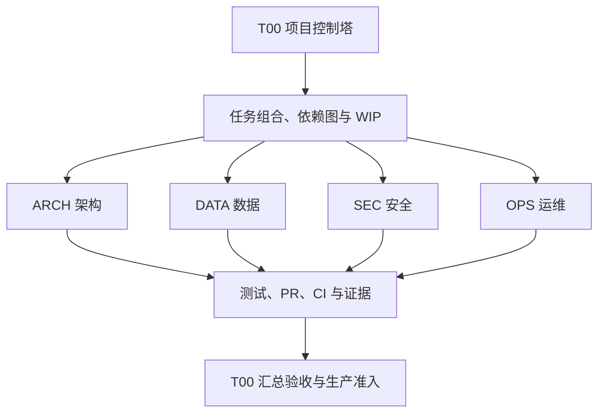

# 平台全生命周期治理工作流

## 1. 权威边界

### GOV-009 浏览器缺口组合 PLAN

- 来源：用户于 2026-09-10 要求继续全部开发。T00 批准本中风险登记及下列四项精确 PLAN；基线 main `3918a79d`。GOV-008 已由 #293 / head `3d856f8f` / CI 34486531706 九项成功、独立无 P0–P2 复审和 legacy 14 批（3332 项、3331 通过、1 本地环境跳过、零失败、退出 0）合并，本次据此正常关闭，不制造递归自证。
- 中央只写总账、本规范及 ROADMAP；实施时 GOV-009 与 OPS-033～OPS-036 共 WIP 5/5；2026-09-11 四领域已独立集成，仅中央 #296 待集成，WIP 1/5。不再扩增本批实施任务。
- OPS-036 / T08：仅 `regional-clinical-documents.js` 与新 `test/regional-clinical-document-retry-session.test.js`。已复现同 event 同步双触发产生两个 POST；既有非金融 retry 不读取客户端幂等键。采用同步 eventId 在途 Set，覆盖 POST 及成功后 GET 刷新，重绘持续禁用同事件，finally 释放当前视图；进入 handler 重验 API 来源、总 action 及当前 exception action，fallback/撤权/移除/旧按钮拒绝，不误锁不同 event。失败不自动重发、不改业务计数，未知提交结果提示核对，不鼓励盲目重试。测试真实 handler/render/委托、pending 重绘、失败释放、成功后刷新锁、GET 失败 fallback 禁止补传及合法路径。非目标：服务端幂等、跨 tab/刷新后 exactly-once、未知结果耐久对账、PDF、通用 load 乱序；这些能力继续未证明。
- OPS-033 / T06：仅 `imaging-cloud.js`、`test/imaging-dashboard-route-characterization.test.js`。已复现 A/B 读取乱序使筛选 B 显示 A、旧失败回流演示及质控状态读取覆盖新筛选。采用共享 dashboard read generation 和居民/机构绑定；在线 pending 失效旧快照并清除动作，最新 HTTP/网络/JSON/最小结构失败明确不可用，禁止演示回流，file 兼容保留；迟到响应不覆盖状态或提示。保留质控对账锁、恢复指引及现有命令语义，不修改 productionCenter、OHIF、API/schema、中央文件或 Proposed durable ADR。
- OPS-034 / T06：仅 `physical-examination.js`、`test/e2e/physical-examination-trusted-rendering.spec.js`。现有服务端 verify/reject 仅 commission，页面却向 institution 显示。仅 commission 且未核验提交时显示这两个按钮，保留 institution 合法 update-check/submit；既有 E2E 内加角色矩阵步骤并保护 XSS、快照及分流回归，不变套件拓扑。不是服务端授权模型变更，不混入跨机构投影问题。
- OPS-035 / T09：T00 核定本次跨域共享浏览器工具的单 writer，仅 `domain-task-ui.js` 与新 `test/domain-task-ui-refresh.test.js`，五个领域调用方不修改。已复现提交成功后 GET 403 被 load 吞掉、随后报保存并刷新成功。load 返回显式结果但不向现有调用方新抛异常；提交失败不刷新；已保存但刷新失败保留清空错误态并明确刷新核对，不误导重复提交。覆盖 HTTP/网络/rows/normalize 失败、双成功、空列表和手工恢复；不扩展并发去重、查询排序、API、幂等或角色模型。
- 验收：各线先 RED 再 GREEN、完整真实脚本或浏览器行为回归、相关调用方/领域/安全及 process 门禁，独立 review、legacy 和最终 head CI 后由 T00 串行集成。新测试提交前登记已有可执行基线，随后绑定实际专项路径。标准 build/lint/type/unit/integration/smoke 可由最终 CI 提供精确证据，legacy 不省略。
- 回滚：各域独立 revert；中央整体回退登记，不删除业务数据或历史证据。无 migration、新依赖或生产激活。
- 非目标：居民三条新后端 POST 继续归 OPS-017，跨域归属/资源授权/幂等审计需独立 ADR 和人工评审；GS-01～GS-10、运行观测、生产六域 NO-GO 均保持，不将本批等同全平台完成。

#### GOV-009 四路集成证据（2026-09-11）

| 任务 | PR | 最终 head | 成功 CI run | main 合并提交 |
|---|---|---|---|---|
| OPS-035 共享工作台 | #297 | 2721a2d7771c3fc4546d3466c86c5f8aa798235d | 34489286669 | d9cc12579111c60e616e94e066cca24549227b64 |
| OPS-036 文书补传 | #298 | 30ea33ce4c637b5489de09509fa574106dfd9b86 | 34496981872 | 7706024c29d7f67d7175ef6151d277d8ecbeea35 |
| OPS-034 体检控件 | #300 | a117470eacc13273283a78ba67b7bbfb5c1f788e | 34502407255 | bf79f0429c2e03719f3fad75927f666452688f82 |
| OPS-033 影像快照 | #299 | d5088db216a3e0f33feac097c568068bd504f600 | 34504010391 | 9e651ef623bfcf4613eee06529098b6e3ce1a4b1 |

- 四项最终 CI 各九项成功，独立评审无未解决 P0–P2；无冲突重基逐文件 blob 零漂移后复用原完整验证与评审，并补窄测和新 strict CI。四领域 legacy 均 14 批退出 0；本地真实 PostgreSQL 环境跳过不计通过，由各自最终 CI 真实 PostgreSQL 合同补证。
- 评审闭环：OPS-036 修复渲染异常逃出 finally 导致事件锁残留，回归验证先释放锁再重绘及后续恢复；OPS-033 修复居民切换后手机标题/副标题残留旧检查信息，真实浏览器验证 pending、错误、空成功清理及正常恢复。两项均先 RED 再 GREEN，并由独立增量复审关闭。
- 影像最终串行 legacy 为 3343 项、3342 通过、1 环境跳过、零失败；首次并行尝试曾出现监测日志 path-swap 断言失败，原始失败记录保留，孤立专项 10/10 和串行全量随后通过。未将首次失败抹去，也未据此断言其根因已解决。unit 的 466、integration 的 66 是测试文件数，不是断言数。
- Windows CRLF 原始字节预算失败仅通过独立工作树 citizen.js 的 LF 机械规范化处理，Git blob 始终为 `81185db19ff16b1f84fe0326a2e938f3e3b53388`；不改预算或 Git 配置。失败记录及最终重跑结果分开保存，换行预算可移植性仍属候选问题。
- 中央 GOV-009 保持待集成/已验证，仅引用已执行本地合同，不引用未来自身 CI；最终独立评审、legacy 及 exact-head CI 齐备后才合并 #296。领域修复不关闭系统黄金场景、生产运行观测、后端幂等、耐久对账或现场准入。

### GOV-008 下一批缺口组合 PLAN

- 来源：用户于 2026-09-09 再次要求继续开发。T00 批准本中风险登记及下列四项精确 PLAN，基线 main `8e400c4c`。GOV-007 已由 #286 / head `a409bfb4` / CI 34339809407 九项成功及 14 批 legacy 退出 0、独立复审完成仓库集成，本次正常登记据此关闭，不创建递归自证任务。
- 中央只修改总账、本规范和 ROADMAP。实施时 GOV-008 与 OPS-029～OPS-032 的 WIP 为 5/5；2026-09-10 四领域均已独立集成，只剩 GOV-008 待集成，WIP 1/5。其他候选排队，未获独立批准不得实施。
- OPS-030 / T01：仅 `platform-identity-governance-ui.js` 与 `test/platform-identity-governance-ui.test.js`。按 document 使用 WeakMap controller 持有最新 accounts/policy，从该 document 当前控件读取筛选；按实际控件 WeakSet 去重，保留 dataset 兼容观察但不以其为唯一绑定权威。覆盖 first→second 后 query/role/全部状态筛选、删除/停用不复活、双 document 隔离、多次 render 监听器不增长、替换控件与恶意字段惰性文本、缺 target 返回 null。保持 buildView、排序、摘要、空态、返回 schema 和 productionReady=false；不改 platform 调用方、服务端身份/授权/OIDC/SMS/session/API/schema。
- OPS-029 / T04：仅 `citizen.js`、新 `test/citizen-care-workspace-session.test.js`、`test/e2e/citizen-records-v1.spec.js`。六入口分别冻结居民/资源及 renderCitizen 单调视图代次；合法迟到回执只合并发起居民既有缓存并标记其同步，reset/render/toast 仅同代次当前视图可用。覆盖六命令×r1→r2/ABA×成功/失败 24 组、当前视图对照、错居民/资源回执拒绝、在线不写 localStorage 和 file 兼容。只改客户端隔离，不补运行路由中未检出的访问确认、异议和照护任务处置三个 POST；这些正向测试为模拟回执的客户端证据，接口能力缺口另留 OPS-017。不改 URL、幂等协议、服务端授权/schema 或同步 GET 治理。
- OPS-031 / T02：仅 `health-dashboard.js` 和新 `test/health-dashboard-static-summary.test.js`。真实全脚本 VM 复现 20 条待办被截为 12、后八条高风险漏计。全量未闭合源事项用于应用和总计汇总，再单独截 12 条预览；保留排序、riskDrilldowns 8 条、辖区预览与 closureTrend 口径、任务分类、闭合判定及 API 正常路径。覆盖 0/12/20、第二应用在第 13 条后、闭合项排除、缺数组、排序变化与源数据不可变；不修改 API/schema/DOM sinks。
- OPS-032 / T06 quality：仅 `quality-safety.js` 和 `test/quality-safety-trusted-rendering.test.js`。已复现 GET 403 后筛选复活旧数据且旧按钮仍 POST（未宣称服务端越权成功）。dashboard 失败清空动态快照及更新时间，用明确错误态而非零或旧统计；筛选/重置不可复活，十类相关动作无有效快照时不 POST。interfacePack 失败清空包和 validationResult、禁样例校验；任一 GET 明确 401/403 同时废弃两缓存及读取世代，十一类写入口失效。迟到成功/失败不得覆盖更新状态，后续各自有效重取才恢复对应入口；不改角色映射、服务端授权、临床规则或 POST 结果协议。
- 验收：四线先 RED 后 GREEN，以真实完整 controller/renderer 测试失败、迟到响应、正常与恶意输入；相关专项、页面、安全、process、diff、legacy test:all、独立 review 和最终 head CI 均满足后交 T00 串行集成。新测试提交前只引用已有可执行回归基线，不冒充已存在的新行为证据。
- 回滚：每项独立 revert，无数据迁移，不回退服务端业务事实。生产六域 NO-GO、GS 系统证据映射和上位运行能力缺口继续保留；T08 文书重试等剩余候选仍排队，不将本批等同全平台完成。

#### GOV-008 四路集成证据（2026-09-10）

| 任务 | PR | 最终 head | 成功 CI run | main 合并提交 |
|---|---|---|---|---|
| OPS-031 驾驶舱 | #291 | da2d7d5f89d38760cd84c28e7479653e3efef354 | 34342944573 | 7f26147c98f80ea60ba1fbf1c91202c9d1435125 |
| OPS-032 质量快照 | #292 | 35aa1de421d4335c6100fad4ec7ee15edf30c3c6 | 34344396358 | 412bbabd052a0d2ee2041fe4ef09d090ddaa6b61 |
| OPS-030 账号筛选 | #295 | 2e08ae143c6a8e01dd4b543b4650e9e464d099e1 | 34345586932 | 6de353382c361108bcbb7db75543de1198e3d476 |
| OPS-029 居民会话 | #294 | 0c71038a0ebe5ef6f07c525666ed60be9de900aa | 34347104698 | 7bd15793cf79ef57fb6b45f2f9631e09faab21e1 |

- 四项最终 CI 各九项成功，独立评审无未解决 P0–P2。各领域 legacy 均 14 批退出 0；本地真实 PostgreSQL 环境跳过不计通过，由相应 CI 真实 PostgreSQL 合同补证。无冲突重基逐文件 blob 零漂移后复用原 legacy/评审，同时补窄测和新 strict CI。
- 居民线补充修复并验证 GET 刷新替换缓存后的迟到回执合并，资源已消失时不伪造同步成功；最终 legacy 为 3283 项、3282 通过、1 环境跳过。真实浏览器保留原四用例并加入隔离步骤，在线根 60、居民 13、PWA 3 的清单未改变。
- Windows 重基后的居民源文件 CRLF 原始字节数触发预算；仅将该工作树文件规范化为 LF 后通过，三个 Git blob 均未变化。未改预算或 Git 配置；原始字节预算的跨平台换行可移植性仍为候选问题。
- 中央 #293 只将四领域的已合并事实记入总账；GOV-008 自身保留待集成及本地合同证据，最终独立评审、legacy 和 exact-head CI 完成前不得关闭，不引用未来自身 CI。
- 三条访问确认、异议、照护任务处置 POST 缺失仍归 OPS-017；模拟回执仅证明客户端隔离，不证明后端鉴权、持久化或业务闭环。GS-01～GS-10 系统证据映射及六域生产 NO-GO 均不变。

### GOV-007 全平台缺口组合 PLAN

- 来源与批准：用户于 2026-09-09 要求继续全平台缺口开发；T00 批准中风险治理登记与以下四项现有浏览器兼容修复。基线为 main `7fe6882b`，main CI 34325866200 已成功。
- 中央范围仅总账、本规范和 ROADMAP；GOV-006 已由 PR #280 合并，最终 head `13327891` 的 CI 34324353339 成功，合并提交 `7fe6882b` 已在主线。本次正常登记据此关闭 GOV-006，不使用本任务自身未来证据。
- 本批实施时 WIP 为 GOV-007 与 OPS-025～OPS-028 共 5 项；四领域现已独立集成并关闭，只剩 GOV-007 待集成，WIP 1/5。四项仅覆盖下表范围，不改变 API、schema、服务端授权、临床规则、金融协议、worker 或生产激活。

| 任务 / Owner | 唯一写范围 | 验收 |
|---|---|---|
| OPS-025 / T03 | public-health-supervision.js；test/public-health-supervision-ui.test.js | 创建检查任务 pending 单 POST；同草稿同载荷未知重试同键，变更载荷不得复用已绑定键，新操作新键，失败保留输入；不得按载荷合并合法独立检查 |
| OPS-026 / T06 emergency | emergency-lifechain-ui.js；test/emergency-lifechain-ui-response-behavior.test.js | 建立和撤销授权只接受现有合法成功投影；坏 JSON、坏 2xx 不报成功、不自动重发；保留正常 201/200、取消确认和可信渲染 |
| OPS-027 / T06 blood | blood.js；test/blood-online-failure-behavior.test.js | queryTrace 与 submitBloodRequest 在线 HTTP/JSON/网络失败不得回退为本地核验通过或 LOCAL-DEMO；未知写需核对，不提示安全重提；保留合法在线及 file 演示 |
| OPS-028 / T07 | medical-payment.js；test/medical-payment-one-stop-ui.test.js | 仅支付创建同草稿同载荷重试同键、pending 单 POST、变更载荷不复用绑定键、新操作新键、坏响应不误报；退款不在范围 |

- 证据：卫监真实页面/API client 双击产生不同键，route harness 产生两任务；支付页面重提换键而现有路由仅按键去重，不构成真实 provider 重复扣款证据。急救及血液只读审计发现解析/在线异常进入成功分支。以上是待修复事实，不是完成证据。
- 测试：四领域均先补真实脚本负向回归再实施，现已登记急救与血液新增测试的实际路径。专项、页面/安全、process/diff、legacy test:all、独立 review 与 exact-head required CI 均通过；无冲突重基比对两文件 blob 不变并补窄测及新 strict CI，不重复无关本地全量。
- 集成证据：OPS-026 为 PR #287 / head `77ff300d` / CI 34332249997 / merge `b1241d6d`；OPS-027 为 #289 / `cc06c9fe` / 34336251802 / `72ae0760`；OPS-028 为 #288 / `23e2cbd0` / 34337368379 / `b2db5c67`；OPS-025 为 #290 / `71ccfe83` / 34338508417 / `8f003bbe`。四项均已关闭、已集成，各自 CI 九项全绿，重基后组合专项 91/91。legacy 均 14 批退出 0，显式环境跳过不计通过；支付日志确认 1 项本地真实 PostgreSQL 测试跳过，由对应 CI 真实 PostgreSQL 合同补证。
- 中央集成：GOV-007 已通过最终 head `a409bfb4` 独立复审、CI 34339809407 九项及 14 批 legacy 退出 0，经 PR #286 合并为 `8e400c4c`，本次正常总账更新关闭。黄金场景、运行治理和现场生产边界不随浏览器修复关闭。
- 回滚：每领域独立 revert，不回退服务端业务事实；中央整体回退登记提交，不删除领域证据。无 migration。
- 候选队列（不占 WIP、不授权实施）：T01 身份筛选旧快照、T02 驾驶舱统计被预览截断、T04 居民照护命令回执错会话归属、T06 质量拒绝刷新后旧授权快照/影像查询乱序/体检角色控件、T08 文书重复补传、T09 共享 DomainTaskUI 刷新失败误报。共享写范围须单独核定，T05 服务端证据链变化须另行决策。
- 覆盖边界：本轮候选池来自九域及五临床子域的有界审计，不是全平台穷尽证明；363 写接口、324 端点证明缺口和浏览器风险 inventory 不等于已确认缺陷数量。GS-01～GS-10 的系统证据映射审计尚未完成，继续未建设，不把零散测试冒充系统级验收。六域生产始终 NO-GO。

### GOV-006 四路并行开发 WIP 与写范围登记 PLAN

- 来源：用户于 2026-09-09 要求继续四路同步开发；T00 已批准本轮中风险控制塔登记 PLAN。
- 目标：以一个中央治理任务关闭已验收的 GOV-005，同时正式登记影像、居民和体检三条互不重叠的实施线，使依赖、WIP、验收和生产边界可机器检查。
- 范围：仅修改生命周期总账、本规范和 `ROADMAP.md` 当前事实；不修改三条领域线业务文件，不代替各领域独立 worktree、测试、评审、PR 或 CI。
- 验收：GOV-005 已绑定 PR #277/CI run 34233229053 关闭；OPS-020 至 OPS-024、TEST-010 与 TEST-011 均有唯一编号、owner、依赖、精确写范围、测试、回滚及非生产证据。末批 OPS-022/OPS-023/OPS-024/TEST-011 分别由 PR #281/#283/#285/#284 集成后，仅 GOV-006 保持待集成，组合 WIP 降为 1/5 且没有范围冲突。
- 测试：本地执行生命周期定向测试、文档事实漂移、只读 handoff、T00 process verify、所有权/治理检查及 CI 未覆盖的 legacy `test:all`；最终 head 的 required CI 分别提供 unit/integration、lint/typecheck、smoke 与 build 证据，不把依赖 PR 的证据冒充为 GOV-006 自身集成证据。
- 回滚：整体回退本登记补丁；不删除或回退领域分支代码、业务数据、历史 PR 或 CI 证据。
- 集成结果：GOV-006 已由 PR #280 合并；最终 head `13327891` 的 required CI 34324353339 成功，合并提交 `7fe6882b` 已在主线。独立评审与本地证据已完成，现关闭并标记已集成；任何仓库结果都不改变六域生产 `NO-GO`。

### TEST-010 区域运营 E2E 静态 fixture PLAN

- 来源与审批：主线定时 Lifecycle gates run 34271928551 的在线根 E2E 为 59/60，唯一失败位于 `test/e2e/product-regional-operations-trusted-rendering.spec.js`；T00 将其纳入已批准低风险任务包。
- 范围：仅修改该 Playwright spec，把偶发的 `route.fetch` 回源替换为完整脱敏静态 fixture 的 `route.fulfill`；不修改业务路由、timeout、retry、workflow、生产数据或运行时。
- 验收：目标场景 `repeat-each=20` 稳定通过；真实 productization route 单元测试继续验证服务端行为；在线根 Playwright 60 项全部通过且测试清单不漂移。
- 回滚：回退该测试文件单一提交，恢复原 fixture；不修改业务数据或生产证据。
- 集成结果：PR #282 已合并，required CI run 34310567775 九项通过并完成独立审查；TEST-010 已关闭并达到“已集成”。该测试证据不等于生产证据，六域继续 `NO-GO`。

### TEST-011 挂号跨端认证与导航就绪等待 PLAN

- 来源与审批：CI run 34311363398 在 `test/e2e/roles.spec.js` 报告 `authFetch` 未定义；URL 已匹配但 `auth.js` 尚未执行。T00 于 2026-09-09 将本修复纳入低风险批准任务包。
- 范围：仅修改 `test/e2e/roles.spec.js`，等待页面既有 `data-auth-resolved=allowed` 与 `data-navigation-shell=ready` 标记后再调用 `authFetch`；不修改生产代码、认证协议、timeout、retry 或 workflow。
- 验收：延迟 auth 脚本时仍等待真实认证和导航就绪；不使用固定 sleep 或放宽 timeout；挂号跨端定向场景及在线根 Playwright 60 项通过。
- 回滚：回退该测试文件单一提交，恢复原等待；不修改业务数据、认证状态或生产证据。
- 集成结果：PR #284 已合并，最终 head `8db2faa9` 的 required CI run 34321272742 九项通过；独立 rebase delta 核验确认仍为原一文件两行就绪等待修复，定向 1/1、在线根 60/60、legacy 14 批零失败及 unit/build/lint/typecheck/process 均通过。TEST-011 已关闭并达到“已集成”，但证据仅属于仓库测试稳定性，生产继续 `NO-GO`。

### OPS-020 影像质控恢复指引 PLAN

- 来源与审批：T06 基于已合并的影像质控对账计划提出最小兼容切片；T00 于 2026-09-09 以中风险 PLAN 批准，范围仅限 `imaging-cloud.js` 和 `test/imaging-dashboard-route-characterization.test.js`。
- 目标：unknown、本地提交失败、严格状态读取失败或当前视图未找到时，只提示刷新、核对和升级，不能暗示外部动作已经完成或资源不存在。
- 验收：保留 POST→GET、相同资源写锁和全部请求语义；失败路径不新增 POST、不使用演示回退、不泄露 provider 或内部错误；特征测试覆盖七类恢复场景。PR #278 已合并，required CI run 34308801123 九项通过，OPS-020 已关闭并达到“已集成”。
- 回滚：合并前关闭 #278；合并后回退该 PR 单一提交并重跑影像专项及 required CI。无 schema 或数据迁移。
- 非目标：不实施耐久 command/outbox、幂等/CAS、机构范围、migration、worker 或 FHIR 回读。`docs/adr/2026-09-07-imaging-quality-control-durable-reconciliation.md` 仍为 Proposed，生产继续 `NO-GO`。
- 证据边界：#278/CI 只证明本次恢复指引仓库集成；耐久、可观测性和现场缺口继续由 OPS-015、OPS-018 及 Proposed ADR 跟踪，不构成生产证据。

### OPS-021 居民评价弹窗会话隔离 PLAN

- 来源与审批：T04 复现居民评价 A 会话请求迟到后关闭、重置或污染 B 会话的问题；T00 于 2026-09-09 批准中风险前端兼容修复。
- 范围：仅 `citizen-service-feedback.js`、`test/citizen-service-feedback.test.js` 和 `test/e2e/citizen-service-feedback.spec.js`；不修改 API、schema、服务端授权、投诉 SLA 或服务端状态机。
- 验收：关闭 A 并打开 B 后，A 的迟到成功、失败或原生 close 事件不得影响 B；同会话提交中不得并行重复请求；失败保留当前草稿、使用固定脱敏提示并允许按既有命令语义重试。
- 测试与回滚：定向单元和居民 E2E 先复现失败，再验证会话隔离、重复提交、失败重试、file 模式和 XSS 边界；回退单一前端/测试提交，不删除评价、投诉、消息、回执或审计。
- 集成结果：PR #279 已合并，required CI run 34309613178 九项通过并完成独立审查；OPS-021 已关闭并达到“已集成”。该证据仅证明本次浏览器会话隔离，投诉独立工单、SLA、升级、结案、多实例 exactly-once 和现场验收继续由 OPS-017 跟踪，生产仍为 `NO-GO`。

### OPS-023 居民取消待确认展示纠正 PLAN

- 来源与审批：T04 发现居民端将 `cancel-requested` 或“取消待确认”误当成已取消，导致待处理事项从需关注计数中消失；T00 于 2026-09-09 将其纳入低风险批准任务包。
- 范围：仅 `citizen-service-feedback.js`、`test/citizen-service-feedback.test.js` 和 `test/e2e/citizen-service-feedback.spec.js`；只精确识别既有两种待确认状态，不修改 API、领域状态机、schema、取消命令或服务端事实。
- 验收：两种待确认来源均显示待处理 warn 并计入需关注；真正取消与完成终态保持现有显示和计数；先补两来源与终态对照 RED，再通过既有弹窗回归和真实页面 E2E。
- 回滚：回退三文件单一提交并重跑居民单元与 E2E；不修改或删除服务订单、取消请求、评价、投诉、消息或审计数据。
- 集成结果：PR #283 已合并，最终 head `4aee44e9` 的 required CI run 34316616188 九项通过且独立评审无 blocker；本地 legacy `test:all` 共 14 批 3135 项通过、1 项环境跳过、零失败，unit 462 与 integration 66 项通过。OPS-023 已关闭并达到“已集成”；更广的居民服务运行治理继续由 OPS-017 跟踪，生产继续 `NO-GO`。

### OPS-022 体检异常操作陈旧卡片锁定 PLAN

- 来源与审批：T06 复现异常处置 POST 成功、随后 GET 刷新失败时旧快照动作仍可点击的问题；T00 于 2026-09-09 批准中风险前端兼容修复。
- 范围：仅 `physical-examination.js` 与 `test/e2e/physical-examination-trusted-rendering.spec.js`；不改变 API method/path、服务端状态机、幂等/CAS、schema、审计或中央治理文件。
- 验收：request ordering 只允许 last-applied 结果更新当前 resident+year；ABA 切换中的 superseded 请求不得误报成功或回滚 overview。POST 已应用、待确认、失败三态保持安全语义；刷新失败时锁定最后成功快照且零重复 POST，有效 GET 仅恢复当前 resident+year 的允许动作。
- 测试与回滚：在现有单一体检 E2E 内覆盖排序、ABA、三态、200→502、稳定脱敏提示、旧快照锁定、零重复 POST 与有效 GET 恢复；回退两文件单一提交，不回退或删除服务端体检事实。
- 集成结果：PR #281 已合并，最终 head `401f0ee0` 的 required CI run 34322391949 九项通过；独立复审核验 rebase 两文件零内容漂移，定向 1/1、体检子域 40/40、套件 21/21、legacy 14/14 批零失败且 1 项环境跳过。OPS-022 已关闭并达到“已集成”，仅缓释 RISK-OPS-022；服务端幂等/CAS、多实例 exactly-once、可观测性和现场验收仍由 OPS-016 等上位缺口跟踪，生产继续 `NO-GO`。

### OPS-024 影像质控响应完整性与关联校验 PLAN

- 来源与审批：真实 VM 复现坏 JSON 的 200 响应被连续两次显示成功并产生重复 POST；T00 于 2026-09-09 批准本中风险现有响应承诺校验 PLAN。
- 范围：仅 `imaging-cloud.js` 和 `test/imaging-dashboard-route-characterization.test.js`；不修改服务端 API、FHIR 协议字段、schema、migration、领域状态机或 worker。
- 验收：坏 JSON、null、数组、空对象、study/review 错关联及同步资源 ID 缺失、非法或不一致均不得进入成功；所有 202 保持 unknown 锁且不自动 GET 或重发；完整合法且关联一致的 200 保留原成功行为。
- 测试与回滚：先以真实脚本特征测试覆盖响应形状、关联、资源 ID、202 与合法 200 对照，再运行影像专项；回退两文件单一提交，无数据迁移或外部补偿。
- 集成结果：PR #285 已合并，最终 head `35cc2c67` 的 required CI run 34320210182 九项通过；独立评审无 blocker，rebase 后两文件零内容漂移，目标特征测试 52/52、process/diff 通过，旧 head 的 legacy 14 批零失败且 1 项既有环境跳过。OPS-024 已关闭并达到“已集成”，仅缓释 RISK-OPS-024；耐久 command/outbox、provider 协议、worker、可观测性和现场证据继续由 OPS-015、OPS-018 与 Proposed ADR 跟踪，生产保持 `NO-GO`。

### GOV-005 生命周期地图反向覆盖与技术债编号治理 PLAN

- 来源：用户于 2026-09-08 批准中风险 T00 PLAN；T00 负责本轮治理修复。
- 目标：让六图差距映射由任务状态反向约束，并使技术债表编号唯一且不与生命周期任务编号同号异义。
- 范围：仅修改生命周期配置/脚本/测试、文档事实漂移脚本/测试、`TECH_DEBT.md`、`ROADMAP.md` 与本规范；不修改业务运行时、API、数据或部署。
- 规则：任一 `taskStatus != 已关闭`、能力低于“已集成”或 `unresolved` 非空的任务必须至少映射一张图；完全闭合任务不得保留陈旧映射。技术债表 ID 必须唯一，且不得与生命周期 task ID 或当前受管 Markdown 中的其他治理定义产生语义冲突；扫描仅识别表格首列、治理条目和标题位置，避免把普通业务示例当作治理编号。
- 验收：OPS-019 按已合并 PR #275 与 CI run 34228860692 闭合但只登记非生产证据；OPS-016 保留 #258/#263/#268 完整 PR/CI 链并删除已闭合的 GOV-003 缺口；正向治理检查及缺失、陈旧、重复映射和编号冲突负向测试均通过。
- 测试：生命周期与文档事实漂移定向测试、quick、architecture 和 process verify，并由本 Draft PR 的 required CI 继续验证。
- 回滚：整体回退本治理补丁，恢复旧任务总账与文档；不删除业务数据或历史证据，也不改变六域生产 `NO-GO`。
- 集成结果：PR #277 已合并至主线，required CI run 34233229053 九项通过；该证据仅证明仓库集成，GOV-005 已关闭但不构成生产证据。

### GOV-004 流程优化 PLAN

- 来源：用户于 2026-09-08 明确要求优化当前开发流程；T00 负责本次中风险治理修复。
- 目标：列出待核对的集成收尾、依赖交接和能力缺口；堵住目录/子文件双写及混合变更遗漏测试的漏洞。
- 范围：本规范、生命周期脚本及其测试、任务总账。复用当前状态和证据字段，不增加业务运行时、数据库或外部依赖。
- 验收：只读交接报告不修改状态、不推断 PR 已合并；前置依赖、审批、写范围和 WIP 均显示具体阻断；父子目录冲突失败关闭；任一未分类文件触发全量单元回退。
- 测试：生命周期负向与只读测试、quick 门禁、架构及仓库治理检查，并由 PR 的必需 CI 验证集成。
- 回滚：回退本次治理补丁；保留既有业务数据、任务证据和所有生产准入要求。

### OPS-019 PWA v63 缓存失效 PLAN

- 来源：OPS-017 居民评价投诉资产已由 PR #272 集成；已安装 PWA 必须以新缓存命名原子获取对应脚本。
- Owner：T04 负责居民端能力，T00 负责 Service Worker 受保护路径集成；本轮使用已批准低风险任务包。
- 范围：仅将居民应用壳缓存从 v62 升至 v63，更新 PWA 浏览器契约及六图中的当前缓存事实；不修改 API、评价投诉状态机、业务数据或历史 ADR。
- 验收：新 Worker 安装后缓存含 `citizen-service-feedback.js`；激活时删除 v62 和另一更早缓存并且只保留 v63；离线导航、API 不缓存、源快照 404 边界继续通过。
- 测试：`npm run test:e2e:pwa`、架构/事实漂移检查、quick 门禁、T00 ownership 校验和 required CI。
- 回滚：回退本任务合并提交及 v63 测试期望；不得删除业务数据。回滚会重新暴露新旧居民脚本混装风险，因此只能在停止静态发布并确认客户端版本策略后执行。
- 已知边界：仓库测试不等于真实 HTTPS、设备/浏览器策略或现场缓存升级验收；生产继续 NO-GO。

T00 是项目控制塔，只负责需求接入、任务组合、依赖排序、WIP、风险汇总、证据核对和放行结论。领域实现必须使用独立任务编号、process worktree、分支、PLAN、PR 和验收记录。T00 不以一个长期“大任务”承载领域代码。

机器事实源是 `config/lifecycle-governance.json`，可执行检查是 `npm run governance:lifecycle`。业务运行待办仍由既有平台待办中心管理，不与研发任务总账混用。



## 2. 十二步闭环

1. T00 接收需求、缺口或监管控制。
2. 记录业务价值、来源、风险等级和数据敏感等级。
3. 在六张地图状态层登记当前基线、目标状态、差距任务和验收证据。
4. 创建独立任务编号，声明 owner、前置依赖、受影响模块和写范围。
5. 编写 PLAN、验收标准、测试策略、可观测性交付和回滚方案。
6. 按风险审批：候选和待批准任务可先登记但不得实施；低风险进入批准任务包；中风险由 T00 审批 PLAN；高风险需要 Accepted ADR、人工评审和专项验证。任务进入“已批准”或后续在制状态时，审批模式必须与风险级别精确匹配。
7. 从最新 `origin/main` 创建独立 process worktree；不得在 T00 工作项中夹带其他领域代码。
8. 先补失败测试、契约或架构适应性规则。
9. 实施最小补丁；同一核心写范围同时只能有一个在制任务。
10. 依据变更影响运行 quick、PR、nightly 或 release 门禁。
11. 创建单主题 PR，完成 review、CI 和证据归档。
12. 合并后更新任务总账、六图状态、风险、ADR 和生产准入矩阵；仓库完成不能自动晋级生产。

任何门禁失败都退回最近的安全阶段。未关闭的高风险任务不得扩散到下游，组合 WIP 上限为 5，建议保持 3 至 5 项。

## 2A. 每轮交付与合并后的交接

每轮开始、PR 合并后及控制塔恢复运行时，执行：

```powershell
node scripts/lifecycle-governance.js handoff
```

命令先验证总账，再派生三份只读清单，不访问 GitHub、不改文件、不自动批准或关闭任务：

| 清单 | 责任人与下一步 |
|---|---|
| `integrationReview` | 集成责任人核对 PR 是否实际合并、合并提交是否在主线、对应提交的必需 CI 是否全部成功；报告中的 PR/CI 引用仅为核对入口 |
| `dependencyReview` | Owner 核对未关闭依赖、风险审批、其他在制任务的重叠写范围、WIP 余量和未解决事项；无已知阻断也只是交接候选 |
| `capabilityFollowups` | Owner 为已关闭任务剩余的能力和可观测性缺口登记后续任务、责任人、验收标准；能力状态继续按真实证据保留 |

集成责任人应在合并后的同一轮交付中完成一次总账收尾 PR：更新 PR/CI 证据，关闭已验收的代码切片，核对后续依赖并释放写范围。网络失败或中断时保留待核对状态；恢复后先重查远端事实，再继续收尾。不得仅凭 PR 链接、分支名、旧提交的绿灯或聊天结论关闭任务。

任务关闭表示本次批准范围已经交付，不自动提高 `capabilityStatus`。缺少完整可观测性、系统场景或现场证据的能力继续保留原状态；后续任务应在 `unresolved` 中引用，避免缺口在任务关闭时消失。只有能力验收证据完整后才能晋升为“已验证”，生产准入仍单独执行。

低风险批准包内的后续工作，在依赖和写范围经 T00 核对释放后继续执行，不重复请求同一范围的方向批准。高风险审批、尚未满足的外部条件或实质范围变化继续按原规则处理。

写范围按仓库相对路径匹配，目录包含其子文件；统一识别斜杠、末尾目录标记和大小写别名。同一任务可声明相交范围，不同在制任务的范围不得重叠。相邻但不同的目录不视为冲突。

## 3. 任务与追踪链

任务编号只使用 `ARCH`、`DATA`、`SEC`、`OPS`、`TEST`、`REL` 或 `GOV` 前缀。每项任务必须形成：

```text
需求 → 监管控制 → 风险 → ADR → 任务 → 测试 → 证据
```

必填内容包括来源需求、影响模块、数据敏感等级、风险、验收标准、测试、回滚、未解决事项、前置依赖、写范围、worktree 和分支。高风险任务缺少批准、Accepted ADR、测试或证据时，控制塔检查失败。

能力状态只允许：

```text
未建设 → 已实现 → 已验证 → 已集成 → 准生产 → 已投产
```

“已实现”只说明实现存在；“已验证”需要测试证据；“已集成”还需要 PR 和 CI 证据；“准生产”要求生产准入矩阵全部满足。任何仓库证据都不能替代真实生产证据。

## 4. 六张地图状态层

六张 AS-IS 地图的正文继续陈述事实，状态层统一存放在机器事实源的 `maps` 中，避免在六份长文档中复制并腐化状态。每条地图状态都必须有：当前基线、目标状态、差距任务、验收证据。地图正文和状态层由架构及文档漂移门禁共同约束。

## 5. 四级门禁

| 层级 | 时机 | 标准入口 | 目的 |
|---|---|---|---|
| quick | 每次提交 | `npm run gate:quick` | 影响分析、治理合同、lint、类型和单元测试 |
| PR | 提交 PR | `npm run gate:pr` | build、架构、受影响集成、smoke 和浏览器安全 |
| nightly | 每日 | `npm run gate:nightly` | 全量发现、跨模块回归、E2E 和内部边界覆盖趋势 |
| release | 发布候选 | `npm run gate:release` | 冻结生产范围并执行严格、真实证据驱动的 preflight |

`node scripts/lifecycle-governance.js impact --base=<ref>` 输出受影响模块和所需门禁。未匹配的新路径至少进入 quick 和 PR，不得静默跳过。夜间与手动门禁由 `lifecycle-gates.yml` 执行；release 缺现场信任材料时必须失败并保持 `NO-GO`。

影响分析逐文件列出 `unclassifiedFiles`。同一批既有已分类文件又有未分类文件时，仍执行全量单元回退；同时修改文档不能掩盖未分类代码。已分类改动复用现有影响规则选择测试。测试证据注明提交、命令和结果；同一提交已有成功证据时不重复无关全量测试，出现新改动、冲突、失败或未覆盖风险时补跑对应验证，必需 CI 保持完整。

影响规则中的完整文件名精确匹配，末尾 `/` 表示目录，`.md` 这类扩展名表示后缀，既有 `auth` 规则保留文件名前缀含义。全量单元回退后，仍补跑已选中但不属于 unit 分区的测试；已在 unit 中执行的用例不重复运行。

失败日志只需保留摘要、稳定错误和证据位置，不得把居民数据、凭据、供应商原始载荷或生产秘密写入报告。flaky 测试必须另立稳定任务、owner 和退出日期，不能通过重试把失败改写为通过。

## 6. 系统级黄金场景

控制塔登记 10 条永久系统场景。每条同时覆盖正常、失败、越权和恢复路径，并由涉及领域共同维护。场景登记不等于已经测试；初始状态为“未建设”，只有形成测试与证据后才能逐级晋升。

## 7. 可观测性完成定义

新增生产运行能力的任务必须同时交付结构化日志、指标与告警、分布式追踪、健康检查、SLO/错误预算、故障手册、降级策略和数据补偿方案。纯仓库治理任务可声明不适用及理由；运行时任务不得以“不适用”规避完成定义。

## 8. 生产准入

功能完整性、数据迁移、安全合规、性能容量、灾备恢复和供应商联调六域默认均为 `NO-GO`。每域必须记录当前仓库状态、解除条件、所需外部证据和责任方。只有六域都具备外部生产证据后，任务才可进入“准生产”；最终生产执行仍由现有受保护 promotion、环境审批和现场授权控制。

仓库交付的标准表述是：“仓库交付达到相应状态，生产仍为 NO-GO”。不得使用“全部完成”概括尚需现场执行的迁移、联调、测评、容量或灾备事项。
