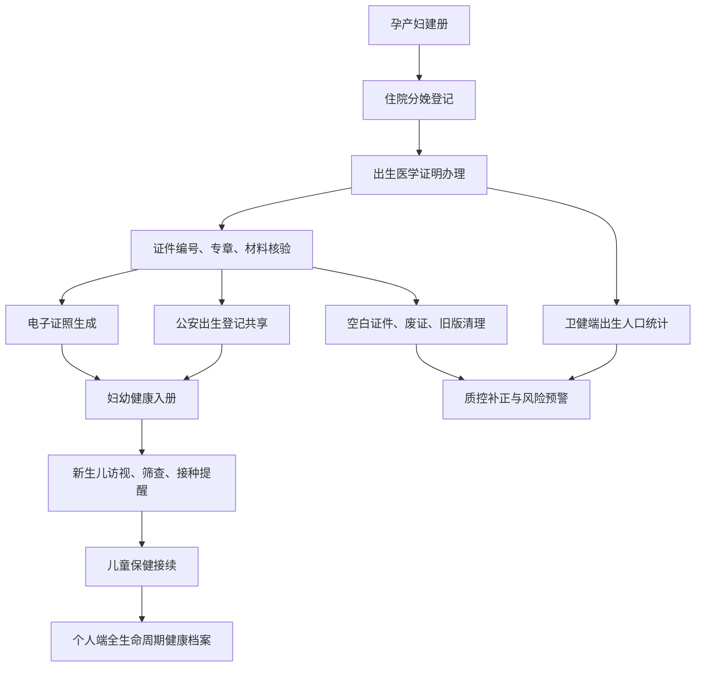

# 妇幼健康与出生医学证明政策说明

## 政策依据

- 国家卫生健康委官网公开的《卫生部关于进一步加强出生医学证明管理的通知》（卫妇社发〔2009〕96 号，公开页面发布日期 2021-01-20）。
- 国家卫生健康委办公厅、公安部办公厅《关于启用出生医学证明（第七版）的通知》（国卫办妇幼发〔2023〕4 号，发布时间 2023-03-28，文件日期 2023-03-24）。

## 关键政策要求到系统功能的映射

| 政策要求 | 系统落点 | 当前实现 |
| --- | --- | --- |
| 《出生医学证明》是法定医学证明文书，也是出生登记的重要依据 | 证件状态、编号、父母身份、新生儿信息和公安共享字段必须可追溯 | `birthCertificates`、`birthStatistics`、`/api/birth-certificates` |
| 签发包括首次签发、换发和补发 | 医疗机构端表单必须区分办理类型，并保留材料核验和签发记录 | `institution.html` 出生医学证明办理、签发、上报入册 |
| 具有助产技术服务资质的医疗保健机构直接办理本机构内出生新生儿首次签发 | 机构端是出生证明办理的业务入口，卫健端负责监管和统计 | `institution.js` 登记与签发动作、`index.html` 监管视图 |
| 证件和印章由专人管理，废证需登记、控制和销毁 | 数据模型需覆盖空白证件、废证、配发、旧版清理和质控补正 | `birthCertificateDocuments`、`birthStatistics`、出生人口统计卡片 |
| 存根和相关资料按首次签发、换发、补发分类归档，永久保存 | 形成电子证照、材料核验、审计日志和档案留痕 | `electronicLicenseStatus`、`qualityCheck`、`securityEvents` |
| 签发过程掌握的公民个人信息应保密 | 按角色、居民授权和家庭关系返回最小数据集 | `/api/state` 居民端过滤、出生证明 API 权限测试 |
| 第七版出生医学证明自 2023 年 4 月 1 日启用，第六版签发截至 2023 年 3 月 31 日 | 证件版本、旧版清理、季度配发和废证处置应纳入管理端说明 | `certificateVersion`、`birthCertificateDocuments`、妇幼 About 页 |
| 空白证件申领和监管由卫生健康行政部门负责，按年度、季度计划申领 | 卫健管理端需要统计证件配发、申领计划、验收回执和废证率 | 当前已建模，真实上线需对接省级证件管理流程 |

## 三端说明

### 卫健管理端

- 汇总出生医学证明、出生人口统计、电子证照、公安共享、妇幼入册和质控补正。
- 形成低体重儿、待访视、未共享、未入册、筛查待确认和废证管理预警。
- 不替代医疗机构源业务系统，负责监督、统计、质控和跨部门协同。

### 医疗机构端

- 办理出生医学证明首次签发、换发、补发。
- 记录母亲居民主索引、新生儿信息、父母信息、出生体重身长、签发医师、材料核验和下一步健康服务。
- 签发后推动电子证照、公安共享和妇幼入册。

### 个人用户端

- 居民按本人及家庭成员授权查看出生医学证明和后续妇幼健康服务。
- 从出生证明接续到新生儿访视、出生缺陷筛查、低体重儿专案、预防接种、儿童保健和后续全生命周期健康档案。
- 不展示卫健监管、机构办理、医保经办、县域医共体等跨角色管理功能。

## 流程图

## 上线依赖

- 真实证件管理机构、签发机构和户口登记机关的接口联调。
- 妇幼健康管理系统、电子证照平台、公安出生登记共享接口。
- 证件编号规则、旧版证件清理台账、空白证件申领计划和废证销毁记录。
- 现场隐私合规、等保测评、审计留存和居民授权规则。

## 统一模板规则

所有平台模板均应按照本模块的模式交付：

1. About 页面或 About 专区说明功能边界、政策依据、角色入口和上线依赖。
2. `docs/` 下提供模块说明文档和流程图。
3. API 或脚本输出 About 页、文档路径、流程图要求、测试证据和验收证据。
4. README、DEPLOYMENT 和 CI/发布产物能追踪对应模块是否满足上述要求。
