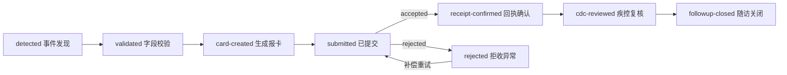

# 传染病事件发现到上报闭环

## 增量目标

本增量把既有 `publicHealthEvents` 聚集性呼吸道事件与 `phase2DiseaseReportQueue` 传染病报卡连接为一条可审计业务链。领域逻辑由 `public-health-event-reporting-service.js` 独立承载，不在本线程修改公共 `server.js`、`package.json`、公共样式或发布总表。

当前实现证明业务闭环可运行，不代表生产上线。正式上线仍需 T00 完成公共 API 集成，并取得疾控直报正式回执、现场联调记录和责任部门签字。因此完成态保持 `productionReady: false`。

## 稳定关联

首个验收样例使用以下稳定链路：

| 标识 | 值 | 用途 |
|---|---|---|
| `externalEventId` | `EMR-LIS-CLUSTER-20260708-001` | 上游重复事件幂等键 |
| `publicHealthEventId` | `phe-infectious-001` | 公卫监测事件 |
| `reportId` | `p2drq-inf-r3` | 疾病报卡队列记录 |
| `standardDomainId` | `ph-infectious` | 传染病防控标准域 |
| `sampleNo` | `LIS-SAMPLE-20260708-001` | 实验室样本关联 |

同一个 `externalEventId` 重复接入时返回既有业务实例；同一个 `publicHealthEventId` 不允许链接到另一个外部事件。

## 状态机



标准映射复核是独立审计动作，不改变业务状态。关闭随访前，`ph-infectious` 映射必须完成复核并关联证据。

## 事件与报卡契约

事件校验必填字段：

- `externalEventId`
- `publicHealthEventId`
- `residentId`
- `diagnosisCode`
- `sampleNo`
- `sourceSystem`
- `observedAt`

报卡必填字段：

- `reportId`
- `reportCardNo`
- `residentId`
- `diagnosisCode`
- `sampleNo`
- `targetCounty`
- `targetPlatform`
- `reportedAt`

每个动作必须携带 `idempotencyKey`。相同动作和相同幂等键重复提交时返回原审计记录，不重复改变状态。调用方可同时提交 `expectedVersion`；版本与当前业务实例不一致时，领域服务拒绝覆盖。

## 直报回执和异常补偿

`record-receipt` 只接受两种 `receiptStatus`：

- `accepted`：记录回执编号、时间和 SHA-256 审计摘要，进入 `receipt-confirmed`。
- `rejected`：必须同时提供拒收原因、异常责任人和处置期限，进入 `rejected`；修正字段后使用新的提交幂等键进行补偿重试。

正式适配器不得伪造成功回执。超时、拒收或无法验证签名时必须保留异常状态并升级给疾控直报接口专班。

## 权限和人工决策

| 动作 | 医疗机构 | 疾控/卫健 | 系统适配器 |
|---|---:|---:|---:|
| 校验事件、生成报卡、提交 | 是 | 是 | 否 |
| 记录标准映射复核 | 否 | 是 | 否 |
| 记录直报回执 | 否 | 是 | 是 |
| 疾控复核、关闭随访 | 否 | 是 | 否 |

居民角色不能执行事件校验、报卡、回执或关闭操作。预警和 AI 只能提供证据与建议，不能替代人工疾控复核。

## 标准映射

首个切片复核以下 `ph-infectious` 条目：

- 病例报告
- 流行病学调查
- 实验室检测
- 报告质量控制

映射记录必须包含复核人、复核时间和现场/标准证据引用。映射记录不能替代属地正式验收。

## T00 集成交接

T00 集成时应：

1. 在 `server.js` 中调用领域服务，不复制状态转换逻辑。
2. 增加读取单个闭环、接收事件和提交动作的公共 API，并沿用现有卫健管理端认证、数据访问日志和安全审计。
3. 为写操作增加持久化版本校验，防止并发覆盖。
4. 在 `package.json` 中接入语法检查、专项测试和 readiness 命令。
5. 将专项报告纳入发布总表，但在正式回执和现场签字缺失时保持发布门禁阻断。
6. 在公卫页面增加事件—报卡—回执—复核—随访时间线；公共样式由 T00 统一处理。

建议 API 契约：

- `GET /api/public-health/infectious-reporting-cases/:id`
- `POST /api/public-health/infectious-reporting-cases`
- `POST /api/public-health/infectious-reporting-cases/:id/actions`

动作接口请求应至少包含 `action`、`idempotencyKey` 和动作所需的证据字段；响应返回最新业务实例、审计记录及 `idempotent` 标志。

## 测试与验收

专项测试覆盖：正常七阶段闭环、必填字段缺失、重复事件和重复提交、拒收补偿、非法角色、非法状态转换以及未复核标准映射时禁止关闭。

运行：

```powershell
node --test test/public-health-event-reporting-service.test.js test/public-health-event-reporting-readiness.test.js
```

只读生成 readiness 对象可调用 `buildPublicHealthEventReportingReadiness()`；CLI 会写入 `release/public-health-event-reporting-readiness-report.json` 和 `.md`，应仅在允许生成发布证据时运行。

验收通过条件：

- 七个业务状态按顺序可运行；
- 成功回执具备报告关联和审计摘要；
- 拒收异常具备责任人和期限，并可补偿重试；
- 疾控复核和随访关闭有人工主体及证据；
- `ph-infectious` 标准映射已复核；
- 业务闭环完成时 `businessClosureComplete: true`，但在正式联调和签字前 `productionReady: false`。
