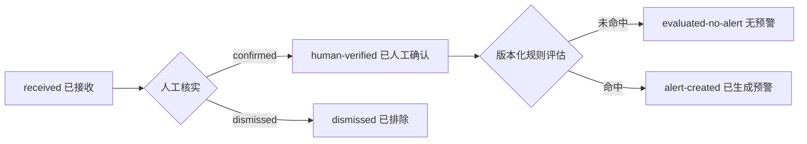
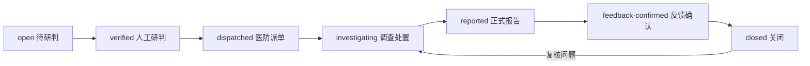

# “十五五”公共卫生信息化首批建设增量

## 建设依据与范围

本增量落实《疾病预防控制“十五五”规划》中“数智疾控”“一处采集、多级共享应用”“多点触发、反应灵敏的传染病监测预警体系”和“医防协同、医防融合”要求，优先建设：

1. 公共卫生数据底座；
2. 多点触发监测预警中心；
3. 医疗机构公共卫生科与基层公共卫生协同闭环。

本增量提供可运行、可测试、可审计的领域内核，不把演示数据、模拟规则命中或功能测试误判为生产上线证据。国家/省级正式接口、属地共享授权、官方报告回执、现场签字和上线审批未完成时，所有服务均保持 `productionReady=false`。

## 一、公共卫生数据底座

### 数据源登记

首批登记八类数据源：

| 数据源 | 责任方 | 共享范围 | 默认刷新要求 |
|---|---|---|---:|
| 传染病病例报告 | 医疗机构公共卫生科 | 医疗—疾控 | 5分钟 |
| 临床症候群 | 发热门诊/急诊 | 医疗—疾控 | 15分钟 |
| 实验室病原 | 区域检验与疾控实验室 | 医疗—疾控 | 15分钟 |
| 突发公共卫生事件 | 疾控应急管理部门 | 疾控—指挥 | 5分钟 |
| 免疫接种与AEFI | 免疫规划部门 | 医疗—疾控 | 60分钟 |
| 病媒生物与环境 | 环境与病媒部门 | 疾控—部门 | 1440分钟 |
| 跨部门协同 | 联防联控专班 | 跨部门 | 60分钟 |
| 社会感知 | 健教与风险沟通部门 | 疾控内部 | 60分钟 |

刷新时间是首批技术配置，不替代国家或属地业务规范；正式建设时由责任部门确认。

### 数据目录

首批目录覆盖数据源、监测信号、风险预警、风险研判、调查处置、医防协同和数据血缘七类实体。信号接入只保存：

- 来源登记编号；
- 来源记录哈希；
- 信号类型、机构和区域代码；
- 观察时间；
- 指标代码、数值、单位和可选基线；
- 证据引用；
- 内容指纹、质量状态和流程状态。

接入载荷禁止包含 `residentId`、姓名、身份证号、电话、地址、病案号等居民直接标识。原始外部记录编号和幂等键只用于服务端生成 SHA-256 哈希，不进入持久化对象和公共输出。

相同来源记录重复接入且内容一致时幂等返回；同一来源记录哈希对应不同内容时直接拒绝。数据底座持续检查未登记来源、非法类型、时间错误、指标或证据缺失、重复记录和直接标识泄露，并复算信号标识绑定与内容指纹；持久化后的业务字段或人工核验字段被改写时，质量看板必须显式失败。

### 数据源运行观测

数据源登记完成不等同于稳定供数。运行看板按各来源的刷新目标计算：

- `fresh`：最近信号不超过两倍刷新周期；
- `delayed`：超过两倍、未超过四倍刷新周期；
- `stale`：超过四倍刷新周期；
- `no-data`：已登记但尚未观察到最小化信号；
- `clock-skew`：观察时间比平台时间超前五分钟以上；
- `quality-review`：来源存在内容指纹、直接标识或其他质量问题。

无数据和延迟形成告警但不伪造业务失败；陈旧、时钟异常和质量问题使运行看板失败关闭。看板仅展示来源编号、责任方、刷新目标、时间年龄、信号数量和问题摘要，不展示生产端点、凭据或原始来源记录编号。

## 二、多点触发监测预警

### 首批规则

八类来源各有一个版本化规则基线：

- 病例报告；
- 临床症候群；
- 实验室病原阳性；
- 突发事件严重度；
- AEFI聚集；
- 病媒密度/环境风险；
- 跨部门风险评分；
- 已核实社会感知线索。

规则记录版本、指标、运算符、阈值、等级和责任部门。规则命中结果保存规则版本与规则摘要，保证后续可以解释“由哪个版本、哪个指标和哪个阈值形成预警”。

阈值是技术验收样例，生产阈值必须由疾控业务部门审批后配置。

### 规则变更治理

持久化的 `publicHealthSurveillanceRules` 只是可信规则的物化视图，不能直接修改后参与评估。阈值、等级或状态变更必须依次完成：

```text
submitted 提交 → approved 委级独立复核 → activated 服务端可信激活
                         └→ rejected 驳回
```

- 疾控监测或委级角色提出变更，提交理由、证据和目标版本；
- 复核人与提交人必须不同；
- 生效动作要求服务端专用密钥生成 HMAC-SHA256 激活回执；
- 回执绑定规则编号、前后版本、阈值、等级、状态、提交人、复核人、激活人、可信来源、验签标志、密钥编号、时间线摘要和签署时间；
- 未治理的规则物化、版本断链、签名缺失或签名后篡改均被拒绝；
- 历史规则版本继续保留，用于验证既有预警的规则摘要，不以新版本重写历史判断。

测试静态密钥只用于功能验收；生产必须使用服务端托管密钥和受控变更窗口。规则激活成功也不自动获得生产上线资格。

### 信号状态



只有疾控监测或委级角色可以人工确认信号；`system` 和AI模型不能执行确认。规则执行器只能评估已经人工确认的信号。

### 预警状态



人工研判必须记录风险等级、结论和证据。AI输出仅可作为建议，不得自行确认预警、发布公共警报或关闭事件。

正式报告必须关联报告编号、回执编号和证据；反馈必须关联反馈编号、结论和证据。

## 三、医防融合与基层协同

预警派单时必须指定：

- 医疗机构编号；
- 基层医疗卫生机构编号；
- 完成时限；
- 派单说明。

系统自动生成两条不可变绑定任务：

1. 医疗机构公共卫生科执行病例来源、报告责任和院内协同核实；
2. 基层公共卫生人员执行社区核查、重点人群随访和健康回执。

任务状态为：

```text
pending → accepted → in-progress → receipt-confirmed → closed
                         └→ exception-open → retry → in-progress
```

每个动作要求责任角色、幂等键和可选的 `expectedVersion`。幂等键同时绑定规范化动作载荷，同一键改换决策内容必须拒绝。拒绝回执必须明确原因、异常责任人和期限。关闭必须提供与任务要求完全一致的证据集合。每次动作前复核任务标识、归属机构、责任角色、版本、时间线、回执和关闭证据，持久化状态被篡改时不得继续流转。

只有同一预警的医院公卫任务和基层公卫任务全部关闭，预警才能执行 `close-alert`。

## 四、责任分工

| 事项 | 责任部门 | 协作部门 |
|---|---|---|
| 数据目录与质量规则 | 平台数据治理组 | 疾控监测、医院信息科 |
| 数据源登记与共享授权 | 各数据源责任部门 | 卫健信息部门、安全管理部门 |
| 规则和阈值审批 | 疾控监测部门 | 实验室、免疫、环境病媒、应急 |
| 人工信号核实与风险研判 | 疾控监测/研判人员 | 医疗机构公共卫生科 |
| 医疗机构任务 | 医疗机构公共卫生科 | 发热门诊、急诊、检验、院感、信息科 |
| 基层任务 | 基层公共卫生科室/专干 | 家庭医生、社区公共卫生委员会 |
| 正式报告和反馈 | 疾控主管部门 | 医疗机构、区域平台 |
| 上线审批 | 卫健/疾控主管部门 | 安全、运维、业务责任部门 |

## 五、文件边界

T08 自有文件：

- `public-health-data-foundation-service.js`：数据目录、来源登记、最小化信号接入、质量和血缘。
- `public-health-surveillance-rule-governance-service.js`：规则提案、独立复核、可信激活、版本历史和防篡改校验。
- `public-health-surveillance-workflow-service.js`：人工核实、版本化规则、预警、研判、报告、反馈和关闭。
- `public-health-medical-prevention-collaboration-service.js`：医院公卫科与基层公卫任务。
- `scripts/public-health-modernization-readiness.js`：三项建设任务的可运行验收。
- `test/public-health-*-service.test.js`：权限、幂等、版本、异常和隐私测试。

T00 负责公共文件和集成：

- `server.js` 的数据源、信号、预警和医防协同路由；
- SQLite 原子写入与唯一约束；
- `public-health.html`、`public-health.js`、`portal.css` 的工作台接入；
- `package.json`、README、发布总表和部署门禁。

T00 只调用领域服务返回的 `nextData`，不得复制状态转换、授权、幂等、版本和关闭判断。

## 六、建议公共API

- `GET /api/public-health/data-foundation`
- `GET /api/public-health/data-source-operations`
- `POST /api/public-health/surveillance-signals`
- `POST /api/public-health/surveillance-signals/:id/actions`
- `GET /api/public-health/surveillance-rule-governance`
- `POST /api/public-health/surveillance-rule-changes`
- `POST /api/public-health/surveillance-rule-changes/:id/actions`
- `GET /api/public-health/surveillance-center`
- `POST /api/public-health/surveillance-alerts/:id/actions`
- `GET /api/public-health/medical-prevention-tasks`
- `POST /api/public-health/medical-prevention-tasks/:id/actions`

公共响应只返回脱敏摘要，不返回居民直接标识、原始外部记录编号、原始幂等键、接口端点、密钥或签名材料。

## 七、测试与验收

功能验收要求：

- 八类数据源和七类目录完整；
- 数据源运行看板能区分新鲜、延迟、陈旧、无数据、时钟异常和质量复核；
- 信号接入具备来源授权、幂等、冲突检测、质量检查和血缘审计；
- 信号内容指纹、人工核验、规则版本、预警时间线、任务归属或关闭证据被篡改时，动作入口和汇总看板均失败关闭；
- 居民直接标识在入口拒绝；
- 八条规则均版本化且规则命中可解释；
- 未经独立复核和服务端可信激活的持久化阈值不能参与评估；
- 规则激活回执签名后修改阈值、状态、可信来源或验签标志必须被拒绝，旧预警仍按其历史规则版本复核；
- 未经人工确认的信号不能进入规则评估；
- AI和居民角色不能确认信号或预警；
- 预警完成研判、派单、调查、正式报告、反馈和关闭；
- 派单自动生成医院公卫科和基层公卫两条任务；
- 拒收任务具备责任人、期限和受控重试；
- 两条医防任务未全部关闭时预警不能关闭；
- 所有业务对象和验收报告保持 `productionReady=false`。

正式上线还要求：

- 国家/省级正式接口规范和属地标准映射确认；
- 数据共享授权和安全评估完成；
- 医疗机构、基层机构、疾控正式端点联调；
- 生产阈值审批、受控变更窗口和服务端托管激活密钥完成；
- 各来源完成连续数据质量与刷新时效观察窗；
- 正式报告和业务回执验签通过；
- 生产数据质量观察窗、灾备演练和现场签字完成；
- T00 发布和多方上线审批通过。
