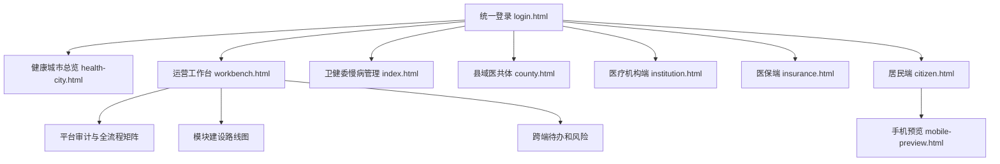
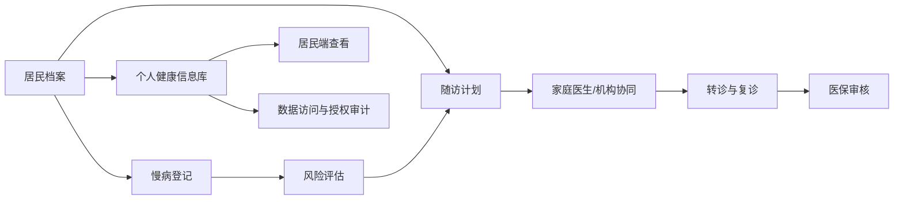
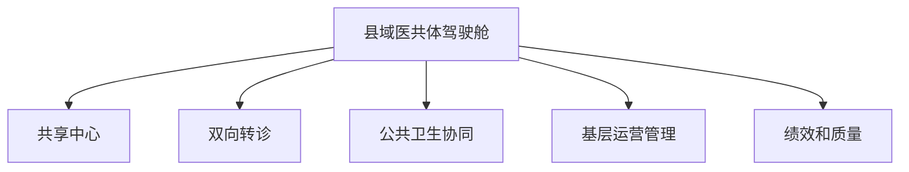

# 卫生健康信息平台全流程说明

更新日期：2026-06-18

本文按当前代码已经能运行的能力整理系统流程。当前平台是一个本地可运行的卫生健康信息平台 MVP，重点覆盖慢病医防融合、全民健康信息、县域医共体、分级诊疗、医保协同、居民端服务和运营审计。

## 1. 总体入口

## 2. 核心数据流

当前演示数据主要保存在 `data/db.json`。健康城市总览另使用 `data/health-city.sqlite` 展示卫生资源、人口、机构、服务量等城市级指标。

## 3. 慢病医防融合闭环

当前已实现：

- 居民档案维护、慢病登记、随访计划、风险分层和统计汇总。
- 慢病协同任务、固定取药、复诊转诊和医保提示的演示闭环。
- 居民端可查看个人健康档案、电子病历、检查检验、用药、过敏、接种、住院和授权记录。
- 运营工作台可查看慢病、医共体、分级诊疗等流程的建设状态和待办。

待生产化：

- 接入真实 EMR、LIS、PACS、医保和公卫系统。
- 将演示账号替换为真实认证和细粒度授权。
- 将 JSON 存储升级为正式数据库，并增加审计不可篡改策略。

## 4. 县域医共体流程

当前 `county.html` 覆盖县域概览、共享中心、双向转诊、公共卫生协同、运营监测和绩效质量。数据来自 `countyConsortium`、`countySharedCenters`、`countyReferrals` 等集合。

## 5. 角色与权限边界

平台现在使用演示账号登录，并按角色跳转页面。当前能力足够支撑演示和流程审计，但还不是正式安全模型：

- 已有角色入口：市级、区县、卫健委、医院、基层机构、医生、医保、居民、医共体。
- 已有页面级访问控制和会话信息。
- 尚未实现短信、政务身份、医保电子凭证或 OAuth 等真实身份认证。
- 尚未实现字段级授权、数据脱敏、授权撤销后的历史访问复核。

## 6. 运营审计流程

运营工作台当前承担两个审计视角：

- `platformAudit`：按模块审计当前能力、缺口、风险和后续动作。
- `platformProcessAudit`：按全流程审计从居民建档、慢病登记、随访、转诊、医保、取药、居民端查看到数据治理的闭环。

这两个集合用于把“系统能做什么、还缺什么、下一步做什么”集中展示，便于继续推进医共体和慢病建设。
