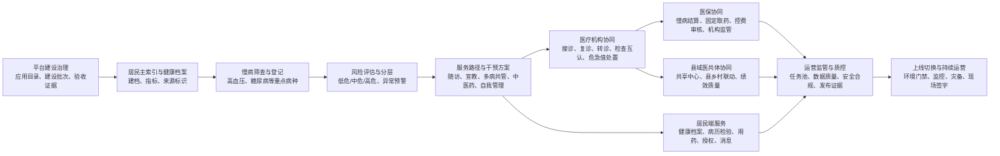
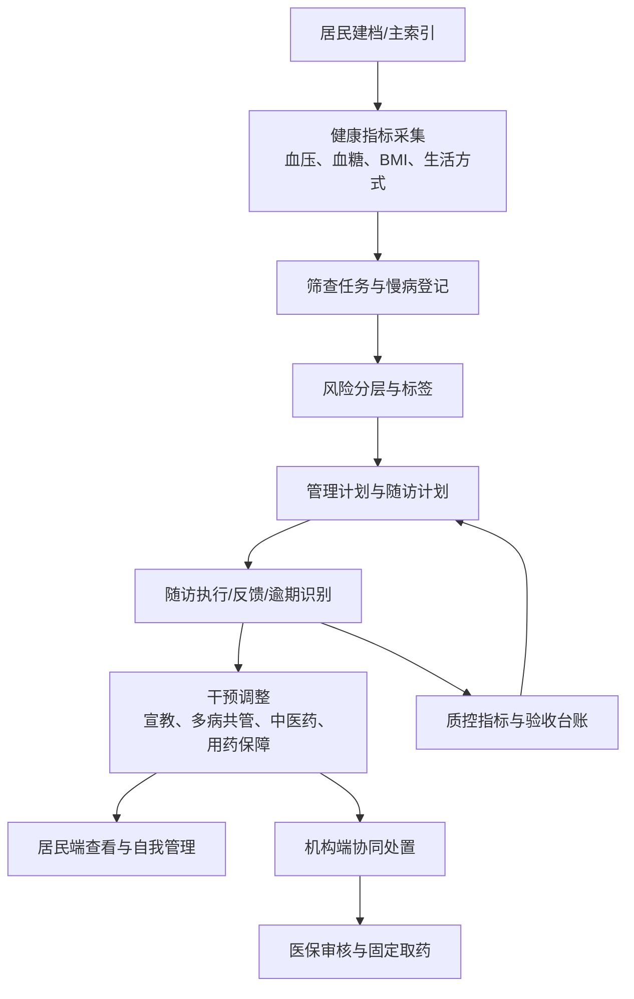
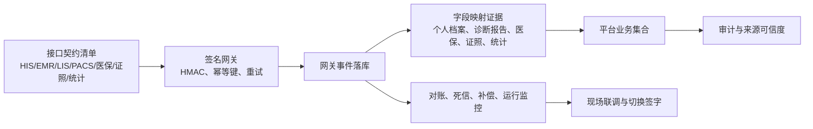
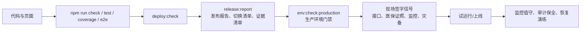

# 卫生健康信息平台全系统流程图与功能分析

更新时间：2026-06-23

本文按当前代码、页面入口、后端 API、数据集合和发布文档整理。状态口径分为三类：

- 已开发：本地 Node 服务、静态页面或自动化脚本中已有可运行能力。
- 演示级已开发：已有页面、数据、API、审计或模拟接入，但正式上线仍依赖现场系统、真实账号、真实接口或测评材料。
- 即将开发：下一阶段应继续补齐的生产化能力，尤其是真实身份源、外部接口联调、生产数据库、监控和现场签字证据。

## 1. 系统总体架构图

```mermaid
flowchart TB
  subgraph Users["用户与组织"]
    U1["市级/区县卫健管理"]
    U2["医疗机构/基层医生"]
    U3["医保管理与经办"]
    U4["县域医共体"]
    U5["居民/家属"]
    U6["运营、质控、安全、实施人员"]
  end

  subgraph Entry["统一入口与页面层"]
    Login["login.html<br/>统一登录与角色分流"]
    City["health-city.html<br/>健康城市总览"]
    Dashboard["health-dashboard.html<br/>综合驾驶舱"]
    Platform["platform.html<br/>平台建设驾驶舱"]
    Workbench["workbench.html<br/>统一运营工作台"]
    Chronic["index.html<br/>慢病医防融合监管"]
    Institution["institution.html<br/>医疗机构协同"]
    Insurance["insurance.html<br/>医保支付与基金监管"]
    County["county.html<br/>县域医共体"]
    Citizen["citizen.html<br/>居民个人健康信息库"]
    Regional["regional-data-sharing.html<br/>区域诊疗数据共享"]
    Quality["quality-safety.html<br/>医疗质量安全监管"]
    Operations["operations.html<br/>医院运行与资源调度"]
  end

  subgraph Api["Node API 与业务服务"]
    Auth["认证、会话、角色权限<br/>/api/auth/*"]
    State["平台状态与集合保存<br/>/api/state, /api/state-collections/*"]
    Workflow["统一任务与工作流<br/>/api/tasks, /api/workflow-actions"]
    ChronicApi["慢病、随访、风险、政策能力 API"]
    CitizenApi["个人健康档案、授权、访问复核 API"]
    Integration["接口契约、签名网关、模拟接入、死信补偿"]
    QualityApi["数据质量、安全合规、审计与发布证据"]
    OpsApi["运行监测、药耗监管、综合驾驶舱"]
  end

  subgraph Data["数据与证据层"]
    Json["data/db.json<br/>演示数据与静态快照"]
    Sqlite["SQLite schema v7<br/>结构化镜像与迁移"]
    Release["release/*<br/>发布、验收、监控、接口证据"]
    Audit["securityEvents / dataAccessLogs<br/>审计事件与访问日志"]
  end

  subgraph External["生产外部系统：现场联调"]
    Oidc["政务统一认证 / CA / 短信 / 人脸"]
    His["HIS / EMR / LIS / PACS / 心电"]
    InsuranceCore["医保核心结算与基金监管"]
    PublicHealth["公卫、疾控、妇幼、死亡登记"]
    Cert["电子证照、公安、民政共享"]
    Monitor["Prometheus / OTel / 日志平台 / SIEM"]
  end

  Users --> Login
  Login --> City
  Login --> Dashboard
  Login --> Platform
  Login --> Workbench
  Login --> Chronic
  Login --> Institution
  Login --> Insurance
  Login --> County
  Login --> Citizen
  Login --> Regional
  Login --> Quality
  Login --> Operations

  Entry --> Auth
  Entry --> State
  Entry --> Workflow
  Entry --> ChronicApi
  Entry --> CitizenApi
  Entry --> Integration
  Entry --> QualityApi
  Entry --> OpsApi

  Api --> Json
  Api --> Sqlite
  Api --> Release
  Api --> Audit

  Integration -.生产联调.-> His
  Integration -.生产联调.-> InsuranceCore
  Integration -.生产联调.-> PublicHealth
  Integration -.生产联调.-> Cert
  Auth -.生产替换.-> Oidc
  QualityApi -.生产接入.-> Monitor
```

## 2. 全业务主流程

## 3. 重点子流程

### 3.1 慢病医防融合闭环

### 3.2 外部接口与数据共享流程

### 3.3 发布验收与生产切换流程

## 4. 主要功能与开发状态

| 功能域 | 已开发/演示级已开发 | 即将开发或现场完成 |
|---|---|---|
| 统一入口与角色 | `login.html`、演示账号、签名会话、角色范围、页面守卫、API 角色校验、非管理角色字段脱敏 | 接入政务统一认证、机构目录、医生身份源、CA/短信/人脸、医保电子凭证或 OAuth/OIDC 正式参数 |
| 健康城市总览 | 健康城市总览、综合驾驶舱、卫生资源与统计指标展示 | 接入真实城市级指标、实时数据源、正式统计直报链路 |
| 平台建设治理 | `platform.html` 支持能力矩阵、存量系统整合、接口衔接、开发批次、验收证据和周报素材 | 挂接真实项目管理、合同、验收、测评报告和现场责任人签字 |
| 统一运营工作台 | `workbench.html` 覆盖平台审计、全流程审计、跨端待办、风险与路线图 | 与真实运营工单、短信/政务消息、现场督办机制联通 |
| 慢病医防融合 | 居民档案、慢病登记、随访、风险分层、筛查、宣教、多病共管、中医药、自我管理、用药保障、质控指标 | 对接家庭医生签约、公卫系统、真实设备、药品供应链和基层质控数据 |
| 居民端 | 个人健康信息库、电子病历、检查检验、用药、影像/附件演示、随访、固定取药、授权共享、撤销、访问历史、PWA 壳和移动预览 | 真实实名关系、亲情代办规则、对象存储、影像原文调阅、真实消息触达和移动端现场可用性测试 |
| 医疗机构端 | 协同任务、授权档案查看、转诊复诊、固定取药、危急值与慢病任务处理 | 对接院内 HIS/EMR/LIS/PACS、医生排班、真实医嘱、检查预约和院内质控 |
| 医保管理与经办 | 医保结算审核、固定取药审核、基金监管、机构监管、控费提示、工作流动作 | 对接医保核心结算、基金监管平台、医保电子凭证、真实支付审核规则 |
| 县域医共体 | 县乡村协同驾驶舱、共享中心、双向转诊、公卫协同、AI 辅助诊断、检查互认、绩效质量 | 接入真实县域机构系统、影像/检验共享中心、医共体绩效结算和基层履约数据 |
| 区域数据共享 | 共享包调阅、互认确认、访问审计、接口联调证据 | 贯通至少一家机构的患者、病历、检验、影像、转诊链路，处理厂商字段差异 |
| 医疗质量安全 | 医疗质量安全监管页面、问题派单、整改反馈、复核动作和报告脚本 | 对接真实质控中心规则、院内不良事件、整改证明和专家复核流程 |
| 医院运行调度 | 运行监测、资源调度、统计直报对账、运维就绪证据 | 接入真实床位、人力、设备、急诊、药耗和运营系统实时数据 |
| 药耗监管 | 药品耗材监管证据、审核、整改、医保同步动作 | 接入采购、库存、处方点评、医保控费和阳光采购数据 |
| 证照与统计 | 出生/死亡证照、卫生统计导入、数字健康凭证、证照版本化写入 | 对接电子证照平台、公安民政、疾控死因监测、国家直报系统 |
| 接口网关 | 契约清单、HMAC 验签、幂等键、事件落库、失败重试、死信补偿、模拟接入、字段映射报告 | 现场专线网关、真实报文、厂商字段差异、联调记录、生产对账 |
| 数据治理 | SQLite schema v7、JSON 静态快照、集合版本、乐观锁、409 冲突、备份恢复、脱敏副本、主索引与数据质量扫描 | 正式数据库约束、索引、回滚脚本、原生备份、真实人口主索引合并拆分规则 |
| 安全合规 | 审计日志、安全事件、审计哈希链、安全合规报告、高风险事件视图、环境密钥门禁 | 等保、密评、信创、国密设备、专线、SIEM、审计保全和测评报告接入 |
| 发布运维 | `deploy:check`、`release:report`、`release:manifest`、`env:check:production`、监控就绪、灾备演练、CI artifact | 独立后端环境、HTTPS、正式密钥、生产监控平台、RTO/RPO 恢复演练和上线签字 |

## 5. 已开发能力归纳

1. 多角色、多端入口已经成型：市级/区县管理、医疗机构、医保、居民、县域医共体、运营工作台、平台建设治理均有独立页面。
2. 核心慢病闭环已经从“单页面演示”扩展到“居民端、机构端、医保端、医共体端、运营端”的跨端业务链。
3. 数据层已经不只是静态 JSON：已存在 SQLite 迁移、结构化镜像、集合版本、乐观锁、备份恢复和脱敏副本能力。
4. 接口层已有生产化雏形：认证、状态、工作流、证照、个人档案、接口网关、互认、医保、科研、移动体验等 API 已覆盖主要业务域。
5. 发布验收已经形成证据体系：部署检查、发布报告、环境门禁、接口映射、监控就绪、灾备演练、全流程审计和 CI 检查均有脚本或报告。

## 6. 即将开发重点

### 可继续在代码库内推进

| 优先级 | 方向 | 主要动作 |
|---|---|---|
| P0 | 生产切换证据深化 | 把真实身份源、接口、监控、灾备、审计保全继续转成可检查配置项、责任人清单、签字模板和发布证据 |
| P0 | 生产数据库深化 | 补齐更多业务表的约束、索引、迁移回滚、原生备份证据和恢复验收 |
| P1 | 工作流细化 | 为多病共管、中医药、自我管理、用药保障、质控、平台证据维护补更多状态动作、消息和审计事件 |
| P1 | 前端一致性 | 让 `platform.html`、`workbench.html`、`index.html` 与新增证据、台账、政策能力保持同一口径 |
| P1 | 测试矩阵深化 | 继续扩展权限边界、并发冲突、移动弱网、平台证据、备份恢复、接口网关和发布报告回归 |
| P2 | 运营体验优化 | 提升老年用户可用性、机构整改闭环、科研数据集审批和信用绩效可视化 |

### 需要现场资源才能完成

| 方向 | 依赖资源 | 完成标志 |
|---|---|---|
| 真实身份 | 政务统一认证、机构目录、医生身份、居民实名、CA/短信/人脸 | 演示账号退出生产路径，页面/API/字段权限与真实身份一致 |
| 真实接口 | HIS、EMR、LIS、PACS、心电、医保、证照、公卫、公安民政、妇幼、疾控 | 至少贯通一个真实机构的患者、病历、检验、影像、转诊和医保链路 |
| 安全测评 | 等保、密评、信创、国密设备、专线、生产密钥 | 测评报告、整改闭环、密钥轮换、审计保全全部入证据库 |
| 生产运维 | HTTPS、后端部署、正式数据库、日志平台、监控平台、SIEM | 监控告警、值班手册、RTO/RPO 恢复演练和上线签字通过 |
| 现场验收 | 业务处室、医院、医保、公卫、质控、项目实施团队 | 验收记录、接口联调记录、上线切换清单和责任人签字齐全 |

## 7. 当前边界判断

当前系统适合做方案展示、业务流程审计、接口契约准备、演示级联调和发布证据沉淀。它已经不是简单原型，但在独立后端环境、真实身份源、真实外部系统、生产监控、审计保全和现场测评完成前，仍应表述为“演示级与试运行准备系统”，不应直接表述为已经可生产上线的正式业务系统。
