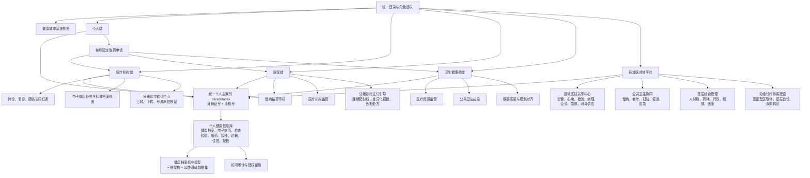
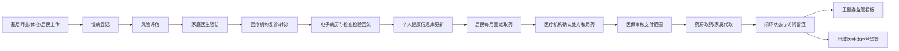
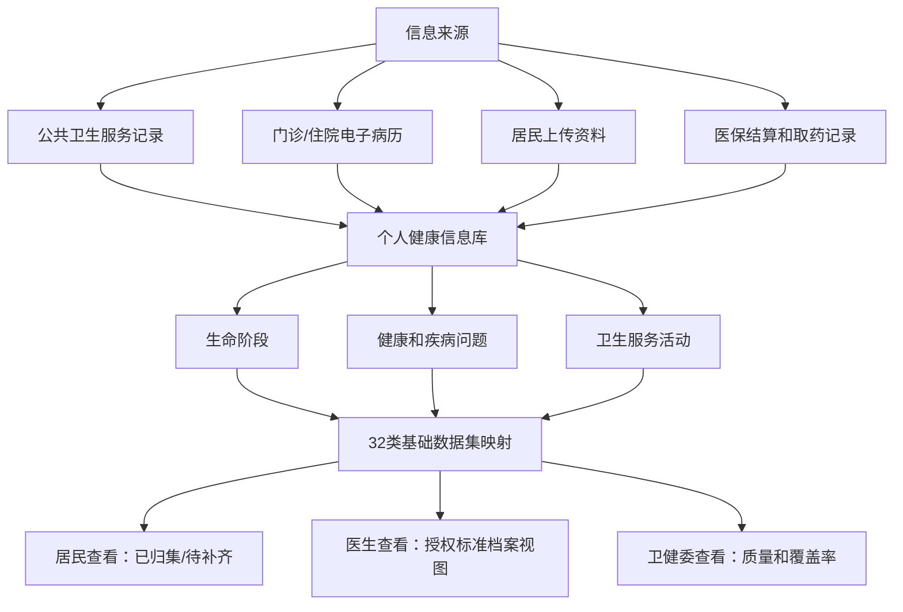
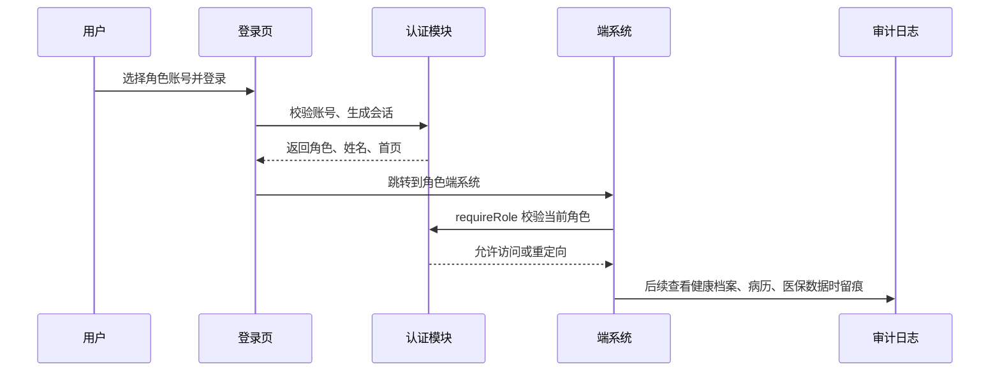

# 健康城市四端协同系统整体流程结构图

## 1. 整体系统结构

## 2. 慢病医防整合与固定取药闭环

## 3. 健康档案与电子病历贯通

## 4. 登录与权限流程

## 5. 登录系统后续生产化方向

- 前端演示账号替换为后端认证接口。
- 密码改为加盐哈希存储，不在前端保存任何明文凭据。
- 增加短信验证码、电子健康码、医保电子凭证、政务统一身份认证。
- 后端签发短期访问令牌和刷新令牌。
- 按角色、机构、居民授权范围做细粒度接口权限。
- 所有健康档案、电子病历、医保数据访问写入 `dataAccessLogs`。
