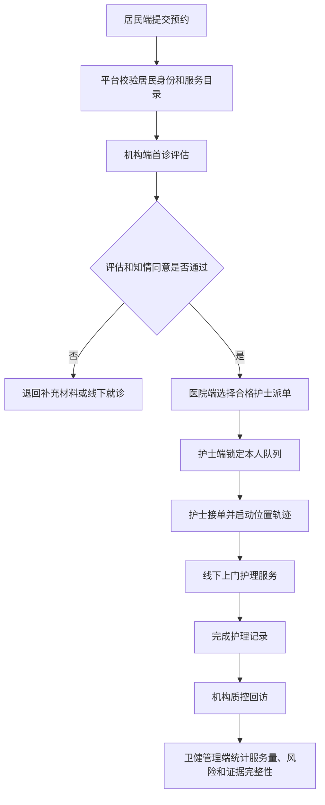

# 互联网护理服务模块说明

## 模块定位

互联网护理服务模块围绕“线上申请、线下服务”的试点边界建设，承接居民端预约、医疗机构端评估派单、护士端接单服务、监管端留痕统计四类能力。模块目标不是替代医疗机构护理管理系统，而是在健康城市平台内形成可审计的预约、评估、知情同意、护士资质、位置轨迹、服务记录和质量回访闭环。

## 功能边界

| 功能域 | 使用角色 | 页面入口 | 核心数据 | 主要能力 | 验收证据 |
| --- | --- | --- | --- | --- | --- |
| 居民预约 | 个人端手机侧 | `internet-nursing.html`, `mobile-preview.html` | `internetNursingOrders`, `residents` | 提交服务对象、服务项目、期望时间、地址和风险等级 | `nursing-mobile-appointment`, `POST /api/internet-nursing/orders` |
| 机构评估派单 | 医院端 | `internet-nursing.html` | `internetNursingInstitutions`, `internetNursingOrders`, `taskMessages` | 完成首诊评估、知情同意、风险复核、合格护士派单和质控回访 | `nursing-orders`, `data-nursing-action` |
| 护士接单服务 | 护士端手机侧 | `internet-nursing.html`, `mobile-preview.html` | `internetNursingNurses`, `internetNursingOrders` | 锁定本人护士身份，接单、开始服务、完成护理记录并保留位置轨迹 | `nursing-nurse-mobile`, `nurse / 123456` |
| 监管统计 | 卫健管理端 | `internet-nursing.html`, `release/internet-nursing-readiness-report.md` | `internetNursingPolicy`, `internetNursingOrders` | 统计试点机构、合格护士、风险订单、轨迹订单和证据完整性 | `internet-nursing:readiness`, `release:manifest` |

## 角色入口

- 个人端：`citizen / 123456` 可进入预约区，提交互联网护理服务申请。
- 医院端：`hospital / 123456` 可完成评估、派单和回访等管理动作。
- 护士端：`nurse / 123456` 直接进入护士工作站，页面锁定 `nurseId=inn-001`，只显示本人可处理队列。
- 卫健管理端：`health / 123456` 或 `city / 123456` 可查看全量试点订单和统计证据。
- 手机预览：`mobile-preview.html` 中的“护理”入口直接加载 `internet-nursing.html?preview=mobile-nursing`，用于验收居民手机预约和护士手机接单响应。

## 数据对象

- `internetNursingPolicy`：试点边界、服务对象、服务目录、证据要求、风险控制和平台要求。
- `internetNursingInstitutions`：试点医疗机构、公开状态、安全等级、应急预案和可提供服务项目。
- `internetNursingNurses`：护士执业资质、培训状态、保险状态、定位设备、一键报警和所属机构。
- `internetNursingOrders`：居民预约、首诊评估、知情同意、护士派单、位置轨迹、护理记录、质量回访和审计轨迹。
- `taskMessages`：新预约、派单、服务进展和质控待办的跨角色消息通道。

## API 权限

- `GET /api/internet-nursing/dashboard`：居民、机构、卫健管理和县域角色可读；服务端按居民授权、机构编码和护士身份裁剪数据。
- `POST /api/internet-nursing/orders`：居民、机构和卫健管理可创建预约；服务端写入首诊评估、知情同意、身份核验和任务消息。
- `POST /api/internet-nursing/orders/:id/actions`：机构和卫健管理可推进评估、派单、回访；护士账号可在本人队列内接单、开始服务和完成护理记录。
- `POST /api/workflow-actions`：兼容统一工作流动作，支持 `internetNursingOrders` 集合的审计留痕。

## 风险控制

- 首诊评估未通过或知情同意未签署的订单不得进入服务完成闭环。
- 派单护士必须满足执业注册、无不良记录、培训合格、责任保险、定位设备和一键报警条件。
- 高风险订单进入 `riskQueue`，并在 readiness 报告中单独统计。
- 服务开始后必须保留 `locationTrace=tracking`、护理记录状态和质量回访状态。

## 流程图

## 测试与验收

- 语法检查：`npm.cmd run check`
- 模块 readiness：`npm.cmd run internet-nursing:readiness`
- 单元测试：`node --test test/internet-nursing-readiness.test.js`
- 发布门禁：`npm.cmd run deploy:check`
- 浏览器验收：使用 `citizen / 123456` 在手机端提交预约，订单来源应标记为 `internet-nursing-mobile`；使用 `nurse / 123456` 登录后，护士选择框应锁定 `inn-001`，手机端接单卡片应显示“接单 / 开始服务 / 完成记录”等中文动作，医院管理区应保持只读。

## 发布证据

- 页面入口：`internet-nursing.html`
- 前端逻辑：`internet-nursing.js`
- 服务端 API：`server.js`
- 模块说明：`docs/互联网护理服务模块说明.md`
- 上线计划：`docs/互联网护理上线与下一步开发计划.md`
- readiness 脚本：`scripts/internet-nursing-readiness.js`
- readiness 产物：`release/internet-nursing-readiness-report.json`, `release/internet-nursing-readiness-report.md`
- CI 入口：`.github/workflows/ci.yml`

## 本轮数据模型升级

- `consentAttachment`：知情同意电子签名附件，记录 `status`、`signedAt`、`signerName`、`version`、`attachmentName` 和 `hash`，医院端评估后可核验签署证据。
- `locationTracePoints`：护士手机端轨迹点列表，记录接单、服务开始、服务完成等节点的 `stage`、`lat`、`lng`、`source` 和 `verified`，支撑服务开始和结束位置核验。
- 上线验收时需确认医院端订单表、居民手机预约卡片和护士手机接单卡片均展示电子签名附件或轨迹点摘要。
- `notificationDeliveries`：互联网护理消息网关投递证据，记录 `event`、`channel`、`targetRole`、`status`、`gatewayMode`、`queuedAt` 和 `sentAt`；站内消息为已发送，短信和院内消息在本地演示中为排队状态，生产环境替换真实网关。

## 使用机构和人员视角

| 使用机构/人员 | 已实现功能 | 下一步开发计划 |
| --- | --- | --- |
| 居民及家庭授权人员 | 手机端预约入口；选择试点机构、服务项目、服务对象、期望时间和上门地址；提交来源标记为 `internet-nursing-mobile`；按本人及家庭授权范围裁剪数据；查看评估、知情同意、风险等级和电子签名附件摘要。 | 增加预约受理、派单、接单、服务开始、服务完成和回访结果提醒；补充价格、医保/自费预估和支付状态；增加满意度评价、投诉和服务后反馈。 |
| 试点医疗机构管理人员 | 医院端订单管理、风险提示、首诊评估、知情同意电子签名附件、合格护士派单和质控回访；可核验签署时间、签署人、版本、附件名、哈希摘要和轨迹点。 | 增加排班能力和派单推荐；对接院内护理管理系统、电子病历和消息网关；完善投诉、不良事件、质控抽查和机构质量评分。 |
| 护士/护理服务人员 | 护士端手机工作站锁定本人身份；按接单、开始服务、完成护理记录顺序推进；写入 `locationTracePoints`；移动卡片展示服务记录、风险等级和轨迹点摘要。 | 增加排班日历、路线提醒、结构化护理记录、耗材使用、照片/附件留痕和异常上报；强化手机定位或定位设备核验。 |
| 卫健管理部门/监管人员 | 查看试点机构、合格护士、订单、风险队列、轨迹订单和证据完整性；通过 readiness、静态测试、API 测试、发布检查和 CI 获取上线证据。 | 建立监管月报；增加准入审核、服务目录变更审批、护士资质到期提醒；输出监管接口契约。 |
| 平台运维/信息化人员 | 维护互联网护理 API、角色权限、审计轨迹、任务消息、release manifest 和 CI 门禁；支撑静态预览与 Node API 混合运行。 | 对接生产消息网关、电子签名/附件存储、医保结算和监管平台；补充生产监控、告警、备份恢复、权限审计和接口压测。 |

## 下一步开发计划

1. 医院端排班与派单推荐：按护士资质、服务项目、服务区域、日容量、风险等级和当前待办量推荐护士。
2. 费用与结算规则：补充服务定价、医保/自费预估、支付状态和居民端展示。
3. 质量与投诉闭环：增加满意度评价、投诉入口、质控抽查、不良事件上报和机构质量评分。
4. 生产集成：接入真实短信、院内消息、电子签名附件存储、电子病历、医保结算和监管平台接口。
