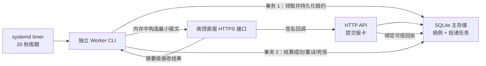

# 传染病直报跨进程运行时与监管

日期：2026-08-05

## 1. 本轮目标

在既有“事务型投递箱 + 独立 Worker”领域模型上，补齐可由操作系统定时拉起的跨进程运行时。HTTP 进程只负责提交报卡、写入投递任务和接收可信回调；Worker 进程只负责领取到期任务、构造最小报文、调用直报适配器并结算投递结果。

本轮交付的是代码、事务边界、运行模板和自动化验证，不代表真实疾控直报平台已经完成联合测试，也不改变全局 `NO-GO` 判定。

## 2. 运行结构



## 3. 事务与恢复保证

| 场景 | 处理方式 |
| --- | --- |
| Worker 出网前崩溃 | 租约已经提交；租约到期后其他 Worker 可重新领取 |
| 出网成功、结算前崩溃 | 任务在租约到期后重试；既有稳定幂等键约束上游重复接收 |
| HTTP 与 Worker 并发写入 | 仓储只校验病例和投递任务两个集合版本，并由 SQLite 乐观锁在提交时复核 |
| 无 SQLite 主存储 | Worker 拒绝启动，不退化到 JSON 跨进程写入 |
| 上游返回原始错误 | 仅保存规范化错误码、时间和是否可重试，不保存原始响应 |
| 密钥或令牌 | 仅从部署环境注入，不写投递箱、日志、状态命令输出或代码仓库 |

## 4. 交付文件

| 文件 | 用途 |
| --- | --- |
| `public-health-direct-report-state-repository.js` | 仅围绕病例与投递任务集合的事务仓储和乐观锁 |
| `public-health-direct-report-worker.js` | 领取、出网、结算以及租约恢复编排 |
| `public-health-direct-report-production-runtime.js` | 将 Worker 接到平台正式状态仓储 |
| `scripts/public-health-direct-report-worker.js` | 独立进程入口、安全状态输出和默认关闭门禁 |
| `deploy/public-health-direct-report-worker.*.template` | systemd service、timer 和环境模板 |

## 5. 部署步骤

1. 使用独立服务账号部署应用，并确保只有服务账号可读写数据目录和审计目录。
2. 从 `deploy/public-health-direct-report-worker.env.template` 生成站点环境文件，密钥值由密钥管理系统注入，不落入部署包或 Git。
3. 保持 `PUBLIC_HEALTH_DIRECT_REPORT_WORKER_ENABLED=false`，先执行：

   ```powershell
   npm run public-health:direct-report-worker:status
   ```

4. 完成正式字段字典、VPN/白名单、机构凭据、回调地址、合成报文联合测试和签字回执后，由变更审批流程启用 Worker。
5. 将 service 与 timer 模板中的占位符替换为绝对路径，执行最小权限核对后启用 timer。
6. 通过运维页面观察排队、重试、死信和回调状态；死信只能由卫健委角色使用已有受控重放入口处理。

## 6. 验收命令

```powershell
npm run public-health:event-reporting-runtime:check
npm run public-health:event-reporting-runtime:test
npm run routes:check
npm run architecture:test
npm run process:test
npm run process:verify
npm run platform:iterations:test
npm run test:all
```

## 7. 仍需现场完成

- 官方直报字段字典版本、代码集和校验规则；
- 生产 VPN、域名、双向认证或网络白名单；
- 机构正式账号、令牌及密钥轮换策略；
- 合成报文成功、失败、超时、重试、回调和对账全场景联合测试；
- Worker 服务账号、日志保全、监控告警、值班响应和灾备演练；
- 疾控、卫健委、医院信息部门和平台实施方联合签字。

在上述材料完成前，状态输出和页面必须继续显示 `productionReady: false`。
