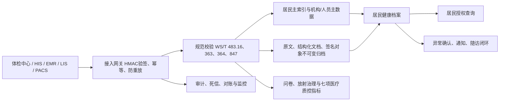

# 体检系统信息化规范基线（更新至2026-07-16）

## 1. 目的与适用范围

本文件是体检系统设计、开发、接口联调、验收和上线的统一依据，适用于一般成人健康体检结果从体检中心、医院接入，归档到居民健康档案并向居民授权展示的场景。

本基线不直接覆盖职业健康检查、征兵/入学等专项体检、从业人员预防性健康检查和国家基本公共卫生服务健康体检。这些业务有独立的项目、资质、报告和报送规则，接入前必须建立单独业务画像。本文件也不替代检验、影像、设备和具体诊疗项目的专业质量标准。

规范使用顺序：法律法规和行政规范性文件为强制边界；卫生行业标准作为共享文档、数据元、值域、交互和签名的实现依据；国家推荐性标准作为安全建设与测评依据。地方监管要求和接入机构规则只能在此基础上增加约束，不能降低要求。

## 2. 规范与文件目录

| 领域 | 文件 | 状态/效力 | 本系统用途 | 官方来源 |
|---|---|---|---|---|
| 体检业务 | 卫医政发〔2009〕77号《健康体检管理暂行规定》 | 现行适用，业务管理依据 | 机构资质、项目登记、分项医师签名、报告组成、总检医师资格 | [国家卫生健康委](https://www.nhc.gov.cn/zwgk/wtwj/201304/889eb3566368445a84701d24908b61a6.shtml) |
| 项目与筛查 | 国卫办医政函〔2025〕412号《成人健康体检项目推荐指引（2025年版）》 | 现行参照使用 | 健康自测问卷、基本项目、慢病风险筛查、工作流程和信息技术支持 | [国家卫生健康委](https://www.nhc.gov.cn/yzygj/c100068/202511/4feaeb6de63e44cb9fd4ac8f579ca279.shtml) |
| 医疗质控 | 国卫办医政函〔2023〕404号《健康体检与管理专业医疗质量控制指标（2023年版）》 | 现行质控依据 | 七项指标数据采集、计算、分析和反馈 | [国家卫生健康委](https://www.nhc.gov.cn/yzygj/c100068/202311/610e3cc82270478f84eeb3c5ba788e23.shtml) |
| 年度改进 | 国卫办医政函〔2026〕63号《2026年国家医疗质量安全改进目标》 | 2026年度执行 | 重要异常结果确认、通知、随访闭环，提高随访率 | [国家卫生健康委](https://www.nhc.gov.cn/yzygj/c100068/202603/9f642951b99c447f8cff9da8abb74dc3.shtml) |
| 放射检查 | 卫办监督发〔2012〕148号《关于规范健康体检应用放射检查技术的通知》 | 现行适用 | 正当化、风险告知、防护最优化、频次和剂量管理 | [国家卫生健康委](https://www.nhc.gov.cn/zhjcj/c100093/201212/69d4b84e1d11482ba9b732936ef2f534.shtml) |
| 共享文档 | WS/T 482—2016《卫生信息共享文档编制规范》 | 现行行业标准 | 文档头、文档体、标识、版本、作者、保管机构和一致性 | [国家卫生健康委](https://www.nhc.gov.cn/fzs/c100048/201607/c9a505f0ae7f41d0a81f019515b1df9c.shtml) |
| 共享文档 | WS/T 483.16—2016《健康档案共享文档规范 第16部分：成人健康体检》 | 现行行业标准 | 成人体检报告交换和归档的主文档画像 | [国家卫生健康委](https://www.nhc.gov.cn/wjw/s9497/201607/57f7bca9b7624074808009b8973ad0f4.shtml) |
| 数据元 | WS/T 363.1～17—2023《卫生健康信息数据元目录》 | 2024-04-01实施，替代2011版 | 人口学、体格检查、检验、影像、诊断、费用等字段定义 | [发布公告与分册](https://www.nhc.gov.cn/fzs/c100048/202310/16a32e2b1c0b42e99480b945ef10c0dc.shtml) |
| 值域 | WS/T 364.1～17—2023《卫生健康信息数据元值域代码》 | 2024-04-01实施，替代2011版 | 性别、证件、机构、异常状态等枚举值域 | [发布公告与分册](https://www.nhc.gov.cn/fzs/c100048/202310/16a32e2b1c0b42e99480b945ef10c0dc.shtml) |
| 区域平台 | WS/T 448—2014《基于居民健康档案的区域卫生信息平台技术规范》 | 现行行业标准 | 居民主索引、健康档案、授权共享和区域平台总体架构 | [国家卫生健康委](https://www.nhc.gov.cn/wjw/s9497/201406/5c7aec881f7948f9bd1557380841e5cd.shtml) |
| 区域交互 | WS/T 790.1～18—2021《区域卫生信息平台交互标准》 | 现行行业标准 | 区域服务、文档注册/查询、机构和人员主数据交互 | [国家卫生健康委](https://www.nhc.gov.cn/wjw/c100175/202111/d9b0f688a3394ef1afc903b05660bd26/files/1645425535256_33407.pdf) |
| 医院交互 | WS/T 846.1～11—2024《医院信息平台交互标准》 | 2025-04-01实施 | 医院侧个人、机构、人员、术语及文档注册查询接口 | [国家卫生健康委](https://www.nhc.gov.cn/wjw/zcwjtg/202411/308603c60d554dd49052b5bfb3a9d391.shtml) |
| 数字签名 | WS/T 847—2024《医学电子文档数字签名技术标准》 | 2025-04-01实施 | SM2/SM3、ES-T时间戳签名、证书链/吊销验证、签名与日志留存 | [国家卫生健康委](https://www.nhc.gov.cn/wjw/s9497/202411/c7630ce5d0bf477fa606830fe8f05f5a.shtml) |
| 电子病历 | 国卫办医发〔2017〕8号《电子病历应用管理规范（试行）》 | 现行适用 | 电子病历创建、修改、签名、归档、复制和封存 | [国家卫生健康委](https://www.nhc.gov.cn/wjw/c100175/201702/90f3de8ae03d488cbddf509dc958f75b.shtml) |
| 病历管理 | 国卫医发〔2013〕31号《医疗机构病历管理规定（2013年版）》 | 现行适用 | 电子与纸质病历效力、质量管理、门诊15年/住院30年最低保存期 | [国家卫生健康委](https://www.nhc.gov.cn/yzygj/c100068/201312/c9955f0471c04450a9f9ab74648fbdd4.shtml) |
| 病历使用 | 国卫办医政函〔2025〕262号《关于进一步加强医疗机构电子病历信息使用管理的通知》 | 现行适用 | 第三方授权边界、分级访问、操作全留痕和外部人员保密 | [国家卫生健康委](https://www.nhc.gov.cn/yzygj/c100068/202506/c68abee7c54b4651a774cd533761780b.shtml) |
| 电子签名 | 《中华人民共和国电子签名法》（2019修正） | 法律，强制 | 数据电文原件完整性、可靠电子签名、可调取和可验证 | [全国人大](https://www.npc.gov.cn/zgrdw/npc/xinwen/2019-05/07/content_2086835.htm) |
| 个人信息 | 《中华人民共和国个人信息保护法》 | 法律，强制 | 健康医疗敏感个人信息、明确目的、充分必要、严格保护、单独同意 | [全国人大](https://www.npc.gov.cn/npc/c2/c30834/202108/t20210820_313088.html) |
| 数据安全 | 《中华人民共和国数据安全法》 | 法律，强制 | 分类分级、全生命周期安全、风险监测和事件处置 | [中国政府网](https://www.gov.cn/xinwen/2021-06/11/content_5616919.htm) |
| 网络安全 | 《中华人民共和国网络安全法》（2025修正） | 2026-01-01施行现行修正版 | 网络运营安全、等级保护、日志和事件处置 | [国家法律法规数据库](https://flk.npc.gov.cn/detail?fileId=&id=021e7d7684474107b8f3febbb1c4f8b5&type=) |
| 网络数据 | 国务院令第790号《网络数据安全管理条例》 | 2025-01-01施行 | 加密、备份、访问控制、认证、供应商责任、风险评估和预案 | [国家网信办](https://www.cac.gov.cn/2024-09/30/c_1729384452307680.htm) |
| 行业网安 | 国卫规划发〔2022〕29号《医疗卫生机构网络安全管理办法》 | 现行适用 | 网络安全责任制、等级保护、供应链、监测通报和应急 | [国家卫生健康委政策解读](https://www.nhc.gov.cn/wjw/c100175/202208/95d3c3c2b1e343ca9607e0fd07725264.shtml) |
| 等级保护 | GB/T 22239—2019《网络安全等级保护基本要求》 | 现行，2025复审继续有效 | 安全通用要求及云、移动、物联网等扩展要求 | [全国标准信息公共服务平台](https://std.samr.gov.cn/gb/search/gbDetailed?id=88F4E6DA63434198E05397BE0A0ADE2D) |
| 等级测评 | GB/T 28448—2019《网络安全等级保护测评要求》 | 现行，2025复审继续有效 | 测评对象、单项测评和整体测评 | [全国标准信息公共服务平台](https://std.samr.gov.cn/gb/search/gbDetailed?id=i3NYKMeGgMs%3D&mode=p) |
| 医疗数据安全 | GB/T 39725—2020《健康医疗数据安全指南》 | 现行推荐性标准 | 数据分类、角色、使用场景及保护措施 | [全国标准信息公共服务平台](https://std.samr.gov.cn/gb/search/gbDetailed?id=B691BB77876CD126E05397BE0A0AF3B3) |
| 个人信息安全 | GB/T 35273—2020《个人信息安全规范》 | 现行；2026年修订计划征求意见中 | 个人信息全生命周期控制基线 | [全国标准信息公共服务平台](https://std.samr.gov.cn/gb/search/gbDetailed?id=F7BE709D9D2B6AF7E05397BE0A0AA8A6) |
| 分类分级 | GB/T 43697—2024《数据分类分级规则》 | 现行推荐性标准 | 统一数据分类、级别研判和重要数据识别方法 | [全国标准信息公共服务平台](https://std.samr.gov.cn/gb/search/gbDetailed?id=14156507D2210337E06397BE0A0AE656) |
| 影响评估 | GB/T 39335—2020《个人信息安全影响评估指南》 | 现行推荐性标准 | 敏感信息共享、供应商接入和新用途上线前评估 | [全国标准信息公共服务平台](https://std.samr.gov.cn/gb/search/gbDetailed?id=B4C25880C3DE1CB3E05397BE0A0A92D0) |
| 去标识化 | GB/T 37964—2019《个人信息去标识化指南》 | 现行，2025复审继续有效 | 科研、统计、测试和非直接诊疗场景脱敏 | [全国标准信息公共服务平台](https://std.samr.gov.cn/gb/search/gbDetailed?id=91890A0DA4AB80C6E05397BE0A0A065D) |

接口标准实施时还应核对国家卫生健康统计信息中心最新互联互通标准化成熟度测评方案；它属于测评与建设导向，不能替代上述法律和业务规则。

## 3. 系统强制实现规则

### 3.1 机构与报告

- 接入前校验医疗机构执业许可、健康体检登记范围和项目范围；超范围报告拒收或进入人工审核。
- 每个检查结果保留执行/审核医师、时间、机构和来源系统；总检报告必须记录符合资格的总检医师及培训确认。
- 分项签署至少保存章节/项目、执业医师标识、医师执业证号、执业范围、签署时间和签名对象引用；总检医师必须是内科或外科副主任医师以上并完成相关培训。
- 报告至少包含一般信息、体格检查、实验室检查、医学影像、阳性/异常发现、健康状况描述和健康建议。空章节也必须显式表达“未开展/未见异常”，不能静默丢失。
- 职业、专项和公共卫生体检必须使用独立业务画像，不得冒充一般成人体检报告。

### 3.2 标识、文档与版本

- 使用平台居民主索引匹配居民，保存来源机构、来源系统、外部文档号、报告号、文档版本和幂等键。
- 交换文档以 WS/T 483.16—2016 为主画像，并按 WS/T 482—2016保存文档标识、作者、保管机构、状态、版本和原文摘要值。
- 原始文档、结构化投影和签名对象一一关联；修订产生新版本，禁止覆盖历史版本。
- 签名对象必须保存其覆盖的原文SHA-256并与原文摘要一致；仅有“验签通过”状态而没有原文绑定证据不得通过生产门禁。

### 3.3 数据元、值域与术语

- 国内交换字段优先使用 WS/T 363—2023 与 WS/T 364—2023；LOINC等国际编码仅作为辅助映射，不得替代国内必需数据元。
- 当前已核验的数据元：收缩压 `DE04.10.174.00`、舒张压 `DE04.10.176.00`、空腹血糖 `DE04.50.038.00`、糖化血红蛋白 `DE04.50.083.00`、血清肌酐 `DE04.50.100.00`、心电图检查结果 `DE04.30.043.00`。
- 本地计算指标必须标记算法、输入值、单位、版本和审核状态；未核验国家数据元的指标不能计入“国标映射率”。

### 3.4 数字签名

- 生产医学电子文档签名执行 WS/T 847—2024：SM2公钥算法、SM3摘要、可信电子认证证书、证书链和吊销状态验证、可信时间戳及 ES-T XML 签名。
- 签名前覆盖完整医学电子文档及医疗服务提供者、服务对象标识；归档和共享前必须验签，失败必须显式阻断。
- 原文、签名值、证书、时间戳、摘要、签名序号和身份标识一并保存，签名日志独立保存。私钥不可导出并由签名人控制。
- HMAC-SHA256只用于接口报文传输鉴权，不等同于医学电子文档签名。演示证书、演示SM2/SM3或RSA签名一律不得计入生产合规。

### 3.5 个人信息、授权和居民访问

- 健康医疗信息按敏感个人信息处理，记录处理目的、告知版本、授权/单独同意引用、使用范围、期限和最小必要确认。
- 居民只能查询本人的健康档案；医务人员、平台人员和供应商采用角色、机构、数据范围和用途四维授权。下载、共享、导出、修改、删除和管理员操作全部审计。
- 对外共享、科研和统计使用前完成个人信息保护影响评估；非直接诊疗场景默认去标识化。
- 第三方人员和系统必须签署保密协议，明确授权范围、目的、期限和退出后的数据处置。

### 3.6 安全、留存和运行

- 按等级保护完成定级、备案、建设整改和测评；生产环境使用传输/存储加密、强认证、最小权限、备份恢复、恶意文件扫描和安全监测。
- 门诊类体检报告及相关审计按不少于15年配置不可变留存；若被纳入住院病历或地方规则要求更长，采用更长期限。
- 数据删除必须服从病历法定保存义务；到期销毁需审批、留痕和可验证销毁结果。
- 建立数据分类分级、漏洞和供应链治理、事件响应、灾备演练、容量监控、死信补偿和人工对账。

### 3.7 问卷、放射检查和医疗质量

- 成人一般健康体检按2025版推荐指引采集自测问卷完成证据，至少覆盖个人基本信息、既往史和家族史、生活方式及心理健康；问卷用于初步风险评估和个性化项目推荐，不得替代医师判断。
- 将慢病风险筛查结果与体检异常项一起形成可解释证据，自动进入慢病风险分层、家医服务建议和居民待办；规则阈值须经本机构医疗质量/临床专家委员会审核并版本化。
- 放射检查逐项记录检查目的、正当化理由、风险告知引用、防护最优化、剂量及单位、操作者和签署结论；对儿童、孕妇和高剂量检查执行适用人群禁忌/限制规则。
- 按国卫办医政函〔2023〕404号采集七项指标：高级职称医师签署报告率、问卷完成率、超声医师日均负担部位数、大便标本留取率、报告平均完成时间、高危异常结果通知率、重要异常结果随访率。没有分母数据时显示“待采集”，不得伪造为0%或100%。
- 重要异常结果闭环固定为“医师确认—通知居民—安排复查/专科—回收后续诊疗情况—关闭”，每步保留人员、时间、内容和送达/随访证据；未完成通知和随访不得关闭。

## 4. 系统架构落点

## 5. 版本治理

- 规范目录由架构、医务、病案、信息安全和法务共同维护，至少每季度及每次上线前复核一次官方状态。
- 每条需求必须在需求追溯矩阵中关联来源、代码、测试和上线证据；没有来源或证据的项目不得标记完成。
- 标准废止、修订或地方规则变化时，先形成影响评估，再升级接口版本和数据迁移方案；历史文档保留原标准版本标识。
- 本基线检索截止日期为2026-07-16。上线前仍需由属地卫生健康主管部门、医院病案/医务/放射/检验/网安部门确认地方性规定、专家共识阈值和实际备案要求。
