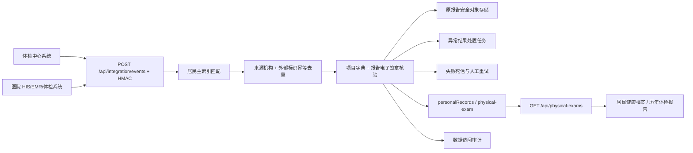

# 体检系统说明

## 目标与边界

体检系统复用现有居民主索引、个人健康档案、角色授权和访问审计能力，不建立与健康档案割裂的第二套居民库。体检中心和医院可把结构化体检结果接入平台；居民在本人及已绑定家庭成员授权范围内查看全部历史体检报告。

代码侧已实现签名接入、查询、异常随访、原报告安全归档和失败补偿闭环。生产上线仍需试点机构完成真实密钥交换、对象存储配置和带证据编号的现场联调签署；这些外部条件未完成时，上线门禁会保持阻断。

职业健康、公共卫生专项、学生、征兵、驾驶和从业人员预防性健康检查已通过 `examProgramType` 与一般成人健康体检强制隔离。专项载荷仅进入 `physicalExamSpecializedIntakes` 受限分流队列，不写入 `personalRecords[physical-exam]`，也不会自动生成慢病风险、家医建议或居民待办；机构端可凭证据编号分配专项系统画像、退回来源并关闭分流。

体检异常联动复用平台现有慢病与居民服务链：异常项按阈值形成可解释风险证据并生成 `chronicScreeningTasks`，进入慢病风险分层；根据异常类型和现有签约状态生成家庭医生服务包或签约复核建议，但不替代居民同意自动签约；同一任务同步到居民服务待办和站内消息，按来源报告ID幂等防重。

开发与验收必须同时遵循：[体检系统信息化规范基线（2026-07-15）](./体检系统信息化规范基线-2026-07-15.md) 和 [体检系统规范需求追溯矩阵（2026-07-15）](./体检系统规范需求追溯矩阵-2026-07-15.md)。前者给出法律、行业标准和国家标准目录，后者把要求对应到代码、测试和外部上线证据。

机构独立部署使用 `physical-examination-standalone.html` 和 `physical-examination-production.js`，不加载急救、用血或影像模块。独立控制面校验体检中心/医院字段映射、真实接入回执、WS/T 847生产签名、原件扫描归档、异常通知—复查—家医随访闭环、现场双人核验、独立冒烟和回退演练。生产证据还必须归入同一 `bundleId` 的签名清单，通过七日有效期、防重放登记及跨证据摘要绑定后才可参与 `GO` 判定。具体见：[体检独立模块生产切换说明（2026-07-24）](./体检独立模块生产切换说明-2026-07-24.md)。

## 数据流



## 接入契约

单份报告和 `reports` 数组批量导入使用相同字段；批量上限为 100 份。

| 字段 | 必填 | 说明 |
|---|---:|---|
| `sourceType` | 是 | `exam-center` 或 `hospital` |
| `residentId` / `personIndex` | 至少一项 | 匹配平台居民主索引 |
| `externalId` | 是 | 来源系统内稳定且唯一的数据标识 |
| `institutionId` | 是 | 来源机构编码 |
| `institutionName` | 是 | 来源机构名称 |
| `reportNo` | 建议 | 体检报告号 |
| `examDate` | 是 | `YYYY-MM-DD` |
| `summary` | 是 | 体检总检结论 |
| `findings` | 否 | 项目编码、名称、结果、单位、参考范围和异常标识 |
| `recommendations` | 否 | 健康建议数组 |
| `documentProfile` | 上线必填 | WS/T 483.16文档标识、版本、章节、作者、保管机构和原文摘要 |
| `institutionQualification` | 上线必填 | 医疗机构许可、体检登记和总检医师资格 |
| `sectionSignatures` | 上线必填 | 体格、检验、影像等分项执业医师标识、执业证号、时间和签名引用 |
| `healthQuestionnaire` | 质控必填 | 2025版指引的基本信息、健康史、生活方式和心理健康完成证据 |
| `radiationExaminations` | 有放射项目时必填 | 正当化、风险告知、防护最优化、剂量、操作者和签署结论 |
| `processingBasis` | 上线必填 | 告知版本、授权/单独同意引用及最小必要确认 |
| `signature` | 上线必填 | WS/T 847生产签名：SM2/SM3、ES-T、证书链、吊销状态和可信时间戳验证 |
| `secureAttachmentId` | 建议 | 通过校验和与恶意文件扫描的安全附件 ID |

幂等键为 `sourceType + institutionId + externalId`。重复报文返回既有归档，不重复生成居民档案。

## 角色权限

- 卫健委端：可查看授权范围内汇总并导入联调数据。
- 医疗机构端：仅可向本机构可访问居民归档体检报告。
- 居民端：只读查看本人和账户绑定家庭成员的历史体检报告，不能调用导入接口。
- 每次按居民查询或成功归档都会复用平台访问审计链。

## 上线前工作台

- `POST /api/integration/events`：统一 HMAC-SHA256 验签、报文防重、落库回执与死信台账。
- `POST /api/integration/events/:id/retry`：卫健委端人工补偿失败事件。
- `POST /api/physical-exams/abnormal-cases/:id/actions`：按确认、通知、安排复查/分派专科、记录随访、关闭或重开处理异常结果；未完成通知和随访不得关闭。
- `POST /api/physical-exams/:id/link-attachment`：仅允许关联状态为 `active` 且扫描为 `clean` 的同一居民原报告。
- `POST /api/physical-exams/joint-tests/:id/actions`：现场检查项必须填写证据编号，所有检查项通过后才能签署上线确认。
- `GET /api/physical-exams` 返回 `readiness`，明确区分代码就绪和生产可上线。
- `GET /api/physical-exams` 同时返回 `highlights`，覆盖健康时光机、报告翻译、行动卡、个性化计划、重复检查、辐射管家、家庭地图、健康护照、情景模拟、质量啄木鸟和城市雷达。
- `POST /api/physical-exams/highlights/actions`：居民确认异常行动、申请复查、创建/撤销健康护照及家庭风险授权，全部校验居民范围并审计。

真实生产门禁包括：`INTEGRATION_GATEWAY_SECRET`、WS/T 483.16文档完整性、WS/T 363/364数据元和值域、WS/T 847真实生产签名、机构资质与个人信息处理依据、生产对象存储适配器、服务端恶意文件扫描、15 年不可变留存，以及体检中心和医院现场验收签字。HMAC仅用于接入报文鉴权，不替代医学电子文档签名。

## 验收

```powershell
npm.cmd run physical-examination:test
npm.cmd run physical-examination:readiness
node --test test/physical-examination-production.test.js
node scripts/physical-examination-standalone-readiness.js
```

运行后生成：

- `release/physical-examination-readiness-report.json`
- `release/physical-examination-readiness-report.md`
