# 卫生健康平台全系统功能报告与分模块流程图

生成日期：2026-06-28
系统范围：`chronic-care-platform` 卫生健康信息平台 MVP
证据来源：当前代码库、`release/release-report.*`、`release/health-dashboard-summary.*`、各模块 readiness/report 脚本、`docs/system-flow.md`

## 1. 总体结论

当前系统已经形成“居民服务 + 医疗协同 + 监管治理 + 数据底座 + 发布运维”的一体化 MVP。系统不是单一慢病应用，而是覆盖居民端健康档案、电子病历、互联网护理、陪诊、慢病随访、区域诊疗共享、医联体转诊远程会诊、质量安全监管、医院运行调度、药耗医保监管、妇幼证照、科研数据沙箱、综合驾驶舱和平台治理的多角色平台。

截至当前发布证据，综合驾驶舱跟踪 8 个优先应用，汇聚 342 条来源记录、12 个开放事项、10 个高风险事项、9 条接口轨道、8 条证据记录和 3 类生产依赖。系统已具备演示、受控试点、互联网预览和发布证据归档基础；正式生产上线仍依赖真实身份源、HIS/EMR/LIS/PACS、医保、电子证照、卫生统计、监控告警、灾备演练、等保密评和现场签字。

## 2. 全系统功能架构

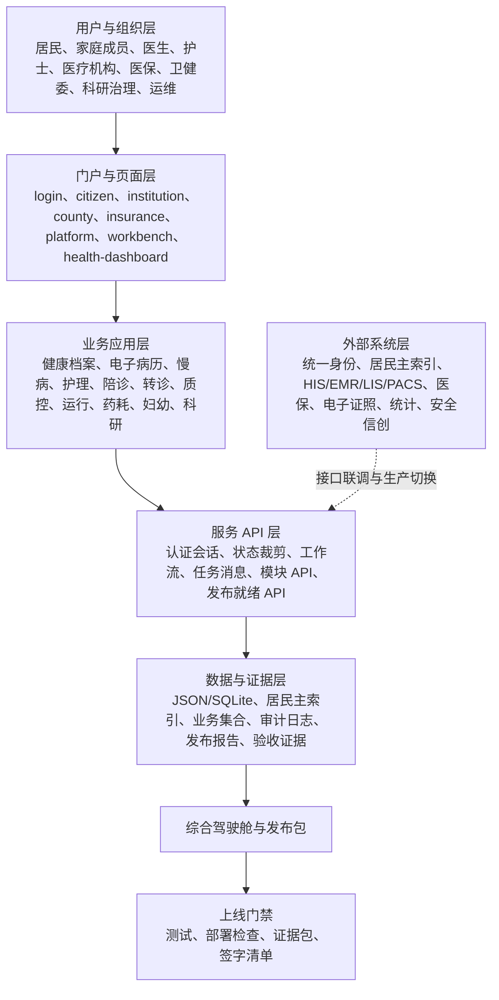

## 3. 模块功能矩阵

| 模块 | 主要入口/API | 当前已实现 | 下一步重点 |
|---|---|---|---|
| 统一身份与权限 | `login.html`、`/api/auth/*` | 演示账号、手机号验证码演示、角色首页、会话签名、居民数据裁剪、权限守卫 | 政务统一认证、短信网关、实名核验、家庭/监护关系、生产 RBAC |
| 居民端健康档案与电子病历 | `citizen.html`、`mobile-preview.html`、`/api/personal-records` | 健康档案、电子病历、检查检验、用药处方、影像/附件分类、家庭成员、PWA/APP/小程序预览 | 真实居民主索引、PACS/文档授权、原文预览、生产域名和 HTTPS |
| 互联网护理 | `internet-nursing.html`、`/api/internet-nursing/*` | 居民申请、机构评估、知情同意、护士派单接单、定位轨迹、护理记录、质控回访 | 机构资质核验、护士执业证联动、服务价格、风险订单闭环 |
| 陪诊服务 | `escort.html`、`citizen.html`、`/api/escort-services/*` | 服务主体、陪诊人员、居民预约、合同保险、补贴类型、风险队列、质量回访 | 线下服务履约、保险/合同附件、补贴结算、投诉处理 |
| 慢病管理与院后随访 | `index.html`、`/api/service-acceptance-summary`、`/api/chronic/*` | 筛查、风险分层、管理计划、随访反馈、多病共管、中医药、自我管理、用药保障 | 真实设备/体检/公卫数据接入、逾期督办、家庭医生绩效闭环 |
| 区域诊疗数据共享 | `regional-data-sharing.html`、`/api/regional-data-sharing` | 居民授权、共享包、报告查询、访问审核、审计日志 | 共享文档、术语标准、访问撤销强拦截、机构接口验收 |
| 医联体转诊与远程会诊 | `county.html`、`/api/referral-teleconsultations` | 转诊、远程会诊、接诊反馈、报告回传、协同工单、医共体验收 | 号源、床位、视频、影像/检验报告、下转随访消息联调 |
| 医疗质量与安全监管 | `quality-safety.html`、`/api/quality-safety/*` | 质量事件、危急值、临床路径、病历质控、互认质控、派单反馈复核 | 真实质控规则、科室签字、危急值通知渠道、整改周期考核 |
| 医院运行监测与资源调度 | `operations.html`、`/api/operations/*` | 床位、人力、设备、门急诊、住院、调度、预警、统计对账 | 生产监控、值班升级、容量阈值、运行日报、资源调度签字 |
| 药品耗材与医保监管 | `insurance.html`、`/api/drug-consumable-supervision/*` | 合理用药、处方点评、固定取药、高值耗材线索、医保同步、整改闭环 | 医保核心结算、门慢门特、电子凭证、支付/退费边界 |
| 妇幼健康与出生证照 | `maternal-child-about.html`、`/api/birth-certificates` | 出生医学证明、妇幼入册、新生儿访视、筛查接种、证照共享、居民可见 | 电子证照平台、公安户籍、妇幼/疾控/民政真实共享 |
| 医师多点执业 | `institution.html`、`/api/multi-practice-registry` | 申请备案、材料核验、责任保险、机构监管、公开台账、风险补正 | 真实执业注册、卫健审批流、保险附件与责任边界 |
| 科研数据集与数据沙箱 | `platform.html`、`/api/research/*` | 数据集申请、伦理审批、脱敏发布、沙箱访问、使用审计、成果回传 | 科研伦理签批、数据使用协议、脱敏评估、结果复核 |
| 综合驾驶舱与平台治理 | `health-dashboard.html`、`workbench.html`、`/api/health-dashboard/summary` | 8 个应用聚合、开放事项、高风险、接口轨道、证据包、上线清单 | 下钻分析、生产运行日报、领导视图、发布签字归档 |

## 4. 分模块流程图

### 4.1 统一身份、角色权限与会话

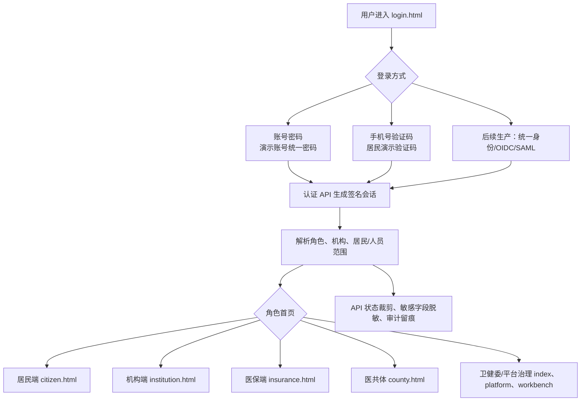

### 4.2 居民端健康档案、电子病历与服务入口

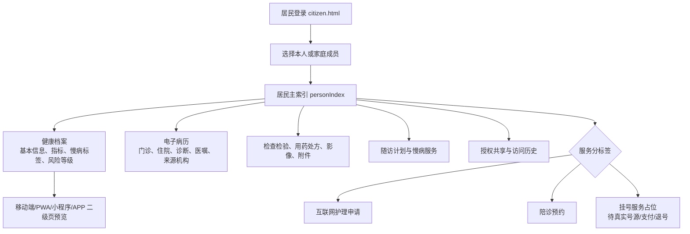

### 4.3 慢病管理与院后随访

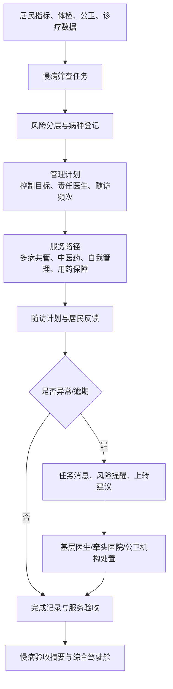

### 4.4 互联网护理服务

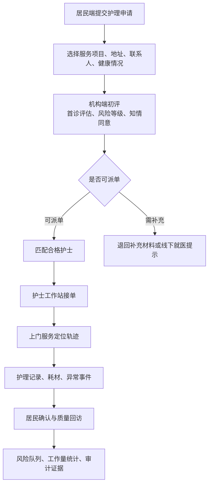

### 4.5 助医陪诊服务

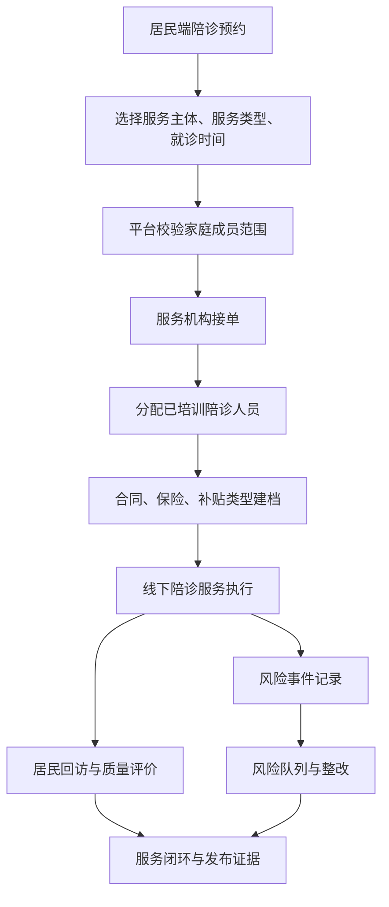

### 4.6 区域诊疗数据共享

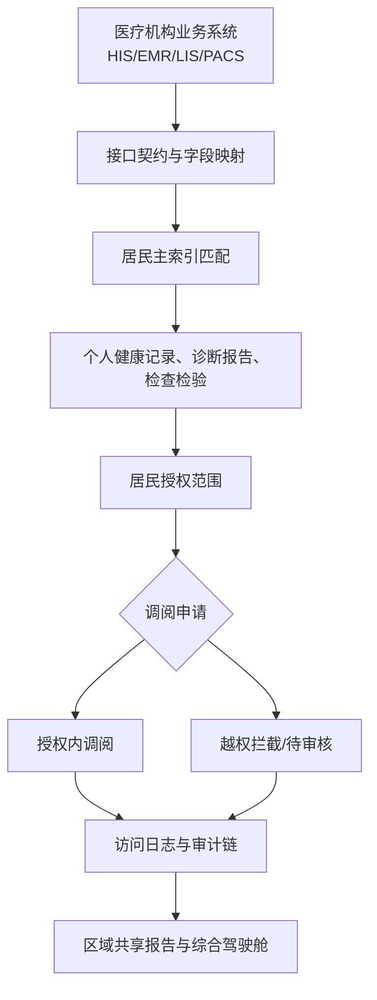

### 4.7 医联体转诊与远程会诊

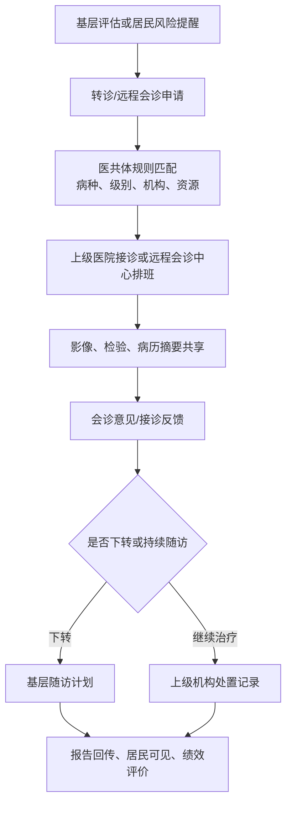

### 4.8 医疗质量与安全监管

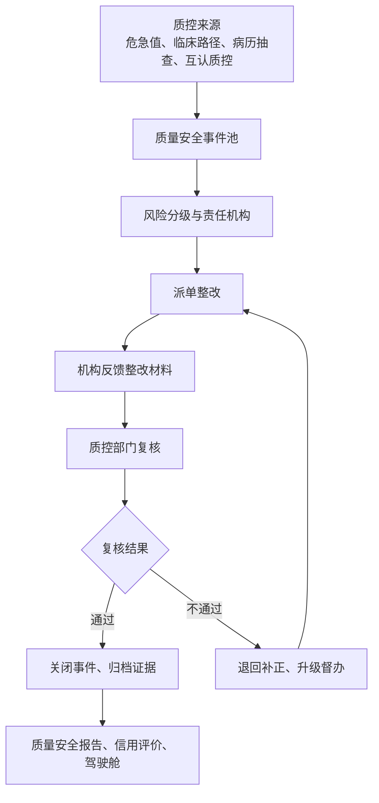

### 4.9 医院运行监测与资源调度

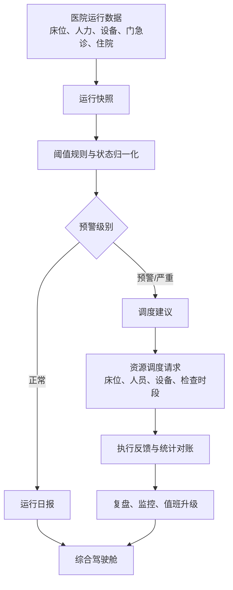

### 4.10 药品耗材、合理用药与医保协同

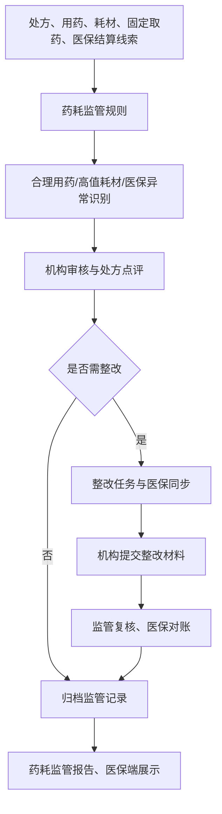

### 4.11 妇幼健康与出生证照

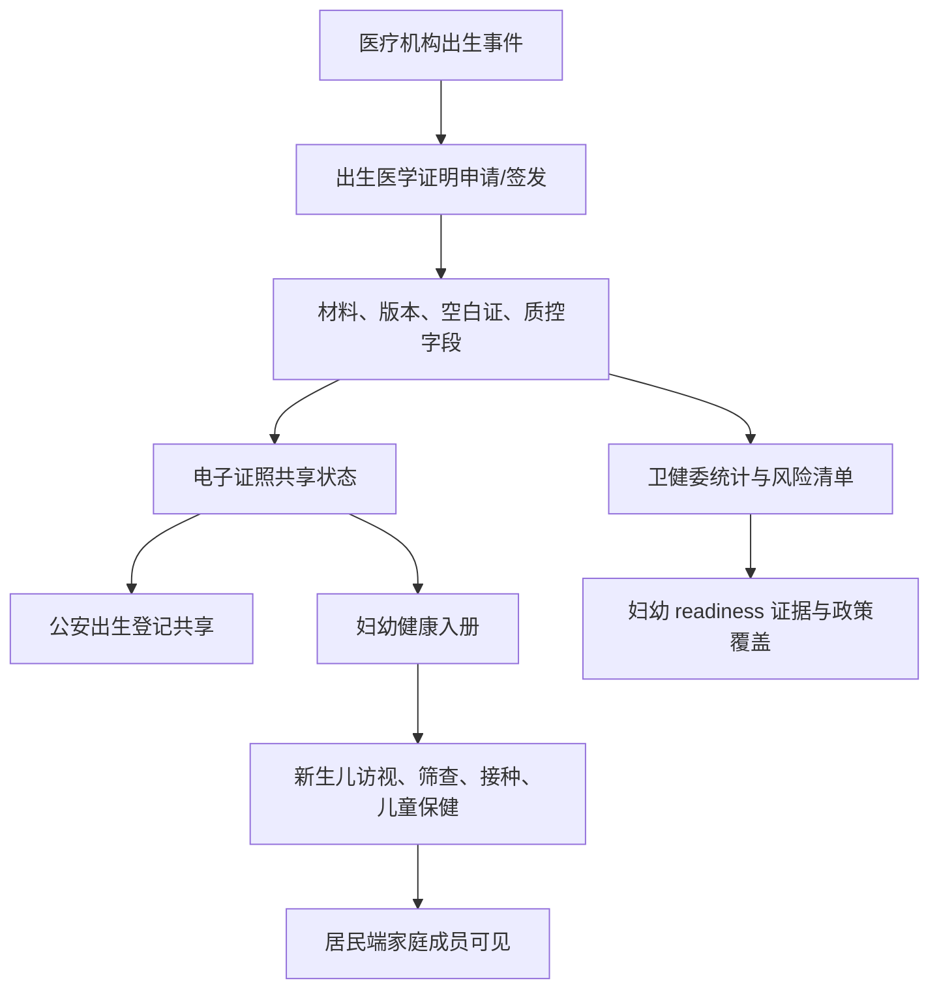

### 4.12 医师多点执业

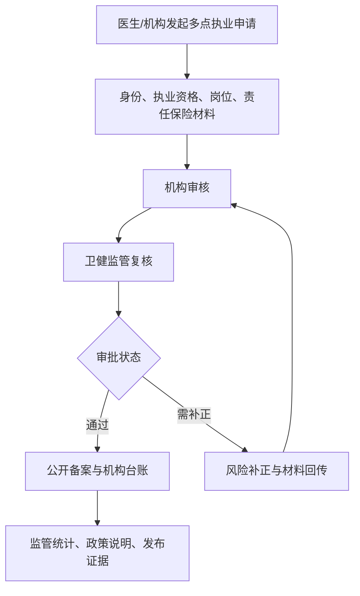

### 4.13 科研数据集与数据沙箱

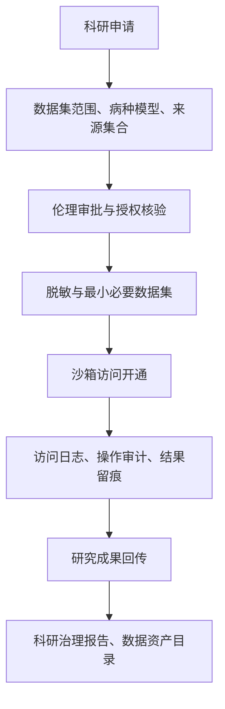

### 4.14 综合驾驶舱、发布证据与上线门禁

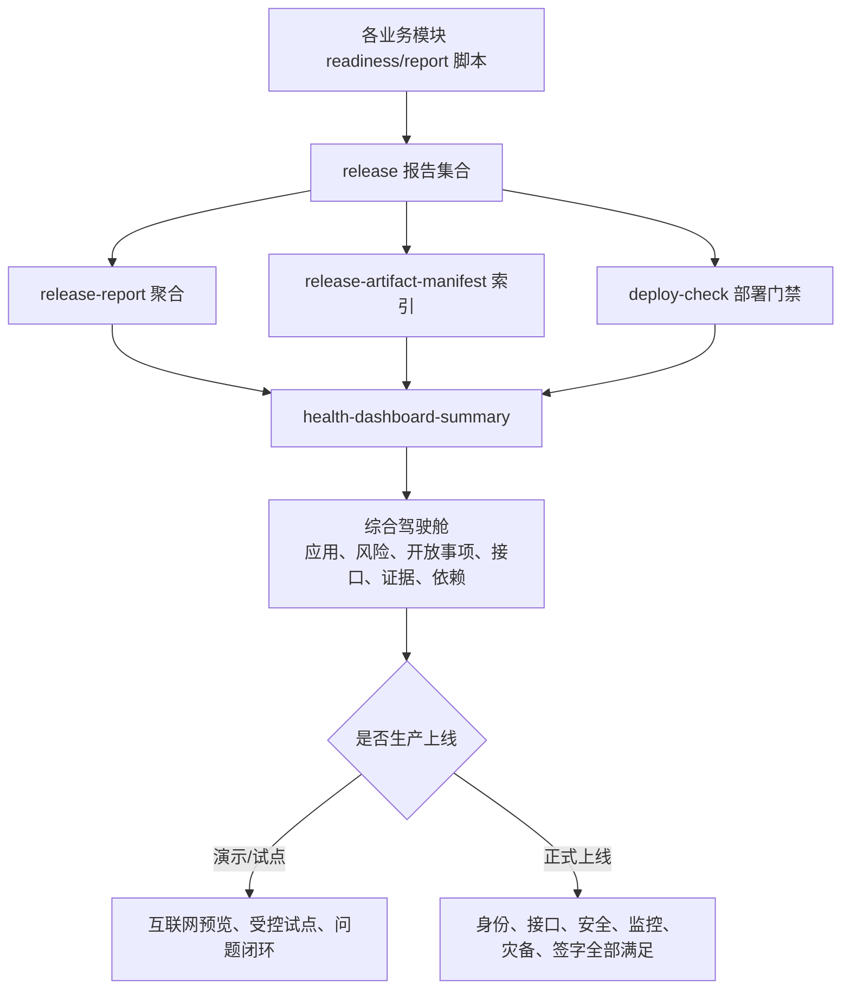

## 5. 当前上线状态判断

| 层级 | 状态 | 说明 |
|---|---|---|
| 演示与互联网预览 | 可用 | 静态页面、演示数据、PWA/移动预览、角色入口、综合驾驶舱和发布证据已具备 |
| 受控试点 | 基本具备 | 居民端、互联网护理、陪诊、慢病随访等可进入小范围试点，但应使用白名单和试点机构 |
| 正式生产上线 | 未完成 | 仍需真实身份、真实接口、生产数据库、审计保全、监控告警、灾备演练、等保密评、现场签字 |

## 6. 优先上线建议

第一批建议上线“居民健康服务试点版”，范围控制为：居民端健康档案只读、电子病历/检查检验/用药只读、互联网护理申请与进度追踪、陪诊预约与回访、慢病随访提醒与居民反馈。暂不把在线诊疗、处方支付、医保结算、正式挂号退号、PACS 原图下载作为第一批承诺能力。

上线前必须完成以下门槛：

- 接入或模拟生产级实名身份、短信网关、家庭成员/监护人关系核验。
- 授权共享从“业务记录”升级为后端强制权限拦截，撤销后即时生效。
- 健康档案、电子病历、检验检查、用药记录明确数据来源、更新时间、可信等级。
- 护理和陪诊补齐服务协议、风险告知、人员资质、质量回访和投诉处理。
- 清理发布快照中的编码损坏标记，保证验收材料可读、可审计。
- 形成试点白名单、应急下线开关、问题闭环台账、日报看板和上线签字包。

## 7. 证据与后续维护

建议把本报告作为全系统功能说明的当前基线。后续每次新增模块或上线批次，应同步更新：

- 模块表中的入口、API、已实现能力和下一步重点。
- 对应 Mermaid 流程图中的角色、业务节点和外部接口。
- `release/*-readiness-report.*`、`release/release-report.*`、`release/release-artifact-manifest.*`。
- `docs/system-flow.md`、`docs/下一步开发规划.md` 和本报告。
