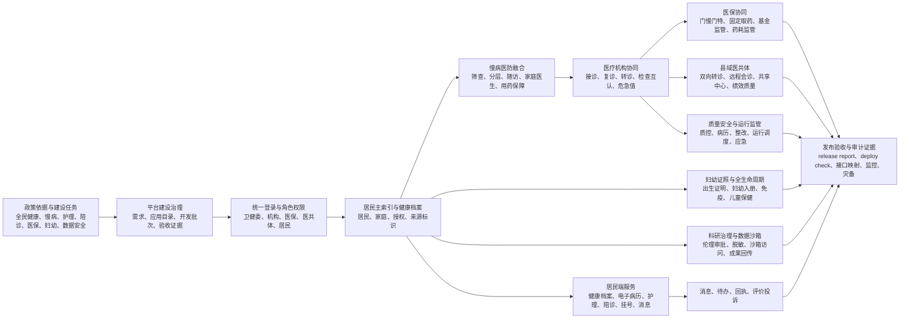
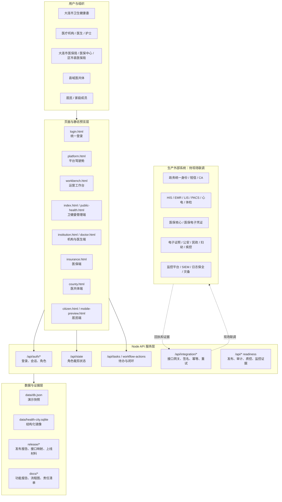
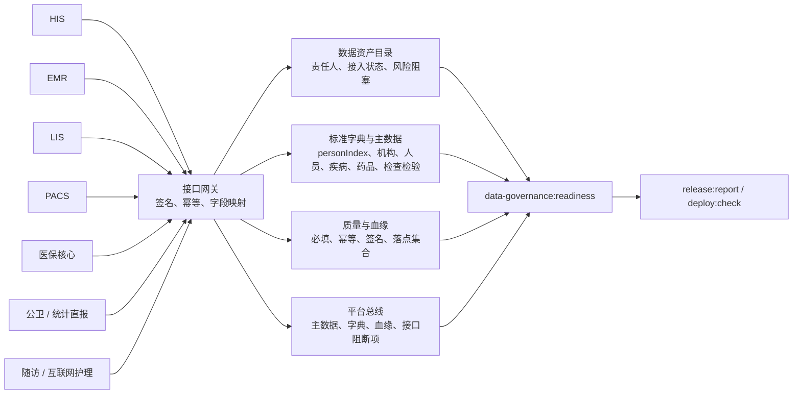

# 卫生健康信息平台全系统图谱集

生成日期：2026-07-15

本文档是本线程的上层架构图谱，用于汇报、评审、研发协同和现场联调说明。当前系统定位为“演示级与试运行准备系统”：已具备页面、Node API、静态快照、角色权限、接口契约、审计和发布证据；正式生产上线仍依赖真实身份源、真实外部接口、生产数据库、监控、安全测评、灾备演练和现场签字。

## 1. 全系统业务流

## 2. 技术拓扑

## 3. 数据治理与平台总线

## 4. 角色边界

| 角色 | 入口 | 主要能力 | 关键边界 |
| --- | --- | --- | --- |
| 大连市卫生健康委 | `index.html`, `platform.html`, `public-health.html` | 平台治理、公共卫生、统计质控、发布证据、上线阻塞项 | 只管理卫健职能，不代替医保业务审批 |
| 医疗机构 | `institution.html`, `doctor.html` | 接诊、随访、转诊、出生证、护理派单、检查互认 | 按机构和医生账号裁剪居民与业务数据 |
| 医保局 / 医保中心 / 区市县医保局 | `insurance.html` | 医保审核、门慢门特、固定取药、基金与药耗监管 | 与卫健端通过接口和证据协同，不混同组织身份 |
| 县域医共体 | `county.html` | 县域转诊、远程会诊、共享中心、互认、绩效 | 只查看医共体协同范围内数据 |
| 居民 / 家庭成员 | `citizen.html`, `mobile-preview.html` | 健康档案、授权、护理、陪诊、挂号、消息 | 不暴露管理集合和跨角色页面入口 |

## 5. 整体开发规则

1. 平台优先：新能力必须接入现有 `server.js`、角色页面、`/api/state`、发布报告和 readiness 链路，不能另起平行 mock。
2. 最小权限：所有 API 和页面必须经过角色、机构、居民家庭或业务范围裁剪；居民端不得读取管理集合。
3. 主索引优先：涉及居民的数据必须保留 `personIndex` 或可追溯居民标识，避免只靠姓名、手机号或临时字段关联。
4. 外部系统诚实标注：HIS、EMR、LIS、PACS、医保、公卫、证照、监控等真实接口未联调时，必须标为 `onsite blocked` 或 `external blocked`，不得写成生产已完成。
5. 证据闭环：每个可上线能力至少具备页面入口、API、数据样例、审计/消息或回执、readiness 脚本、测试、`deploy:check` 或 `release:report` 汇总。
6. 快照保护：预览和 API 探测优先使用临时 `DATA_DIR`；如果确需更新 `data/db.json`，只补充可审查 seed 和验收锚点，不能夹带运行态噪声。
7. 小步交付：每轮开发只做一个可验证切片，先跑聚焦测试，再跑 `npm.cmd run check`、相关 readiness、`deploy:check`、`release:report`。
8. 文档即门禁：架构、责任、上线边界和现场阻塞项必须有对应文档或报告，并用静态测试防止乱码、遗漏关键链路。

## 6. 下一阶段优先级

| 优先级 | 方向 | 验收方式 |
| --- | --- | --- |
| P0 | 生产身份、短信、CA、接口网关密钥、审计保全 | `env:check:production`、身份适配器 readiness、现场签字 |
| P0 | HIS/EMR/LIS/PACS/医保核心联调 | `interface:mapping`、接口回执、字段映射、失败补偿台账 |
| P1 | 数据治理底座扩展到平台总线 | `data-governance:readiness`、资产目录、字典、血缘、阻断项 |
| P1 | 居民端上线材料、护理/陪诊/挂号闭环 | `launch:smoke`、居民端发布面板、服务订单审计 |
| P1 | PostgreSQL/SQLite 生产同步与回滚 | 迁移包、shadow reconciliation、备份恢复演练 |
| P2 | 指标中心、科研沙箱、智能辅助、质量安全深化 | 专项 readiness、release manifest、平台驾驶舱入口 |
