# 公共卫生信息化系统全景图集

生成日期：2026-07-12
适用范围：已纳入平台公共卫生、医防融合、居民服务、医疗机构协同、数据治理、安全审计与上线治理能力。

## 阅读说明

本图集以逻辑架构和业务责任为主，不替代网络拓扑、IP 地址、密钥、供应商接口地址或现场签字材料。所有标记为“待现场联调”的节点均不构成生产上线证明。

| 阅读顺序 | 图集目的 | 主要读者 |
|---|---|---|
| 1-4 | 看清系统范围、业务能力和公卫闭环 | 卫健管理、疾控、项目管理 |
| 5-9 | 看清数据、接口、权限和居民服务路径 | 信息中心、业务处室、医院 |
| 10-14 | 看清医防协同、质控、安全和部署边界 | 医疗机构、等保、运维团队 |
| 15-17 | 看清监控、灾备和上线治理 | 运维、应急、上线指挥组 |

## 1. 业务能力全景图

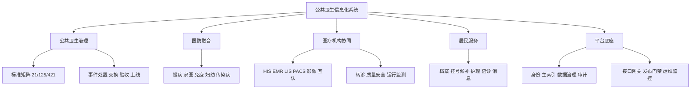

## 2. 逻辑系统拓扑图

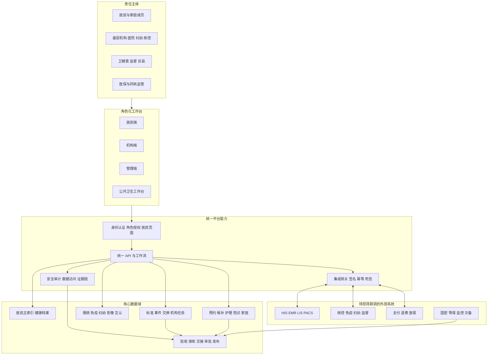

## 3. 公共卫生事件处置流程图

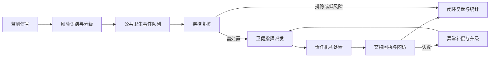

## 4. 标准实施、验收与上线治理流程图

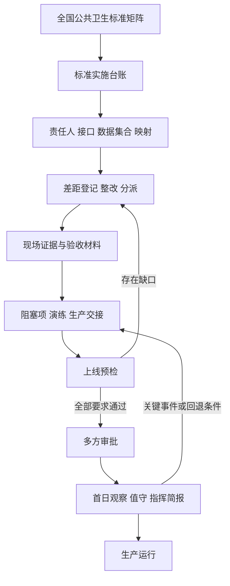

## 5. 数据流与数据血缘图

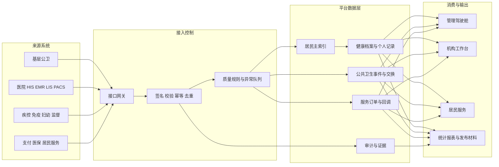

## 6. 预约回调与人工对账时序图

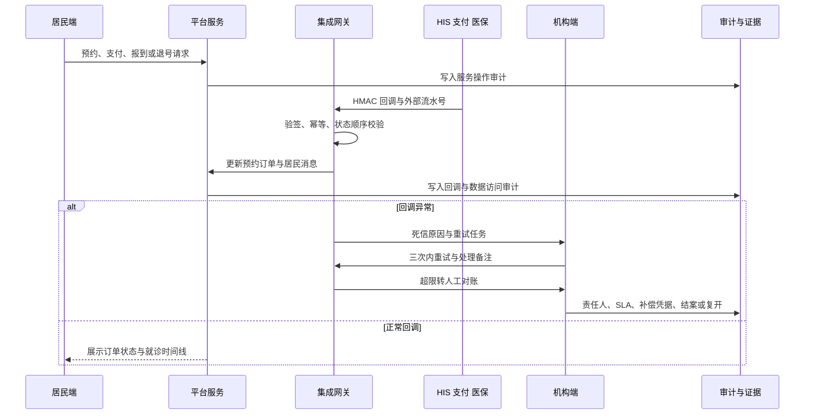

## 7. 角色权限与数据范围图

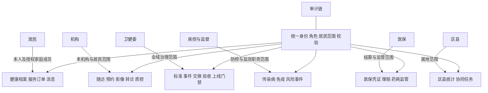

## 8. 居民服务旅程图

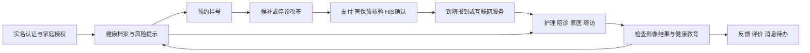

## 9. 预约、候补与改签状态流转图

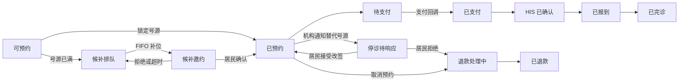

## 10. 慢病医防融合流程图

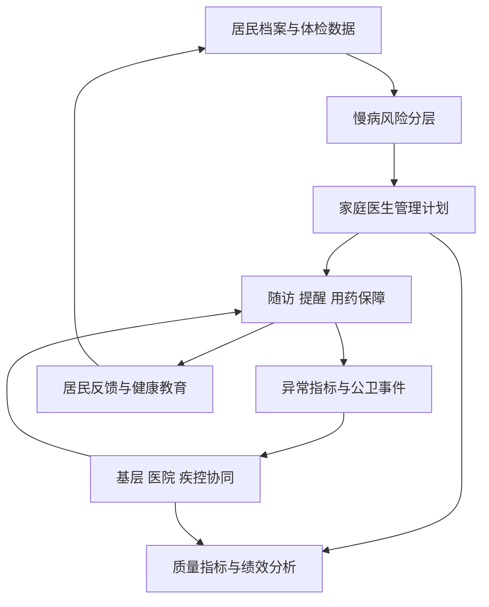

## 11. 免疫、妇幼与传染病协同图

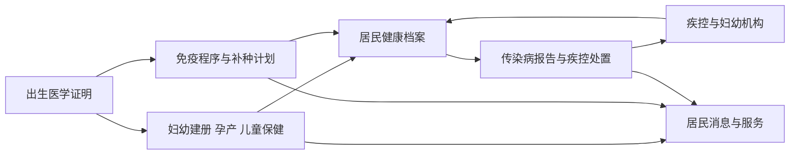

## 12. 医疗质量、安全与医院运行治理图

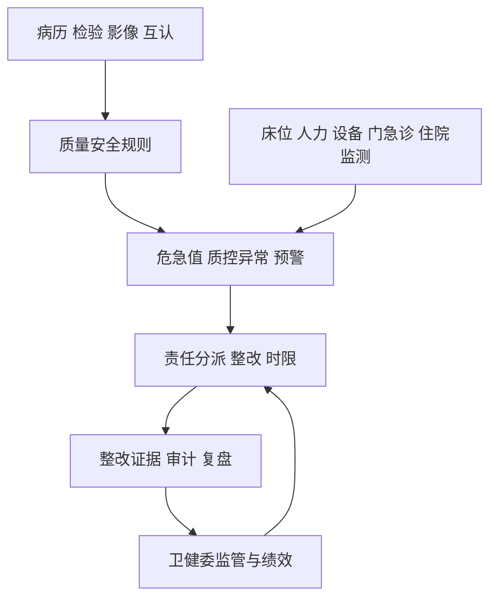

## 13. 安全与审计架构图

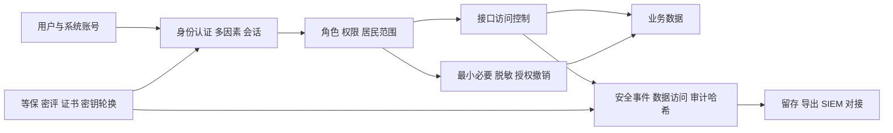

## 14. 部署与网络分区图

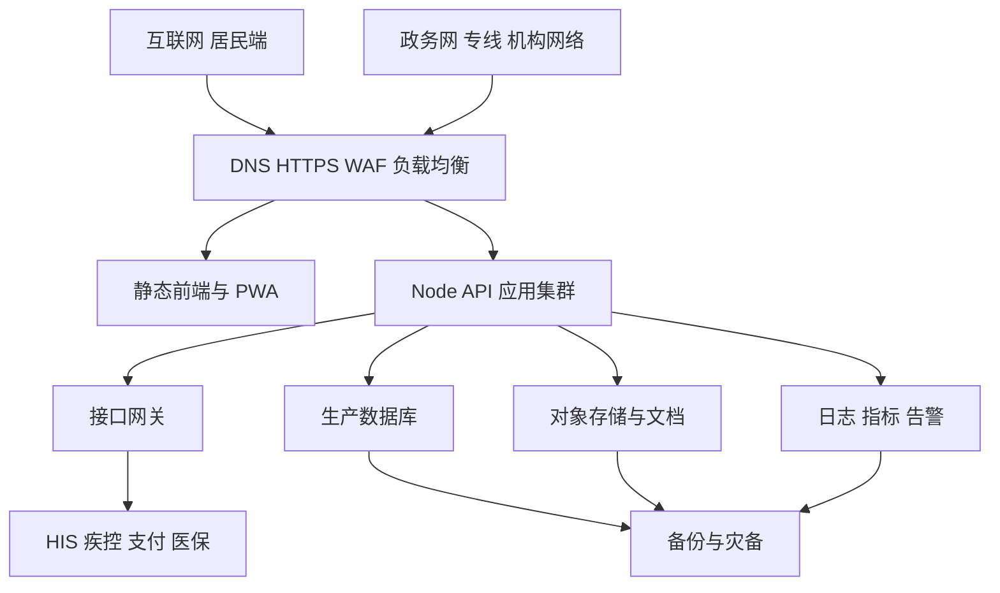

## 15. 运行监控与事件响应图

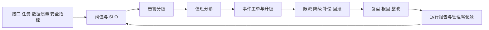

## 16. 灾备与恢复演练图

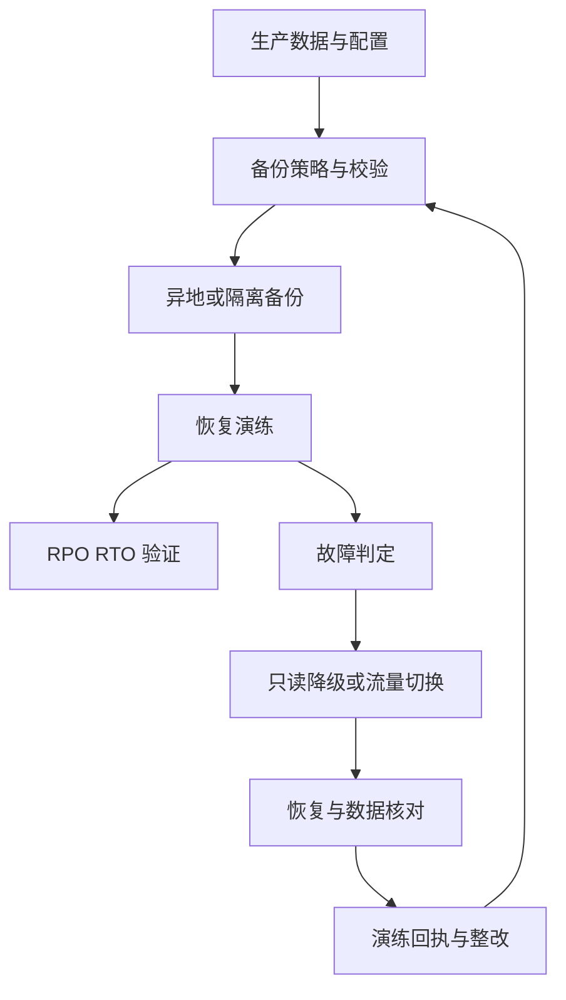

## 17. 上线治理与首日观察图

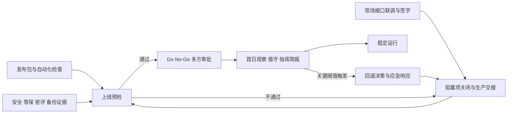

## 图集使用建议

1. 面向领导汇报：优先使用第 1、3、4、17 图。
2. 面向医院和疾控联调：优先使用第 5、6、7、11 图。
3. 面向信息中心和等保测评：优先使用第 2、13、14、15、16 图。
4. 面向居民服务运营：优先使用第 8、9、10 图。
5. 正式上线评审时，所有“待现场联调”节点必须替换为真实接口、验收记录、签字材料和生产监控证据。
