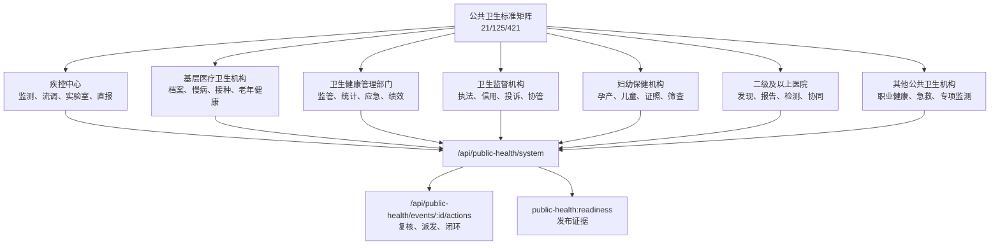

# 公共卫生信息化系统建设报告

生成日期：2026-07-08
建设依据：`C:/Users/drxuj/OneDrive/3.信息化/公共卫生/全国公共卫生信息化建设标准与规范.pdf`、`C:/Users/drxuj/OneDrive/3.信息化/公共卫生/全国公共卫生信息化建设标准与规范.jpg`

## 建设结论

本次已在现有卫生健康信息平台内建立公共卫生信息化系统，入口为 `public-health.html`，后端汇总接口为 `GET /api/public-health/system`，事件处置接口为 `POST /api/public-health/events/:id/actions`，发布校验脚本为 `public-health:readiness`，重点支撑平时管理、战时响应和医防融合。

系统按《全国公共卫生信息化建设标准与规范（试行）》固化 21/125/421 覆盖口径：

| 类型 | 一级指标 | 二级指标 | 三级指标 |
|---|---:|---:|---:|
| 管理服务业务 | 18 | 105 | 365 |
| 信息技术业务 | 3 | 20 | 56 |
| 合计 | 21 | 125 | 421 |

## 系统模块

| 模块 | 已落地能力 | 证据 |
|---|---|---|
| 标准矩阵 | 21 个一级指标逐项建模，记录二级/三级数量、牵头方、复用数据集合、接口方向和下一步现场依赖 | `publicHealthStandards`、`public-health.html` |
| 机构责任 | 覆盖疾控中心、基层医疗卫生机构、卫生健康管理部门、卫生监督机构、妇幼保健机构、二级及以上医院、其他公共卫生机构 | `publicHealthInstitutionScopes` |
| 平战结合事件 | 监测预警、指挥处置、随访复盘形成事件队列，覆盖传染病、免疫、慢病、食品安全、职业病和突发事件 | `publicHealthEvents`、`/api/public-health/system` |
| 事件处置闭环 | 支持卫健委端对风险队列执行疾控复核、指挥派发、闭环归档，动作写入事件历史和安全审计 | `POST /api/public-health/events/:id/actions`、`public-health.js` |
| 数据交换 | 建立直报、实验室、免疫、妇幼、应急、安全审计六类交换任务 | `publicHealthExchangeTasks` |
| 安全与验收 | 标准覆盖、机构覆盖、事件闭环、交换安全纳入 readiness 和发布清单 | `publicHealthReadinessEvidence`、`release/public-health-readiness-report.md` |

## 机构与业务边界

## 下一步开发计划

已新增 `docs/公共卫生信息化下一步开发计划.md`，按 5 小时开发切片和两周路线继续推进事件处置闭环、数据交换、机构协同和现场验收证据。当前 5 小时切片优先完成事件处置闭环，让公共卫生风险队列可执行、可追踪、可审计。

## 下一步现场依赖

1. 接入真实疾控直报、预防接种、妇幼保健、卫生监督、职业健康和食品安全风险监测接口。
2. 补齐 HIS/EMR/LIS/PACS、院感、急救和应急指挥系统的现场联调样例。
3. 归档等保、密评、国密、备份恢复、日志保全和现场签字材料。
4. 按属地业务处室确认每个标准域的责任人、处置时限、质控阈值和回执规则。

## 全部开发完成项

本轮已把下一步计划中的数据交换、机构协同和现场验收继续落到可运行系统中：

| 计划阶段 | 已完成能力 | 运行证据 |
|---|---|---|
| 数据交换 | 六类交换任务具备运行台账、回执状态、失败补偿、重放/人工复核路径 | `publicHealthExchangeRuns`、`POST /api/public-health/exchange-tasks/:id/runs` |
| 机构协同 | 七类机构形成角色化任务、账号状态、交接状态和下一步现场动作 | `publicHealthInstitutionTasks`、`POST /api/public-health/institution-tasks/:id/actions` |
| 现场验收 | 等保密评、接口联调、备份恢复、平战演练、账号确认和发布材料纳入验收清单 | `publicHealthOnsiteAcceptances`、`POST /api/public-health/onsite-acceptances/:id/actions` |
| 发布证据 | readiness、release-report、deploy-check、release manifest、静态/API 测试同步覆盖 | `public-health:readiness`、`release:report`、`deploy:check` |

公共卫生页面 `public-health.html` 已增加“交换运行”“机构协同”“现场验收”面板，并提供“记录回执”“完成协同”“记录签署”操作。所有动作均由卫健委端角色控制，写入 `securityEvents` 审计，动作标识分别为 `public-health-exchange-run`、`public-health-institution-task-action`、`public-health-onsite-acceptance`。

## 发布说明

当前发布的是演示/验收包：系统、接口、数据结构、前端工作台、发布报告和本地门禁已完成；正式生产切换仍需现场提供真实疾控直报、预防接种、妇幼、卫生监督、HIS/EMR/LIS/PACS、等保密评、国密设备和签字材料。上述现场材料已在 `publicHealthOnsiteAcceptances` 中形成阻断项和责任人，不会被误报为已经完成的外部依赖。

## 继续开发完成项：上线阻塞闭环

本轮继续开发新增 `publicHealthCutoverBlockers`，将正式生产上线前的外部阻塞项从现场验收清单中独立出来，覆盖疾控直报正式接口、HIS/EMR/LIS/PACS 院内账号和签名密钥、预防接种档案和冷链回执、等保密评与国密设备、公共卫生数据备份恢复演练、七类机构联系人与账号授权。

新增接口：`POST /api/public-health/cutover-blockers/:id/actions`，用于记录阻塞项整改证据、责任人、状态和后续动作，并写入 `securityEvents` 审计，审计动作名为 `public-health-cutover-blocker-action`。

前端 `public-health.html` 新增“上线阻塞”面板，`public-health.js` 新增 `renderCutoverBlockers` 和 `data-public-health-cutover-blocker` 操作入口；readiness 报告新增 `cutover:blockers`、`cutover:open-boundary`、`frontend:cutover-panel` 检查，并在发布报告中纳入 `publicHealth:cutoverBlockers`。

生产边界继续保持清晰：本地发布包可以跟踪和记录阻塞项整改证据，但只有现场真实接口、密钥、测评报告、备份恢复演练和签字材料全部到位后，才能关闭正式生产切换阻断条件。

## 继续开发完成项：上线准备度闭环

本轮继续开发在 `publicHealthCutoverBlockers` 之上新增 `publicHealthCutoverReadiness` 计算结果，将开放阻塞项、P0/P1 数量、证据记录数、7 天内到期项、逾期项、red/amber 升级状态和责任动作统一汇总为生产切换 gate。当前 release gate 为 `site-evidence-required`，原因是仍有 P0 阻塞项未关闭；当现场正式接口、密钥、测评报告、备份恢复演练和签字材料全部记录并关闭后，gate 才能转为 `production-ready`。

新增接口：`GET /api/public-health/cutover-readiness`，用于卫健委端读取上线准备度摘要、责任动作和阻塞项明细，并写入 `securityEvents` 审计，审计动作名为 `public-health-cutover-readiness`。`POST /api/public-health/cutover-blockers/:id/actions` 同步支持更新 `assignee`、`remediationStatus`、`siteWindow`、`reminderChannel` 和 `escalationLevel`。

前端 `public-health.html` 新增“上线准备度”面板，`public-health.js` 新增 `renderCutoverReadiness` 和 `buildStaticCutoverReadiness`，在静态预览和 API 运行态都能展示 release gate、P0 开放数、证据记录数、提醒渠道和下一步责任动作。发布校验新增 `cutover:readiness-board`、`frontend:cutover-readiness-panel`、`api:cutover-readiness` 和 `publicHealth:cutoverReadiness`，并同步纳入 `public-health:readiness`、`deploy:check`、`release:report`。

## 继续开发完成项：上线证据包签收闭环

本轮继续开发新增 `publicHealthCutoverEvidencePackets`，把每个 `publicHealthCutoverBlockers` 阻塞项拆成可逐项签收的证据包，覆盖正式直报接口确认、院内系统账号与签名密钥、预防接种档案回执、等保密评与国密设备、备份恢复演练、机构联系人和账号授权等 20 项必备材料。

新增接口：`GET /api/public-health/cutover-evidence-packets` 用于读取证据包看板，`POST /api/public-health/cutover-evidence-packets/:id/actions` 用于登记、核验或退回单项材料，并写入 `securityEvents` 审计，审计动作名为 `public-health-cutover-evidence-packet-action`。证据包动作会同步更新关联阻塞项的 `evidenceStatus`，并刷新 `publicHealthCutoverReadiness` 的证据摘要。

前端 `public-health.html` 新增“上线证据包”面板，`public-health.js` 新增 `renderCutoverEvidencePackets` 和 `data-public-health-cutover-evidence-packet` 操作入口；发布校验新增 `cutover:evidence-packets`、`frontend:cutover-evidence-panel`、`api:cutover-evidence-packets` 和 `publicHealth:cutoverEvidencePackets`，并同步纳入 `public-health:readiness`、`deploy:check`、`release:report`。

## 继续开发完成项：现场材料桥接闭环

本轮继续开发新增 `publicHealthSiteEvidenceBridge`，把通用上线材料 `siteLaunchEvidence` 与公共卫生上线证据包、现场验收清单、上线阻塞项和审批 gate 逐项映射，避免同一份正式接口、账号密钥、测评报告、备份演练和签字材料在多个看板重复登记。

新增接口：`GET /api/public-health/site-evidence-bridge` 用于读取桥接映射，`POST /api/public-health/site-evidence-bridge/actions` 用于登记桥接材料、同步证据包状态和刷新上线 gate，并写入 `securityEvents` 审计，审计动作名为 `public-health-site-evidence-bridge-action`。

前端 `public-health.html` 新增“现场材料桥接”面板，`public-health.js` 新增 `renderSiteEvidenceBridge` 和 `data-public-health-site-evidence-link` 操作入口；发布校验新增 `frontend:site-evidence-bridge-panel`、`api:site-evidence-bridge` 和 `docs:report` 覆盖，并同步纳入 `public-health:readiness`、`release:report`。

## 继续开发完成项：生产上线审批 gate

本轮继续开发新增 `publicHealthLaunchApprovals` 和 `publicHealthLaunchGate` 计算结果，把正式上线要求合并为 8 个阻断条件：21/125/421 标准矩阵、事件处置闭环、六类交换回执、七类机构交接、现场验收签字、20 项证据包核验、P0/P1 阻塞项关闭、多方上线审批。默认演示数据仍保持 `site-evidence-required`，因为现场真实接口、签字、测评、备份演练和审批材料没有全部到位；当所有条件通过后才会自动转为 `production-ready`。

新增接口：`GET /api/public-health/launch-gate` 用于读取上线 gate、阻断要求和审批队列，`POST /api/public-health/launch-gate/actions` 用于记录卫健委、疾控、医院、安全、运维和项目办审批动作，并写入 `securityEvents` 审计，审计动作名为 `public-health-launch-gate-action`。

前端 `public-health.html` 新增“上线审批 gate”面板，`public-health.js` 新增 `renderLaunchGate` 和 `data-public-health-launch-approval` 操作入口；发布校验新增 `launch:gate`、`frontend:launch-gate-panel`、`api:launch-gate` 和 `publicHealth:launchGate`，并同步纳入 `public-health:readiness`、`deploy:check`、`release:report`。

## 继续开发完成项：上线演练复测闭环

本轮继续开发新增 `publicHealthCutoverDrills`，把公共卫生正式切换前的接口彩排、应急指挥、安全合规、备份回退和上线会演练纳入统一 go/no-go 台账。每条演练记录关联上线阻塞项、证据包缺口、开放发现、复测状态和下一步责任动作，默认演示数据保持 `blocked`，避免在现场材料未到位时误判为可生产上线。

新增接口：`GET /api/public-health/cutover-drills` 读取上线演练看板，`POST /api/public-health/cutover-drills/:id/actions` 登记复测结果、开放发现、附件名称和下一步动作，并写入 `securityEvents` 审计，审计动作名为 `public-health-cutover-drill-action`。演练结果会联动 `publicHealthCutoverReadiness`、`publicHealthCutoverEvidencePackets` 和 `publicHealthLaunchApprovals`，但不会绕过 P0/P1 阻塞项关闭和多方上线审批。

前端 `public-health.html` 新增“上线演练”面板，`public-health.js` 新增 `renderCutoverDrills`、`buildStaticCutoverDrillBoard` 和 `data-public-health-cutover-drill` 操作入口；发布校验新增 `cutover:drill-board`、`frontend:cutover-drill-panel`、`api:cutover-drills` 和 `publicHealth:cutoverDrills`，并同步纳入 `public-health:readiness`、`deploy:check`、`release:report`。

## 继续开发完成项：现场材料桥接

本轮继续开发新增 `publicHealthSiteEvidenceBridge`，把通用现场上线材料台账 `siteLaunchEvidence` 与公共卫生 `publicHealthCutoverEvidencePackets` 建立显式映射：直报统计接口、HIS/EMR/LIS 联调、证照/免疫接续、安全审计、密钥国密配置、备份恢复演练、统一身份与机构账号授权等现场模板，分别映射到公共卫生 P0/P1 证据包条目、现场验收项和上线 gate。

新增接口：`GET /api/public-health/site-evidence-bridge` 读取现场材料桥接进度，`POST /api/public-health/site-evidence-bridge/actions` 按桥接项登记 verified 现场材料，并复用 `siteLaunchEvidence` 写入审计；公共卫生侧新增审计动作 `public-health-site-evidence-bridge-action`。桥接只会把已核验材料抵扣到公共卫生证据包和现场验收项，不会自动关闭 P0/P1 阻塞项，也不会绕过多方上线审批。

前端 `public-health.html` 新增“现场材料桥接”面板，`public-health.js` 新增 `renderSiteEvidenceBridge`、`buildStaticSiteEvidenceBridge` 和 `data-public-health-site-evidence-link` 操作入口；发布校验新增 `site-evidence:bridge`、`frontend:site-evidence-bridge-panel`、`api:site-evidence-bridge` 和 `publicHealth:siteEvidenceBridge`。

## 继续开发完成项：现场证据核验任务台

本轮继续开发新增 `publicHealthSiteEvidenceVerificationTasks`，把 9 项现场材料桥接要求拆成可分派、可核验、可升级的上线任务。任务记录责任人、核验角色、核验窗口、必查项、升级路径和匹配的现场证据 ID；只有任务状态为 `verified` 且引用的证据 ID 与已核验桥接材料一致时，才计入上线 gate，避免仅点击任务动作就误判材料已经到位。

新增接口：`GET /api/public-health/site-evidence-verification-tasks` 读取核验任务台，`POST /api/public-health/site-evidence-verification-tasks/:id/actions` 记录待核验、核验通过、退回或升级动作，并写入 `securityEvents`，审计动作名为 `public-health-site-evidence-verification-action`。核验结果会刷新 `publicHealthSiteEvidenceVerificationBoard` 和生产上线 gate，但不会自动关闭 P0/P1 阻塞项，也不会替代多方上线审批。

前端 `public-health.html` 新增“现场证据核验任务台”面板，`public-health.js` 新增 `renderSiteEvidenceVerificationTasks` 和 `data-public-health-site-evidence-verification-task` 操作入口；发布校验新增 `frontend:site-evidence-verification-panel`、`api:site-evidence-verification-tasks` 和 `docs:report` 覆盖，并同步纳入 `public-health:readiness`、`deploy:check`、`release:report`。

## 继续开发完成项：生产交接包 gate

本轮继续开发新增 `publicHealthProductionHandoffs`，把公共卫生正式上线前的接口移交、应急指挥移交、安全合规移交、运维回退移交、七类机构账号移交和发布归档移交纳入 production handoff gate。每个交接包记录责任方、接收方、必备签收项、关联证据包、发布归档材料和下一步现场动作；默认状态保持 `pending-site-handoff`，确保没有现场签收时不会误判为生产可切换。

新增接口：`GET /api/public-health/production-handoffs` 读取生产交接包看板，`POST /api/public-health/production-handoffs/:id/actions` 登记签收、退回、补证和发布归档动作，并写入 `securityEvents` 审计，审计动作名为 `public-health-production-handoff-action`。

前端 `public-health.html` 新增“生产交接包”面板，`public-health.js` 新增 `renderProductionHandoffs`、`buildStaticProductionHandoffBoard` 和 `data-public-health-production-handoff` 操作入口；发布校验新增 `production:handoffs`、`frontend:production-handoff-panel`、`api:production-handoffs` 和 `publicHealth:productionHandoffs`。所有交接包完成签收并归档 release artifacts 后，`launch-production-handoffs` 才能通过。
## 持续开发完成项：上线观察与回退台账

本轮继续开发新增 `publicHealthGoLiveObservations`，把正式切换首日的 API smoke、直报/医院回执、应急指挥值守、安全审计、备份回退待命和七类机构账号支持纳入 go-live observation 看板。默认状态为 `scheduled`，表示观察计划、指标阈值、回退触发条件和值班责任人已就绪；真实生产观察仍需上线当天登记，不会被静态计划误判为已经完成。

新增接口：`GET /api/public-health/go-live-observations` 读取上线观察与回退台账，`POST /api/public-health/go-live-observations/:id/actions` 登记 monitoring、passed、blocked、rollback 或 closed 观察动作，并写入 `securityEvents` 审计，审计动作名为 `public-health-go-live-observation-action`。

前端 `public-health.html` 新增“上线观察与回退”面板，`public-health.js` 新增 `renderGoLiveObservations`、`buildStaticGoLiveObservationBoard` 和 `data-public-health-go-live-observation` 操作入口；发布校验新增 `go-live:observation-plan`、`frontend:go-live-observation-panel`、`api:go-live-observations`、`docs:go-live-observations` 和 `publicHealth:goLiveObservations`。`launch-go-live-observation` 只校验观察计划完备、回退责任明确且无当前 critical signal；正式 production-ready 仍受现场证据、生产交接和多方审批 gate 约束。
## Launch Incident Desk Evidence

This release adds the launch incident desk for public health production go-live observation. The runtime data set is `publicHealthLaunchIncidents`; the commission API records actions through `POST /api/public-health/launch-incidents/:id/actions`; each action writes the audit event `public-health-launch-incident-action`.

The launch incident desk keeps first-day channels, SLA state, escalation owners, rollback decision owners, latest action evidence, and critical-open-ticket checks visible in the readiness and release evidence chain.

The default state is `desk-ready` with no actual open incident. This is a launch-day triage and rollback-decision readiness gate only; final `production-ready` still depends on signed site evidence, production handoffs, closed P0/P1 blockers, and multi-party launch approvals.

## Launch Duty Handoff Evidence

This release adds the launch duty handoff desk for public health first-day command operations. The runtime data set is `publicHealthLaunchDutyShifts`; the commission API records actions through `POST /api/public-health/launch-duty-shifts/:id/actions`; each action writes the audit event `public-health-launch-duty-shift-action`.

The launch duty handoff board keeps duty windows, primary owners, backup owners, contact channels, escalation owners, handoff checklists, linked go-live observations, linked launch incident lanes, and required evidence visible in `public-health:readiness`, `deploy:check`, and `release:report`.

The default state is `roster-ready`, meaning the roster and command handoff path are prepared. It is not proof of real production staffing completion; final `production-ready` still depends on signed site evidence, production handoffs, closed P0/P1 blockers, closed critical launch tickets, and multi-party launch approvals.

## Launch Command Brief Evidence

This release adds the launch command brief and status broadcast desk for public health first-day command operations. The runtime data set is `publicHealthLaunchCommandBriefs`; the commission API records actions through `POST /api/public-health/launch-command-briefs/:id/actions`; each action writes the audit event `public-health-launch-command-brief-action`.

The launch command brief board keeps prelaunch go/no-go, launch start, first receipt, T+8 stability watch, and T+24 first-day closure broadcasts aligned with `launchGate`, `cutoverReadiness`, `productionHandoffBoard`, `goLiveObservationBoard`, `launchIncidentBoard`, `launchDutyBoard`, and `siteEvidenceBridge`.

The default state is `briefing-ready`, meaning templates, audiences, source boards, duty links, observation links, incident links, publish channels, and decision owners are prepared. It is not proof that real launch-day outcomes have been published; final `production-ready` still depends on signed site evidence, production handoffs, closed P0/P1 blockers, closed critical launch tickets, and multi-party launch approvals.

## Launch Approval Preflight Guard

This release adds `publicHealthLaunchGate.approvalPreflight`, which summarizes the 13 non-approval launch requirements before a final multi-party decision can be recorded. The gate exposes the passed and blocked prerequisite counts, the blocking requirement IDs, and the required next actions to `GET /api/public-health/launch-gate`, `public-health:readiness`, and the launch gate panel.

`POST /api/public-health/launch-gate/actions` now defaults to `submitted`. A request with `status: approved` is rejected with HTTP 409 until every non-approval requirement passes. Final approval also requires the explicit confirmation `APPROVE PUBLIC HEALTH LAUNCH`. Each action records its `preflightStatus` and blocked requirement IDs in the approval history and the existing `public-health-launch-gate-action` security audit event.

The interface therefore shows `提交审批` while evidence, blockers, handoffs, drills, or site verification remain unresolved, and reveals `批准审批` only after the approvalPreflight becomes eligible. This prevents demo data or a single operator action from being mistaken for a real production release decision.

## Standard Implementation Ledger

This release adds `publicHealthStandardImplementationLedger` for all 21 public-health standard domains. Each record retains the responsible organization, 21/125/421 source range, linked data collections, interface mappings, required review checks, recorded gaps, and any separately verified `siteLaunchEvidence` reference.

The commission can inspect the complete ledger through `GET /api/public-health/standard-implementation-ledger` and record a mapping review, gap, escalation, or verified external evidence reference through `POST /api/public-health/standard-implementation-ledger/:id/actions`. Each state-changing action writes the security audit event `public-health-standard-implementation-action`.

The ledger is reported by `public-health:readiness`, `deploy:check`, and `release:report`. Structural mapping completion and a mapping-review record are traceability signals only: they do not create site evidence, clear P0/P1 blockers, sign production handoffs, or convert `site-evidence-required` to `production-ready`.

The commission page now exposes `record-standard-gap`, `escalate-standard-gap`, `assign-standard-gap-remediation`, `verify-standard-gap-remediation`, and `link-standard-site-evidence` alongside mapping review. A gap, escalation, assignment, or verification is rejected unless a specific note is supplied. Assignment additionally requires a remediation owner and a YYYY-MM-DD due date; verification additionally requires a verified `siteLaunchEvidence` row. A verified remediation closes only the ledger row's gap status: it does not close a P0/P1 blocker, sign a handoff, accept a site, or override `site-evidence-required`.

The remediation watch derives `remediationUnassigned`, `remediationDueSoon`, and `remediationOverdue` from each still-open ledger gap and its assigned due date. It provides commission users with a scan-friendly follow-up view, including due-day deltas and escalation prompts. These are operational warning signals only; they neither create site evidence nor change the production launch gate.

## Exchange Exception Compensation Desk

Each failed exchange run is now projected into `exchangeExceptionBoard`, which records its exception status, responsible owner, due date, escalation history and compensation receipt. Commission users can assign (`assign-exchange-exception`), escalate (`escalate-exchange-exception`) and resolve (`resolve-exchange-exception`) an exception through `POST /api/public-health/exchange-runs/:id/actions`. Every action requires a note; assignment also requires an owner and YYYY-MM-DD due date, while resolution requires a compensation receipt ID. The route writes `public-health-exchange-exception-action` to the security audit trail. An unresolved exchange exception blocks the `launch-exchange-receipts` requirement, but resolving it does not create site evidence, clear a P0/P1 blocker, sign a production handoff or override `site-evidence-required`.
