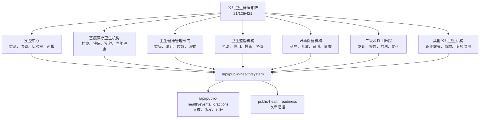

# 公共卫生信息化系统建设报告

生成日期：2026-07-08
建设依据：`C:/Users/drxuj/OneDrive/3.信息化/公共卫生/全国公共卫生信息化建设标准与规范.pdf`、`C:/Users/drxuj/OneDrive/3.信息化/公共卫生/全国公共卫生信息化建设标准与规范.jpg`

## 建设结论

本次已在现有卫生健康信息平台内建立公共卫生信息化系统，入口为 `public-health.html`，后端汇总接口为 `GET /api/public-health/system`，事件处置接口为 `POST /api/public-health/events/:id/actions`，发布校验脚本为 `public-health:readiness`，重点支撑平时管理、战时响应和医防融合。

系统按《全国公共卫生信息化建设标准与规范（试行）》固化 21/125/421 覆盖口径：

| 类型 | 一级指标 | 二级指标 | 三级指标 |
|---|---:|---:|---:|
| 管理服务业务 | 18 | 105 | 365 |
| 信息技术业务 | 3 | 20 | 56 |
| 合计 | 21 | 125 | 421 |

## 系统模块

| 模块 | 已落地能力 | 证据 |
|---|---|---|
| 标准矩阵 | 21 个一级指标逐项建模，记录二级/三级数量、牵头方、复用数据集合、接口方向和下一步现场依赖 | `publicHealthStandards`、`public-health.html` |
| 机构责任 | 覆盖疾控中心、基层医疗卫生机构、卫生健康管理部门、卫生监督机构、妇幼保健机构、二级及以上医院、其他公共卫生机构 | `publicHealthInstitutionScopes` |
| 平战结合事件 | 监测预警、指挥处置、随访复盘形成事件队列，覆盖传染病、免疫、慢病、食品安全、职业病和突发事件 | `publicHealthEvents`、`/api/public-health/system` |
| 事件处置闭环 | 支持卫健委端对风险队列执行疾控复核、指挥派发、闭环归档，动作写入事件历史和安全审计 | `POST /api/public-health/events/:id/actions`、`public-health.js` |
| 数据交换 | 建立直报、实验室、免疫、妇幼、应急、安全审计六类交换任务 | `publicHealthExchangeTasks` |
| 安全与验收 | 标准覆盖、机构覆盖、事件闭环、交换安全纳入 readiness 和发布清单 | `publicHealthReadinessEvidence`、`release/public-health-readiness-report.md` |

## 机构与业务边界

## 下一步开发计划

已新增 `docs/公共卫生信息化下一步开发计划.md`，按 5 小时开发切片和两周路线继续推进事件处置闭环、数据交换、机构协同和现场验收证据。当前 5 小时切片优先完成事件处置闭环，让公共卫生风险队列可执行、可追踪、可审计。

## 下一步现场依赖

1. 接入真实疾控直报、预防接种、妇幼保健、卫生监督、职业健康和食品安全风险监测接口。
2. 补齐 HIS/EMR/LIS/PACS、院感、急救和应急指挥系统的现场联调样例。
3. 归档等保、密评、国密、备份恢复、日志保全和现场签字材料。
4. 按属地业务处室确认每个标准域的责任人、处置时限、质控阈值和回执规则。

## 全部开发完成项

本轮已把下一步计划中的数据交换、机构协同和现场验收继续落到可运行系统中：

| 计划阶段 | 已完成能力 | 运行证据 |
|---|---|---|
| 数据交换 | 六类交换任务具备运行台账、回执状态、失败补偿、重放/人工复核路径 | `publicHealthExchangeRuns`、`POST /api/public-health/exchange-tasks/:id/runs` |
| 机构协同 | 七类机构形成角色化任务、账号状态、交接状态和下一步现场动作 | `publicHealthInstitutionTasks`、`POST /api/public-health/institution-tasks/:id/actions` |
| 现场验收 | 等保密评、接口联调、备份恢复、平战演练、账号确认和发布材料纳入验收清单 | `publicHealthOnsiteAcceptances`、`POST /api/public-health/onsite-acceptances/:id/actions` |
| 发布证据 | readiness、release-report、deploy-check、release manifest、静态/API 测试同步覆盖 | `public-health:readiness`、`release:report`、`deploy:check` |

公共卫生页面 `public-health.html` 已增加“交换运行”“机构协同”“现场验收”面板，并提供“记录回执”“完成协同”“记录签署”操作。所有动作均由卫健委端角色控制，写入 `securityEvents` 审计，动作标识分别为 `public-health-exchange-run`、`public-health-institution-task-action`、`public-health-onsite-acceptance`。

## 发布说明

当前发布的是演示/验收包：系统、接口、数据结构、前端工作台、发布报告和本地门禁已完成；正式生产切换仍需现场提供真实疾控直报、预防接种、妇幼、卫生监督、HIS/EMR/LIS/PACS、等保密评、国密设备和签字材料。上述现场材料已在 `publicHealthOnsiteAcceptances` 中形成阻断项和责任人，不会被误报为已经完成的外部依赖。
