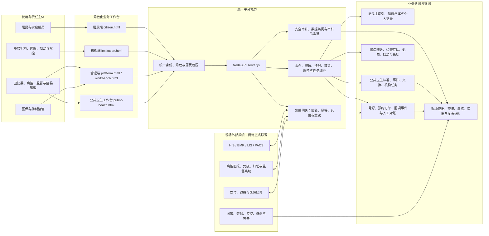
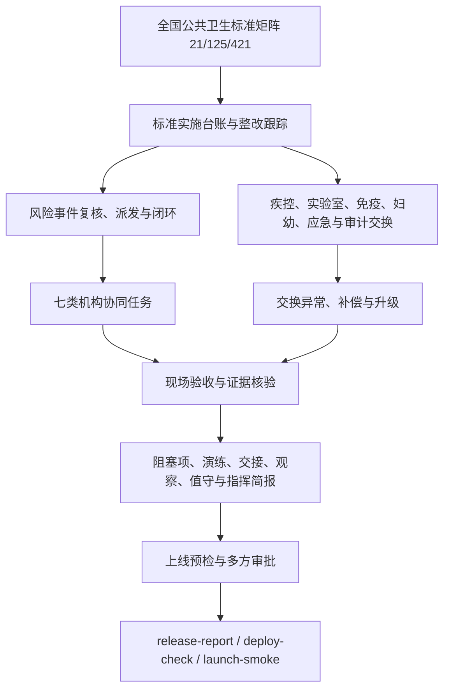
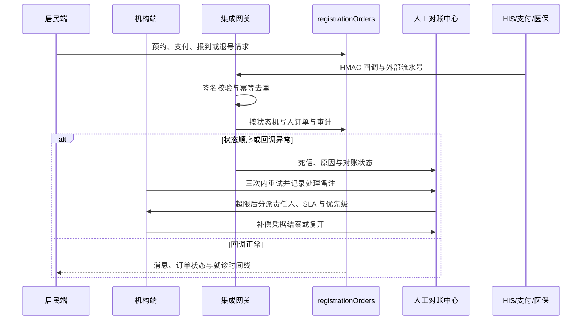

# 公共卫生信息化系统拓扑图

生成日期：2026-07-10
范围：本线程已落地的公共卫生标准实施、医防融合、居民服务、医疗机构协同、跨系统回调与发布上线门禁。

完整的分主题图集见 [公共卫生信息化系统全景图集.md](公共卫生信息化系统全景图集.md)。

## 总体拓扑

## 关键闭环

### 公共卫生上线与标准实施

### 预约挂号跨系统与异常处置

## 模块责任矩阵

| 层级 | 主要模块 | 已形成的闭环 | 生产边界 |
|---|---|---|---|
| 公共卫生业务 | 标准矩阵、事件、交换、机构协同、验收与上线工作台 | 21 个标准域映射、异常补偿、现场证据、上线预检 | 真实疾控、免疫、妇幼、监督与应急接口仍需现场签字联调 |
| 医防融合 | 慢病随访、家庭医生、风险提醒、居民反馈 | 风险分层、随访、基层与公卫任务联动 | 真实基层业务数据和政策口径需属地验证 |
| 医疗机构协同 | 影像云、检验互认、转诊会诊、质量安全、医院运行 | 数据接入、范围控制、审计、处置与报告 | HIS/EMR/LIS/PACS 真实报文、证书和授权仍待接入 |
| 居民服务 | 健康档案、预约挂号、陪诊、互联网护理、消息与家庭范围 | 角色范围、预约支付到退费、停诊改签、居民任务 | 正式支付、短信、统一身份与医院服务协议仍待验收 |
| 平台与治理 | 身份、主索引、接口目录、数据治理、安全审计、发布报告 | API 鉴权、数据访问审计、证据索引、发布门禁 | 生产密钥、国密产品、等保、监控与灾备证据不可由演示数据替代 |

## 本线程交付脉络

1. 公共卫生系统以标准矩阵为起点，逐步形成事件处置、交换回执、机构协同、现场验收、阻塞管理、交接、值守、指挥简报与上线审批闭环。
2. 慢病医防融合、妇幼、免疫、影像、转诊会诊、质量安全、医院运行和居民服务复用统一身份、居民范围、档案、任务与审计能力，不建设孤立数据岛。
3. 预约挂号已延展为签名回调、幂等、状态机、死信重放、机构人工对账、补偿凭据和居民停诊改签的完整演示链路。
4. 所有本地演示记录均保持 `productionReady=false`；`release:report`、`deploy:check` 和 `launch:smoke` 只证明代码与演示门禁就绪，不替代现场验收。

## 上线前必须闭合的外部边界

- 真实 HIS/EMR/LIS/PACS、疾控直报、免疫、妇幼、卫生监督、支付与医保接口地址、字段字典、签名样例及网络白名单。
- 正式机器身份、密钥轮换、证书、国密产品、等保与日志留存证据。
- 多方联调成功/失败/重试/死信/回滚证据，现场账号、服务台、值守与应急演练签字。
- 上线预检全部通过后，才可由多方审批将状态从 `site-evidence-required` 转为 `production-ready`。
