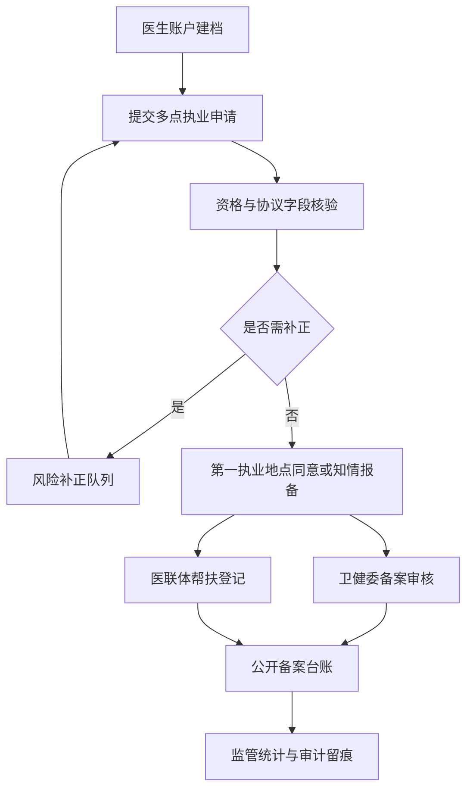

# 医师多点执业主要功能报告

## 报告定位

本报告梳理医生账户与医师多点执业模块的主要功能、角色边界、政策依据、数据对象、API 能力和发布证据。模块目标是把医师合理流动、第一执业地点同意或知情报备、协议责任、责任保险、信息公开和卫健监管纳入同一业务闭环，服务医联体帮扶、基层慢病联合门诊和优质医疗资源下沉。

## 主要功能矩阵

| 功能域 | 使用角色 | 页面入口 | 核心数据 | 主要能力 | 验收证据 |
| --- | --- | --- | --- | --- | --- |
| 医生账户档案 | 医生账户、医疗机构 | `doctor.html`、`GET /api/doctors/me` | `doctorProfiles.electronicRegistration` | 展示执业证号、职称、专业、第一执业地点、定期考核、电子化注册核验、本人多点执业汇总和关联功能 | `renderDoctorAccounts`、医生登录角色、`multiPracticeSummary`、`verifyDoctorElectronicRegistration` |
| 多点执业申请 | 医生账户、医疗机构 | `doctor.html`、`institution.html` | `multiPracticeApplications` | 医生端填写拟执业机构、科室、范围、期限、排班、任务、责任、薪酬、保险和第一执业地点意见，机构端承接审核 | `multi-practice-form`、`POST /api/multi-practice-applications` |
| 政策与材料核验 | 医疗机构、卫健委 | `institution.html`、`index.html` | `multiPracticePolicy`, `compliance`, `documentChecks`, `riskFlags`, `primaryPracticeConfirmation` | 核验职称、年限、定期考核、电子化注册、范围一致性、协议完整性、第一执业地点电子确认、保险、排班冲突，并同步风险补正标记 | `syncMultiPracticeDocumentChecks`、`multiPracticeRiskFlags`、医生端材料核验标签 |
| 卫健监管台账 | 卫健委 | `index.html` | `multiPracticeApplications` | 展示总量、待审、备案、公开台账、风险补正和材料核验 | `renderMultiPracticeGovernance`、`GET /api/multi-practice-registry` |
| 公开备案与风险补正 | 卫健委、医疗机构、公众查询 | `index.html`、`institution.html`、`GET /api/public/multi-practice-ledger` | `publicLedger`, `reviewQueue`, `scheduleConflictEvidence`, `externalSync` | 按公开字段输出备案台账，对协议缺失、保险缺失、排班冲突、退回补正形成队列，并保留对外同步结果 | `/api/multi-practice-registry.publicLedger`、`/api/public/multi-practice-ledger`、`reviewQueue`、`scheduleConflictEvidence`、`externalSync` |
| 医生医院闭环 | 医生账户、医院端 | `doctor.html`、`institution.html`、`GET /api/doctors/me`、`GET /api/messages` | `taskMessages`, `multiPracticeMessages` | 医生提交申请后推送医院端待处理消息，医院端确认或退回后医生端收到回执 | `buildMultiPracticeTaskMessage`、`/api/workflow-actions` |
| 政策说明与发布证据 | 发布与审计 | `about.html` | `docs/医师多点执业政策说明.md` | 固化政策边界、字段映射、角色清单、流程图、上线依赖和验收规则 | `test/static.test.js`、本报告 |

## 三端功能边界

- 医生账户和医疗机构负责申请登记、医师电子化注册核验、协议补齐、第一执业地点电子确认或知情报备、医联体帮扶登记、本人申请汇总、医院端处理消息、材料核验标签和机构侧公开台账查看。
- 卫健委负责查看全量监管摘要、待审事项、风险补正、公开备案、材料核验和政策执行情况。
- 医保角色不参与多点执业监管台账访问；现有 API 回归测试要求医保访问 `/api/multi-practice-registry` 返回 403。

## 政策说明

- 国卫医发〔2014〕86号明确多点执业是医师在有效注册期内，于两个或两个以上医疗机构定期从事执业活动。
- 慈善义诊、公益巡回医疗、突发事件救援、公共卫生服务项目和外出会诊不按本模块多点执业申请管理。
- 申请应关注执业类别和范围一致、中级及以上职称、同专业工作年限、最近两个周期定期考核、第一执业地点同意或知情报备。
- 系统已将医师电子化注册核验建模为 `doctorProfiles.electronicRegistration`，核对执业证号、类别、范围、第一执业地点、有效期和电子签章。
- 系统已将第一执业地点意见建模为 `primaryPracticeConfirmation`，记录确认方式、经办人、机构、时间、签章编号和意见，并同步到 `documentChecks.firstPracticeConsent`。
- 劳务协议应约定执业期限、时间安排、工作任务、医疗责任、薪酬和相关保险；医疗损害或纠纷由当事医疗机构和医师依法处理。
- 系统支持多点执业信息公开，形成可监管的公开备案台账。

## 流程图

## 发布证据

- About 页面：`about.html` 的 `data-about-section="multi-practice-policy"` 和 `data-about-flow="multi-practice"`。
- 政策说明：`docs/医师多点执业政策说明.md`。
- 主要功能报告：`docs/医师多点执业主要功能报告.md`。
- 医生端入口：`doctor.html` 的本人医生档案、多点执业申请表、材料核验标签和医院端回执。
- 机构端入口：`institution.html` 的多点执业政策校验、医院端待处理消息、第一执业地点确认和公开备案台账。
- 卫健委入口：`index.html` 的医师多点执业监管面板。
- API 证据：`GET /api/multi-practice-registry`、`GET /api/public/multi-practice-ledger`、`GET/POST/PATCH /api/multi-practice-applications`、`GET /api/doctors/me`。
- 测试证据：`test/api.test.js` 覆盖监管台账权限边界、医生账户汇总、医生提交、医院端消息接收、医院确认回执、`workflow-actions` 审计导出、PATCH 后材料核验与风险标记同步；`test/static.test.js` 覆盖 About、政策说明和报告入口。
- Readiness 证据：`npm.cmd run multi-practice:readiness` 生成 `release/multi-practice-readiness-report.md`，覆盖电子化注册和第一执业地点电子确认。

## 本轮闭环增强

- 排班冲突自动识别：`detectMultiPracticeScheduleConflicts` 根据同一医生、同一排班文本和仍有效的多点执业记录生成 `scheduleConflictEvidence`，并同步到 `documentChecks.scheduleConflict` 与 `riskFlags`。
- 生命周期动作闭环：医院端已支持 `return-correction`、`suspend`、`withdraw`、`terminate` 和备案通过动作，对应退回补正、暂停执业、撤回申请、终止备案和公开备案。
- 公开备案查询：新增 `GET /api/public/multi-practice-ledger`，按 `q`、`doctorName`、`institution`、`status` 查询公开台账，只返回医生姓名、执业范围、第一执业地点、拟执业机构、期限、排班和备案状态等公开字段。
- 外部系统同步证据：新增 `externalSync`，记录医师电子化注册 `electronicRegistration`、第一执业地点电子签章 `eSignature`、院内 HIS/HR 人事映射 `hisHr` 的同步状态和签章编号。
