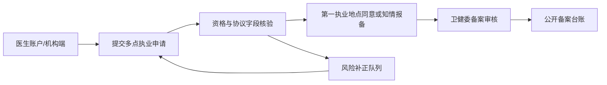

# 医师多点执业政策说明

## 政策依据

本模块依据《国家卫生计生委等五部门关于印发推进和规范医师多点执业的若干意见的通知》（国卫医发〔2014〕86号）建立演示能力。政策核心目标是促进优质医疗资源平稳有序流动、鼓励医师到基层和资源薄弱地区服务，同时通过资格、协议、责任、考核和信息公开保障医疗质量安全。

## 适用边界

- 多点执业：医师在有效注册期内，于两个或两个以上医疗机构定期从事执业活动。
- 不纳入本模块申请管理：慈善或公益性巡回医疗、义诊、突发事件或灾害事故医疗救援、基本和重大公共卫生服务项目、按外出会诊规定开展的会诊。
- 医联体帮扶：对口支援、支援基层、帮扶托管、医疗集团或医疗联合体内服务可按帮扶登记管理，系统重点记录任务、机构、期限、排班和备案状态。

## 系统功能边界

- 医生账户：医生登录后查看本人档案、执业证号、职称、专业、第一执业地点和已提交的多点执业申请。
- 机构端：医疗机构提交多点执业申请，补齐拟执业机构、科室、执业期限、排班、工作任务、医疗责任、薪酬、保险和第一执业地点意见。
- 卫健委端：监管多点执业申请总量、待审事项、备案公开、风险补正、材料核验和公开备案台账。
- API 台账：`GET /api/multi-practice-registry` 按角色返回监管摘要、公开备案、补正队列、材料核验和政策摘要。

## 材料与合规核验

系统根据当前演示数据生成以下核验结果：

- 资格条件：执业类别、执业范围、职称、同专业工作年限、最近两个周期医师定期考核。
- 第一执业地点：已同意、知情报备、医联体内帮扶免办手续或待确认。
- 协议字段：执业期限、时间安排、工作任务、医疗责任、薪酬、相关保险。
- 风险提示：公立医院院级领导限制、执业范围不一致、协议不完整、保险缺失、排班冲突、退回或补正状态。
- 信息公开：医生姓名、执业类别、执业范围、第一执业地点、拟执业机构、执业期限和监管状态。

## 数据对象

- `doctorProfiles`：医生账户档案、执业证号、职称、专业、第一执业地点、定期考核和可用功能。
- `multiPracticePolicy`：政策来源、资格规则、协议字段和管理规则。
- `multiPracticeApplications`：申请记录、合规核验、材料核验、生命周期、公开字段和监管状态。
- `securityEvents`：申请、审核、拒绝和越权访问的审计记录。

## 政策到系统字段映射

| 政策要求 | 系统字段或视图 | 核验方式 |
|---|---|---|
| 有效注册期、执业类别和执业范围 | `doctorProfiles.category`、`practiceScope`、`registrationValidUntil` | 医生档案和申请范围一致性核验 |
| 中级及以上职称、同专业满 5 年 | `title`、`yearsInSpecialty` | `compliance.titleQualified`、`compliance.fiveYears` |
| 最近两个周期定期考核无不合格记录 | `assessmentRecords` | `compliance.assessmentQualified` |
| 第一执业地点同意或知情报备 | `primaryConsent` | `documentChecks.firstPracticeConsent` |
| 劳务协议约定期限、时间、任务、责任、薪酬、保险 | `period`、`schedule`、`tasks`、`responsibility`、`compensation`、`insurance` | `compliance.agreementCompleted`、`documentChecks.cooperationAgreement`、`documentChecks.liabilityInsurance` |
| 各执业地点合理安排时间 | `schedule`、`scheduleConflict` | `documentChecks.scheduleConflict` 和补正队列 |
| 医疗责任由当事机构和医师依法处理 | `responsibility`、`lifecycle` | 申请表、审核记录和生命周期留痕 |
| 信息公开和社会监督 | `publicVisible`、`disclosureItems`、公开备案台账 | `/api/multi-practice-registry.publicLedger` |

## 角色操作清单

| 角色 | 主要操作 | 系统入口 |
|---|---|---|
| 医生账户 | 查看本人医生档案、提交多点执业申请、补齐协议和保险材料 | `institution.html` |
| 第一执业地点 | 同意或知情报备，确认排班不影响本机构岗位职责 | `institution.html` 工作流动作 |
| 拟执业机构 | 记录工作任务、责任约定、薪酬和保险安排 | `institution.html` 申请表 |
| 卫健委 | 查看总量、待审、风险补正、备案公开和材料核验 | `index.html`、`/api/multi-practice-registry` |
| 医保角色 | 不参与多点执业台账访问 | API 返回 403 |

## 风险补正口径

系统将以下情况纳入补正队列或风险提示：

- 职称、工作年限、定期考核、执业类别或执业范围不满足当前演示规则。
- 第一执业地点意见为待确认。
- 协议字段缺少期限、时间安排、工作任务、医疗责任、薪酬或保险。
- 勾选存在排班冲突。
- 公立医院院级领导存在非对口支援、帮扶托管、医联体等情形外的执业限制。
- 状态包含退回或补正。

## 关键流程

发布门禁同时要求 policy coverage 能识别 `flowchart TD` 流程图证据；本政策说明保留横向 LR 主图，主要功能报告提供 TD 流程图用于发布验收。

## 验收规则

- 医生账户只能查看本人多点执业申请。
- 医疗机构只能查看本机构作为第一执业地点或拟执业机构的申请。
- 卫健委可以查看全量监管摘要、公开台账和补正队列。
- 医保角色不得访问多点执业监管台账。
- API 回归测试覆盖 `/api/multi-practice-registry` 的卫健委、医生和医保权限边界。

## 上线依赖

正式上线前需对接医师电子化注册、医疗机构人事系统、医师定期考核、劳务协议、责任保险凭证、电子签章、属地备案规则和医疗质量安全监管流程。演示数据不替代真实行政审批、备案或执业许可结果。

## 关联报告

- 主要功能报告：`docs/医师多点执业主要功能报告.md`
