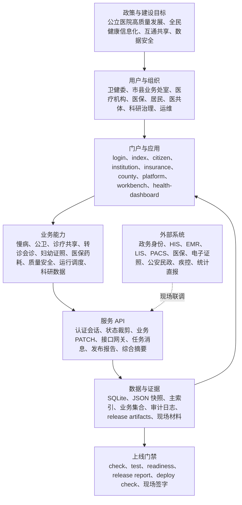

# 卫生健康信息平台研发报告

生成日期：2026-07-08
项目范围：`chronic-care-platform` 卫生健康信息平台、综合管理服务系统及已拆分专项应用 worktree
报告定位：用于研发汇报、阶段验收、后续排期和现场联调准备；不替代正式立项批复、政策解读、等保密评或生产上线审批。

## 1. 总体结论

本平台已经从单一慢病演示系统扩展为面向卫生健康行政部门、医疗机构、医保协同、居民端、县域医共体、科研治理和运维发布的一体化卫生健康信息平台。当前代码库已具备本地服务、静态预览、角色登录、数据快照、API 回归、发布报告和部署门禁能力，能够支撑方案展示、受控演示、联调准备和阶段验收。

已实现能力集中在四条主线：

1. 卫健管理端：慢病医防融合、统计证照、质量安全、应急预警、绩效监管、政策说明和综合管理驾驶舱。
2. 机构与医共体端：医疗机构服务、转诊会诊、检查检验互认、固定取药、医师多点执业、妇幼证照和县域协同。
3. 居民端：个人健康信息库、电子病历、检查检验、用药处方、家庭成员、授权共享、互联网护理、陪诊和移动端预览。
4. 平台底座：统一登录、角色权限、居民数据裁剪、SQLite/JSON 双路径、接口网关、数据质量、审计哈希链、发布证据和部署检查。

正式上线仍需补齐真实政务身份、生产数据库、HIS/EMR/LIS/PACS、医保核心、电子证照、卫生统计直报、监控告警、审计留存、备份恢复、等保密评、信创适配和现场签字。

## 2. 政策文件依据

| 政策文件 | 主要要求 | 平台研发落点 |
|---|---|---|
| [《国务院办公厅关于推动公立医院高质量发展的意见》（国办发〔2021〕18号）](https://www.nhc.gov.cn/tigs/c100053/202202/649129aba43d4e21945fc3bbe7d94cd4.shtml) | 推动公立医院高质量发展，强化治理体系、运行管理、智慧医院和信息化支撑 | 指标中心、医院运行监测、质量安全、运营效率、综合管理驾驶舱、发布门禁 |
| [《公立医院高质量发展促进行动（2021—2025年）》（国卫医发〔2021〕27号）](https://www.nhc.gov.cn/bgt/201809reh/202112/cef2a45b1edf4079a8aa0f759bae44b2/files/1733795732211_59112.pdf) | 围绕医疗质量、医疗服务、医学教育、临床科研、医院管理和信息化建设提升能力 | 质量安全、服务体验、科研数据集、绩效指标、智慧医院管理线预留入口 |
| [《公立医院高质量发展评价指标（试行）》](https://www.natcm.gov.cn/yizhengsi/gongzuodongtai/2022-09-16/27692.html) | 建立高质量发展评价指标体系，支撑改革成效评价 | 指标中心按运营、质量、安全、协同、公卫、科研、资源效率分类建模 |
| [国家公立医院绩效考核操作手册](https://www.nhc.gov.cn/cms-search/downFiles/d5b01488579745f79295852f8368f127.pdf) | 以绩效考核指标牵引医疗质量、运营效率、持续发展、满意度评价 | 指标卡片、指标口径、目标值、责任方、趋势和数据来源字段 |
| [《“十四五”全民健康信息化规划》（国卫规划发〔2022〕30号）](https://www.ndcpa.gov.cn/jbkzzx/c100030/common/content/content_1658745812574605312.html) | 建设全民健康信息平台，推进互联互通、数据共享、数字健康、安全保障 | 居民主索引、区域共享、接口契约、平台治理、数据质量、安全合规 |
| [《全国医疗卫生机构信息互通共享三年攻坚行动方案（2023—2025年）》相关公开答复](https://www.nhc.gov.cn/wjw/jiany/202508/b9a23ad761124c71a1111545580dd756.shtml) | 推进电子健康卡、检查检验互通共享、健康档案查询、平台互通和安全防护 | 检查检验互认、健康档案授权共享、接口网关、互联互通测评证据 |
| 《关于加强基层慢性病健康管理服务的指导意见》（平台既有政策覆盖材料引用为国卫基层发〔2025〕15号，正式报送前需复核现行有效文本和属地细则） | 加强基层慢性病健康管理、分级连续服务、家庭医生协同和质量控制 | 慢病筛查、风险分层、随访计划、居民反馈、用药保障、家庭医生闭环 |
| 《辽宁省医学影像云功能规范》（平台既有影像云建设依据，正式联调前需由属地业务主管部门复核版本） | 规范区域影像云接入、影像调阅、报告回传、移动端查阅和数据安全 | 医学影像云、DICOM/RIS/PACS 接入、移动端查看、EMR/健康档案同步、授权审计 |
| [《国家免疫规划疫苗儿童免疫程序及说明（2026年版）》](https://www.ndcpa.gov.cn/jbkzzx/c100013/common/content/content_2073003175839174656.html) | 明确儿童免疫程序、补种原则和特殊健康状态接种要求 | 免疫计划生成、出生证明接续、居民端查看、卫健委端风险提示、`immunization:readiness` |
| [《国家基本公共卫生服务规范（第三版）》](https://www.nhc.gov.cn/ewebeditor/uploadfile/2017/04/20170417104506514.pdf) | 规范居民健康档案、健康教育、预防接种、儿童、孕产妇、老年人、慢病管理等服务 | 居民健康档案、慢病随访、妇幼健康、免疫规划、公共卫生任务闭环 |
| 《关于加强基层慢性病健康管理服务的指导意见》（国卫基层发〔2025〕15号） | 强化基层慢病筛查、分层分类管理、患者自我健康管理、用药保障、医保协同和质量评价 | 慢病风险分层、管理计划、随访反馈、多病共管、固定取药、用药保障、质控指标和医保审核 |
| 《基层慢性病健康管理服务能力建设指引》（国卫办基层函〔2025〕39号） | 建设基层慢病健康管理中心，明确人员、设备、信息化、服务路径和质量管理要求 | 慢病服务角色、能力条件、服务路径、质量指标、验收台账和发布摘要 |
| 《国家免疫规划疫苗儿童免疫程序及说明（2026年版）》 | 明确儿童免疫程序、年龄规则、特殊健康状态提示、补种和逾期提醒要求 | 2026 版免疫规划算法、出生证明联动、居民端接种计划、卫健端逾期风险和 `immunization:readiness` |
| 《辽宁省医学影像云功能规范》《辽宁省医学影像云技术规范》 | 要求医院影像数据接入、DICOM/RIS/PACS/EMR 兼容、患者手机查看、授权分享、质控统计和安全传输 | 影像云接入、患者移动查看、EMR 主索引、授权分享、质控回写、DICOM TLS、HTTPS/AES 和 `imaging-cloud:readiness` |
| [《关于印发互联网诊疗管理办法（试行）等3个文件的通知》（国卫医发〔2018〕25号）](https://www.cac.gov.cn/2018-09/14/c_1123431844.htm) | 规范互联网诊疗、互联网医院和远程医疗服务，保障医疗质量安全 | 远程会诊、互联网护理、线上服务边界、机构端评估和审计留痕 |
| [《中华人民共和国网络安全法》](https://www.cac.gov.cn/2016-11/07/c_1119867116.htm)、[《中华人民共和国数据安全法》](https://www.cac.gov.cn/2021-06/11/c_1624994566919140.htm)、[《中华人民共和国个人信息保护法》](https://www.cac.gov.cn/2021-08/20/c_1631050028355286.htm) | 规范网络运行安全、数据处理、个人信息保护、风险监测和应急处置 | 角色权限、敏感字段脱敏、授权撤销、访问审计、哈希链、生产密钥和审计留存门禁 |
| [《医疗卫生机构网络安全管理办法》](https://www.natcm.gov.cn/hudongjiaoliu/guanfangweixin/2022-09-01/27516.html) | 指导医疗卫生机构加强网络安全、数据安全、责任分工和监督管理 | 等保密评信创台账、安全验收清单、生产门禁、日志保全和高风险事件视图 |

## 3. 系统总体架构

### 已实现总体能力

平台已形成统一登录、居民主索引、个人健康信息库、慢病医防融合、县域医共体、医学影像云、互联网护理、陪诊服务、妇幼健康、免疫规划、医保药耗监管、质量安全、数据治理、科研沙箱、综合驾驶舱和发布取证闭环。

已实现功能已按角色入口、业务闭环、数据治理、发布证据和现场联调边界归类，便于研发汇报和后续验收逐项核对。

## 4. 已实现功能与总体能力

| 模块 | 已实现能力 | 当前证据 |
|---|---|---|
| 统一登录与权限 | 演示账号、角色首页、签名会话、会话密钥轮换、非管理角色字段脱敏、居民数据裁剪、401/403 越权拒绝 | `login.html`、`auth.js`、`/api/auth/*`、`test/api.test.js` |
| 居民个人健康信息库 | 健康档案、电子病历、检查检验、用药处方、影像和附件分类、家庭成员、授权共享、访问历史、PWA/手机预览 | `citizen.html`、`mobile-preview.html`、`manifest.webmanifest`、`service-worker.js` |
| 慢病医防融合 | 筛查任务、风险分层、管理计划、随访、宣教、多病共管、中医药服务、自我管理、用药保障和质控指标 | `index.html`、慢病集合、`/api/service-acceptance-summary`、`docs/政策依据说明.md` |
| 基层与医共体协同 | 县域 16255 模型、协同工单、检查检验互认、基层 AI 病例、转诊会诊、报告回传和验收台账 | `county.html`、`/api/referral-teleconsultations`、县域业务集合 |
| 医疗机构服务 | 授权档案、诊疗工单、固定取药、证照办理、多点执业申请、第一执业地点确认和公开备案 | `institution.html`、`/api/multi-practice-registry`、`docs/医师多点执业主要功能报告.md` |
| 医保与药耗监管 | 医保局、医保中心、区县医保角色拆分；理赔审核、电子凭证、固定取药、基金监管、药耗线索和整改闭环 | `insurance.html`、`insuranceClaims`、`digitalCredentials`、药耗监管专项记录 |
| 妇幼健康与证照 | 出生医学证明、死亡医学证明、妇幼入册、新生儿访视、出生缺陷筛查、证照交换和人口统计 | `maternal-child-about.html`、`birthCertificates`、`deathCertificates`、`docs/妇幼健康主要功能报告.md` |
| 公共卫生与应急 | 公卫风险信号、慢病逾期预警、死亡证照和疾控死因链路、公共卫生任务汇总 | `emergencySignals`、`healthStatistics`、综合驾驶舱风险区 |
| 质量安全与运行调度 | 危急值、病历质控、互认质控、床位/人力/设备/门急诊/住院运行监测、调度预警和日报对账 | 专项 worktree 能力、综合驾驶舱汇总、发布报告索引 |
| 科研数据与专病库 | 科研数据集申请、伦理审批、脱敏发布、沙箱访问、使用审计、成果回流、专病库模型人工复核 | `platform.html`、`/api/research/*`、`researchDatasets`、`diseaseRegistryModels` |
| 数据治理与主索引 | SQLite/JSON 双路径、居民主索引、集合版本、乐观锁、409 冲突契约、备份恢复、脱敏快照、数据质量评分卡 | `server.js`、`scripts/storage-admin.js`、`/api/data-quality/*` |
| 安全合规与审计 | 安全事件、访问日志、审计哈希链、审计导出、安全合规报告、高风险事件视图、等保密评信创台账 | `/api/audit/verify`、`/api/security/compliance-report`、`release/audit-retention-report.*` |
| 平台治理与发布 | 应用目录、接口清单、平台证据、环境矩阵、监控就绪、运行就绪、生产数据库 readiness、release report、deploy check | `platform.html`、`workbench.html`、`scripts/release-report.js`、`scripts/deploy-check.js` |
| 综合管理服务系统 | 汇总前 7 个应用指标、风险、任务、接口、验收证据和现场依赖；增加出生、死亡、就诊、入院日/周/月/年看板 | 专项 worktree `08-health-dashboard`、`/api/health-dashboard/summary` |
| 指标中心 | 8 个指标、8 个维度、7 类改革分类、3 个预留汇聚入口；支持维度/状态筛选和下钻证据定位 | PR #10、`docs/health-dashboard-indicator-center-report.md`、远端 Actions success |

## 5. 当前工程与发布证据

| 证据类型 | 当前状态 | 说明 |
|---|---|---|
| 本地语法检查 | 已建立 | `npm.cmd run check` 覆盖前端、后端、脚本和测试文件语法 |
| API 回归测试 | 已建立 | `npm.cmd test` 覆盖认证、权限、审计、接口、发布报告、数据质量等 |
| 端到端验证 | 已建立 | Playwright/DOM 预览用于验证角色旅程和驾驶舱交互 |
| 发布报告 | 已建立 | `npm.cmd run release:report` 汇总文件、数据、身份、审计、接口、监控、运行、驾驶舱等门禁 |
| 发布清单 | 已建立 | `npm.cmd run release:manifest` 索引 release artifacts、模板和证据文件 |
| 部署检查 | 已建立 | `npm.cmd run deploy:check` 检查关键文件、集合、脚本和发布证据 |
| 专项 readiness | 已建立 | `internet-nursing:readiness`、`imaging-cloud:readiness`、`immunization:readiness`、`maternal-child:readiness`、`data-governance:readiness` |
| 综合驾驶舱摘要 | 已建立 | `health-dashboard:summary` 汇总优先应用指标、风险、任务、接口、验收证据和现场依赖 |
| 现场材料 | 已建模板 | 统一身份、接口联调、监控值守、生产签字、上线证据包仍需现场替换演示样例 |

## 6. 下一步开发计划

### P0：真实上线前必须完成

| 优先级 | 任务 | 交付物 | 验收口径 |
|---|---|---|---|
| P0-1 | 生产环境与数据库切换 | PostgreSQL/正式数据库适配、迁移、备份、恢复、回滚脚本 | 不再以 JSON 作为生产主存储；恢复演练有记录 |
| P0-2 | 政务统一身份与机构目录 | OIDC/SAML/CA/短信/医生身份源映射，机构和岗位权限矩阵 | 页面、API、字段三级权限一致，越权拒绝并留痕 |
| P0-3 | 审计留存与安全合规 | 审计导出目录或 SIEM、日志保全、密钥轮换、等保密评证据 | `/api/audit/verify` 通过，审计留存可复核 |
| P0-4 | 生产监控与灾备 | `/api/health`、`/api/metrics`、告警路由、值班升级、RTO/RPO 演练 | 监控告警可触达，灾备恢复达到现场目标 |
| P0-5 | 真实接口联调签字 | HIS/EMR/LIS/PACS、医保、电子证照、公安民政、疾控、统计直报 | 真实报文、截图、问题清单、整改复测和联合签字归档 |

### P1：业务闭环深化

| 优先级 | 任务 | 重点内容 |
|---|---|---|
| P1-1 | 指标中心深化 | 接入真实公立医院绩效考核、等级评审、质量安全、运营效率、服务体验、公卫协同和科研转化指标；建立指标版本、口径审核和数据质量分 |
| P1-2 | 智慧医院管理线汇聚入口 | 汇聚医疗质量安全、医院运行监测、科研平台、药品耗材监管模块指标，形成医院侧可下钻视图 |
| P1-3 | 医共体协同闭环 | 接入号源、床位、检查检验报告、会诊视频、下转随访和基层机构反馈 |
| P1-4 | 公卫闭环 | 接入疾控死因监测、传染病报告、免疫规划、慢病公卫随访和突发公共卫生事件处置 |
| P1-5 | 居民服务闭环 | 完善互联网护理、陪诊、挂号、随访、消息回执、评价投诉和质量回访 |

### P2：治理、智能化与持续运营

| 优先级 | 任务 | 重点内容 |
|---|---|---|
| P2-1 | 数据资产与主数据治理 | 建立指标目录、数据目录、接口目录、字段血缘、质量规则和授权台账 |
| P2-2 | 低风险 AI 辅助 | 优先落在政策问答、指标解释、报告生成、科研队列辅助和异常线索提示；不直接做自动诊断或处方 |
| P2-3 | 移动端与适老化深化 | 小程序/APP/PWA 发布材料、弱网模式、线下帮办、家属代办和老年用户可用性测试 |
| P2-4 | 运维运营体系 | 多环境发布、灰度回滚、变更审批、培训材料、热线工单、月度运行报告 |

## 7. 现场联调边界

当前平台可以作为研发演示、方案汇报、联调准备和阶段验收基础，但不应直接宣称为生产系统。生产上线前必须完成以下边界确认：

1. 数据来源边界：演示数据必须替换为现场真实接口、脱敏迁移数据或正式测试数据。
2. 身份权限边界：演示账号必须替换为政务统一身份、机构目录、人员岗位和居民实名关系。
3. 接口责任边界：平台只汇聚、督办、审计和下钻，不替代 HIS、EMR、LIS、PACS、医保、证照、公卫等源系统办理职责。
4. 安全合规边界：等保、密评、信创、日志留存、数据分级分类、个人信息保护影响评估需以正式材料归档。
5. 上线签字边界：部署门禁、接口联调、监控灾备、生产数据库、统一身份、审计留存均通过后，方可进入真实试运行。

## 8. 责任部门与验收证据矩阵

| 责任部门或角色 | 当前已承接功能 | 下一步联调责任 | 验收证据 |
|---|---|---|---|
| 规划信息处/信息中心 | 平台架构、接口目录、指标中心、综合管理服务系统、发布门禁 | 统筹统一身份、主索引、生产数据库、接口网关、监控告警和数据目录 | 接口清单、系统就绪报告、`health-dashboard:summary`、`release:report`、上线签字单 |
| 医政医管处 | 医疗质量安全、转诊会诊、检查检验互认、医院运行监管 | 组织 HIS/EMR/LIS/PACS、床位、会诊、互认和质控整改联调 | 真实报文、质控整改台账、互认记录、医院侧复核签字 |
| 基层卫生/公共卫生处 | 慢病医防融合、基层随访、家庭医生、公卫任务汇总 | 接入基层公卫、家庭医生签约、慢病随访、免疫规划和风险处置数据 | 随访闭环率、逾期清单、免疫规划核对记录、公卫任务处置证据 |
| 妇幼健康处 | 出生医学证明、妇幼入册、新生儿访视、出生人口统计 | 联调出生医学证明、省电子证照、公安户籍、妇幼专线和居民端接续 | 出生证照回执、撤销补正记录、共享对账单、妇幼风险清单 |
| 疾控/应急管理 | 死亡证明、死因监测、公卫风险、应急预警 | 联调疾控死因监测、传染病报告、突发事件处置和资源调度 | 死因编码回执、传染病报告样例、应急处置复盘记录 |
| 医保协同单位 | 医保审核、固定取药、电子凭证、药耗监管线索 | 联调医保核心、门慢门特、双通道、结算凭证和异地转诊规则 | 结算样例、凭证核验日志、基金监管线索、整改闭环 |
| 医疗机构 | 档案授权、诊疗工单、证照办理、多点执业、运行日报 | 提供真实院内系统接口、科室责任人、测试账号、样例数据和联合签字 | 院内接口联调单、科室确认记录、问题整改复测单 |
| 项目办/安全管理岗 | 发布报告、部署门禁、现场材料、安全审计和证据包 | 组织等保密评、信创适配、审计留存、灾备演练、培训和上线批准 | 等保密评材料、审计导出、灾备演练报告、培训签到、上线批复 |

## 9. 真实上线需求清单

| 类别 | 必备条件 | 未满足时处理 |
|---|---|---|
| 环境 | 生产域名、HTTPS、正式服务器、数据库、对象存储、备份目录、日志目录和时间同步 | 仅允许演示或联调环境运行 |
| 身份 | 政务统一身份、机构目录、人员岗位、医生身份源、居民实名和家庭/监护关系 | 不开放真实居民和机构业务数据 |
| 接口 | HIS/EMR/LIS/PACS、医保、电子证照、公安民政、疾控、公卫、统计直报有真实协议和样例报文 | 对应功能保留“演示/待联调”状态 |
| 数据 | 数据分级分类、脱敏迁移、主索引匹配、质量校验、历史数据回滚方案 | 不导入生产数据，不承诺统计口径 |
| 安全 | 等保、密评、信创、漏洞扫描、密钥轮换、审计留存、个人信息保护影响评估 | 不解除生产上线阻断 |
| 运维 | 监控告警、值班升级、备份恢复、灾备演练、灰度回滚、培训和热线工单 | 不进入连续运行或扩大试点 |
| 验收 | 联调签字、问题闭环、复测记录、上线审批、试运行报告和责任部门确认 | 不发布为生产 ready |

## 10. 近期里程碑

| 阶段 | 时间建议 | 目标 | 交付物 |
|---|---|---|---|
| M1：报告定稿与责任确认 | 1 周 | 固化政策依据、功能清单、责任部门和上线边界 | 本研发报告、责任矩阵、问题清单 |
| M2：最小现场样板 | 2 至 4 周 | 选择 1 家三级医院、1 个区县、1 个基层机构完成最小联调 | 身份样例、接口样例、日报样例、问题整改台账 |
| M3：生产底座验收 | 4 至 8 周 | 完成生产数据库、统一身份、审计留存、监控告警和备份恢复 | 环境验收单、灾备演练、监控截图、审计导出 |
| M4：业务闭环试运行 | 8 至 12 周 | 慢病、诊疗共享、证照、公卫、医保和指标中心进入小范围试运行 | 试运行报告、用户反馈、指标看板、上线审批材料 |

## 11. 建议近期推进顺序

1. 先合并并固化综合管理服务系统和指标中心，确保主平台、驾驶舱、release report 和 deploy check 证据一致。
2. 建立“政策依据—指标口径—数据源—责任部门—验收证据”的统一台账。
3. 选择 1 家三级医院、1 个区县、1 个基层机构作为最小现场联调样板。
4. 先联调统一身份、居民主索引、HIS/EMR/LIS/PACS 和统计日报，再扩展医保、电子证照、公卫和科研。
5. 每次新增模块必须同步页面入口、API、数据对象、测试、readiness、release artifact 和现场验收材料。
