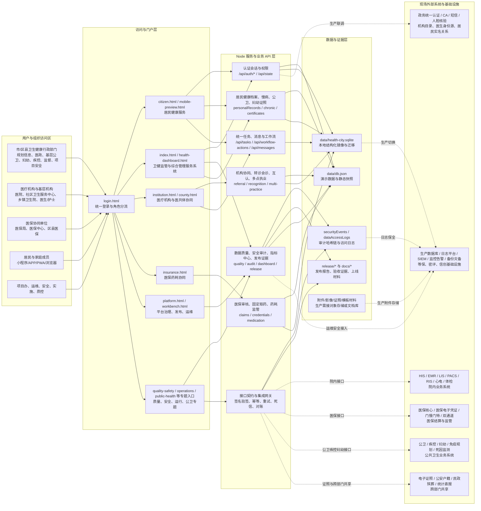
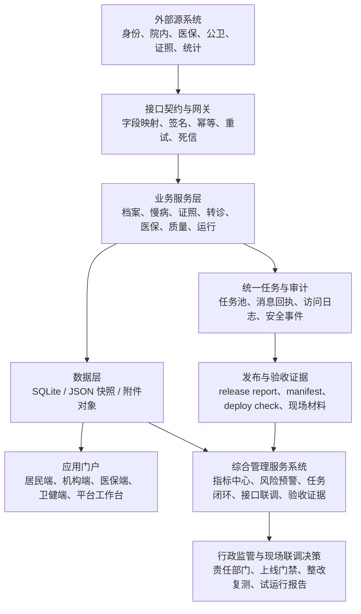

# 卫生健康信息平台系统拓扑图

生成日期：2026-07-08
适用范围：`chronic-care-platform` 主平台、综合管理服务系统、居民端、机构端、医保协同、医共体协同、公共卫生和平台治理模块。

## 1. 全系统拓扑图

## 2. 数据流向拓扑

## 3. 部署形态说明

| 形态 | 组成 | 适用场景 | 边界 |
|---|---|---|---|
| 静态预览 | HTML/CSS/JS + `data/db.json` | 方案展示、页面评审、非写入演示 | 不运行 Node API，不产生真实会话、写入、审计和接口调用 |
| 本地服务演示 | Node server + JSON/SQLite + 演示账号 | 研发验证、API 回归、角色流程演示 | 数据为演示快照，外部系统为模拟或预留接口 |
| 现场联调环境 | Node 服务 + 现场测试账号 + 接口样例 + 测试数据库 | 与医院、医保、公卫、证照、统计等系统联调 | 不承载正式生产数据，必须有测试数据和问题台账 |
| 生产试运行 | 正式身份源 + 生产数据库 + 监控告警 + 审计留存 + 灾备 | 小范围白名单试运行 | 必须完成等保密评、上线签字、接口验收和回滚方案 |

## 4. 拓扑组件清单

| 层级 | 组件 | 当前载体 | 下一步现场确认 |
|---|---|---|---|
| 用户与组织访问区 | 卫健、医疗机构、医保、居民、项目运维安全 | 演示账号、角色首页、数据裁剪 | 真实机构目录、人员岗位、居民实名和家庭/监护关系 |
| 访问与门户层 | 居民端、卫健端、机构端、医保端、平台工作台、专题入口 | `citizen.html`、`index.html`、`health-dashboard.html`、`institution.html`、`insurance.html`、`platform.html`、`workbench.html` | 生产域名、HTTPS、移动端发布、统一导航和访问审计 |
| Node 服务与业务 API 层 | 认证、任务、档案、慢病、公卫、转诊、医保、指标中心、发布证据 | `server.js`、业务脚本、readiness 脚本、release 脚本 | 多环境配置、接口限流、错误重试、灰度回滚和服务监控 |
| 数据与证据层 | JSON 快照、SQLite 镜像、审计日志、release artifacts、附件材料 | `data/db.json`、`data/health-city.sqlite`、`release/*`、`docs/*` | 生产数据库、对象存储、审计留存、数据分级分类、备份恢复 |
| 现场外部系统 | 身份、院内、医保、公卫、证照、统计、监控安全基础设施 | 接口契约、模拟接入、占位联调清单 | 正式协议、样例报文、签名密钥、测试账号、联合签字和问题台账 |
| 综合管理服务系统 | 指标中心、风险预警、任务闭环、接口联调、验收证据、上线门禁 | `health-dashboard.html`、`health-dashboard:summary`、发布证据 | 真实指标口径、责任部门、数据源、质量分、现场验收材料 |

## 5. 拓扑联调顺序

1. 先确认生产网络区、域名、证书、数据库、日志和备份边界。
2. 再接入政务统一身份、机构目录、人员岗位和居民实名关系。
3. 选择一家医院完成 HIS/EMR/LIS/PACS 最小接口样例联调。
4. 同步推进医保、电子证照、公卫疾控妇幼和统计直报接口样例。
5. 将接口回执、问题整改、复测结论和签字材料同步到 release evidence。
6. 最后由综合管理服务系统汇总指标、风险、任务、接口和上线门禁。

## 6. 联调责任矩阵

| 联调对象 | 主责部门 | 平台对接内容 | 必备验收证据 | 上线门禁 |
|---|---|---|---|---|
| 政务统一身份、机构目录、人员岗位 | 规划信息处、项目办、安全管理岗 | 登录会话、角色权限、机构人员映射、访问审计 | 测试账号清单、角色矩阵、审计导出、权限复核记录 | 未完成实名身份、最小权限和审计留存前不得开放生产访问 |
| HIS / EMR / LIS / PACS / RIS | 医政医管、医疗机构信息科、项目实施单位 | 患者索引、诊疗记录、检验检查、影像索引、转诊会诊回执 | 样例报文、字段映射、接口回执、问题台账、联合签字 | 未完成样例联调和异常回滚前不得承载真实诊疗数据 |
| 医保核心、电子凭证、门慢门特、双通道 | 医保协同单位、医政医管、药政相关岗位 | 医保资格、费用结算状态、药耗监管、待遇协同提示 | 医保接口协议、测试结算回执、差错处理记录、对账样例 | 未完成医保授权、对账规则和差错处置前不得进入生产结算流程 |
| 公卫、疾控、妇幼、免疫规划、死因监测 | 基层公卫、妇幼、疾控、医疗机构 | 公卫档案、慢病随访、妇幼证照、免疫接种、出生死亡事件 | 业务口径确认、样例数据、重复/缺失校验、复测结论 | 未完成口径确认和数据质量阈值前不得作为监管考核依据 |
| 电子证照、公安户籍、民政殡葬、统计直报 | 规划信息处、相关业务处室、跨部门接口单位 | 证照核验、实名关系、出生死亡校验、统计报送状态 | 接口授权文件、测试账号、证照核验回执、统计直报比对表 | 未完成跨部门授权和留痕机制前不得自动流转正式数据 |
| 生产数据库、日志平台、监控告警、备份灾备 | 项目办、安全管理岗、运维单位 | 多环境配置、日志审计、告警指标、备份恢复、灰度回滚 | 部署清单、监控截图、备份恢复演练、回滚演练、等保密评材料 | 未完成监控、备份、回滚和安全审批前不得发布上线 |
| 综合管理服务系统与指标中心 | 卫健行政主管部门、规划信息处、业务处室 | 指标汇总、风险预警、任务闭环、接口联调、验收证据、上线门禁 | `health-dashboard:summary`、readiness 结果、release report、问题整改闭环 | 未完成责任部门、指标口径、证据来源和现场签字前不得作为正式监管口径 |

## 7. 拓扑边界

1. 平台承担汇聚、监管、督办、下钻、审计和发布取证，不替代 HIS、EMR、LIS、PACS、医保、电子证照、公卫和统计直报等源系统的业务办理职责。
2. 综合管理服务系统是行政管理入口，指标中心只呈现指标口径、来源、责任、状态、质量和下钻证据，不直接修改源业务数据。
3. 居民端展示个人健康信息、授权共享、服务申请和消息回执，生产上线必须完成实名关系、监护关系、隐私协议、撤权拦截和移动端发布材料。
4. 生产上线必须以正式数据库、统一身份、接口签字、审计留存、监控告警、备份恢复、等保密评和现场审批作为门禁。
