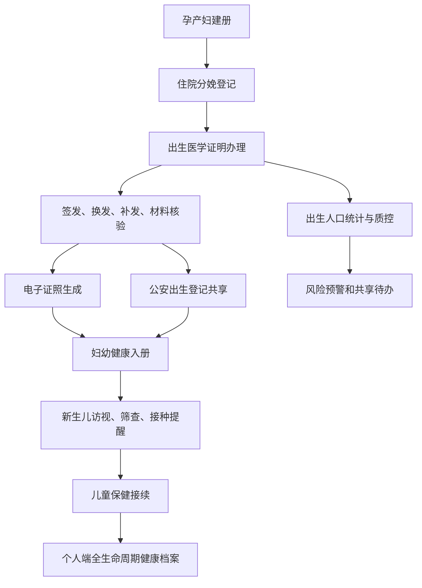

# 妇幼健康主要功能报告

## 报告定位

本报告梳理妇幼健康模块的主要功能、角色边界、数据对象、政策依据和发布证据。模块围绕出生医学证明办理、出生人口统计、妇幼入册、新生儿访视、出生缺陷筛查、预防接种、儿童保健接续和居民全生命周期健康管理形成闭环。

## 主要功能矩阵

| 功能域 | 使用角色 | 页面入口 | 核心数据 | 主要能力 | 验收证据 |
| --- | --- | --- | --- | --- | --- |
| 出生人口统计与监管 | 卫健管理端 | `index.html` | `birthStatistics`, `birthCertificates` | 展示出生证明、签发/上报、电子证照、公安共享、妇幼入册、低体重儿、质控补正和风险清单 | `renderBirthStatistics`, `renderMaternalChildCare`, `mch-risk-list` |
| 出生医学证明办理 | 医疗机构端 | `institution.html` | `birthCertificates`, `birthCertificateForms` | 登记新生儿和父母信息，办理首次签发、换发、补发、签发、上报入册和材料核验 | `birth-certificate-form`, `/api/birth-certificates`, `submitBirthCertificate`, `actionButton` |
| 出生人口健康管理 | 个人用户端 | `citizen.html` | `birthCertificates`, `personalRecords`, `deathCertificates` | 居民查看家庭成员出生证明、妇幼入册、新生儿访视、筛查、接种、低体重儿专案，并接续儿童保健、青少年健康、成人慢病、老年照护、临终授权和死亡证明闭环 | `renderBirthHealth`, `renderMaternalChildContinuity`, `lifecycle-summary` |
| 电子证照与公安共享 | 医疗机构端/卫健管理端 | `institution.html`, `index.html` | `birthCertificates`, `securityEvents` | 跟踪电子证照生成、公安出生登记共享、妇幼健康入册、共享失败审计和质控补正 | `electronicLicenseStatus`, `publicSecuritySync`, `maternalChildSync` |
| 政策与发布证据 | 发布与审计 | `maternal-child-about.html` | `docs/maternal-child-policy.md`, `docs/妇幼健康全模块说明.md` | 固化政策依据、流程图、三端边界、上线依赖和统一模板规则 | `maternal-child:readiness`, `release-artifact-manifest`, CI |

## 三端功能边界

- 卫健管理端负责出生人口统计、妇幼服务监测、风险趋势、质控补正和跨部门共享协同，不直接替代医疗机构办理业务。
- 医疗机构端负责出生医学证明申请、登记、签发、材料核验、状态更新、电子证照和上报入册。
- 个人用户端负责查看本人及家庭成员授权范围内的出生证明、出生健康记录和妇幼连续服务任务，并以 8 阶段生命周期时间轴接续儿童保健、青少年健康、成人健康、慢病康复、老年照护、临终授权和死亡证明闭环，不出现卫健监管或机构办理功能。

## 数据集合

- `birthCertificates`：出生医学证明主记录，包含证明编号、产妇居民标识、新生儿姓名、业务状态、妇幼同步状态、公安同步状态和电子证照状态。
- `birthCertificateForms`：机构端登记表单和政策表单记录，支撑办理流转与审计追踪。
- `birthStatistics`：出生人口统计指标，支撑卫健管理端统计看板、服务清单和风险监测。
- `residents`：居民身份与授权边界，用于母亲、新生儿和家庭成员关系匹配。
- `personalRecords`：居民端出生健康、儿童青少年、成人健康、慢病康复、老年照护和授权接续记录。

## API 与权限

- `GET /api/birth-certificates`：返回出生证明个案、统计和表单。居民端按本人及家庭成员授权过滤，管理端和机构端按角色权限访问。
- `POST /api/birth-certificates`：机构端登记出生医学证明，服务端校验居民访问权限并写入审计事件。
- `GET /api/state`：按登录角色返回裁剪后的妇幼数据，确保个人用户端不暴露管理集合。

## 优化后交接要点

| 交接项 | 责任端 | 验收重点 | 自动证据 |
| --- | --- | --- | --- |
| 三端功能隔离 | 平台管理员 | 登录后只展示本账号可监管、可办理、可查看的妇幼功能，不串入其他模块办理入口 | `role:isolation`, `canAccessResident` |
| 证件政策字段 | 医疗机构端/卫健管理端 | 证件版本、签发类型、材料核验、质控补正、归档状态、空白证件和第七版证件规则可追溯 | `data:certificate-policy-fields` |
| 居民生命周期接续 | 个人用户端 | 出生证明接续到新生儿访视、筛查、接种、儿童保健、青少年健康、成人慢病、老年照护、临终授权、死亡证明和个人健康档案 | `role:citizen`, `role:citizen-lifecycle-8`, `lifecycle-summary` |
| 发布证据闭环 | 发布与审计 | About、政策说明、主功能报告、测试、发布清单和 release 报告互相可追踪 | `maternal-child:readiness`, `release:manifest`, `release:report` |

## 流程图

## 发布证据

- About 页面：`maternal-child-about.html`
- 模块说明：`docs/妇幼健康全模块说明.md`
- 政策说明：`docs/maternal-child-policy.md`
- 主要功能报告：`docs/妇幼健康主要功能报告.md`
- 发布脚本：`npm.cmd run maternal-child:readiness`
- 发布产物：`release/maternal-child-readiness-report.json`、`release/maternal-child-readiness-report.md`
