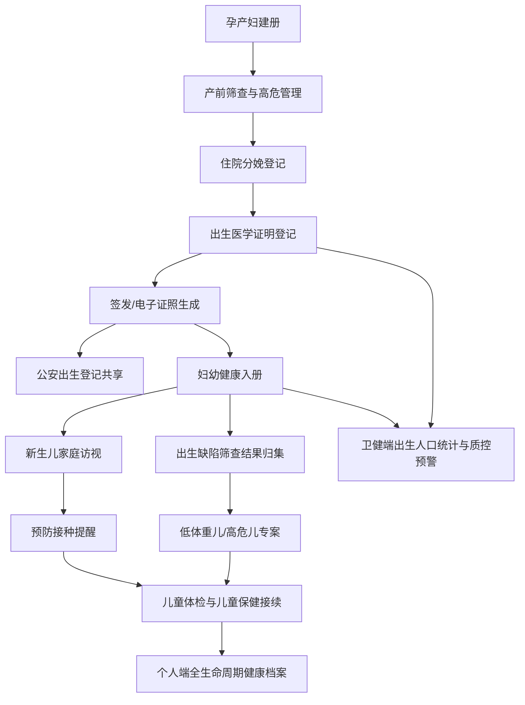

# 妇幼健康全模块说明

## 模块定位

妇幼健康模块贯通孕产妇建册、产前筛查、住院分娩、出生医学证明、新生儿访视、出生缺陷筛查、预防接种、低体重儿专案、儿童保健接续和管理端统计预警。模块目标不是单独展示出生证明，而是把“母亲-新生儿-儿童保健”作为连续健康服务链路纳入全民健康平台。

## 已实现功能

### 卫健管理端

- `出生医学证明与出生人口统计`：展示出生证明、首次签发、换发补发、电子证照、公安共享、妇幼入册、低体重儿和待处理指标。
- `出生人口健康管理`：展示妇幼入册、待访视、低体重儿和质控通过情况。
- `妇幼健康服务协同`：按孕产妇个案、出生证明、签发/上报、待访视、筛查待确认、低体重儿、共享待办和质控待办形成管理视图。
- `妇幼风险清单`：自动识别低体重儿、妇幼待入册、公安待共享、质控待复核、出生缺陷筛查待确认等风险信号。

### 医疗机构端

- 出生医学证明登记表单：支持母亲、新生儿姓名、性别、出生时间、出生体重、出生身长、父亲姓名、签发医师、办理类型、办理状态、下一步健康服务。
- 出生证明筛选：按办理状态和健康风险筛选。
- 机构侧预警：待签发、待入册共享、低体重儿、质控补正。
- 业务动作：签发、上报入册，并同步电子证照、公安共享、妇幼入册和健康管理状态。

### 个人用户端

- 出生人口健康管理：展示家庭成员出生证明、电子证照、公安共享、妇幼入册、新生儿访视、低体重儿专案状态。
- 妇幼接续清单：把出生医学证明、妇幼健康入册、新生儿家庭访视、出生缺陷筛查、低体重儿专案、儿童保健接续生成居民可见待办。
- 全生命周期健康管理：出生与建档阶段自动吸收出生证明和新生儿健康管理信息。

## 数据对象

- `birthCertificates`：出生医学证明个案，含证件编号、版本、签发类型、新生儿信息、母亲居民 ID、出生体重、签发机构、公安共享、妇幼入册、质控和下一步服务。
- `birthStatistics`：出生人口统计、地区统计、流程规则和健康管理服务清单。
- `residents`：母亲和家庭成员主索引，用于个人端按授权家庭范围裁剪。
- `personalRecords`：个人健康档案，承接后续儿童体检、免疫、检验、门诊和授权记录。

## API 与权限

- `GET /api/state`：按角色返回状态；居民端只返回本人及家庭成员相关妇幼数据。
- `GET /api/birth-certificates`：医疗机构、卫健和居民按授权范围读取出生证明。
- `POST /api/birth-certificates`：医疗机构和卫健登记出生证明，医保和居民无权写入。
- `POST /api/workflow-actions`：医疗机构可对出生证明执行签发、上报入册等状态动作。
- `GET /api/priority-applications/templates`：所有平台模板统一输出功能边界、复用点、数据、API、前端入口、测试、验收证据和说明文档/流程图规则。

## 流程图

## 统一模板规则

此规则适用于所有平台模板和后续独立应用对话：

1. 每个模块必须有 About 页说明，说明功能边界、角色入口、数据对象、API、测试和上线依赖。
2. 每个模块必须有独立说明文档，落在 `docs/` 目录，写清已实现能力、数据口径、权限、风险和验收方式。
3. 每个模块必须有流程图，至少覆盖“数据来源-业务办理-共享协同-个人端可见-管理端统计/预警”的主路径。
4. 每个模板必须在交接 API 中暴露说明文档路径、About 页锚点和流程图要求。
5. 每次发布必须跑 `npm.cmd run check` 和 `npm.cmd test`，并在最终说明里列出提交号和分支。
