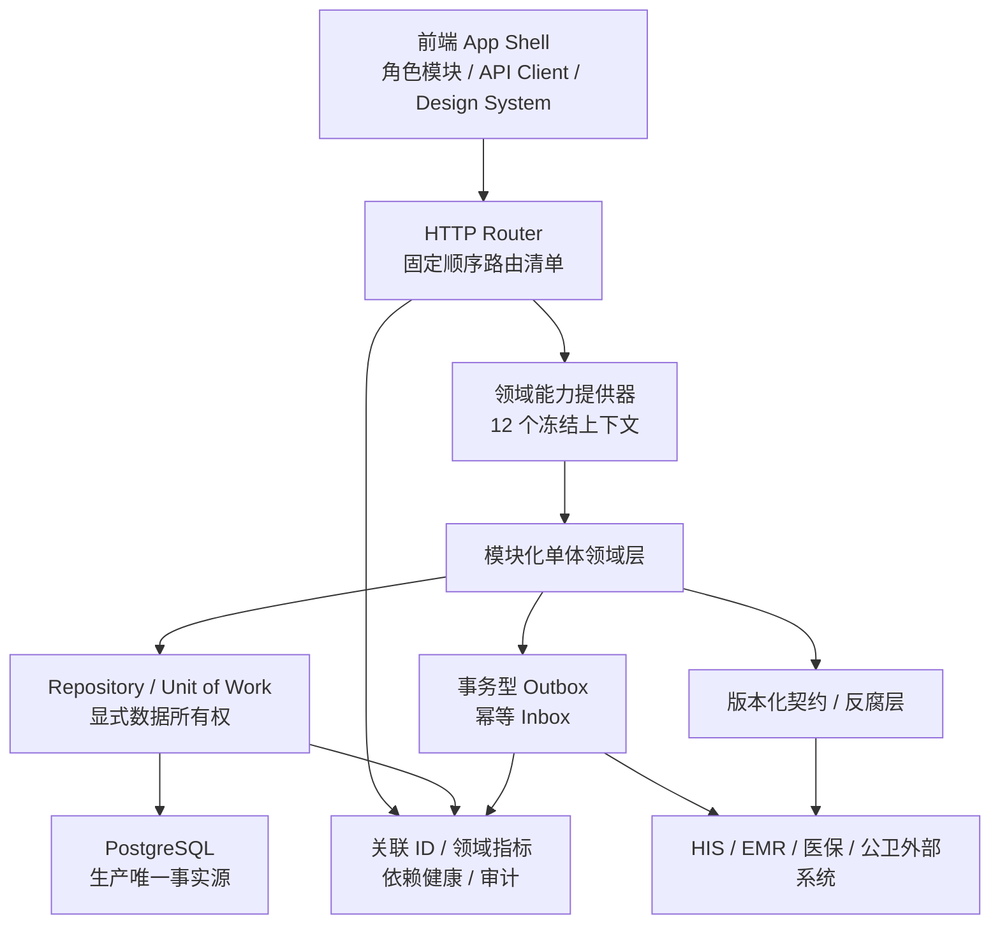

# 平台整体结构与进程分工

日期：2026-08-03

## 领域与进程

| 进程 | 领域 | 主要职责 |
|---|---|---|
| T00 | 集成治理 | 组合根、路由顺序、横切架构、CI、主干与发布 |
| T01 | runtime / identity-security | 健康检查、会话、认证授权、安全边界 |
| T02 | platform-governance / state-data | 治理、生产证据、审计与迁移期状态适配 |
| T03 | public-health | 监测基础、公卫运营、出生死亡登记 |
| T04 | citizen-chronic | 居民档案、家庭授权、慢病管理 |
| T05 | care-coordination | 转诊、协同服务、护理与履约 |
| T06 | clinical-specialties | 影像、急救、用血、质量安全和专科运营 |
| T07 | insurance-payment | 医保结算、支付、退款与凭证 |
| T08 | integration | 外部网关、签名回调、消息投递 |
| T09 | research / shared | 科研沙箱、只读组合视图和共享体验 |

`shared` 与 `state-data` 不是业务数据所有者。它们只能组合查询、适配迁移或调用领域写入端口。生产数据的权威存储、集合所有者和允许读者由
`config/domain-data-ownership.json` 唯一定义。

## 开发与集成

1. 每个进程使用短生命周期 `process/tNN-<topic>-YYYYMMDD` 分支和独立工作树。
2. 进程只修改其受保护边界；跨域协议、路由顺序、CI 和组合根交给 T00。
3. 拉取请求直接进入 `main`，必须通过严格检查、线性历史和讨论解决门禁。
4. 功能分支只运行 PR 检查，合入后 `main` 再运行一次全量推送检查。
5. 发布使用不可变标签、构建产物和环境审批；生产证据不由代码仓库伪造。

## 服务提取

当前保持模块化单体。只有满足独立扩缩容、故障隔离、数据自治、团队自治、发布节奏和运维成熟度门槛且没有阻断项的领域，才进入微服务提取流程。机器可读评分见
`config/service-extraction-scorecard.json`。
